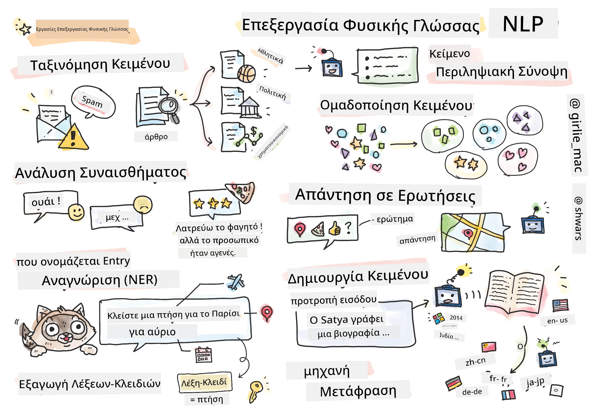

# Επεξεργασία Φυσικής Γλώσσας



Σε αυτή την ενότητα, θα επικεντρωθούμε στη χρήση Νευρωνικών Δικτύων για την αντιμετώπιση εργασιών που σχετίζονται με την **Επεξεργασία Φυσικής Γλώσσας (NLP)**. Υπάρχουν πολλά προβλήματα NLP που θέλουμε οι υπολογιστές να μπορούν να λύσουν:

* **Ταξινόμηση κειμένου** είναι ένα τυπικό πρόβλημα ταξινόμησης που αφορά ακολουθίες κειμένου. Παραδείγματα περιλαμβάνουν την ταξινόμηση μηνυμάτων ηλεκτρονικού ταχυδρομείου ως ανεπιθύμητα ή μη, ή την κατηγοριοποίηση άρθρων ως αθλητικά, επιχειρηματικά, πολιτικά κ.λπ. Επίσης, κατά την ανάπτυξη chat bots, συχνά χρειάζεται να κατανοήσουμε τι θέλει να πει ένας χρήστης — σε αυτή την περίπτωση ασχολούμαστε με την **ταξινόμηση πρόθεσης**. Συχνά, στην ταξινόμηση πρόθεσης πρέπει να αντιμετωπίσουμε πολλές κατηγορίες.
* **Ανάλυση συναισθήματος** είναι ένα τυπικό πρόβλημα παλινδρόμησης, όπου πρέπει να αποδώσουμε έναν αριθμό (ένα συναίσθημα) που αντιστοιχεί στο πόσο θετικό/αρνητικό είναι το νόημα μιας πρότασης. Μια πιο προχωρημένη έκδοση της ανάλυσης συναισθήματος είναι η **ανάλυση συναισθήματος βάσει πτυχών** (ABSA), όπου αποδίδουμε συναίσθημα όχι σε ολόκληρη την πρόταση, αλλά σε διαφορετικά μέρη της (πτυχές), π.χ. *Σε αυτό το εστιατόριο, μου άρεσε η κουζίνα, αλλά η ατμόσφαιρα ήταν απαίσια*.
* **Αναγνώριση Ονομαστικών Οντοτήτων** (NER) αναφέρεται στο πρόβλημα εξαγωγής συγκεκριμένων οντοτήτων από κείμενο. Για παράδειγμα, μπορεί να χρειαστεί να κατανοήσουμε ότι στη φράση *Πρέπει να πετάξω στο Παρίσι αύριο* η λέξη *αύριο* αναφέρεται σε ΗΜΕΡΟΜΗΝΙΑ, και το *Παρίσι* είναι ΤΟΠΟΘΕΣΙΑ.  
* **Εξαγωγή λέξεων-κλειδιών** είναι παρόμοια με το NER, αλλά πρέπει να εξάγουμε λέξεις σημαντικές για το νόημα της πρότασης αυτόματα, χωρίς προεκπαίδευση για συγκεκριμένους τύπους οντοτήτων.
* **Ομαδοποίηση κειμένου** μπορεί να είναι χρήσιμη όταν θέλουμε να ομαδοποιήσουμε παρόμοιες προτάσεις, για παράδειγμα, παρόμοια αιτήματα σε συνομιλίες τεχνικής υποστήριξης.
* **Απάντηση σε ερωτήσεις** αναφέρεται στην ικανότητα ενός μοντέλου να απαντήσει σε μια συγκεκριμένη ερώτηση. Το μοντέλο λαμβάνει ένα κείμενο και μια ερώτηση ως εισόδους, και πρέπει να παρέχει ένα σημείο στο κείμενο όπου περιέχεται η απάντηση στην ερώτηση (ή, μερικές φορές, να δημιουργήσει το κείμενο της απάντησης).
* **Δημιουργία κειμένου** είναι η ικανότητα ενός μοντέλου να δημιουργεί νέο κείμενο. Μπορεί να θεωρηθεί ως εργασία ταξινόμησης που προβλέπει το επόμενο γράμμα/λέξη βάσει κάποιου *προτροπής κειμένου*. Προχωρημένα μοντέλα δημιουργίας κειμένου, όπως το GPT-3, είναι ικανά να λύσουν άλλες εργασίες NLP χρησιμοποιώντας μια τεχνική που ονομάζεται [προγραμματισμός προτροπών](https://towardsdatascience.com/software-3-0-how-prompting-will-change-the-rules-of-the-game-a982fbfe1e0) ή [μηχανική προτροπών](https://medium.com/swlh/openai-gpt-3-and-prompt-engineering-dcdc2c5fcd29).
* **Περίληψη κειμένου** είναι μια τεχνική όταν θέλουμε ένας υπολογιστής να "διαβάσει" μεγάλο κείμενο και να το συνοψίσει σε λίγες προτάσεις.
* **Μετάφραση κειμένου** μπορεί να θεωρηθεί ως συνδυασμός κατανόησης κειμένου σε μία γλώσσα και δημιουργίας κειμένου σε άλλη.

Αρχικά, οι περισσότερες εργασίες NLP λύνονταν με παραδοσιακές μεθόδους όπως γραμματικές. Για παράδειγμα, στη μετάφραση κειμένου χρησιμοποιούνταν αναλυτές για τη μετατροπή της αρχικής πρότασης σε ένα συντακτικό δέντρο, στη συνέχεια εξάγονταν υψηλότερες σημασιολογικές δομές για την αναπαράσταση του νοήματος της πρότασης, και βάσει αυτού του νοήματος και της γραμματικής της γλώσσας στόχου παράγονταν τα αποτελέσματα. Σήμερα, πολλές εργασίες NLP λύνονται πιο αποτελεσματικά με τη χρήση νευρωνικών δικτύων.

> Πολλές κλασικές μέθοδοι NLP υλοποιούνται στη βιβλιοθήκη Python [Natural Language Processing Toolkit (NLTK)](https://www.nltk.org). Υπάρχει ένα εξαιρετικό [Βιβλίο NLTK](https://www.nltk.org/book/) διαθέσιμο online που καλύπτει πώς μπορούν να λυθούν διάφορες εργασίες NLP χρησιμοποιώντας το NLTK.

Στο μάθημά μας, θα επικεντρωθούμε κυρίως στη χρήση Νευρωνικών Δικτύων για NLP, και θα χρησιμοποιήσουμε το NLTK όπου χρειάζεται.

Έχουμε ήδη μάθει για τη χρήση νευρωνικών δικτύων για την αντιμετώπιση δεδομένων πίνακα και εικόνων. Η κύρια διαφορά μεταξύ αυτών των τύπων δεδομένων και του κειμένου είναι ότι το κείμενο είναι μια ακολουθία μεταβλητού μήκους, ενώ το μέγεθος εισόδου στην περίπτωση των εικόνων είναι γνωστό εκ των προτέρων. Ενώ τα συνελικτικά δίκτυα μπορούν να εξάγουν μοτίβα από δεδομένα εισόδου, τα μοτίβα στο κείμενο είναι πιο περίπλοκα. Π.χ., μπορούμε να έχουμε άρνηση που διαχωρίζεται από το υποκείμενο με αυθαίρετο αριθμό λέξεων (π.χ. *Δεν μου αρέσουν τα πορτοκάλια*, έναντι *Δεν μου αρέσουν αυτά τα μεγάλα πολύχρωμα νόστιμα πορτοκάλια*), και αυτό πρέπει να ερμηνευθεί ως ένα μοτίβο. Έτσι, για να χειριστούμε τη γλώσσα, πρέπει να εισαγάγουμε νέους τύπους νευρωνικών δικτύων, όπως *επαναληπτικά δίκτυα* και *μετασχηματιστές*.

## Εγκατάσταση Βιβλιοθηκών

Αν χρησιμοποιείτε τοπική εγκατάσταση Python για να εκτελέσετε αυτό το μάθημα, ίσως χρειαστεί να εγκαταστήσετε όλες τις απαιτούμενες βιβλιοθήκες για NLP χρησιμοποιώντας τις παρακάτω εντολές:

**Για PyTorch**
```bash
pip install -r requirements-torch.txt
```
**Για TensorFlow**
```bash
pip install -r requirements-tf.txt
```

> Μπορείτε να δοκιμάσετε NLP με TensorFlow στο [Microsoft Learn](https://docs.microsoft.com/learn/modules/intro-natural-language-processing-tensorflow/?WT.mc_id=academic-77998-cacaste)

## Προειδοποίηση GPU

Σε αυτή την ενότητα, σε ορισμένα παραδείγματα θα εκπαιδεύσουμε αρκετά μεγάλα μοντέλα.
* **Χρησιμοποιήστε Υπολογιστή με GPU**: Συνιστάται να εκτελείτε τα σημειωματάριά σας σε υπολογιστή με GPU για να μειώσετε τους χρόνους αναμονής κατά την εργασία με μεγάλα μοντέλα.
* **Περιορισμοί Μνήμης GPU**: Η εκτέλεση σε GPU μπορεί να οδηγήσει σε καταστάσεις όπου εξαντλείται η μνήμη GPU, ειδικά κατά την εκπαίδευση μεγάλων μοντέλων.
* **Κατανάλωση Μνήμης GPU**: Η ποσότητα μνήμης GPU που καταναλώνεται κατά την εκπαίδευση εξαρτάται από διάφορους παράγοντες, συμπεριλαμβανομένου του μεγέθους του minibatch.
* **Ελαχιστοποίηση Μεγέθους Minibatch**: Αν αντιμετωπίσετε προβλήματα μνήμης GPU, σκεφτείτε να μειώσετε το μέγεθος του minibatch στον κώδικά σας ως πιθανή λύση.
* **Απελευθέρωση Μνήμης GPU στο TensorFlow**: Παλαιότερες εκδόσεις του TensorFlow μπορεί να μην απελευθερώνουν σωστά τη μνήμη GPU κατά την εκπαίδευση πολλών μοντέλων μέσα σε έναν πυρήνα Python. Για να διαχειριστείτε αποτελεσματικά τη χρήση μνήμης GPU, μπορείτε να ρυθμίσετε το TensorFlow ώστε να δεσμεύει μνήμη GPU μόνο όταν χρειάζεται.
* **Ενσωμάτωση Κώδικα**: Για να ρυθμίσετε το TensorFlow ώστε να αυξάνει τη δέσμευση μνήμης GPU μόνο όταν απαιτείται, συμπεριλάβετε τον παρακάτω κώδικα στα σημειωματάριά σας:

```python
physical_devices = tf.config.list_physical_devices('GPU') 
if len(physical_devices)>0:
    tf.config.experimental.set_memory_growth(physical_devices[0], True) 
```

Αν ενδιαφέρεστε να μάθετε για το NLP από την κλασική προοπτική ML, επισκεφθείτε [αυτή τη σειρά μαθημάτων](https://github.com/microsoft/ML-For-Beginners/tree/main/6-NLP)

## Σε αυτή την Ενότητα
Σε αυτή την ενότητα θα μάθουμε για:

* [Αναπαράσταση κειμένου ως τανυστές](13-TextRep/README.md)
* [Ενσωματώσεις λέξεων](14-Emdeddings/README.md)
* [Μοντελοποίηση γλώσσας](15-LanguageModeling/README.md)
* [Επαναληπτικά Νευρωνικά Δίκτυα](16-RNN/README.md)
* [Δίκτυα Γεννήτριας](17-GenerativeNetworks/README.md)
* [Μετασχηματιστές](18-Transformers/README.md)

---

**Αποποίηση Ευθύνης**:  
Αυτό το έγγραφο έχει μεταφραστεί χρησιμοποιώντας την υπηρεσία αυτόματης μετάφρασης [Co-op Translator](https://github.com/Azure/co-op-translator). Παρόλο που καταβάλλουμε προσπάθειες για ακρίβεια, παρακαλούμε να έχετε υπόψη ότι οι αυτόματες μεταφράσεις ενδέχεται να περιέχουν σφάλματα ή ανακρίβειες. Το πρωτότυπο έγγραφο στη μητρική του γλώσσα θα πρέπει να θεωρείται η αυθεντική πηγή. Για κρίσιμες πληροφορίες, συνιστάται επαγγελματική ανθρώπινη μετάφραση. Δεν φέρουμε ευθύνη για τυχόν παρεξηγήσεις ή εσφαλμένες ερμηνείες που προκύπτουν από τη χρήση αυτής της μετάφρασης.