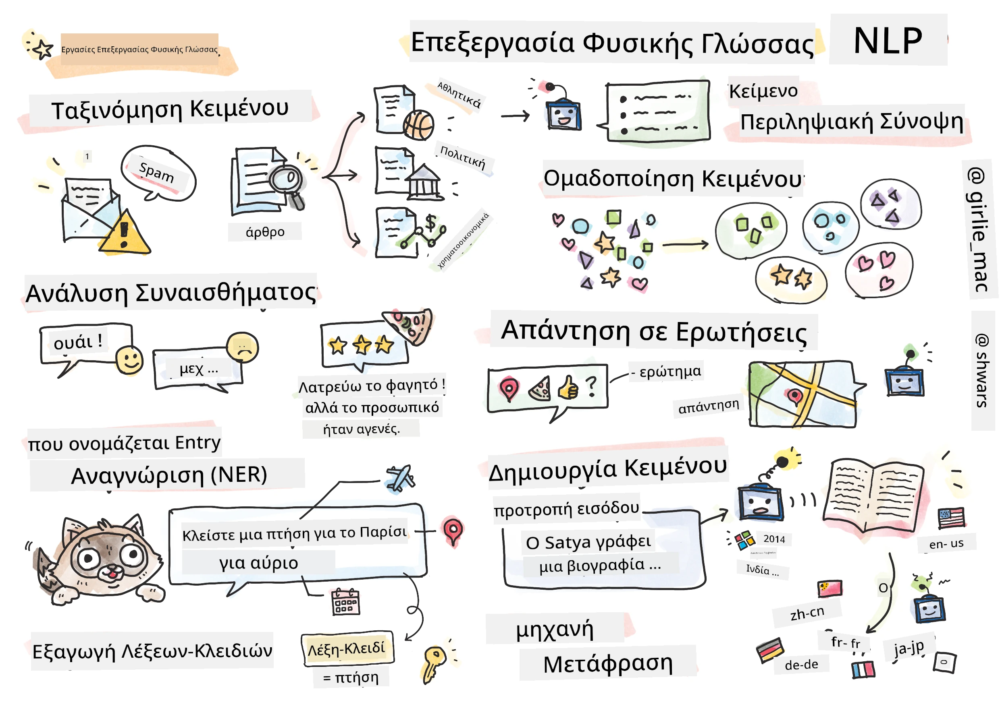

# Επεξεργασία Φυσικής Γλώσσας



Σε αυτήν την ενότητα, θα επικεντρωθούμε στη χρήση Νευρωνικών Δικτύων για την αντιμετώπιση εργασιών που σχετίζονται με την **Επεξεργασία Φυσικής Γλώσσας (NLP)**. Υπάρχουν πολλά προβλήματα NLP που θέλουμε οι υπολογιστές να μπορούν να λύσουν:

* **Κατάταξη κειμένου** είναι ένα τυπικό πρόβλημα ταξινόμησης που αφορά σειρές κειμένου. Παραδείγματα περιλαμβάνουν την ταξινόμηση μηνυμάτων ηλεκτρονικού ταχυδρομείου ως ανεπιθύμητα (spam) ή όχι, ή την κατηγοριοποίηση άρθρων ως αθλητικά, επιχειρήσεις, πολιτική, κ.λπ. Επίσης, όταν αναπτύσσουμε chat bots, συχνά πρέπει να κατανοήσουμε τι ήθελε να πει ο χρήστης – σε αυτή την περίπτωση ασχολούμαστε με την **ταξινόμηση προθέσεων**. Συχνά, στην ταξινόμηση προθέσεων πρέπει να διαχειριστούμε πολλές κατηγορίες.
* **Ανάλυση συναισθήματος** είναι ένα τυπικό πρόβλημα παλινδρόμησης, όπου πρέπει να αποδοθεί ένας αριθμός (ένα συναίσθημα) που αντιστοιχεί στο πόσο θετικό/αρνητικό είναι το νόημα μιας πρότασης. Μια πιο προχωρημένη μορφή ανάλυσης συναισθήματος είναι η **ανάλυση συναισθήματος βάσει πτυχών** (ABSA), όπου το συναίσθημα αποδίδεται όχι σε ολόκληρη την πρόταση αλλά σε διαφορετικά τμήματά της (πτυχές), π.χ. *Σε αυτό το εστιατόριο μου άρεσε η κουζίνα, αλλά η ατμόσφαιρα ήταν απαίσια*.
* **Αναγνώριση Οντοτήτων με Όνομα** (NER) αναφέρεται στο πρόβλημα της εξαγωγής ορισμένων οντοτήτων από το κείμενο. Για παράδειγμα, μπορεί να χρειαστεί να κατανοήσουμε ότι στη φράση *Πρέπει να πετάξω στο Παρίσι αύριο* η λέξη *αύριο* αναφέρεται σε ΗΜΕΡΟΜΗΝΙΑ, και το *Παρίσι* είναι ΤΟΠΟΘΕΣΙΑ.  
* **Εξαγωγή λέξεων-κλειδιών** είναι παρόμοια με την NER, αλλά πρέπει να εξάγουμε λέξεις σημαντικές για το νόημα της πρότασης αυτόματα, χωρίς προεκπαίδευση για συγκεκριμένους τύπους οντοτήτων.
* **Ομαδοποίηση κειμένου** μπορεί να είναι χρήσιμη όταν θέλουμε να ομαδοποιήσουμε παρόμοιες προτάσεις, για παράδειγμα, παρόμοια αιτήματα σε συνομιλίες τεχνικής υποστήριξης.
* **Απάντηση σε ερωτήσεις** αναφέρεται στην ικανότητα ενός μοντέλου να απαντά σε συγκεκριμένη ερώτηση. Το μοντέλο λαμβάνει ως είσοδο ένα κομμάτι κειμένου και μια ερώτηση, και πρέπει να δώσει μια θέση στο κείμενο όπου περιέχεται η απάντηση στην ερώτηση (ή, μερικές φορές, να παράγει το κείμενο της απάντησης).
* **Γεννήτρια κειμένου** είναι η ικανότητα ενός μοντέλου να παράγει νέο κείμενο. Μπορεί να θεωρηθεί ως πρόβλημα ταξινόμησης που προβλέπει το επόμενο γράμμα/λέξη βασιζόμενο σε κάποιο *προτροπή κειμένου*. Προχωρημένα μοντέλα παραγωγής κειμένου, όπως το GPT-3, μπορούν να λύσουν και άλλα προβλήματα NLP όπως ταξινόμηση χρησιμοποιώντας μία τεχνική που ονομάζεται [προγραμματισμός προτροπών](https://towardsdatascience.com/software-3-0-how-prompting-will-change-the-rules-of-the-game-a982fbfe1e0) ή [μηχανική των προτροπών](https://medium.com/swlh/openai-gpt-3-and-prompt-engineering-dcdc2c5fcd29)
* **Περίληψη κειμένου** είναι μια τεχνική όταν θέλουμε ο υπολογιστής να "διαβάσει" μακρύ κείμενο και να το συνοψίσει σε λίγες προτάσεις.
* **Μηχανική μετάφραση** μπορεί να θεωρηθεί ως συνδυασμός κατανόησης κειμένου σε μια γλώσσα και παραγωγής κειμένου σε μια άλλη.

Αρχικά, οι περισσότερες εργασίες NLP λύνονταν χρησιμοποιώντας παραδοσιακές μεθόδους όπως γραμματικές. Για παράδειγμα, στη μηχανική μετάφραση χρησιμοποιούνταν αναλυτές (parsers) για να μετατρέψουν την αρχική πρόταση σε δέντρο σύνταξης, στη συνέχεια εξάγονταν υψηλού επιπέδου σημασιολογικές δομές για να αναπαραστήσουν το νόημα της πρότασης, και με βάση αυτό το νόημα και τη γραμματική της γλώσσας στόχου, γινόταν η παραγωγή του αποτελέσματος. Σήμερα, πολλές εργασίες NLP λύνονται πιο αποτελεσματικά χρησιμοποιώντας νευρωνικά δίκτυα.

> Πολλές κλασικές μέθοδοι NLP υλοποιούνται στην Python βιβλιοθήκη [Natural Language Processing Toolkit (NLTK)](https://www.nltk.org). Υπάρχει ένα εξαιρετικό [βιβλίο NLTK](https://www.nltk.org/book/) διαθέσιμο online που καλύπτει το πώς διάφορες εργασίες NLP μπορούν να λυθούν χρησιμοποιώντας το NLTK.

Στο μάθημά μας, θα επικεντρωθούμε κυρίως στη χρήση νευρωνικών δικτύων για NLP, και θα χρησιμοποιούμε το NLTK όπου χρειάζεται.

Έχουμε ήδη μάθει για τη χρήση νευρωνικών δικτύων στην επεξεργασία πίνακα δεδομένων και εικόνων. Η βασική διαφορά μεταξύ αυτών των τύπων δεδομένων και του κειμένου είναι ότι το κείμενο είναι μια ακολουθία μεταβλητού μήκους, ενώ το μέγεθος της εισόδου στην περίπτωση των εικόνων είναι γνωστό εκ των προτέρων. Ενώ τα συνελικτικά δίκτυα μπορούν να εξάγουν μοτίβα από τα δεδομένα εισόδου, τα μοτίβα στο κείμενο είναι πιο σύνθετα. Π.χ., η άρνηση μπορεί να βρίσκεται μακριά από το υποκείμενο με αυθαίρετο αριθμό λέξεων (π.χ. *Δεν μου αρέσουν οι πορτοκάλια* vs. *Δεν μου αρέσουν αυτά τα μεγάλα χρωματιστά νόστιμα πορτοκάλια*), και αυτό πρέπει να ερμηνευτεί ως ένα μοτίβο. Έτσι, για να διαχειριστούμε τη γλώσσα πρέπει να εισάγουμε νέους τύπους νευρωνικών δικτύων, όπως *επαναλαμβανόμενα δίκτυα* και *μετασχηματιστές*.

## Εγκατάσταση Βιβλιοθηκών

Εάν χρησιμοποιείτε τοπική εγκατάσταση Python για να εκτελέσετε αυτό το μάθημα, ίσως χρειαστεί να εγκαταστήσετε όλες τις απαιτούμενες βιβλιοθήκες για NLP χρησιμοποιώντας τις ακόλουθες εντολές:

**Για PyTorch**
```bash
pip install -r requirements-pytorch.txt
```
**Για TensorFlow**
```bash
pip install -r requirements-tf.txt
```

> Μπορείτε να δοκιμάσετε NLP με TensorFlow στο [Microsoft Learn](https://docs.microsoft.com/learn/modules/intro-natural-language-processing-tensorflow/?WT.mc_id=academic-77998-cacaste)

## Προειδοποίηση GPU

Σε αυτήν την ενότητα, σε ορισμένα από τα παραδείγματα θα εκπαιδεύουμε αρκετά μεγάλα μοντέλα.
* **Χρησιμοποιήστε υπολογιστή με υποστήριξη GPU**: Συνιστάται να εκτελείτε τα τετράδιά σας σε υπολογιστή με υποστήριξη GPU για να μειώσετε τους χρόνους αναμονής όταν δουλεύετε με μεγάλα μοντέλα.
* **Περιορισμοί μνήμης GPU**: Η εκτέλεση σε GPU μπορεί να οδηγήσει σε καταστάσεις όπου εξαντλείται η μνήμη της GPU, ειδικά όταν εκπαιδεύονται μεγάλα μοντέλα.
* **Κατανάλωση μνήμης GPU**: Η ποσότητα μνήμης GPU που καταναλώνεται κατά την εκπαίδευση εξαρτάται από διάφορους παράγοντες, συμπεριλαμβανομένου του μεγέθους του minibatch.
* **Μείωση μεγέθους minibatch**: Αν αντιμετωπίσετε προβλήματα μνήμης GPU, σκεφτείτε να μειώσετε το μέγεθος του minibatch στον κώδικά σας ως πιθανή λύση.
* **Αποδέσμευση μνήμης GPU στο TensorFlow**: Παλαιότερες εκδόσεις του TensorFlow ίσως δεν απελευθερώνουν σωστά τη μνήμη GPU όταν εκπαιδεύονται πολλαπλά μοντέλα μέσα σε έναν Python πυρήνα. Για να διαχειριστείτε αποτελεσματικά τη μνήμη GPU, μπορείτε να διαμορφώσετε το TensorFlow ώστε να δεσμεύει μνήμη GPU μόνο όταν χρειάζεται.
* **Συμπερίληψη κώδικα**: Για να ορίσετε το TensorFlow να αυξάνει τη δέσμευση μνήμης GPU μόνο όταν απαιτείται, συμπεριλάβετε τον ακόλουθο κώδικα στα τετράδιά σας:

```python
physical_devices = tf.config.list_physical_devices('GPU') 
if len(physical_devices)>0:
    tf.config.experimental.set_memory_growth(physical_devices[0], True) 
```

Αν σας ενδιαφέρει να μάθετε για NLP από μια κλασική οπτική της Μηχανικής Μάθησης, επισκεφθείτε [αυτή τη συλλογή μαθημάτων](https://github.com/microsoft/ML-For-Beginners/tree/main/6-NLP)

## Σε αυτή την Ενότητα
Σε αυτήν την ενότητα θα μάθουμε για:

* [Αναπαράσταση κειμένου ως τάνσορες](13-TextRep/README.md)
* [Ενσωματώσεις λέξεων](14-Embeddings/README.md)
* [Μοντελοποίηση γλώσσας](15-LanguageModeling/README.md)
* [Επαναλαμβανόμενα νευρωνικά δίκτυα](16-RNN/README.md)
* [Γενετικά δίκτυα](17-GenerativeNetworks/README.md)
* [Μετασχηματιστές](18-Transformers/README.md)

---

<!-- CO-OP TRANSLATOR DISCLAIMER START -->
**Αποποίηση ευθυνών**:
Αυτό το έγγραφο έχει μεταφραστεί χρησιμοποιώντας την υπηρεσία μετάφρασης με τεχνητή νοημοσύνη [Co-op Translator](https://github.com/Azure/co-op-translator). Ενώ επιδιώκουμε την ακρίβεια, παρακαλούμε να έχετε υπόψη ότι οι αυτοματοποιημένες μεταφράσεις ενδέχεται να περιέχουν λάθη ή ανακρίβειες. Το πρωτότυπο έγγραφο στη μητρική του γλώσσα πρέπει να θεωρείται η αυθεντική πηγή. Για κρίσιμες πληροφορίες, συνιστάται επαγγελματική ανθρώπινη μετάφραση. Δεν φέρουμε ευθύνη για τυχόν παρεξηγήσεις ή λανθασμένες ερμηνείες που προκύπτουν από τη χρήση αυτής της μετάφρασης.
<!-- CO-OP TRANSLATOR DISCLAIMER END -->