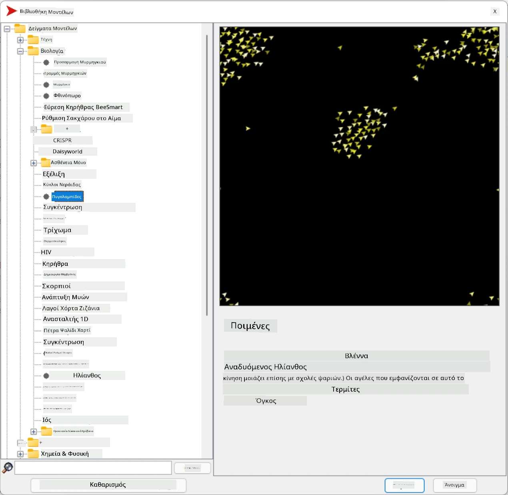
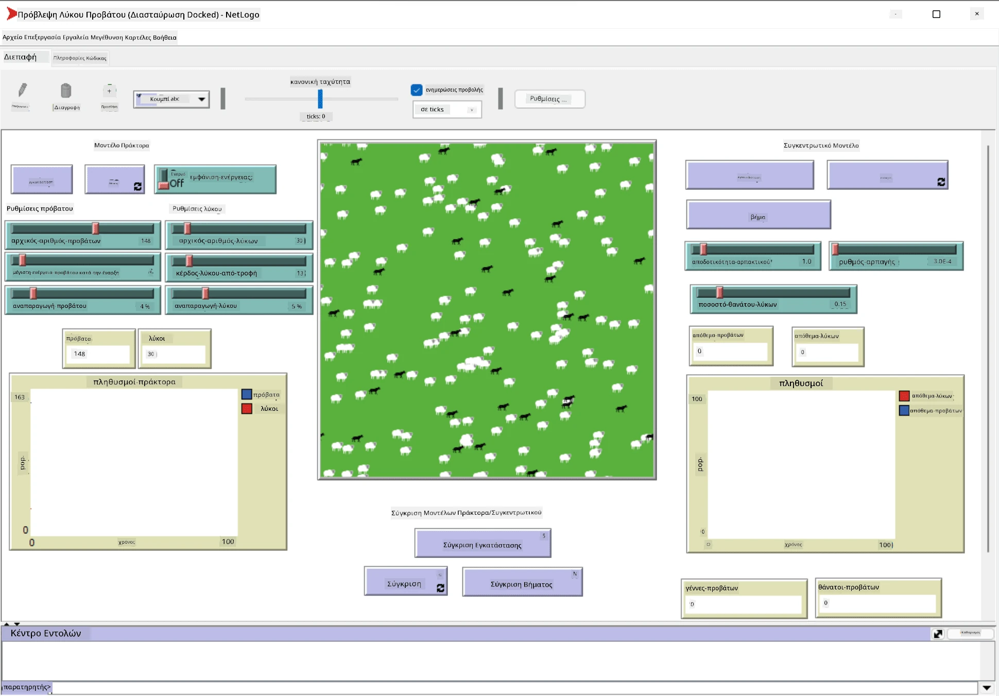

# Πολυπρακτορικά Συστήματα

Ένας από τους πιθανούς τρόπους επίτευξης νοημοσύνης είναι η λεγόμενη **αναδυόμενη** (ή **συνεργιστική**) προσέγγιση, η οποία βασίζεται στο γεγονός ότι η συνδυασμένη συμπεριφορά πολλών σχετικά απλών πρακτόρων μπορεί να οδηγήσει σε πιο σύνθετη (ή ευφυή) συμπεριφορά του συστήματος συνολικά. Θεωρητικά, αυτό βασίζεται στις αρχές της [Συλλογικής Νοημοσύνης](https://en.wikipedia.org/wiki/Collective_intelligence), του [Αναδυτισμού](https://en.wikipedia.org/wiki/Global_brain) και της [Εξελικτικής Κυβερνητικής](https://en.wikipedia.org/wiki/Global_brain), που υποστηρίζουν ότι τα συστήματα ανώτερου επιπέδου αποκτούν κάποια προστιθέμενη αξία όταν συνδυάζονται σωστά από συστήματα κατώτερου επιπέδου (η λεγόμενη *αρχή της μετάβασης μετασυστήματος*).

## [Κουίζ πριν τη διάλεξη](https://ff-quizzes.netlify.app/en/ai/quiz/45)

Η κατεύθυνση των **Πολυπρακτορικών Συστημάτων** εμφανίστηκε στην Τεχνητή Νοημοσύνη τη δεκαετία του 1990 ως απάντηση στην ανάπτυξη του Διαδικτύου και των κατανεμημένων συστημάτων. Ένα από τα κλασικά εγχειρίδια Τεχνητής Νοημοσύνης, το [Artificial Intelligence: A Modern Approach](https://en.wikipedia.org/wiki/Artificial_Intelligence:_A_Modern_Approach), εστιάζει στην κλασική Τεχνητή Νοημοσύνη από την οπτική των Πολυπρακτορικών Συστημάτων.

Κεντρική έννοια στην πολυπρακτορική προσέγγιση είναι η έννοια του **Πράκτορα** - μιας οντότητας που ζει σε κάποιο **περιβάλλον**, το οποίο μπορεί να αντιλαμβάνεται και να επενεργεί σε αυτό. Αυτή είναι μια πολύ ευρεία έννοια, και μπορεί να υπάρχουν πολλοί διαφορετικοί τύποι και ταξινομήσεις πρακτόρων:

* Με βάση την ικανότητά τους να συλλογίζονται:
   - **Αντιδραστικοί** πράκτορες έχουν συνήθως απλή συμπεριφορά τύπου αίτησης-απάντησης
   - **Στοχαστικοί** πράκτορες χρησιμοποιούν κάποια μορφή λογικής συλλογιστικής ή/και ικανότητες σχεδιασμού
* Με βάση τον τόπο εκτέλεσης του κώδικα του πράκτορα:
   - **Στατικοί** πράκτορες λειτουργούν σε έναν αφιερωμένο κόμβο δικτύου
   - **Κινητοί** πράκτορες μπορούν να μετακινούν τον κώδικά τους μεταξύ κόμβων δικτύου
* Με βάση τη συμπεριφορά τους:
   - **Παθητικοί πράκτορες** δεν έχουν συγκεκριμένους στόχους. Μπορούν να αντιδρούν σε εξωτερικά ερεθίσματα, αλλά δεν θα ξεκινήσουν δράσεις από μόνοι τους.
   - **Ενεργοί πράκτορες** έχουν κάποιους στόχους που επιδιώκουν
   - **Γνωστικοί πράκτορες** περιλαμβάνουν σύνθετο σχεδιασμό και συλλογιστική

Τα πολυπρακτορικά συστήματα χρησιμοποιούνται σήμερα σε πολλές εφαρμογές:

* Στα παιχνίδια, πολλοί χαρακτήρες που δεν ελέγχονται από τον παίκτη χρησιμοποιούν κάποια μορφή Τεχνητής Νοημοσύνης και μπορούν να θεωρηθούν ευφυείς πράκτορες
* Στην παραγωγή βίντεο, η απόδοση σύνθετων 3D σκηνών που περιλαμβάνουν πλήθη γίνεται συνήθως με προσομοίωση πολυπρακτορικών συστημάτων
* Στη μοντελοποίηση συστημάτων, η πολυπρακτορική προσέγγιση χρησιμοποιείται για την προσομοίωση της συμπεριφοράς ενός σύνθετου μοντέλου. Για παράδειγμα, η πολυπρακτορική προσέγγιση έχει χρησιμοποιηθεί με επιτυχία για την πρόβλεψη της εξάπλωσης της νόσου COVID-19 παγκοσμίως. Παρόμοια προσέγγιση μπορεί να χρησιμοποιηθεί για τη μοντελοποίηση της κυκλοφορίας στην πόλη και την παρακολούθηση της αντίδρασής της σε αλλαγές στους κανόνες κυκλοφορίας.
* Σε σύνθετα αυτοματοποιημένα συστήματα, κάθε συσκευή μπορεί να λειτουργεί ως ανεξάρτητος πράκτορας, καθιστώντας το σύστημα συνολικά λιγότερο μονολιθικό και πιο ανθεκτικό.

Δεν θα αφιερώσουμε πολύ χρόνο για να εμβαθύνουμε στα πολυπρακτορικά συστήματα, αλλά θα εξετάσουμε ένα παράδειγμα **Πολυπρακτορικής Μοντελοποίησης**.

## NetLogo

Το [NetLogo](https://ccl.northwestern.edu/netlogo/) είναι ένα περιβάλλον πολυπρακτορικής μοντελοποίησης βασισμένο σε μια τροποποιημένη έκδοση της γλώσσας προγραμματισμού [Logo](https://en.wikipedia.org/wiki/Logo_(programming_language)). Αυτή η γλώσσα αναπτύχθηκε για τη διδασκαλία εννοιών προγραμματισμού σε παιδιά και σας επιτρέπει να ελέγχετε έναν πράκτορα που ονομάζεται **χελώνα**, η οποία μπορεί να κινείται αφήνοντας ένα ίχνος πίσω της. Αυτό επιτρέπει τη δημιουργία σύνθετων γεωμετρικών σχημάτων, που αποτελεί έναν πολύ οπτικό τρόπο κατανόησης της συμπεριφοράς ενός πράκτορα.

Στο NetLogo, μπορούμε να δημιουργήσουμε πολλές χελώνες χρησιμοποιώντας την εντολή `create-turtles`. Στη συνέχεια, μπορούμε να δώσουμε εντολές σε όλες τις χελώνες να εκτελέσουν κάποιες ενέργειες (στο παρακάτω παράδειγμα - να κινηθούν 10 σημεία μπροστά):

```
create-turtles 10
ask turtles [
  forward 10
]
```

Φυσικά, δεν είναι ενδιαφέρον όταν όλες οι χελώνες κάνουν το ίδιο πράγμα, οπότε μπορούμε να `ask` ομάδες χελωνών, π.χ. εκείνες που βρίσκονται κοντά σε ένα συγκεκριμένο σημείο. Μπορούμε επίσης να δημιουργήσουμε χελώνες διαφορετικών *φυλών* χρησιμοποιώντας την εντολή `breed [cats cat]`. Εδώ το `cat` είναι το όνομα της φυλής, και πρέπει να καθορίσουμε τόσο τη μοναδική όσο και την πληθυντική μορφή της λέξης, επειδή διαφορετικές εντολές χρησιμοποιούν διαφορετικές μορφές για λόγους σαφήνειας.

> ✅ Δεν θα εμβαθύνουμε στη γλώσσα NetLogo - μπορείτε να επισκεφθείτε τον εξαιρετικό [Διαδραστικό Λεξικό NetLogo για Αρχάριους](https://ccl.northwestern.edu/netlogo/bind/) αν θέλετε να μάθετε περισσότερα.

Μπορείτε να [κατεβάσετε](https://ccl.northwestern.edu/netlogo/download.shtml) και να εγκαταστήσετε το NetLogo για να το δοκιμάσετε.

### Βιβλιοθήκη Μοντέλων

Ένα εξαιρετικό χαρακτηριστικό του NetLogo είναι ότι περιέχει μια βιβλιοθήκη έτοιμων μοντέλων που μπορείτε να δοκιμάσετε. Μεταβείτε στο **File &rightarrow; Models Library**, και θα βρείτε πολλές κατηγορίες μοντέλων για να επιλέξετε.



> Στιγμιότυπο οθόνης της βιβλιοθήκης μοντέλων από τον Dmitry Soshnikov

Μπορείτε να ανοίξετε ένα από τα μοντέλα, για παράδειγμα **Biology &rightarrow; Flocking**.

### Κύριες Αρχές

Αφού ανοίξετε το μοντέλο, μεταφέρεστε στην κύρια οθόνη του NetLogo. Εδώ είναι ένα δείγμα μοντέλου που περιγράφει τον πληθυσμό λύκων και προβάτων, δεδομένων πεπερασμένων πόρων (γρασίδι).



> Στιγμιότυπο οθόνης από τον Dmitry Soshnikov

Σε αυτή την οθόνη, μπορείτε να δείτε:

* Την ενότητα **Interface**, η οποία περιέχει:
  - Το κύριο πεδίο, όπου ζουν όλοι οι πράκτορες
  - Διάφορα χειριστήρια: κουμπιά, ρυθμιστικά κ.λπ.
  - Γραφήματα που μπορείτε να χρησιμοποιήσετε για να εμφανίσετε παραμέτρους της προσομοίωσης
* Την καρτέλα **Code**, η οποία περιέχει τον επεξεργαστή, όπου μπορείτε να πληκτρολογήσετε πρόγραμμα NetLogo

Στις περισσότερες περιπτώσεις, η διεπαφή θα έχει ένα κουμπί **Setup**, το οποίο αρχικοποιεί την κατάσταση της προσομοίωσης, και ένα κουμπί **Go** που ξεκινά την εκτέλεση. Αυτά χειρίζονται οι αντίστοιχοι χειριστές στον κώδικα που μοιάζουν ως εξής:

```
to go [
...
]
```

Ο κόσμος του NetLogo αποτελείται από τα εξής αντικείμενα:

* **Πράκτορες** (χελώνες) που μπορούν να κινούνται στο πεδίο και να κάνουν κάτι. Δίνετε εντολές στους πράκτορες χρησιμοποιώντας τη σύνταξη `ask turtles [...]`, και ο κώδικας στις αγκύλες εκτελείται από όλους τους πράκτορες σε *λειτουργία χελώνας*.
* **Κομμάτια** είναι τετράγωνα τμήματα του πεδίου, πάνω στα οποία ζουν οι πράκτορες. Μπορείτε να αναφέρεστε σε όλους τους πράκτορες στο ίδιο κομμάτι ή να αλλάζετε τα χρώματα και άλλες ιδιότητες των κομματιών. Μπορείτε επίσης να `ask patches` να κάνουν κάτι.
* **Παρατηρητής** είναι ένας μοναδικός πράκτορας που ελέγχει τον κόσμο. Όλοι οι χειριστές κουμπιών εκτελούνται σε *λειτουργία παρατηρητή*.

> ✅ Η ομορφιά ενός πολυπρακτορικού περιβάλλοντος είναι ότι ο κώδικας που εκτελείται σε λειτουργία χελώνας ή κομματιού εκτελείται ταυτόχρονα από όλους τους πράκτορες παράλληλα. Έτσι, γράφοντας λίγο κώδικα και προγραμματίζοντας τη συμπεριφορά ενός μεμονωμένου πράκτορα, μπορείτε να δημιουργήσετε σύνθετη συμπεριφορά του συστήματος προσομοίωσης συνολικά.

### Συμπεριφορά Σμήνους

Ως παράδειγμα πολυπρακτορικής συμπεριφοράς, ας εξετάσουμε τη **[Συμπεριφορά Σμήνους](https://en.wikipedia.org/wiki/Flocking_(behavior))**. Η συμπεριφορά σμήνους είναι ένα σύνθετο μοτίβο που μοιάζει πολύ με τον τρόπο που πετούν τα σμήνη πουλιών. Παρατηρώντας τα να πετούν, μπορεί να σκεφτείτε ότι ακολουθούν κάποιο είδος συλλογικού αλγορίθμου ή ότι διαθέτουν κάποια μορφή *συλλογικής νοημοσύνης*. Ωστόσο, αυτή η σύνθετη συμπεριφορά προκύπτει όταν κάθε μεμονωμένος πράκτορας (σε αυτή την περίπτωση, ένα *πουλί*) παρατηρεί μόνο κάποιους άλλους πράκτορες σε μικρή απόσταση από αυτό και ακολουθεί τρεις απλούς κανόνες:

* **Ευθυγράμμιση** - κατευθύνεται προς τη μέση κατεύθυνση των γειτονικών πρακτόρων
* **Συνοχή** - προσπαθεί να κατευθυνθεί προς τη μέση θέση των γειτόνων (*έλξη μακράς εμβέλειας*)
* **Διαχωρισμός** - όταν πλησιάζει πολύ άλλα πουλιά, προσπαθεί να απομακρυνθεί (*απώθηση μικρής εμβέλειας*)

Μπορείτε να εκτελέσετε το παράδειγμα συμπεριφοράς σμήνους και να παρατηρήσετε τη συμπεριφορά. Μπορείτε επίσης να προσαρμόσετε παραμέτρους, όπως τον *βαθμό διαχωρισμού* ή την *εμβέλεια ορατότητας*, που καθορίζει πόσο μακριά μπορεί να δει κάθε πουλί. Σημειώστε ότι αν μειώσετε την εμβέλεια ορατότητας στο 0, όλα τα πουλιά γίνονται τυφλά και η συμπεριφορά σμήνους σταματά. Αν μειώσετε τον διαχωρισμό στο 0, όλα τα πουλιά συγκεντρώνονται σε μια ευθεία γραμμή.

> ✅ Μεταβείτε στην καρτέλα **Code** και δείτε πού υλοποιούνται οι τρεις κανόνες της συμπεριφοράς σμήνους (ευθυγράμμιση, συνοχή και διαχωρισμός) στον κώδικα. Σημειώστε πώς αναφερόμαστε μόνο σε εκείνους τους πράκτορες που βρίσκονται εντός ορατότητας.

### Άλλα Μοντέλα για Εξερεύνηση

Υπάρχουν μερικά ακόμη ενδιαφέροντα μοντέλα που μπορείτε να πειραματιστείτε:

* **Art &rightarrow; Fireworks** δείχνει πώς ένα πυροτέχνημα μπορεί να θεωρηθεί συλλογική συμπεριφορά μεμονωμένων ρευμάτων φωτιάς
* **Social Science &rightarrow; Traffic Basic** και **Social Science &rightarrow; Traffic Grid** δείχνουν το μοντέλο κυκλοφορίας πόλης σε 1D και 2D πλέγμα με ή χωρίς φανάρια. Κάθε αυτοκίνητο στην προσομοίωση ακολουθεί τους εξής κανόνες:
   - Αν ο χώρος μπροστά του είναι κενός - επιταχύνει (μέχρι μια συγκεκριμένη μέγιστη ταχύτητα)
   - Αν βλέπει εμπόδιο μπροστά - φρενάρει (και μπορείτε να προσαρμόσετε πόσο μακριά μπορεί να δει ο οδηγός)
* **Social Science &rightarrow; Party** δείχνει πώς οι άνθρωποι συγκεντρώνονται κατά τη διάρκεια ενός κοκτέιλ πάρτι. Μπορείτε να βρείτε τον συνδυασμό παραμέτρων που οδηγεί στη γρηγορότερη αύξηση της ευτυχίας της ομάδας.

Όπως βλέπετε από αυτά τα παραδείγματα, οι πολυπρακτορικές προσομοιώσεις μπορούν να είναι ένας πολύ χρήσιμος τρόπος για να κατανοήσουμε τη συμπεριφορά ενός σύνθετου συστήματος που αποτελείται από άτομα που ακολουθούν την ίδια ή παρόμοια λογική. Μπορεί επίσης να χρησιμοποιηθεί για τον έλεγχο εικονικών πρακτόρων, όπως [NPCs](https://en.wikipedia.org/wiki/NPC) σε παιχνίδια υπολογιστή ή πρακτόρων σε 3D κόσμους κινουμένων σχεδίων.

## Στοχαστικοί Πράκτορες

Οι πράκτορες που περιγράφηκαν παραπάνω είναι πολύ απλοί, αντιδρώντας σε αλλαγές στο περιβάλλον χρησιμοποιώντας κάποιο είδος αλγορίθμου. Ως εκ τούτου, είναι **αντιδραστικοί πράκτορες**. Ωστόσο, μερικές φορές οι πράκτορες μπορούν να συλλογίζονται και να σχεδιάζουν τις ενέργειές τους, οπότε ονομάζονται **στοχαστικοί**.

Ένα τυπικό παράδειγμα θα ήταν ένας προσωπικός πράκτορας που λαμβάνει μια εντολή από έναν άνθρωπο να κλείσει ένα πακέτο διακοπών. Υποθέστε ότι υπάρχουν πολλοί πράκτορες που ζουν στο διαδίκτυο και μπορούν να τον βοηθήσουν. Θα πρέπει τότε να επικοινωνήσει με άλλους πράκτορες για να δει ποιες πτήσεις είναι διαθέσιμες, ποιες είναι οι τιμές των ξενοδοχείων για διαφορετικές ημερομηνίες και να προσπαθήσει να διαπραγματευτεί την καλύτερη τιμή. Όταν το σχέδιο διακοπών ολοκληρωθεί και επιβεβαιωθεί από τον ιδιοκτήτη, μπορεί να προχωρήσει στην κράτηση.

Για να το κάνει αυτό, οι πράκτορες πρέπει να **επικοινωνούν**. Για επιτυχημένη επικοινωνία χρειάζονται:

* Κάποιες **τυποποιημένες γλώσσες για την ανταλλαγή γνώσης**, όπως [Knowledge Interchange Format](https://en.wikipedia.org/wiki/Knowledge_Interchange_Format) (KIF) και [Knowledge Query and Manipulation Language](https://en.wikipedia.org/wiki/Knowledge_Query_and_Manipulation_Language) (KQML). Αυτές οι γλώσσες σχεδιάζονται με βάση τη [Θεωρία Πράξεων Ομιλίας](https://en.wikipedia.org/wiki/Speech_act).
* Αυτές οι γλώσσες πρέπει επίσης να περιλαμβάνουν κάποιες **πρωτόκολλες για

---

