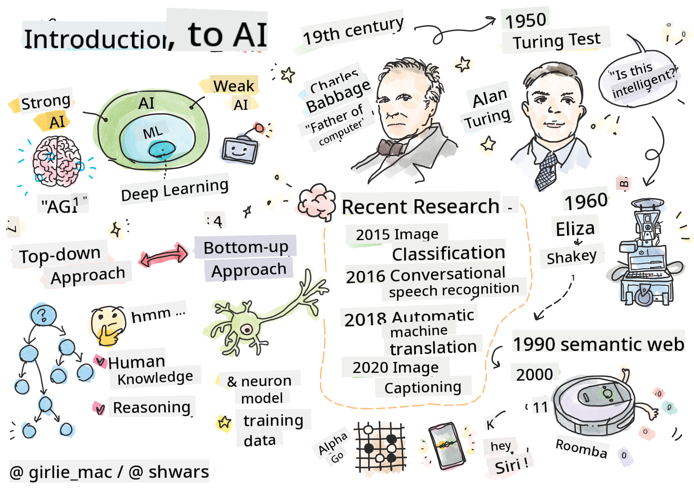
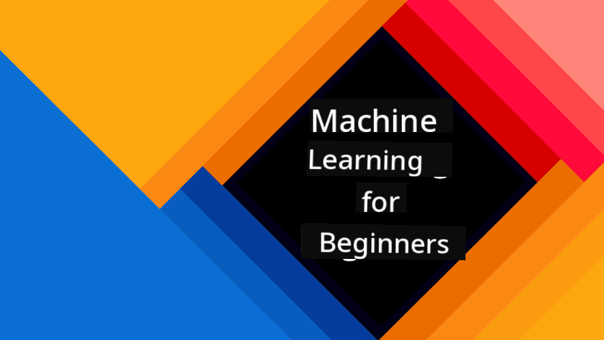
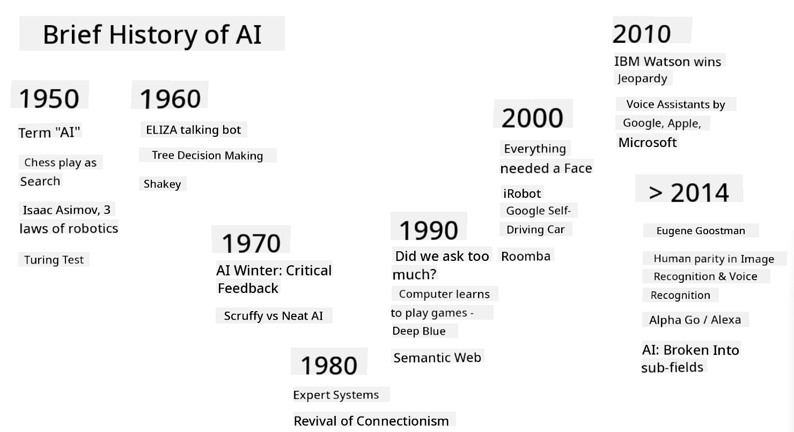
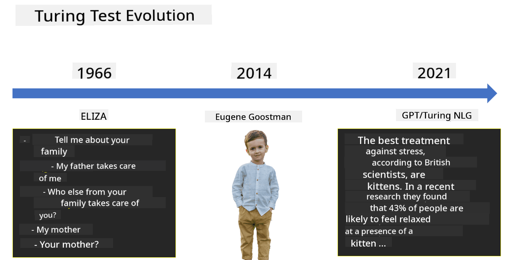

<!--
CO_OP_TRANSLATOR_METADATA:
{
  "original_hash": "06ca1b0138e65b964481ae83275b270e",
  "translation_date": "2025-10-03T07:20:16+00:00",
  "source_file": "lessons/1-Intro/README.md",
  "language_code": "en"
}
-->
# Introduction to AI

> Sketchnote by [Tomomi Imura](https://twitter.com/girlie_mac)

## [Pre-lecture quiz](https://ff-quizzes.netlify.app/en/ai/quiz/1)

**Artificial Intelligence** is an exciting scientific field that explores how computers can exhibit intelligent behavior, such as performing tasks that humans excel at.

Originally, computers were invented by [Charles Babbage](https://en.wikipedia.org/wiki/Charles_Babbage) to process numbers using a well-defined procedure—an algorithm. Modern computers, while far more advanced than Babbage's 19th-century model, still operate on the same principle of controlled computations. This means we can program a computer to perform a task if we know the exact sequence of steps required to achieve the goal.

> Photo by [Vickie Soshnikova](http://twitter.com/vickievalerie)

> ✅ Determining a person's age from their photograph is a task that cannot be explicitly programmed, as we don't fully understand how we arrive at the number in our minds when we do it.

---

However, there are tasks we don't explicitly know how to solve. For example, determining someone's age from their photograph. We learn to do this by observing many examples of people of different ages, but we can't explain the process or program a computer to replicate it. These types of tasks are precisely what **Artificial Intelligence** (AI) aims to address.

✅ Think of tasks you could delegate to a computer that would benefit from AI. Consider fields like finance, medicine, and the arts—how are these areas benefiting from AI today?

## Weak AI vs. Strong AI

Weak AI | Strong AI
---------------------------------------|-------------------------------------
Weak AI refers to AI systems designed and trained for specific tasks or a narrow set of tasks.|Strong AI, or Artificial General Intelligence (AGI), refers to AI systems with human-level intelligence and understanding.
These systems excel at predefined tasks but lack true understanding or consciousness.|Strong AI can perform any intellectual task a human can, adapt to different domains, and possess consciousness or self-awareness.
Examples include virtual assistants like Siri or Alexa, recommendation algorithms, and customer service chatbots.|Achieving Strong AI is a long-term goal requiring systems that can reason, learn, understand, and adapt across diverse tasks and contexts.
Weak AI is specialized and lacks human-like cognitive abilities or general problem-solving skills.|Strong AI remains theoretical, as no system has reached this level of intelligence.

For more information, refer to **[Artificial General Intelligence](https://en.wikipedia.org/wiki/Artificial_general_intelligence)** (AGI).

## The Definition of Intelligence and the Turing Test

One challenge in discussing **[Intelligence](https://en.wikipedia.org/wiki/Intelligence)** is the lack of a clear definition. Some associate intelligence with **abstract thinking** or **self-awareness**, but it remains difficult to define.

> [Photo](https://unsplash.com/photos/75715CVEJhI) by [Amber Kipp](https://unsplash.com/@sadmax) from Unsplash

To illustrate the ambiguity of the term *intelligence*, consider the question: "Is a cat intelligent?" People often give different answers because there is no universally accepted test to prove or disprove the claim. And if you think there is—try giving your cat an IQ test...

✅ Take a moment to think about how you define intelligence. Is a crow solving a maze to access food intelligent? Is a child intelligent?

---

When discussing AGI, we need a way to determine if we've created a truly intelligent system. [Alan Turing](https://en.wikipedia.org/wiki/Alan_Turing) proposed the **[Turing Test](https://en.wikipedia.org/wiki/Turing_test)**, which serves as a definition of intelligence. The test compares a system to something inherently intelligent—a human. Since automatic comparisons can be bypassed by programs, a human interrogator is used. If the interrogator cannot distinguish between a human and a computer system in a text-based dialogue, the system is considered intelligent.

> A chatbot named [Eugene Goostman](https://en.wikipedia.org/wiki/Eugene_Goostman), developed in St. Petersburg, came close to passing the Turing Test in 2014 by employing a clever personality trick. It claimed to be a 13-year-old Ukrainian boy, explaining its lack of knowledge and text discrepancies. The bot convinced 30% of judges it was human after a 5-minute dialogue—a metric Turing predicted machines would achieve by 2000. However, this doesn't mean we've created an intelligent system or that the computer fooled the interrogator—the creators fooled the humans, not the bot itself!

✅ Have you ever mistaken a chatbot for a human? What convinced you?

## Different Approaches to AI

To make a computer behave like a human, we need to model human thinking within the computer. This requires understanding what makes humans intelligent.

> To program intelligence into a machine, we must understand how we make decisions. Through introspection, you'll notice some processes happen subconsciously—like distinguishing a cat from a dog—while others involve reasoning.

There are two main approaches to this problem:

Top-down Approach (Symbolic Reasoning) | Bottom-up Approach (Neural Networks)
---------------------------------------|-------------------------------------
The top-down approach models human reasoning to solve problems. It involves extracting **knowledge** from humans and representing it in a computer-readable format. It also requires modeling **reasoning** within the computer. | The bottom-up approach models the structure of the human brain, consisting of many simple units called **neurons**. Each neuron acts as a weighted average of its inputs, and a network of neurons can be trained to solve problems using **training data**.

Other approaches to intelligence include:

* **Emergent**, **Synergetic**, or **multi-agent approaches** rely on the idea that complex intelligent behavior can emerge from interactions among many simple agents. According to [evolutionary cybernetics](https://en.wikipedia.org/wiki/Global_brain#Evolutionary_cybernetics), intelligence can *emerge* from simpler reactive behaviors during *metasystem transitions*.

* **Evolutionary approaches**, or **genetic algorithms**, optimize processes based on evolutionary principles.

We'll explore these approaches later in the course, but for now, we'll focus on the top-down and bottom-up methods.

### The Top-Down Approach

The **top-down approach** involves modeling human reasoning. Since we can follow our thoughts while reasoning, we can formalize this process and program it into a computer. This is known as **symbolic reasoning**.

Humans often use rules to guide their decision-making. For instance, a doctor diagnosing a patient might observe a fever and infer inflammation. By applying a set of rules to a specific problem, the doctor can arrive at a diagnosis.

This approach heavily depends on **knowledge representation** and **reasoning**. Extracting knowledge from experts can be challenging, as they may not always know why they arrive at certain conclusions. Some solutions simply "pop into their heads" without explicit reasoning. Certain tasks, like determining someone's age from a photograph, cannot be reduced to manipulating knowledge.

### Bottom-Up Approach

Alternatively, we can model the simplest elements of the brain—a neuron. By constructing an **artificial neural network** in a computer, we can teach it to solve problems using examples. This process resembles how newborns learn about their surroundings through observation.

✅ Research how babies learn. What are the basic elements of a baby's brain?

> | What about ML?         |      |
> |--------------|-----------|
> | Artificial Intelligence that involves computers learning to solve problems using data is called **Machine Learning**. This course won't cover classical machine learning; for that, refer to the [Machine Learning for Beginners](http://aka.ms/ml-beginners) curriculum. |       |

## A Brief History of AI

Artificial Intelligence emerged as a field in the mid-20th century. Initially, symbolic reasoning dominated, leading to successes like expert systems—programs acting as experts in specific domains. However, this approach proved difficult to scale. Extracting knowledge from experts, representing it in computers, and maintaining accurate knowledge bases became too complex and costly, leading to the [AI Winter](https://en.wikipedia.org/wiki/AI_winter) of the 1970s.

> Image by [Dmitry Soshnikov](http://soshnikov.com)

As computing resources became cheaper and more data became available, neural network approaches began outperforming humans in areas like computer vision and speech recognition. Over the last decade, "Artificial Intelligence" has become synonymous with neural networks, as most AI successes stem from them.

The evolution of approaches can be seen in chess-playing programs:

* Early chess programs relied on search algorithms, estimating possible moves for a few steps ahead and selecting the optimal move. This led to the development of [alpha-beta pruning](https://en.wikipedia.org/wiki/Alpha%E2%80%93beta_pruning).
* Search strategies worked well in endgames with limited moves but struggled in openings with vast possibilities. Later programs used [case-based reasoning](https://en.wikipedia.org/wiki/Case-based_reasoning), referencing similar positions in a knowledge base.
* Modern programs that outperform humans use neural networks and [reinforcement learning](https://en.wikipedia.org/wiki/Reinforcement_learning), learning by playing against themselves and improving from mistakes—similar to human learning but at a much faster pace.

✅ Research other games played by AI.

Similarly, the evolution of "talking programs" (potentially passing the Turing Test) shows progress:

* Early programs like [Eliza](https://en.wikipedia.org/wiki/ELIZA) used simple grammatical rules and reformulated input sentences into questions.
* Modern assistants like Cortana, Siri, and Google Assistant are hybrid systems, using neural networks for speech-to-text conversion and intent recognition, combined with reasoning algorithms for actions.
* Future systems may rely entirely on neural models for dialogue. Recent GPT and [Turing-NLG](https://www.microsoft.com/research/blog/turing-nlg-a-17-billion-parameter-language-model-by-microsoft) networks show promising results.

> Image by Dmitry Soshnikov, [photo](https://unsplash.com/photos/r8LmVbUKgns) by [Marina Abrosimova](https://unsplash.com/@abrosimova_marina_foto), Unsplash

## Recent AI Research

The significant surge in neural network research began around 2010, when large public datasets started becoming accessible. A massive collection of images called [ImageNet](https://en.wikipedia.org/wiki/ImageNet), containing approximately 14 million annotated images, led to the creation of the [ImageNet Large Scale Visual Recognition Challenge](https://image-net.org/challenges/LSVRC/).

> Image by [Dmitry Soshnikov](http://soshnikov.com)

In 2012, [Convolutional Neural Networks](../4-ComputerVision/07-ConvNets/README.md) were first applied to image classification, resulting in a significant reduction in classification errors (from nearly 30% to 16.4%). By 2015, Microsoft's ResNet architecture [achieved human-level accuracy](https://doi.org/10.1109/ICCV.2015.123).

Since then, Neural Networks have shown remarkable success across various tasks:

---

Year | Human Parity Achieved
-----|--------
2015 | [Image Classification](https://doi.org/10.1109/ICCV.2015.123)
2016 | [Conversational Speech Recognition](https://arxiv.org/abs/1610.05256)
2018 | [Automatic Machine Translation](https://arxiv.org/abs/1803.05567) (Chinese-to-English)
2020 | [Image Captioning](https://arxiv.org/abs/2009.13682)

In recent years, we’ve seen tremendous advancements with large language models like BERT and GPT-3. This progress is largely due to the abundance of general text data available, enabling the training of models to understand the structure and meaning of texts. These models are pre-trained on broad text collections and later fine-tuned for specific tasks. We’ll explore more about [Natural Language Processing](../5-NLP/README.md) later in this course.

## 🚀 Challenge

Explore the internet to identify where, in your opinion, AI is being used most effectively. Is it in a mapping application, a speech-to-text service, or perhaps a video game? Investigate how the system was developed.

## [Post-lecture quiz](https://ff-quizzes.netlify.app/en/ai/quiz/2)

## Review & Self Study

Review the history of AI and ML by reading through [this lesson](https://github.com/microsoft/ML-For-Beginners/tree/main/1-Introduction/2-history-of-ML). Choose an element from the sketchnote at the beginning of that lesson or this one, and research it further to understand the cultural context behind its development.

**Assignment**: [Game Jam](assignment.md)

---

**Disclaimer**:  
This document has been translated using the AI translation service [Co-op Translator](https://github.com/Azure/co-op-translator). While we aim for accuracy, please note that automated translations may contain errors or inaccuracies. The original document in its native language should be regarded as the authoritative source. For critical information, professional human translation is recommended. We are not responsible for any misunderstandings or misinterpretations resulting from the use of this translation.