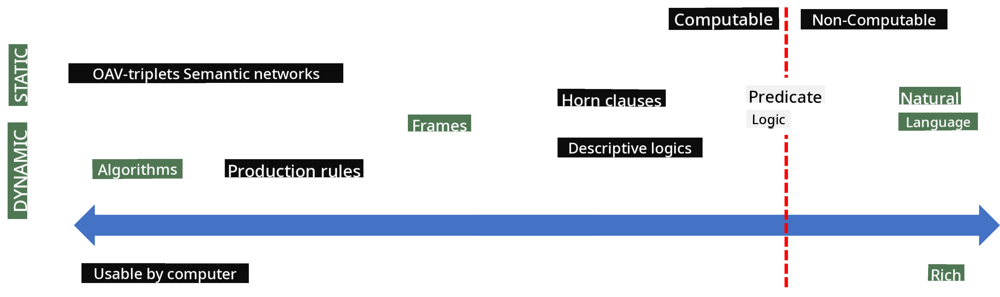
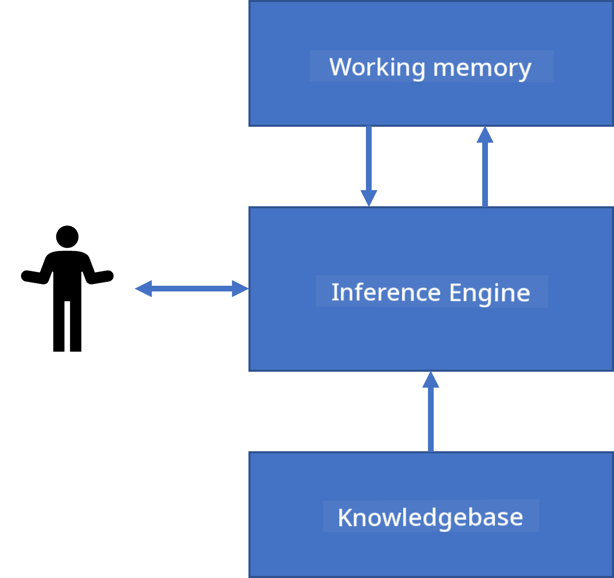
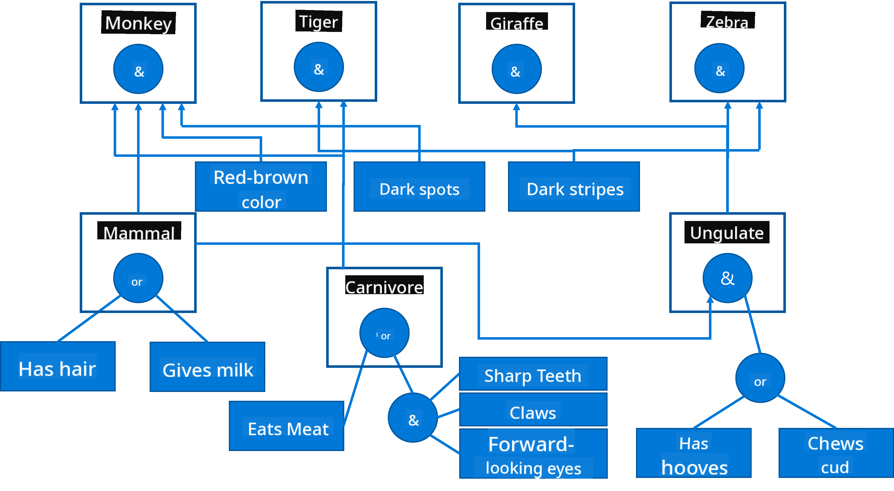

<!--
CO_OP_TRANSLATOR_METADATA:
{
  "original_hash": "98c5222ff9556b55223fed2337145e18",
  "translation_date": "2025-08-31T17:44:28+00:00",
  "source_file": "lessons/2-Symbolic/README.md",
  "language_code": "en"
}
-->
*Image [from Wikipedia](https://commons.wikimedia.org/w/index.php?curid=37705247), By Longlivetheux - Own work, CC BY-SA 4.0*

Thus, the problem of **knowledge representation** is to find an effective way to represent knowledge inside a computer in the form of data, making it usable automatically. This can be seen as a spectrum:



> Image by [Dmitry Soshnikov](http://soshnikov.com)

* On the left, there are very simple types of knowledge representations that can be effectively used by computers. The simplest one is algorithmic, where knowledge is represented by a computer program. However, this is not the best way to represent knowledge because it lacks flexibility. Knowledge in our minds is often non-algorithmic.
* On the right, there are representations such as natural text. While the most powerful, it cannot be used for automatic reasoning.

> ✅ Take a moment to think about how you represent knowledge in your mind and convert it into notes. Is there a specific format that helps you retain information better?

## Classifying Computer Knowledge Representations

We can classify different methods of computer knowledge representation into the following categories:

* **Network representations** are based on the idea that we have a network of interconnected concepts in our minds. We can attempt to replicate these networks as a graph inside a computer—a so-called **semantic network**.

1. **Object-Attribute-Value triplets** or **attribute-value pairs**. Since a graph can be represented in a computer as a list of nodes and edges, we can represent a semantic network as a list of triplets containing objects, attributes, and values. For example, we can create the following triplets about programming languages:

Object | Attribute | Value
-------|-----------|------
Python | is | Untyped-Language
Python | invented-by | Guido van Rossum
Python | block-syntax | indentation
Untyped-Language | doesn't have | type definitions

> ✅ Think about how triplets could be used to represent other types of knowledge.

2. **Hierarchical representations** emphasize the fact that we often organize objects into hierarchies in our minds. For example, we know that a canary is a bird, and all birds have wings. We also have an idea of what color a canary usually is and how fast it can fly.

   - **Frame representation** is based on representing each object or class of objects as a **frame** containing **slots**. Slots can have default values, value restrictions, or stored procedures that can be called to obtain the slot's value. All frames form a hierarchy similar to an object hierarchy in object-oriented programming languages.
   - **Scenarios** are a special kind of frame that represents complex situations that unfold over time.

**Python**

Slot | Value | Default value | Interval |
-----|-------|---------------|----------|
Name | Python | | |
Is-A | Untyped-Language | | |
Variable Case | | CamelCase | |
Program Length | | | 5-5000 lines |
Block Syntax | Indent | | |

3. **Procedural representations** are based on representing knowledge as a list of actions that can be executed when certain conditions are met.
   - Production rules are if-then statements that allow us to draw conclusions. For example, a doctor might have a rule stating: **IF** a patient has a high fever **OR** a high level of C-reactive protein in a blood test, **THEN** the patient has an inflammation. Once one of the conditions is met, we can conclude inflammation and use this information for further reasoning.
   - Algorithms can also be considered a form of procedural representation, though they are rarely used directly in knowledge-based systems.

4. **Logic** was originally proposed by Aristotle as a way to represent universal human knowledge.
   - Predicate Logic, as a mathematical theory, is too rich to be computable, so subsets like Horn clauses (used in Prolog) are typically employed.
   - Descriptive Logic is a family of logical systems used to represent and reason about hierarchies of objects in distributed knowledge representations, such as the *semantic web*.

## Expert Systems

One of the early successes of symbolic AI was the development of **expert systems**—computer systems designed to act as experts in specific, limited problem domains. These systems were based on a **knowledge base** extracted from one or more human experts and included an **inference engine** to perform reasoning.

 | 
---------------------------------------------|------------------------------------------------
Simplified structure of a human neural system | Architecture of a knowledge-based system

Expert systems are modeled after the human reasoning system, which includes **short-term memory** and **long-term memory**. Similarly, knowledge-based systems have the following components:

* **Problem memory**: Contains knowledge about the problem currently being solved, such as a patient's temperature or blood pressure, or whether they have inflammation. This is also called **static knowledge** because it represents a snapshot of what we currently know about the problem—the so-called *problem state*.
* **Knowledge base**: Represents long-term knowledge about a problem domain. This knowledge is manually extracted from human experts and remains unchanged between consultations. Since it helps navigate from one problem state to another, it is also called **dynamic knowledge**.
* **Inference engine**: Orchestrates the entire process of searching the problem state space, asking the user questions when necessary. It is also responsible for finding the appropriate rules to apply to each state.

As an example, consider the following expert system for identifying an animal based on its physical characteristics:



> Image by [Dmitry Soshnikov](http://soshnikov.com)

This diagram is called an **AND-OR tree**, a graphical representation of a set of production rules. Drawing a tree is useful during the initial stages of extracting knowledge from an expert. However, to represent the knowledge inside a computer, it is more convenient to use rules:

```
IF the animal eats meat
OR (animal has sharp teeth
    AND animal has claws
    AND animal has forward-looking eyes
) 
THEN the animal is a carnivore
```

You’ll notice that each condition on the left-hand side of the rule and the action are essentially object-attribute-value (OAV) triplets. **Working memory** contains the set of OAV triplets corresponding to the problem currently being solved. A **rules engine** looks for rules whose conditions are satisfied and applies them, adding another triplet to the working memory.

> ✅ Create your own AND-OR tree on a topic of your choice!

### Forward vs. Backward Inference

The process described above is called **forward inference**. It begins with some initial data about the problem in the working memory and follows this reasoning loop:

1. If the target attribute is present in the working memory, stop and provide the result.
2. Look for all rules whose conditions are currently satisfied to form a **conflict set** of rules.
3. Perform **conflict resolution** to select one rule to execute. Conflict resolution strategies include:
   - Selecting the first applicable rule in the knowledge base
   - Selecting a random rule
   - Selecting the *most specific* rule, i.e., the one meeting the most conditions on the "left-hand side" (LHS)
4. Apply the selected rule and insert the new piece of knowledge into the problem state.
5. Repeat from step 1.

In some cases, however, we may want to start with no knowledge about the problem and ask questions to arrive at a conclusion. For example, in medical diagnosis, we don’t perform all possible tests before diagnosing a patient. Instead, we perform tests as needed to make decisions.

This process can be modeled using **backward inference**, which is driven by the **goal**—the attribute value we are trying to determine:

1. Select all rules that can provide the value of the goal (i.e., rules with the goal on the RHS ("right-hand side")) to form a conflict set.
2. If no rules exist for this attribute, or if a rule indicates that the value should be asked of the user, ask for it. Otherwise:
3. Use a conflict resolution strategy to select one rule as a *hypothesis* to prove.
4. Recursively repeat the process for all attributes in the LHS of the rule, attempting to prove them as goals.
5. If the process fails at any point, use another rule from step 3.

> ✅ In what situations is forward inference more suitable? What about backward inference?

### Implementing Expert Systems

Expert systems can be implemented using various tools:

* Directly programming them in a high-level programming language. This is not ideal because the main advantage of a knowledge-based system is the separation of knowledge from inference. Ideally, a domain expert should be able to write rules without needing to understand the details of the inference process.
* Using an **expert systems shell**, a system specifically designed to be populated with knowledge using a knowledge representation language.

## ✍️ Exercise: Animal Inference

Check out [Animals.ipynb](https://github.com/microsoft/AI-For-Beginners/blob/main/lessons/2-Symbolic/Animals.ipynb) for an example of implementing forward and backward inference in an expert system.
> **Note**: This example is quite basic and serves only to illustrate what an expert system looks like. When you begin developing such a system, you’ll only start noticing some *intelligent* behavior once you reach a certain number of rules, typically around 200 or more. At some stage, the rules become so intricate that it’s difficult to keep track of all of them, and you might start questioning why the system makes certain decisions. However, a key feature of knowledge-based systems is that you can always *explain* precisely how any decision was reached.
## Ontologies and the Semantic Web

At the end of the 20th century, there was an initiative to use knowledge representation to annotate Internet resources, enabling the discovery of resources that match very specific queries. This initiative was called the **Semantic Web**, and it was based on several key concepts:

- A specialized knowledge representation system based on **[description logics](https://en.wikipedia.org/wiki/Description_logic)** (DL). It is similar to frame-based knowledge representation because it organizes objects into hierarchies with properties, but it also includes formal logical semantics and inference capabilities. There is a family of DLs that balance expressiveness with the computational complexity of inference.
- Distributed knowledge representation, where all concepts are identified by global URI identifiers, allowing the creation of knowledge hierarchies that span the internet.
- A family of XML-based languages for describing knowledge: RDF (Resource Description Framework), RDFS (RDF Schema), OWL (Ontology Web Language).

A central concept in the Semantic Web is **Ontology**. This refers to an explicit specification of a problem domain using a formal knowledge representation. The simplest ontology might be a hierarchy of objects within a domain, while more complex ontologies include rules for inference.

In the Semantic Web, all representations are based on triplets. Each object and relation is uniquely identified by a URI. For example, to state that this AI Curriculum was developed by Dmitry Soshnikov on January 1, 2022, we can use the following triplets:


```
http://github.com/microsoft/ai-for-beginners http://www.example.com/terms/creation-date “Jan 13, 2007”
http://github.com/microsoft/ai-for-beginners http://purl.org/dc/elements/1.1/creator http://soshnikov.com
```

> ✅ Here, `http://www.example.com/terms/creation-date` and `http://purl.org/dc/elements/1.1/creator` are widely recognized URIs used to express the concepts of *creator* and *creation date*.

In a more complex scenario, if we want to define a list of creators, we can use data structures defined in RDF.


> Diagrams above by [Dmitry Soshnikov](http://soshnikov.com)

The progress of the Semantic Web was somewhat slowed by the success of search engines and natural language processing techniques, which can extract structured data from text. However, in certain areas, significant efforts are still being made to maintain ontologies and knowledge bases. Notable projects include:

* [WikiData](https://wikidata.org/) is a collection of machine-readable knowledge bases linked to Wikipedia. Much of the data is extracted from Wikipedia *InfoBoxes*, which are structured content sections within Wikipedia pages. You can [query](https://query.wikidata.org/) WikiData using SPARQL, a specialized query language for the Semantic Web. Here’s an example query that shows the most common eye colors among humans:

```sparql
#defaultView:BubbleChart
SELECT ?eyeColorLabel (COUNT(?human) AS ?count)
WHERE
{
  ?human wdt:P31 wd:Q5.       # human instance-of homo sapiens
  ?human wdt:P1340 ?eyeColor. # human eye-color ?eyeColor
  SERVICE wikibase:label { bd:serviceParam wikibase:language "en". }
}
GROUP BY ?eyeColorLabel
```

* [DBpedia](https://www.dbpedia.org/) is another initiative similar to WikiData.

> ✅ If you want to experiment with creating your own ontologies or exploring existing ones, there’s a great visual ontology editor called [Protégé](https://protege.stanford.edu/). You can download it or use it online.


*Web Protégé editor open with the Romanov Family ontology. Screenshot by Dmitry Soshnikov*

## ✍️ Exercise: A Family Ontology

Check out [FamilyOntology.ipynb](https://github.com/Ezana135/AI-For-Beginners/blob/main/lessons/2-Symbolic/FamilyOntology.ipynb) for an example of using Semantic Web techniques to analyze family relationships. In this exercise, we’ll take a family tree in the common GEDCOM format and an ontology of family relationships to build a graph of all family connections for a given set of individuals.

## Microsoft Concept Graph

In most cases, ontologies are carefully crafted by hand. However, it’s also possible to **extract** ontologies from unstructured data, such as natural language text.

One such effort was undertaken by Microsoft Research, resulting in the [Microsoft Concept Graph](https://blogs.microsoft.com/ai/microsoft-researchers-release-graph-that-helps-machines-conceptualize/?WT.mc_id=academic-77998-cacaste).

This is a large collection of entities grouped using `is-a` inheritance relationships. It can answer questions like "What is Microsoft?" with responses such as "a company with probability 0.87, and a brand with probability 0.75."

The Graph is accessible via a REST API or as a downloadable text file listing all entity pairs.

## ✍️ Exercise: A Concept Graph

Try the [MSConceptGraph.ipynb](https://github.com/microsoft/AI-For-Beginners/blob/main/lessons/2-Symbolic/MSConceptGraph.ipynb) notebook to see how the Microsoft Concept Graph can be used to categorize news articles into different groups.

## Conclusion

Today, AI is often equated with *Machine Learning* or *Neural Networks*. However, humans also engage in explicit reasoning, which is something neural networks currently do not handle. In real-world projects, explicit reasoning is still used for tasks requiring explanations or the ability to adjust system behavior in a controlled manner.

## 🚀 Challenge

In the Family Ontology notebook linked to this lesson, experiment with other family relationships. Try to uncover new connections between individuals in the family tree.

## [Post-lecture quiz](https://ff-quizzes.netlify.app/en/ai/quiz/4)

## Review & Self Study

Research areas where humans have attempted to quantify and codify knowledge. Look into Bloom's Taxonomy, and explore historical efforts to make sense of the world. Study Linnaeus’s taxonomy of organisms and Dmitri Mendeleev’s classification of chemical elements. What other fascinating examples can you find?

**Assignment**: [Build an Ontology](assignment.md)

---

**Disclaimer**:  
This document has been translated using the AI translation service [Co-op Translator](https://github.com/Azure/co-op-translator). While we aim for accuracy, please note that automated translations may include errors or inaccuracies. The original document in its native language should be regarded as the authoritative source. For critical information, professional human translation is advised. We are not responsible for any misunderstandings or misinterpretations resulting from the use of this translation.