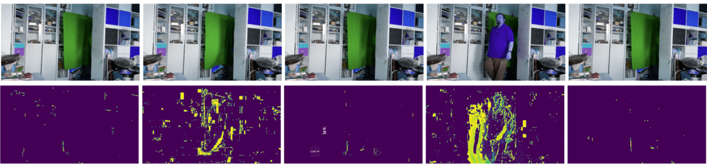

<!--
CO_OP_TRANSLATOR_METADATA:
{
  "original_hash": "4bedc8e702db17260cfe824d58b6cfd4",
  "translation_date": "2025-08-31T17:38:57+00:00",
  "source_file": "lessons/4-ComputerVision/06-IntroCV/README.md",
  "language_code": "en"
}
-->
# Introduction to Computer Vision

[Computer Vision](https://wikipedia.org/wiki/Computer_vision) is a field focused on enabling computers to achieve a high-level understanding of digital images. This definition is broad because *understanding* can encompass various tasks, such as identifying objects in an image (**object detection**), recognizing events (**event detection**), describing an image in text, or reconstructing a scene in 3D. There are also specialized tasks related to human images, such as estimating age and emotions, detecting and identifying faces, and estimating 3D poses, among others.

## [Pre-lecture quiz](https://ff-quizzes.netlify.app/en/ai/quiz/11)

One of the simplest tasks in computer vision is **image classification**.

Computer vision is often considered a branch of AI. Today, most computer vision tasks are solved using neural networks. In this section, we will explore a specific type of neural network used for computer vision, [convolutional neural networks](../07-ConvNets/README.md).

Before passing an image to a neural network, it is often beneficial to apply algorithmic techniques to enhance the image.

Several Python libraries are available for image processing:

* **[imageio](https://imageio.readthedocs.io/en/stable/)** can be used to read and write various image formats. It also supports ffmpeg, a useful tool for converting video frames into images.
* **[Pillow](https://pillow.readthedocs.io/en/stable/index.html)** (also known as PIL) is more versatile and supports image manipulation tasks like morphing, palette adjustments, and more.
* **[OpenCV](https://opencv.org/)** is a powerful image processing library written in C++ and is considered the *de facto* standard for image processing. It has a convenient Python interface.
* **[dlib](http://dlib.net/)** is a C++ library that implements many machine learning algorithms, including some for computer vision. It also has a Python interface and can handle complex tasks like face detection and facial landmark detection.

## OpenCV

[OpenCV](https://opencv.org/) is widely regarded as the *de facto* standard for image processing. It offers numerous useful algorithms implemented in C++. OpenCV can also be accessed via Python.

A great resource for learning OpenCV is [this Learn OpenCV course](https://learnopencv.com/getting-started-with-opencv/). In this curriculum, the goal is not to master OpenCV but to demonstrate examples of its use and how it can be applied.

### Loading Images

Images in Python can be conveniently represented as NumPy arrays. For instance, grayscale images with dimensions of 320x200 pixels would be stored in a 200x320 array, while color images of the same size would have a shape of 200x320x3 (for 3 color channels). To load an image, you can use the following code:

```python
import cv2
import matplotlib.pyplot as plt

im = cv2.imread('image.jpeg')
plt.imshow(im)
```

Traditionally, OpenCV uses BGR (Blue-Green-Red) encoding for color images, whereas other Python tools use the more common RGB (Red-Green-Blue) encoding. To ensure the image appears correctly, you need to convert it to the RGB color space, either by swapping dimensions in the NumPy array or by using an OpenCV function:

```python
im = cv2.cvtColor(im,cv2.COLOR_BGR2RGB)
```

The same `cvtColor` function can be used for other color space transformations, such as converting an image to grayscale or to the HSV (Hue-Saturation-Value) color space.

OpenCV can also be used to load video frame-by-frame. An example of this is provided in the exercise [OpenCV Notebook](OpenCV.ipynb).

### Image Processing

Before passing an image to a neural network, you may want to apply several preprocessing steps. OpenCV offers a variety of functionalities, including:

* **Resizing** an image using `im = cv2.resize(im, (320,200),interpolation=cv2.INTER_LANCZOS)`
* **Blurring** an image using `im = cv2.medianBlur(im,3)` or `im = cv2.GaussianBlur(im, (3,3), 0)`
* Adjusting the **brightness and contrast** of an image through NumPy array manipulations, as described [in this Stackoverflow note](https://stackoverflow.com/questions/39308030/how-do-i-increase-the-contrast-of-an-image-in-python-opencv).
* Using [thresholding](https://docs.opencv.org/4.x/d7/d4d/tutorial_py_thresholding.html) by calling `cv2.threshold`/`cv2.adaptiveThreshold` functions, which is often preferable to adjusting brightness or contrast.
* Applying various [transformations](https://docs.opencv.org/4.5.5/da/d6e/tutorial_py_geometric_transformations.html) to the image:
    - **[Affine transformations](https://docs.opencv.org/4.5.5/d4/d61/tutorial_warp_affine.html)** are useful for combining rotation, resizing, and skewing when you know the source and destination locations of three points in the image. Affine transformations preserve parallel lines.
    - **[Perspective transformations](https://medium.com/analytics-vidhya/opencv-perspective-transformation-9edffefb2143)** are helpful when you know the source and destination positions of four points in the image. For example, if you take a picture of a rectangular document with a smartphone camera at an angle and want to create a rectangular image of the document itself.
* Understanding movement within an image using **[optical flow](https://docs.opencv.org/4.5.5/d4/dee/tutorial_optical_flow.html)**.

## Examples of using Computer Vision

In our [OpenCV Notebook](OpenCV.ipynb), we provide examples of how computer vision can be applied to specific tasks:

* **Pre-processing a photograph of a Braille book**. This example demonstrates how thresholding, feature detection, perspective transformation, and NumPy manipulations can be used to isolate individual Braille symbols for further classification by a neural network.

 |  | 
----|-----|-----

> Image from [OpenCV.ipynb](OpenCV.ipynb)

* **Detecting motion in video using frame difference**. If the camera is stationary, frames from the camera feed should be quite similar. Since frames are represented as arrays, subtracting the arrays for two consecutive frames reveals pixel differences. These differences are minimal for static frames but increase significantly when there is substantial motion in the image.



> Image from [OpenCV.ipynb](OpenCV.ipynb)

* **Detecting motion using Optical Flow**. [Optical flow](https://docs.opencv.org/3.4/d4/dee/tutorial_optical_flow.html) helps track how individual pixels move across video frames. There are two types of optical flow:

   - **Dense Optical Flow** calculates a vector field showing the movement of each pixel.
   - **Sparse Optical Flow** focuses on distinctive features in the image (e.g., edges) and tracks their movement across frames.


> Image from [OpenCV.ipynb](OpenCV.ipynb)

## ✍️ Example Notebooks: OpenCV [try OpenCV in Action](OpenCV.ipynb)

Explore [OpenCV Notebook](OpenCV.ipynb) to experiment with OpenCV.

## Conclusion

Sometimes, relatively complex tasks like motion detection or fingertip detection can be solved entirely using computer vision techniques. Therefore, understanding the basics of computer vision and the capabilities of libraries like OpenCV is highly beneficial.

## 🚀 Challenge

Watch [this video](https://docs.microsoft.com/shows/ai-show/ai-show--2021-opencv-ai-competition--grand-prize-winners--cortic-tigers--episode-32?WT.mc_id=academic-77998-cacaste) from the AI show to learn about the Cortic Tigers project and how they developed a block-based solution to make computer vision tasks accessible via a robot. Research other similar projects that help introduce new learners to the field.

## [Post-lecture quiz](https://ff-quizzes.netlify.app/en/ai/quiz/12)

## Review & Self Study

Learn more about optical flow [in this excellent tutorial](https://learnopencv.com/optical-flow-in-opencv/).

## [Assignment](lab/README.md)

In this lab, you will record a video with simple gestures, and your task will be to extract up/down/left/right movements using optical flow.


---

**Disclaimer**:  
This document has been translated using the AI translation service [Co-op Translator](https://github.com/Azure/co-op-translator). While we aim for accuracy, please note that automated translations may include errors or inaccuracies. The original document in its native language should be regarded as the authoritative source. For critical information, professional human translation is advised. We are not responsible for any misunderstandings or misinterpretations resulting from the use of this translation.