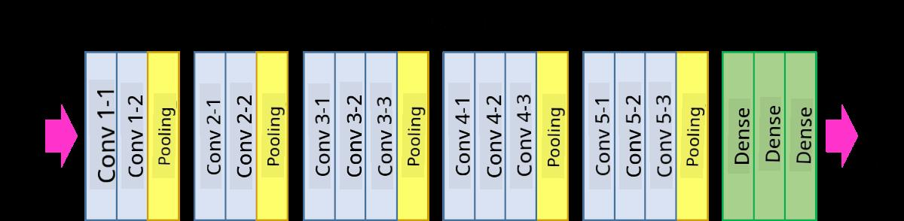
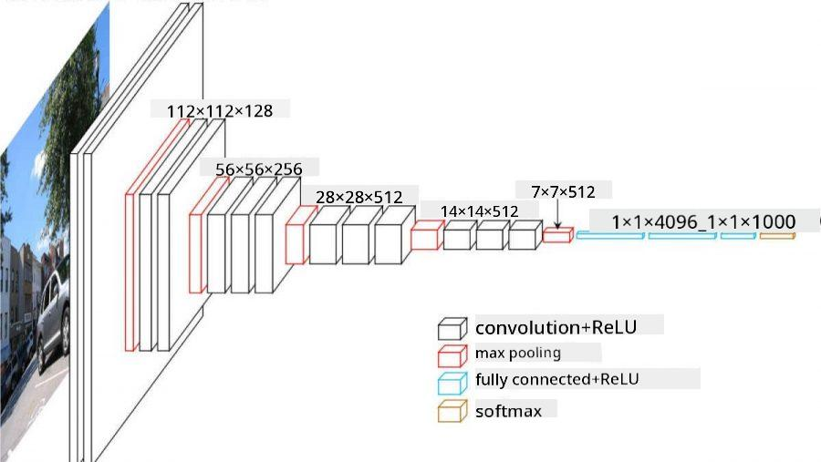

<!--
CO_OP_TRANSLATOR_METADATA:
{
  "original_hash": "2f7b97b375358cb51a1e098df306bf73",
  "translation_date": "2025-08-31T17:36:03+00:00",
  "source_file": "lessons/4-ComputerVision/07-ConvNets/CNN_Architectures.md",
  "language_code": "en"
}
-->
# Well-Known CNN Architectures

### VGG-16

VGG-16 is a network that achieved 92.7% accuracy in ImageNet top-5 classification in 2014. It has the following layer structure:

As you can see, VGG follows a traditional pyramid architecture, which is a sequence of convolution-pooling layers.

> Image from [Researchgate](https://www.researchgate.net/figure/Vgg16-model-structure-To-get-the-VGG-NIN-model-we-replace-the-2-nd-4-th-6-th-7-th_fig2_335194493)

### ResNet

ResNet is a family of models proposed by Microsoft Research in 2015. The main idea of ResNet is to use **residual blocks**:

> Image from [this paper](https://arxiv.org/pdf/1512.03385.pdf)

The reason for using identity pass-through is to have our layer predict **the difference** between the result of a previous layer and the output of the residual block - hence the name *residual*. These blocks are much easier to train, and networks with several hundreds of these blocks can be constructed (the most common variants are ResNet-52, ResNet-101, and ResNet-152).

You can also think of this network as being able to adjust its complexity to the dataset. Initially, when you start training the network, the weight values are small, and most of the signal passes through the identity layers. As training progresses and weights grow larger, the significance of the network parameters increases, and the network adjusts to provide the required expressive power to correctly classify training images.

### Google Inception

Google Inception architecture takes this idea one step further and builds each network layer as a combination of several different paths:

> Image from [Researchgate](https://www.researchgate.net/figure/Inception-module-with-dimension-reductions-left-and-schema-for-Inception-ResNet-v1_fig2_355547454)

Here, we need to emphasize the role of 1x1 convolutions, because at first glance they might not seem useful. Why would we need to apply a 1x1 filter to an image? However, remember that convolution filters also work across multiple depth channels (originally RGB colors, and in subsequent layers, channels for different filters). A 1x1 convolution is used to mix these input channels together using different trainable weights. It can also be seen as downsampling (pooling) across the channel dimension.

Here is [a good blog post](https://medium.com/analytics-vidhya/talented-mr-1x1-comprehensive-look-at-1x1-convolution-in-deep-learning-f6b355825578) on the subject, and [the original paper](https://arxiv.org/pdf/1312.4400.pdf).

### MobileNet

MobileNet is a family of models with reduced size, suitable for mobile devices. Use them if you are limited in resources and can afford to sacrifice a bit of accuracy. The main idea behind them is the concept of **depthwise separable convolution**, which represents convolution filters as a combination of spatial convolutions and 1x1 convolutions across depth channels. This significantly reduces the number of parameters, making the network smaller in size and easier to train with less data.

Here is [a good blog post on MobileNet](https://medium.com/analytics-vidhya/image-classification-with-mobilenet-cc6fbb2cd470).

## Conclusion

In this unit, you have learned the main concept behind computer vision neural networks - convolutional networks. Real-world architectures that power image classification, object detection, and even image generation networks are all based on CNNs, just with more layers and some additional training techniques.

## 🚀 Challenge

In the accompanying notebooks, there are notes at the bottom about how to achieve greater accuracy. Try experimenting to see if you can improve the accuracy.

## [Post-lecture quiz](https://ff-quizzes.netlify.app/en/ai/quiz/14)

## Review & Self Study

While CNNs are most commonly used for computer vision tasks, they are generally effective at extracting fixed-sized patterns. For example, if working with sounds, CNNs can be used to identify specific patterns in audio signals, where filters would be 1-dimensional (this type of CNN is called 1D-CNN). Additionally, 3D-CNNs are sometimes used to extract features in multi-dimensional spaces, such as detecting certain events in videos. These networks can capture patterns of feature changes over time. Explore and study other tasks that can be accomplished using CNNs.

## [Assignment](lab/README.md)

In this lab, your task is to classify different cat and dog breeds. These images are more complex than the MNIST dataset, have higher dimensions, and include more than 10 classes.

---

**Disclaimer**:  
This document has been translated using the AI translation service [Co-op Translator](https://github.com/Azure/co-op-translator). While we aim for accuracy, please note that automated translations may include errors or inaccuracies. The original document in its native language should be regarded as the authoritative source. For critical information, professional human translation is advised. We are not responsible for any misunderstandings or misinterpretations resulting from the use of this translation.