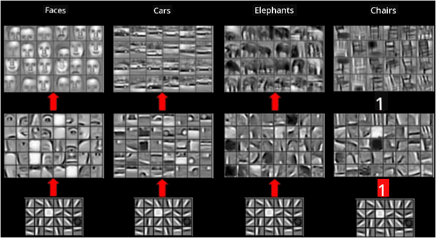

<!--
CO_OP_TRANSLATOR_METADATA:
{
  "original_hash": "088837b42b7d99198bf62db8a42411e0",
  "translation_date": "2025-08-31T17:35:37+00:00",
  "source_file": "lessons/4-ComputerVision/07-ConvNets/README.md",
  "language_code": "en"
}
-->
> Image of [Leung-Malik Filter Bank](https://www.robots.ox.ac.uk/~vgg/research/texclass/filters.html)

However, while we can manually design filters to extract certain patterns, we can also structure the network in a way that allows it to learn these patterns automatically. This is one of the core ideas behind CNNs.

## Main ideas behind CNN

The functioning of CNNs is based on the following key concepts:

* Convolutional filters are capable of extracting patterns.
* Networks can be designed so that filters are trained automatically.
* This approach can be extended to identify patterns in high-level features, not just in the original image. CNNs extract features hierarchically, starting with low-level pixel combinations and progressing to higher-level combinations of image components.

> Image from [a paper by Hislop-Lynch](https://www.semanticscholar.org/paper/Computer-vision-based-pedestrian-trajectory-Hislop-Lynch/26e6f74853fc9bbb7487b06dc2cf095d36c9021d), based on [their research](https://dl.acm.org/doi/abs/10.1145/1553374.1553453)

## ✍️ Exercises: Convolutional Neural Networks

Let’s dive deeper into how convolutional neural networks function and how trainable filters can be achieved by working through the following notebooks:

* [Convolutional Neural Networks - PyTorch](ConvNetsPyTorch.ipynb)
* [Convolutional Neural Networks - TensorFlow](ConvNetsTF.ipynb)

## Pyramid Architecture

Most CNNs used for image processing follow a pyramid architecture. The first convolutional layer applied to the original images typically uses a relatively small number of filters (8-16), which detect simple pixel combinations like horizontal or vertical lines. At the next level, the spatial dimensions of the network are reduced, while the number of filters increases, enabling the detection of more complex combinations of features. As we progress through the layers toward the final classifier, the spatial dimensions of the image continue to shrink, and the number of filters grows.

For example, consider the architecture of VGG-16, a network that achieved 92.7% accuracy in ImageNet's top-5 classification in 2014:

> Image from [Researchgate](https://www.researchgate.net/figure/Vgg16-model-structure-To-get-the-VGG-NIN-model-we-replace-the-2-nd-4-th-6-th-7-th_fig2_335194493)

## Best-Known CNN Architectures

[Continue your study about the best-known CNN architectures](CNN_Architectures.md)

---

**Disclaimer**:  
This document has been translated using the AI translation service [Co-op Translator](https://github.com/Azure/co-op-translator). While we aim for accuracy, please note that automated translations may include errors or inaccuracies. The original document in its native language should be regarded as the authoritative source. For critical information, professional human translation is advised. We are not responsible for any misunderstandings or misinterpretations resulting from the use of this translation.