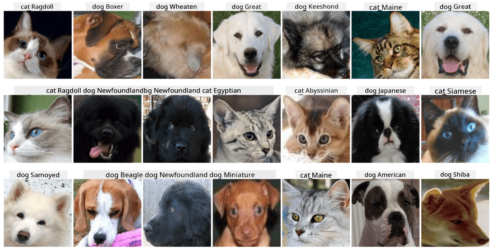

<!--
CO_OP_TRANSLATOR_METADATA:
{
  "original_hash": "f3d2cee9cb3c52160419e560c57a690e",
  "translation_date": "2025-08-31T17:36:39+00:00",
  "source_file": "lessons/4-ComputerVision/07-ConvNets/lab/README.md",
  "language_code": "en"
}
-->
# Classification of Pets Faces

Lab Assignment from [AI for Beginners Curriculum](https://github.com/microsoft/ai-for-beginners).

## Task

Imagine you need to develop an application for a pet nursery to catalog all pets. One of the key features of such an application would be automatically identifying the breed from a photograph. This can be effectively achieved using neural networks.

Your task is to train a convolutional neural network to classify different breeds of cats and dogs using the **Pet Faces** dataset.

## The Dataset

We will use the **Pet Faces** dataset, which is derived from the [Oxford-IIIT](https://www.robots.ox.ac.uk/~vgg/data/pets/) pets dataset. It includes 35 different breeds of dogs and cats.



To download the dataset, use this code snippet:

```python
!wget https://thor.robots.ox.ac.uk/~vgg/data/pets/images.tar.gz
!tar xfz images.tar.gz
!rm images.tar.gz
```

## Starting Notebook

Begin the lab by opening [PetFaces.ipynb](PetFaces.ipynb)

## Takeaway

You have tackled a fairly complex problem of image classification from scratch! Despite the large number of classes, you were able to achieve reasonable accuracy! It’s also a good idea to measure top-k accuracy, as some classes can be easily confused, even by humans, due to their subtle differences.

---

**Disclaimer**:  
This document has been translated using the AI translation service [Co-op Translator](https://github.com/Azure/co-op-translator). While we aim for accuracy, please note that automated translations may include errors or inaccuracies. The original document in its native language should be regarded as the authoritative source. For critical information, professional human translation is advised. We are not responsible for any misunderstandings or misinterpretations resulting from the use of this translation.