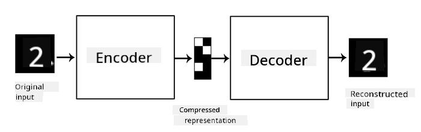

<!--
CO_OP_TRANSLATOR_METADATA:
{
  "original_hash": "0b306c04f5337b6e7430e5c0b16bb5c0",
  "translation_date": "2025-08-31T17:41:39+00:00",
  "source_file": "lessons/4-ComputerVision/09-Autoencoders/README.md",
  "language_code": "en"
}
-->
# Autoencoders

When training CNNs, one challenge is the need for a large amount of labeled data. For example, in image classification, we must manually sort images into different categories.

## [Pre-lecture quiz](https://ff-quizzes.netlify.app/en/ai/quiz/17)

However, we can use raw (unlabeled) data to train CNN feature extractors, a method known as **self-supervised learning**. Instead of labels, training images serve as both the input and output for the network. The main concept of an **autoencoder** is to use an **encoder network** to transform the input image into a **latent space** (usually a smaller vector), followed by a **decoder network** that reconstructs the original image.

> ✅ An [autoencoder](https://wikipedia.org/wiki/Autoencoder) is "a type of artificial neural network used to learn efficient codings of unlabeled data."

By training an autoencoder to capture as much information from the original image as possible for accurate reconstruction, the network identifies the best **embedding** of input images to represent their meaning.

> Image from [Keras blog](https://blog.keras.io/building-autoencoders-in-keras.html)

## Scenarios for using Autoencoders

Although reconstructing original images may not seem inherently useful, autoencoders excel in several scenarios:

* **Reducing image dimensions for visualization** or **training image embeddings**. Autoencoders often outperform PCA because they account for the spatial structure of images and hierarchical features.
* **Denoising**, or removing noise from images. Since noise contains a lot of irrelevant information, the autoencoder cannot fit it all into the smaller latent space, focusing instead on the essential parts of the image. To train denoisers, we use original images as targets and noisy images as inputs for the autoencoder.
* **Super-resolution**, or increasing image resolution. High-resolution images serve as targets, while lower-resolution images are used as inputs for the autoencoder.
* **Generative models**. After training the autoencoder, the decoder can generate new objects using random latent vectors.

## Variational Autoencoders (VAE)

Traditional autoencoders reduce input data dimensions to identify key features of input images. However, latent vectors often lack interpretability. For instance, in the MNIST dataset, determining which digits correspond to specific latent vectors is challenging because nearby latent vectors may not represent the same digit.

For generative models, understanding the latent space is crucial. This leads to the concept of **variational autoencoders** (VAE).

A VAE learns to predict the *statistical distribution* of latent parameters, known as the **latent distribution**. For example, latent vectors can be modeled as a normal distribution with a mean zmean and standard deviation zsigma (both are vectors of dimensionality d). The encoder predicts these parameters, and the decoder reconstructs objects using random vectors sampled from this distribution.

To summarize:

 * From the input vector, we predict `z_mean` and `z_log_sigma` (instead of directly predicting the standard deviation, we predict its logarithm).
 * We sample a vector `sample` from the distribution N(zmean,exp(zlog\_sigma)).
 * The decoder reconstructs the original image using `sample` as the input vector.

 

> Image from [this blog post](https://ijdykeman.github.io/ml/2016/12/21/cvae.html) by Isaak Dykeman

Variational autoencoders use a complex loss function with two components:

* **Reconstruction loss**, which measures how closely the reconstructed image matches the target (e.g., Mean Squared Error or MSE). This is the same loss function used in standard autoencoders.
* **KL loss**, which ensures the latent variable distribution remains close to a normal distribution. It is based on [Kullback-Leibler divergence](https://www.countbayesie.com/blog/2017/5/9/kullback-leibler-divergence-explained), a metric for comparing statistical distributions.

A key advantage of VAEs is their ability to generate new images easily, as the latent vector distribution is well-defined. For example, training a VAE with a 2D latent vector on MNIST allows us to vary latent vector components to produce different digits:

> Image by [Dmitry Soshnikov](http://soshnikov.com)

Notice how images transition smoothly as latent vectors are sampled from different regions of the latent space. This space can also be visualized in 2D:

 

> Image by [Dmitry Soshnikov](http://soshnikov.com)

## ✍️ Exercises: Autoencoders

Explore autoencoders further in these notebooks:

* [Autoencoders in TensorFlow](AutoencodersTF.ipynb)
* [Autoencoders in PyTorch](AutoEncodersPyTorch.ipynb)

## Properties of Autoencoders

* **Data Specific** - Autoencoders perform well only on the type of images they were trained on. For instance, a super-resolution network trained on flowers will not work effectively on portraits. This is because the network uses fine details learned from the training dataset to enhance resolution.
* **Lossy** - The reconstructed image differs from the original image. The nature of the loss depends on the *loss function* used during training.
* Works on **unlabeled data**

## [Post-lecture quiz](https://ff-quizzes.netlify.app/en/ai/quiz/18)

## Conclusion

In this lesson, you explored different types of autoencoders available to AI practitioners. You learned how to build them and use them to reconstruct images. Additionally, you studied VAEs and their application in generating new images.

## 🚀 Challenge

This lesson focused on using autoencoders for images, but they can also be applied to music! Check out the Magenta project's [MusicVAE](https://magenta.tensorflow.org/music-vae), which uses autoencoders to reconstruct music. Experiment with the [library](https://colab.research.google.com/github/magenta/magenta-demos/blob/master/colab-notebooks/Multitrack_MusicVAE.ipynb) to see what you can create.

## [Post-lecture quiz](https://ff-quizzes.netlify.app/en/ai/quiz/16)

## Review & Self Study

For further reading, explore these resources on autoencoders:

* [Building Autoencoders in Keras](https://blog.keras.io/building-autoencoders-in-keras.html)
* [Blog post on NeuroHive](https://neurohive.io/ru/osnovy-data-science/variacionnyj-avtojenkoder-vae/)
* [Variational Autoencoders Explained](https://kvfrans.com/variational-autoencoders-explained/)
* [Conditional Variational Autoencoders](https://ijdykeman.github.io/ml/2016/12/21/cvae.html)

## Assignment

At the end of [this notebook using TensorFlow](AutoencodersTF.ipynb), you will find a 'task' - use this as your assignment.

---

**Disclaimer**:  
This document has been translated using the AI translation service [Co-op Translator](https://github.com/Azure/co-op-translator). While we aim for accuracy, please note that automated translations may include errors or inaccuracies. The original document in its native language should be regarded as the authoritative source. For critical information, professional human translation is advised. We are not responsible for any misunderstandings or misinterpretations resulting from the use of this translation.