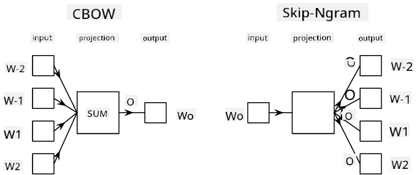

<!--
CO_OP_TRANSLATOR_METADATA:
{
  "original_hash": "31b46ba1f3aa78578134d4829f88be53",
  "translation_date": "2025-08-31T17:56:16+00:00",
  "source_file": "lessons/5-NLP/15-LanguageModeling/README.md",
  "language_code": "en"
}
-->
# Language Modeling

Semantic embeddings, such as Word2Vec and GloVe, are essentially the first step toward **language modeling**—creating models that can somehow *understand* (or *represent*) the essence of language.

## [Pre-lecture quiz](https://ff-quizzes.netlify.app/en/ai/quiz/29)

The core idea behind language modeling is training models on unlabeled datasets in an unsupervised way. This is crucial because there is an abundance of unlabeled text available, whereas labeled text is always limited by the effort required to annotate it. Typically, language models are designed to **predict missing words** in text, as it is straightforward to mask a random word in a sentence and use it as a training example.

## Training Embeddings

In earlier examples, we used pre-trained semantic embeddings, but it’s fascinating to explore how these embeddings can be trained. Several approaches can be employed:

* **N-Gram** language modeling, where a token is predicted based on the N preceding tokens (N-gram).
* **Continuous Bag-of-Words** (CBoW), where the middle token $W_0$ in a sequence $W_{-N}$, ..., $W_N$ is predicted.
* **Skip-gram**, where a set of surrounding tokens {$W_{-N},\dots, W_{-1}, W_1,\dots, W_N$} is predicted using the middle token $W_0$.

> Image from [this paper](https://arxiv.org/pdf/1301.3781.pdf)

## ✍️ Example Notebooks: Training CBoW model

Expand your knowledge with the following notebooks:

* [Training CBoW Word2Vec with TensorFlow](CBoW-TF.ipynb)
* [Training CBoW Word2Vec with PyTorch](CBoW-PyTorch.ipynb)

## Conclusion

In the previous lesson, we discovered that word embeddings work like magic! Now we understand that training word embeddings isn’t overly complicated, and we can train our own embeddings for domain-specific text when necessary.

## [Post-lecture quiz](https://ff-quizzes.netlify.app/en/ai/quiz/30)

## Review & Self Study

* [Official PyTorch tutorial on Language Modeling](https://pytorch.org/tutorials/beginner/nlp/word_embeddings_tutorial.html).
* [Official TensorFlow tutorial on training Word2Vec model](https://www.TensorFlow.org/tutorials/text/word2vec).
* Learn how to use the **gensim** framework to train commonly used embeddings with just a few lines of code [in this documentation](https://pytorch.org/tutorials/beginner/nlp/word_embeddings_tutorial.html).

## 🚀 [Assignment: Train Skip-Gram Model](lab/README.md)

In the lab, your challenge is to modify the code from this lesson to train a skip-gram model instead of CBoW. [Read the details](lab/README.md)

---

**Disclaimer**:  
This document has been translated using the AI translation service [Co-op Translator](https://github.com/Azure/co-op-translator). While we aim for accuracy, please note that automated translations may include errors or inaccuracies. The original document in its native language should be regarded as the authoritative source. For critical information, professional human translation is advised. We are not responsible for any misunderstandings or misinterpretations resulting from the use of this translation.