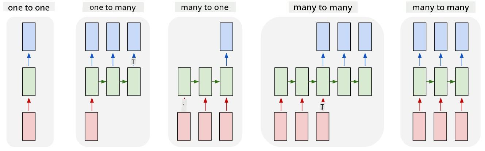

<!--
CO_OP_TRANSLATOR_METADATA:
{
  "original_hash": "bd10f434e444bce61b7f97eeb1ff6a55",
  "translation_date": "2025-08-31T17:58:44+00:00",
  "source_file": "lessons/5-NLP/19-NER/README.md",
  "language_code": "en"
}
-->
# Named Entity Recognition

So far, we have primarily focused on one NLP task—classification. However, there are other NLP tasks that can be tackled using neural networks. One such task is **[Named Entity Recognition](https://wikipedia.org/wiki/Named-entity_recognition)** (NER), which involves identifying specific entities in text, such as locations, person names, dates, chemical formulas, and more.

## [Pre-lecture quiz](https://ff-quizzes.netlify.app/en/ai/quiz/37)

## Example of Using NER

Imagine you want to create a natural language chatbot, similar to Amazon Alexa or Google Assistant. Intelligent chatbots work by *understanding* what the user wants through text classification of the input sentence. The result of this classification is called **intent**, which determines what the chatbot should do.

> Image by the author

However, a user might include parameters in their request. For instance, when asking about the weather, they might specify a location or a date. The bot needs to identify these entities and fill in the parameter slots accordingly before taking action. This is where NER comes into play.

> ✅ Another example is [analyzing scientific medical papers](https://soshnikov.com/science/analyzing-medical-papers-with-azure-and-text-analytics-for-health/). A key task here is identifying specific medical terms, such as diseases and medical substances. While a small number of diseases might be found using substring searches, more complex entities like chemical compounds and medication names require a more sophisticated approach.

## NER as Token Classification

NER models are essentially **token classification models**, as they determine for each input token whether it belongs to an entity and, if so, to which entity class.

Take the following paper title as an example:

**Tricuspid valve regurgitation** and **lithium carbonate** **toxicity** in a newborn infant.

The entities in this text are:

* Tricuspid valve regurgitation is a disease (`DIS`)
* Lithium carbonate is a chemical substance (`CHEM`)
* Toxicity is also a disease (`DIS`)

Notice that an entity can span multiple tokens. Additionally, as in this example, we need to distinguish between two consecutive entities. For this reason, it is common to use two classes for each entity: one for the first token of the entity (often prefixed with `B-` for **beginning**) and another for the continuation of the entity (`I-` for **inner token**). Tokens that do not belong to any entity are labeled as `O` for **other**. This tagging system is called [BIO tagging](https://en.wikipedia.org/wiki/Inside%E2%80%93outside%E2%80%93beginning_(tagging)) (or IOB). When tagged, the title looks like this:

Token | Tag
------|-----
Tricuspid | B-DIS
valve | I-DIS
regurgitation | I-DIS
and | O
lithium | B-CHEM
carbonate | I-CHEM
toxicity | B-DIS
in | O
a | O
newborn | O
infant | O
. | O

Since we need a one-to-one correspondence between tokens and classes, we can train a **many-to-many** neural network model, as shown in the diagram below:

> *Image from [this blog post](http://karpathy.github.io/2015/05/21/rnn-effectiveness/) by [Andrej Karpathy](http://karpathy.github.io/). NER token classification models correspond to the right-most network architecture in this image.*

## Training NER Models

Because a NER model is essentially a token classification model, we can use RNNs, which we’ve already studied, for this task. In this case, each block of the recurrent network outputs the token ID. The following example notebook demonstrates how to train an LSTM for token classification.

## ✍️ Example Notebooks: NER

Continue your learning with the following notebook:

* [NER with TensorFlow](NER-TF.ipynb)

## Conclusion

A NER model is a **token classification model**, meaning it is used to classify tokens. This is a common NLP task that helps identify specific entities in text, such as locations, names, dates, and more.

## 🚀 Challenge

Complete the assignment linked below to train a named entity recognition model for medical terms, and then test it on a different dataset.

## [Post-lecture quiz](https://ff-quizzes.netlify.app/en/ai/quiz/38)

## Review & Self Study

Read the blog [The Unreasonable Effectiveness of Recurrent Neural Networks](http://karpathy.github.io/2015/05/21/rnn-effectiveness/) and explore the Further Reading section in the article to deepen your understanding.

## [Assignment](lab/README.md)

In this lesson’s assignment, you will train a medical entity recognition model. Start by training an LSTM model as described in this lesson, and then move on to using the BERT transformer model. Read [the instructions](lab/README.md) for full details.

---

**Disclaimer**:  
This document has been translated using the AI translation service [Co-op Translator](https://github.com/Azure/co-op-translator). While we aim for accuracy, please note that automated translations may include errors or inaccuracies. The original document in its native language should be regarded as the authoritative source. For critical information, professional human translation is advised. We are not responsible for any misunderstandings or misinterpretations resulting from the use of this translation.