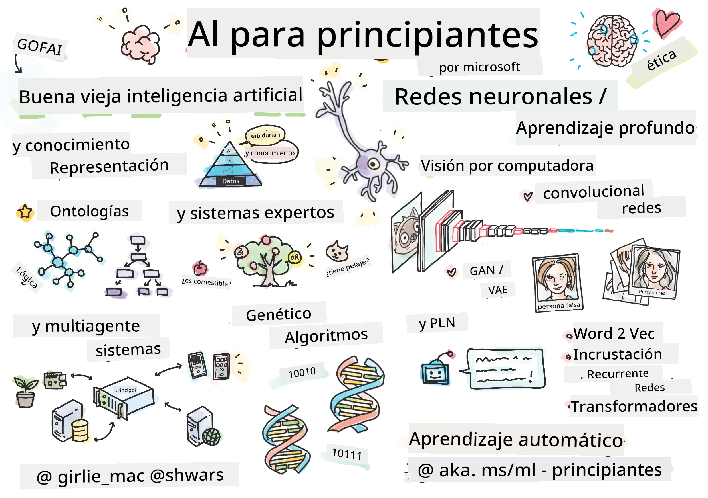

[](https://github.com/microsoft/AI-For-Beginners/blob/main/LICENSE)
[](https://GitHub.com/microsoft/AI-For-Beginners/graphs/contributors/)
[](https://GitHub.com/microsoft/AI-For-Beginners/issues/)
[](https://GitHub.com/microsoft/AI-For-Beginners/pulls/)
[](http://makeapullrequest.com)

[](https://GitHub.com/microsoft/AI-For-Beginners/watchers/)
[](https://GitHub.com/microsoft/AI-For-Beginners/network/)
[](https://GitHub.com/microsoft/AI-For-Beginners/stargazers/)
[](https://mybinder.org/v2/gh/microsoft/ai-for-beginners/HEAD)
[](https://gitter.im/Microsoft/ai-for-beginners?utm_source=badge&utm_medium=badge&utm_campaign=pr-badge)

[](https://discord.gg/nTYy5BXMWG)

# Inteligencia Artificial para Principiantes - Un Currículum

||
|:---:|
| AI For Beginners - _Sketchnote por [@girlie_mac](https://twitter.com/girlie_mac)_ |

¡Explora el mundo de la **Inteligencia Artificial** (IA) con nuestro currículum de 12 semanas y 24 lecciones! Incluye lecciones prácticas, cuestionarios y laboratorios. El currículum es apto para principiantes y cubre herramientas como TensorFlow y PyTorch, así como la ética en la IA.


### 🌐 Soporte Multilingüe

#### Soportado mediante GitHub Action (Automatizado y Siempre Actualizado)

<!-- CO-OP TRANSLATOR LANGUAGES TABLE START -->
[Arabic](../ar/README.md) | [Bengali](../bn/README.md) | [Bulgarian](../bg/README.md) | [Burmese (Myanmar)](../my/README.md) | [Chinese (Simplified)](../zh-CN/README.md) | [Chinese (Traditional, Hong Kong)](../zh-HK/README.md) | [Chinese (Traditional, Macau)](../zh-MO/README.md) | [Chinese (Traditional, Taiwan)](../zh-TW/README.md) | [Croatian](../hr/README.md) | [Czech](../cs/README.md) | [Danish](../da/README.md) | [Dutch](../nl/README.md) | [Estonian](../et/README.md) | [Finnish](../fi/README.md) | [French](../fr/README.md) | [German](../de/README.md) | [Greek](../el/README.md) | [Hebrew](../he/README.md) | [Hindi](../hi/README.md) | [Hungarian](../hu/README.md) | [Indonesian](../id/README.md) | [Italian](../it/README.md) | [Japanese](../ja/README.md) | [Kannada](../kn/README.md) | [Korean](../ko/README.md) | [Lithuanian](../lt/README.md) | [Malay](../ms/README.md) | [Malayalam](../ml/README.md) | [Marathi](../mr/README.md) | [Nepali](../ne/README.md) | [Nigerian Pidgin](../pcm/README.md) | [Norwegian](../no/README.md) | [Persian (Farsi)](../fa/README.md) | [Polish](../pl/README.md) | [Portuguese (Brazil)](../pt-BR/README.md) | [Portuguese (Portugal)](../pt-PT/README.md) | [Punjabi (Gurmukhi)](../pa/README.md) | [Romanian](../ro/README.md) | [Russian](../ru/README.md) | [Serbian (Cyrillic)](../sr/README.md) | [Slovak](../sk/README.md) | [Slovenian](../sl/README.md) | [Spanish](./README.md) | [Swahili](../sw/README.md) | [Swedish](../sv/README.md) | [Tagalog (Filipino)](../tl/README.md) | [Tamil](../ta/README.md) | [Telugu](../te/README.md) | [Thai](../th/README.md) | [Turkish](../tr/README.md) | [Ukrainian](../uk/README.md) | [Urdu](../ur/README.md) | [Vietnamese](../vi/README.md)

> **¿Prefieres Clonar Localmente?**

> Este repositorio incluye más de 50 traducciones de idiomas que aumentan significativamente el tamaño de descarga. Para clonar sin traducciones, usa el sparse checkout:
> ```bash
> git clone --filter=blob:none --sparse https://github.com/microsoft/AI-For-Beginners.git
> cd AI-For-Beginners
> git sparse-checkout set --no-cone '/*' '!translations' '!translated_images'
> ```
> Esto te da todo lo necesario para completar el curso con una descarga mucho más rápida.
<!-- CO-OP TRANSLATOR LANGUAGES TABLE END -->

**Si deseas que se soporten idiomas adicionales, están listados [aquí](https://github.com/Azure/co-op-translator/blob/main/getting_started/supported-languages.md)**

## Únete a la Comunidad
[](https://discord.gg/nTYy5BXMWG)

## Qué aprenderás

**[Mapa Mental del Curso](http://soshnikov.com/courses/ai-for-beginners/mindmap.html)**

En este currículum aprenderás:

* Diferentes enfoques de la Inteligencia Artificial, incluyendo el enfoque simbólico "clásico" con **Representación del Conocimiento** y razonamiento ([GOFAI](https://en.wikipedia.org/wiki/Symbolic_artificial_intelligence)).
* **Redes Neuronales** y **Aprendizaje Profundo**, que están en el núcleo de la IA moderna. Ilustraremos los conceptos detrás de estos temas importantes utilizando código en dos de los frameworks más populares - [TensorFlow](http://Tensorflow.org) y [PyTorch](http://pytorch.org).
* **Arquitecturas Neuronales** para trabajar con imágenes y texto. Cubriremos modelos recientes aunque puede que falte algo del estado del arte.
* Enfoques de IA menos populares, como **Algoritmos Genéticos** y **Sistemas Multi-Agente**.

Lo que no cubriremos en este currículum:

> [Encuentra todos los recursos adicionales para este curso en nuestra colección Microsoft Learn](https://learn.microsoft.com/en-us/collections/7w28iy2xrqzdj0?WT.mc_id=academic-77998-bethanycheum)

* Casos de negocio del uso de la **IA en los Negocios**. Considera tomar la ruta de aprendizaje [Introducción a la IA para usuarios de negocio](https://docs.microsoft.com/learn/paths/introduction-ai-for-business-users/?WT.mc_id=academic-77998-bethanycheum) en Microsoft Learn, o la [AI Business School](https://www.microsoft.com/ai/ai-business-school/?WT.mc_id=academic-77998-bethanycheum), desarrollada en cooperación con [INSEAD](https://www.insead.edu/).
* **Aprendizaje Automático Clásico**, que está bien descrito en nuestro [Currículum para principiantes en Machine Learning](http://github.com/Microsoft/ML-for-Beginners).
* Aplicaciones prácticas de IA construidas usando **[Cognitive Services](https://azure.microsoft.com/services/cognitive-services/?WT.mc_id=academic-77998-bethanycheum)**. Para esto, recomendamos comenzar con módulos de Microsoft Learn para [visión](https://docs.microsoft.com/learn/paths/create-computer-vision-solutions-azure-cognitive-services/?WT.mc_id=academic-77998-bethanycheum), [procesamiento de lenguaje natural](https://docs.microsoft.com/learn/paths/explore-natural-language-processing/?WT.mc_id=academic-77998-bethanycheum), **[IA Generativa con Azure OpenAI Service](https://learn.microsoft.com/en-us/training/paths/develop-ai-solutions-azure-openai/?WT.mc_id=academic-77998-bethanycheum)** y otros.
* **Frameworks en la Nube para ML** específicos, como [Azure Machine Learning](https://azure.microsoft.com/services/machine-learning/?WT.mc_id=academic-77998-bethanycheum), [Microsoft Fabric](https://learn.microsoft.com/en-us/training/paths/get-started-fabric/?WT.mc_id=academic-77998-bethanycheum), o [Azure Databricks](https://docs.microsoft.com/learn/paths/data-engineer-azure-databricks?WT.mc_id=academic-77998-bethanycheum). Considera usar las rutas de aprendizaje [Construye y opera soluciones de machine learning con Azure Machine Learning](https://docs.microsoft.com/learn/paths/build-ai-solutions-with-azure-ml-service/?WT.mc_id=academic-77998-bethanycheum) y [Construye y opera soluciones de Machine Learning con Azure Databricks](https://docs.microsoft.com/learn/paths/build-operate-machine-learning-solutions-azure-databricks/?WT.mc_id=academic-77998-bethanycheum).
* **IA Conversacional** y **Chat Bots**. Existe una ruta de aprendizaje separada [Crea soluciones de IA conversacional](https://docs.microsoft.com/learn/paths/create-conversational-ai-solutions/?WT.mc_id=academic-77998-bethanycheum), y también puedes consultar [esta publicación en el blog](https://soshnikov.com/azure/hello-bot-conversational-ai-on-microsoft-platform/) para más detalles.
* **Matemáticas Profundas** detrás del aprendizaje profundo. Para esto, recomendamos [Deep Learning](https://www.amazon.com/Deep-Learning-Adaptive-Computation-Machine/dp/0262035618) por Ian Goodfellow, Yoshua Bengio y Aaron Courville, que también está disponible en línea en [https://www.deeplearningbook.org/](https://www.deeplearningbook.org/).

Para una introducción suave a temas de _IA en la Nube_ puedes considerar tomar la ruta de aprendizaje [Comienza con inteligencia artificial en Azure](https://docs.microsoft.com/learn/paths/get-started-with-artificial-intelligence-on-azure/?WT.mc_id=academic-77998-bethanycheum).

# Contenido

|     |                                                                 Enlace de la Lección                                                                 |                                           PyTorch/Keras/TensorFlow                                          | Laboratorio                                                           |
| :-: | :------------------------------------------------------------------------------------------------------------------------------------------: | :---------------------------------------------------------------------------------------------: | ------------------------------------------------------------------------------ |
| 0  |                                 [Configuración del Curso](./lessons/0-course-setup/setup.md)                                 |                      [Configura tu entorno de desarrollo](./lessons/0-course-setup/how-to-run.md)                       |   |
| I  |               [**Introducción a la IA**](./lessons/1-Intro/README.md)      | | |
| 01  |       [Introducción e Historia de la IA](./lessons/1-Intro/README.md)       |           -                            | -  |
| II |              **IA Simbólica**              |
| 02  |       [Representación del Conocimiento y Sistemas Expertos](./lessons/2-Symbolic/README.md)       |            [Sistemas Expertos](./lessons/2-Symbolic/Animals.ipynb) /  [Ontología](./lessons/2-Symbolic/FamilyOntology.ipynb) /[Grafo de Conceptos](./lessons/2-Symbolic/MSConceptGraph.ipynb)                             |  |
| III |                        [**Introducción a las Redes Neuronales**](./lessons/3-NeuralNetworks/README.md) |||
| 03  |                [Perceptrón](./lessons/3-NeuralNetworks/03-Perceptron/README.md)                 |                       [Cuaderno](./lessons/3-NeuralNetworks/03-Perceptron/Perceptron.ipynb)                      | [Laboratorio](./lessons/3-NeuralNetworks/03-Perceptron/lab/README.md) |
| 04  |                   [Perceptrón Multicapa y Creación de nuestro propio Framework](./lessons/3-NeuralNetworks/04-OwnFramework/README.md)                   |        [Cuaderno](./lessons/3-NeuralNetworks/04-OwnFramework/OwnFramework.ipynb)        | [Laboratorio](./lessons/3-NeuralNetworks/04-OwnFramework/lab/README.md) |
| 05  |            [Introducción a Frameworks (PyTorch/TensorFlow) y Sobreajuste](./lessons/3-NeuralNetworks/05-Frameworks/README.md)             |           [PyTorch](./lessons/3-NeuralNetworks/05-Frameworks/IntroPyTorch.ipynb) / [Keras](./lessons/3-NeuralNetworks/05-Frameworks/IntroKeras.ipynb) / [TensorFlow](./lessons/3-NeuralNetworks/05-Frameworks/IntroKerasTF.ipynb)             | [Laboratorio](./lessons/3-NeuralNetworks/05-Frameworks/lab/README.md) |
| IV  |            [**Visión por Computadora**](./lessons/4-ComputerVision/README.md)             | [PyTorch](https://docs.microsoft.com/learn/modules/intro-computer-vision-pytorch/?WT.mc_id=academic-77998-cacaste) / [TensorFlow](https://docs.microsoft.com/learn/modules/intro-computer-vision-TensorFlow/?WT.mc_id=academic-77998-cacaste)| [Explora Visión por Computadora en Microsoft Azure](https://learn.microsoft.com/en-us/collections/7w28iy2xrqzdj0?WT.mc_id=academic-77998-bethanycheum) |
| 06  |            [Introducción a Visión por Computadora. OpenCV](./lessons/4-ComputerVision/06-IntroCV/README.md)             |           [Cuaderno](./lessons/4-ComputerVision/06-IntroCV/OpenCV.ipynb)         | [Laboratorio](./lessons/4-ComputerVision/06-IntroCV/lab/README.md) |
| 07  |            [Redes Neuronales Convolucionales](./lessons/4-ComputerVision/07-ConvNets/README.md) &  [Arquitecturas CNN](./lessons/4-ComputerVision/07-ConvNets/CNN_Architectures.md)             |           [PyTorch](./lessons/4-ComputerVision/07-ConvNets/ConvNetsPyTorch.ipynb) /[TensorFlow](./lessons/4-ComputerVision/07-ConvNets/ConvNetsTF.ipynb)             | [Laboratorio](./lessons/4-ComputerVision/07-ConvNets/lab/README.md) |
| 08  |            [Redes Pre-entrenadas y Aprendizaje por Transferencia](./lessons/4-ComputerVision/08-TransferLearning/README.md) y [Trucos de Entrenamiento](./lessons/4-ComputerVision/08-TransferLearning/TrainingTricks.md)             |           [PyTorch](./lessons/4-ComputerVision/08-TransferLearning/TransferLearningPyTorch.ipynb) / [TensorFlow](./lessons/3-NeuralNetworks/05-Frameworks/IntroKerasTF.ipynb)             | [Laboratorio](./lessons/4-ComputerVision/08-TransferLearning/lab/README.md) |
| 09  |            [Autoencoders y VAEs](./lessons/4-ComputerVision/09-Autoencoders/README.md)             |           [PyTorch](./lessons/4-ComputerVision/09-Autoencoders/AutoEncodersPyTorch.ipynb) / [TensorFlow](./lessons/4-ComputerVision/09-Autoencoders/AutoencodersTF.ipynb)             |  |
| 10  |            [Redes Generativas Antagónicas y Transferencia de Estilo Artístico](./lessons/4-ComputerVision/10-GANs/README.md)             |           [PyTorch](./lessons/4-ComputerVision/10-GANs/GANPyTorch.ipynb) / [TensorFlow](./lessons/4-ComputerVision/10-GANs/GANTF.ipynb)             |  |
| 11  |            [Detección de Objetos](./lessons/4-ComputerVision/11-ObjectDetection/README.md)             |         [TensorFlow](./lessons/4-ComputerVision/11-ObjectDetection/ObjectDetection.ipynb)             | [Laboratorio](./lessons/4-ComputerVision/11-ObjectDetection/lab/README.md) |
| 12  |            [Segmentación Semántica. U-Net](./lessons/4-ComputerVision/12-Segmentation/README.md)             |           [PyTorch](./lessons/4-ComputerVision/12-Segmentation/SemanticSegmentationPytorch.ipynb) / [TensorFlow](./lessons/4-ComputerVision/12-Segmentation/SemanticSegmentationTF.ipynb)             |  |
| V  |            [**Procesamiento de Lenguaje Natural**](./lessons/5-NLP/README.md)             | [PyTorch](https://docs.microsoft.com/learn/modules/intro-natural-language-processing-pytorch/?WT.mc_id=academic-77998-cacaste) /[TensorFlow](https://docs.microsoft.com/learn/modules/intro-natural-language-processing-TensorFlow/?WT.mc_id=academic-77998-cacaste) | [Explora Procesamiento de Lenguaje Natural en Microsoft Azure](https://learn.microsoft.com/en-us/collections/7w28iy2xrqzdj0?WT.mc_id=academic-77998-bethanycheum)|
| 13  |            [Representación de Texto. Bow/TF-IDF](./lessons/5-NLP/13-TextRep/README.md)             |           [PyTorch](https://github.com/microsoft/AI-For-Beginners/blob/main/lessons/5-NLP/13-TextRep/TextRepresentationPyTorch.ipynb) / [TensorFlow](https://github.com/microsoft/AI-For-Beginners/blob/main/lessons/5-NLP/13-TextRep/TextRepresentationTF.ipynb)             | |
| 14  |            [Embeddings semánticos de palabras. Word2Vec y GloVe](./lessons/5-NLP/14-Embeddings/README.md)             |           [PyTorch](https://github.com/microsoft/AI-For-Beginners/blob/main/lessons/5-NLP/14-Embeddings/EmbeddingsPyTorch.ipynb) / [TensorFlow](https://github.com/microsoft/AI-For-Beginners/blob/main/lessons/5-NLP/14-Embeddings/EmbeddingsTF.ipynb)             |  |
| 15  |            [Modelado del Lenguaje. Entrenando tus propios embeddings](./lessons/5-NLP/15-LanguageModeling/README.md)             |           [PyTorch](https://github.com/microsoft/AI-For-Beginners/blob/main/lessons/5-NLP/15-LanguageModeling/CBoW-PyTorch.ipynb) / [TensorFlow](https://github.com/microsoft/AI-For-Beginners/blob/main/lessons/5-NLP/15-LanguageModeling/CBoW-TF.ipynb)             | [Laboratorio](./lessons/5-NLP/15-LanguageModeling/lab/README.md) |
| 16  |            [Redes Neuronales Recurrentes](./lessons/5-NLP/16-RNN/README.md)             |           [PyTorch](https://github.com/microsoft/AI-For-Beginners/blob/main/lessons/5-NLP/16-RNN/RNNPyTorch.ipynb) / [TensorFlow](https://github.com/microsoft/AI-For-Beginners/blob/main/lessons/5-NLP/16-RNN/RNNTF.ipynb)             |  |
| 17  |            [Redes Recurrentes Generativas](./lessons/5-NLP/17-GenerativeNetworks/README.md)             |           [PyTorch](https://github.com/microsoft/AI-For-Beginners/blob/main/lessons/5-NLP/17-GenerativeNetworks/GenerativePyTorch.ipynb) / [TensorFlow](https://github.com/microsoft/AI-For-Beginners/blob/main/lessons/5-NLP/17-GenerativeNetworks/GenerativeTF.ipynb)             | [Laboratorio](./lessons/5-NLP/17-GenerativeNetworks/lab/README.md) |
| 18  |            [Transformers. BERT.](./lessons/5-NLP/18-Transformers/README.md)             |           [PyTorch](https://github.com/microsoft/AI-For-Beginners/blob/main/lessons/5-NLP/18-Transformers/TransformersPyTorch.ipynb) /[TensorFlow](https://github.com/microsoft/AI-For-Beginners/blob/main/lessons/5-NLP/18-Transformers/TransformersTF.ipynb)             |  |
| 19  |            [Reconocimiento de Entidades Nombradas](./lessons/5-NLP/19-NER/README.md)             |           [TensorFlow](https://microsoft.github.io/AI-For-Beginners/lessons/5-NLP/19-NER/NER-TF.ipynb)             | [Laboratorio](./lessons/5-NLP/19-NER/lab/README.md) |
| 20  |            [Modelos de Lenguaje Grandes, Programación de Prompts y Tareas Few-Shot](./lessons/5-NLP/20-LangModels/README.md)             |           [PyTorch](https://microsoft.github.io/AI-For-Beginners/lessons/5-NLP/20-LangModels/GPT-PyTorch.ipynb) | |
| VI |            **Otras Técnicas de IA** || |
| 21  |            [Algoritmos Genéticos](./lessons/6-Other/21-GeneticAlgorithms/README.md)             |           [Cuaderno](./lessons/6-Other/21-GeneticAlgorithms/Genetic.ipynb) | |
| 22  |            [Aprendizaje por Refuerzo Profundo](./lessons/6-Other/22-DeepRL/README.md)             |           [PyTorch](./lessons/6-Other/22-DeepRL/CartPole-RL-PyTorch.ipynb) /[TensorFlow](./lessons/6-Other/22-DeepRL/CartPole-RL-TF.ipynb)             | [Laboratorio](./lessons/6-Other/22-DeepRL/lab/README.md) |
| 23  |            [Sistemas Multi-Agentes](./lessons/6-Other/23-MultiagentSystems/README.md)             |  | |
| VII |            **Ética en IA** | | |
| 24  |            [Ética en IA e IA Responsable](./lessons/7-Ethics/README.md)             |           [Microsoft Learn: Principios de IA Responsable](https://docs.microsoft.com/learn/paths/responsible-ai-business-principles/?WT.mc_id=academic-77998-cacaste) | |
| IX  |            **Extras** | | |
| 25  |            [Redes Multi-Modal, CLIP y VQGAN](./lessons/X-Extras/X1-MultiModal/README.md)             |           [Cuaderno](./lessons/X-Extras/X1-MultiModal/Clip.ipynb)    | |

## Cada lección contiene

* Material de lectura previa
* Cuadernos ejecutables de Jupyter, que a menudo son específicos para el framework (**PyTorch** o **TensorFlow**). El cuaderno ejecutable también contiene mucho material teórico, por lo que para entender el tema necesitas revisar al menos una versión del cuaderno (ya sea PyTorch o TensorFlow).
* **Laboratorios** disponibles para algunos temas, que te dan la oportunidad de intentar aplicar el material que has aprendido a un problema específico.
* Algunas secciones contienen enlaces a módulos de [**MS Learn**](https://learn.microsoft.com/en-us/collections/7w28iy2xrqzdj0?WT.mc_id=academic-77998-bethanycheum) que cubren temas relacionados.

## Comenzando

### 🎯 ¿Nuevo en IA? ¡Empieza Aquí!

Si eres completamente nuevo en IA y quieres ejemplos prácticos rápidos, ¡consulta nuestros [**Ejemplos para Principiantes**](./examples/README.md)! Estos incluyen:

- 🌟 **Hola Mundo IA** - Tu primer programa de IA (reconocimiento de patrones)
- 🧠 **Red Neuronal Simple** - Construye una red neuronal desde cero  

- 🖼️ **Clasificador de Imágenes** - Clasifica imágenes con comentarios detallados  
- 💬 **Sentimiento del Texto** - Analiza textos positivos/negativos  

Estos ejemplos están diseñados para ayudarte a entender conceptos de IA antes de adentrarte en el currículo completo.

### 📚 Configuración del Currículo Completo

- Hemos creado una [lección de configuración](./lessons/0-course-setup/setup.md) para ayudarte a configurar tu entorno de desarrollo. - ¡Para educadores, también hemos creado una [lección de configuración del currículo](./lessons/0-course-setup/for-teachers.md)!  
- Cómo [Ejecutar el código en VSCode o en un Codespace](./lessons/0-course-setup/how-to-run.md)  

Sigue estos pasos:

Bifurca el Repositorio: Haz clic en el botón "Fork" en la esquina superior derecha de esta página.

Clona el Repositorio: `git clone https://github.com/microsoft/AI-For-Beginners.git`

No olvides poner una estrella (🌟) a este repositorio para encontrarlo más fácilmente después.

## Conoce a otros Aprendices

Únete a nuestro [servidor oficial de Discord de IA](https://aka.ms/genai-discord?WT.mc_id=academic-105485-bethanycheum) para conocer y hacer networking con otros alumnos que toman este curso y obtener soporte.

Si tienes retroalimentación sobre el producto o preguntas mientras construyes, visita nuestro [Foro de Desarrolladores de Azure AI Foundry](https://aka.ms/foundry/forum)

## Cuestionarios

> **Una nota sobre los cuestionarios**: Todos los cuestionarios están contenidos en la carpeta Quiz-app en etc\quiz-app, o [En línea Aquí](https://ff-quizzes.netlify.app/) Están enlazados dentro de las lecciones. La aplicación de cuestionarios puede ejecutarse localmente o desplegarse en Azure; sigue las instrucciones en la carpeta `quiz-app`. Se están localizando gradualmente.

## Se Busca Ayuda

¿Tienes sugerencias o has encontrado errores ortográficos o en el código? Abre un issue o crea un pull request.

## Agradecimientos Especiales

* **✍️ Autor Principal:** [Dmitry Soshnikov](http://soshnikov.com), PhD  
* **🔥 Editor:** [Jen Looper](https://twitter.com/jenlooper), PhD  
* **🎨 Ilustradora de Sketchnotes:** [Tomomi Imura](https://twitter.com/girlie_mac)  
* **✅ Creadora de Cuestionarios:** [Lateefah Bello](https://github.com/CinnamonXI), [MLSA](https://studentambassadors.microsoft.com/)  
* **🙏 Colaboradores Principales:** [Evgenii Pishchik](https://github.com/Pe4enIks)  

## Otros Currículos

¡Nuestro equipo produce otros currículos! Consulta:

<!-- CO-OP TRANSLATOR OTHER COURSES START -->
### LangChain  
[](https://aka.ms/langchain4j-for-beginners)  
[](https://aka.ms/langchainjs-for-beginners?WT.mc_id=m365-94501-dwahlin)  

---

### Azure / Edge / MCP / Agentes  
[](https://github.com/microsoft/AZD-for-beginners?WT.mc_id=academic-105485-koreyst)  
[](https://github.com/microsoft/edgeai-for-beginners?WT.mc_id=academic-105485-koreyst)  
[](https://github.com/microsoft/mcp-for-beginners?WT.mc_id=academic-105485-koreyst)  
[](https://github.com/microsoft/ai-agents-for-beginners?WT.mc_id=academic-105485-koreyst)  

---

### Serie de IA Generativa  
[](https://github.com/microsoft/generative-ai-for-beginners?WT.mc_id=academic-105485-koreyst)  
[-9333EA?style=for-the-badge&labelColor=E5E7EB&color=9333EA)](https://github.com/microsoft/Generative-AI-for-beginners-dotnet?WT.mc_id=academic-105485-koreyst)  
[-C084FC?style=for-the-badge&labelColor=E5E7EB&color=C084FC)](https://github.com/microsoft/generative-ai-for-beginners-java?WT.mc_id=academic-105485-koreyst)  
[-E879F9?style=for-the-badge&labelColor=E5E7EB&color=E879F9)](https://github.com/microsoft/generative-ai-with-javascript?WT.mc_id=academic-105485-koreyst)  

---

### Aprendizaje Básico  
[](https://aka.ms/ml-beginners?WT.mc_id=academic-105485-koreyst)  
[](https://aka.ms/datascience-beginners?WT.mc_id=academic-105485-koreyst)  
[](https://aka.ms/ai-beginners?WT.mc_id=academic-105485-koreyst)  
[](https://github.com/microsoft/Security-101?WT.mc_id=academic-96948-sayoung)  
[](https://aka.ms/webdev-beginners?WT.mc_id=academic-105485-koreyst)  
[](https://aka.ms/iot-beginners?WT.mc_id=academic-105485-koreyst)  
[](https://github.com/microsoft/xr-development-for-beginners?WT.mc_id=academic-105485-koreyst)  

---

### Serie Copiloto  
[](https://aka.ms/GitHubCopilotAI?WT.mc_id=academic-105485-koreyst)  
[](https://github.com/microsoft/mastering-github-copilot-for-dotnet-csharp-developers?WT.mc_id=academic-105485-koreyst)  
[](https://github.com/microsoft/CopilotAdventures?WT.mc_id=academic-105485-koreyst)  
<!-- CO-OP TRANSLATOR OTHER COURSES END -->

## Obtener Ayuda

Si te quedas atascado o tienes preguntas sobre cómo construir aplicaciones de IA, únete a otros alumnos y desarrolladores experimentados en discusiones sobre MCP. Es una comunidad de apoyo donde las preguntas son bienvenidas y el conocimiento se comparte libremente.

[](https://discord.gg/nTYy5BXMWG)

Si tienes retroalimentación sobre el producto o errores mientras construyes, visita:

[](https://aka.ms/foundry/forum)

---

<!-- CO-OP TRANSLATOR DISCLAIMER START -->
**Descargo de responsabilidad**:
Este documento ha sido traducido utilizando el servicio de traducción automática [Co-op Translator](https://github.com/Azure/co-op-translator). Aunque nos esforzamos por la precisión, tenga en cuenta que las traducciones automatizadas pueden contener errores o inexactitudes. El documento original en su idioma nativo debe considerarse la fuente autorizada. Para información crítica, se recomienda una traducción profesional realizada por personas. No nos hacemos responsables de malentendidos o interpretaciones erróneas que resulten del uso de esta traducción.
<!-- CO-OP TRANSLATOR DISCLAIMER END -->