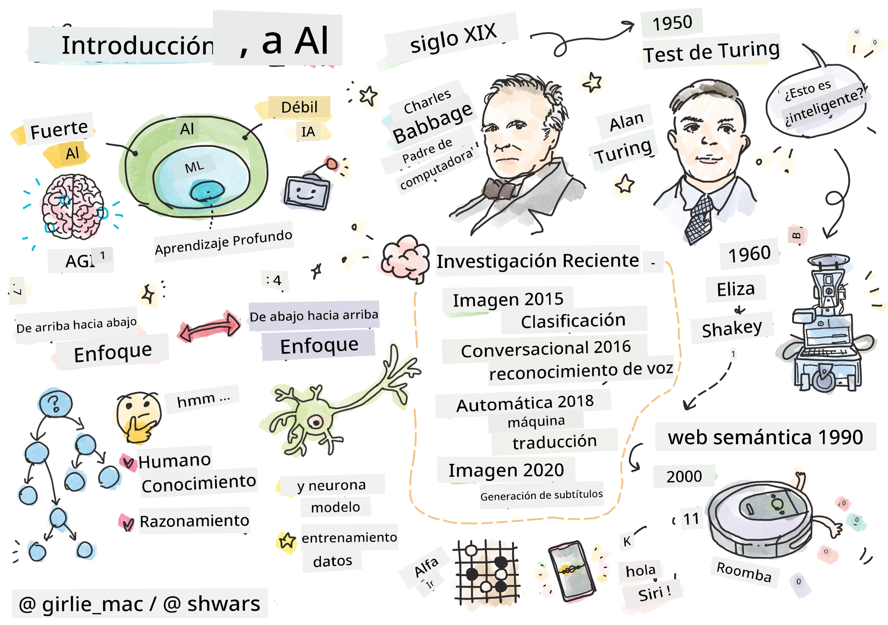
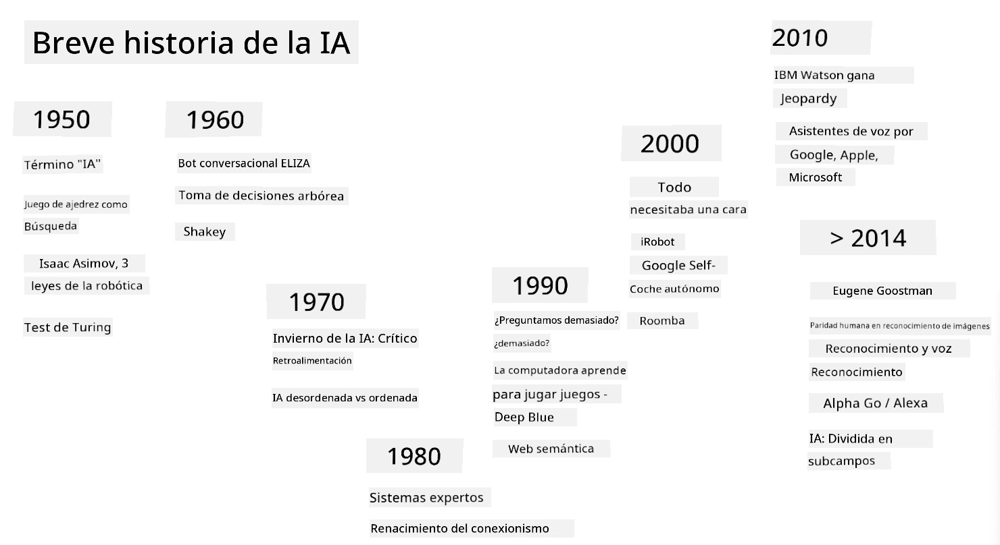
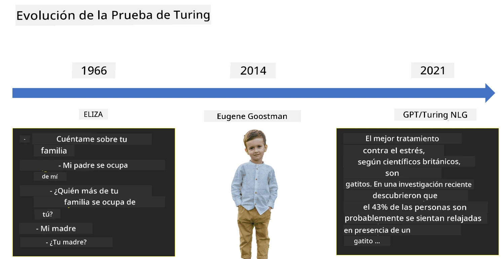

# Introducción a la IA

> Dibujo por [Tomomi Imura](https://twitter.com/girlie_mac)

## [Cuestionario previo a la clase](https://ff-quizzes.netlify.app/en/ai/quiz/1)

**Inteligencia Artificial** es una disciplina científica emocionante que estudia cómo podemos hacer que las computadoras exhiban un comportamiento inteligente, es decir, que realicen aquellas cosas en las que los seres humanos son buenos.

Originalmente, las computadoras fueron inventadas por [Charles Babbage](https://en.wikipedia.org/wiki/Charles_Babbage) para operar con números siguiendo un procedimiento bien definido: un algoritmo. Las computadoras modernas, aunque significativamente más avanzadas que el modelo original propuesto en el siglo XIX, aún siguen la misma idea de cálculos controlados. Por lo tanto, es posible programar una computadora para hacer algo si conocemos la secuencia exacta de pasos necesarios para lograr el objetivo.

> Foto por [Vickie Soshnikova](http://twitter.com/vickievalerie)

> ✅ Definir la edad de una persona a partir de su fotografía es una tarea que no puede ser programada explícitamente, porque no sabemos cómo llegamos a un número en nuestra mente cuando lo hacemos.

---

Sin embargo, hay algunas tareas que no sabemos cómo resolver explícitamente. Consideremos determinar la edad de una persona a partir de su fotografía. De alguna manera aprendemos a hacerlo porque hemos visto muchos ejemplos de personas de diferentes edades, pero no podemos explicar explícitamente cómo lo hacemos, ni podemos programar una computadora para hacerlo. Este es exactamente el tipo de tarea que interesa a la **Inteligencia Artificial** (IA).

✅ Piensa en algunas tareas que podrías delegar a una computadora y que se beneficiarían de la IA. Considera los campos de finanzas, medicina y artes: ¿cómo se están beneficiando hoy en día de la IA?

## IA Débil vs. IA Fuerte

IA Débil | IA Fuerte
---------------------------------------|-------------------------------------
La IA débil se refiere a sistemas de IA diseñados y entrenados para una tarea específica o un conjunto limitado de tareas.|La IA fuerte, o Inteligencia Artificial General (AGI), se refiere a sistemas de IA con inteligencia y comprensión a nivel humano.
Estos sistemas de IA no son generalmente inteligentes; sobresalen en realizar una tarea predefinida pero carecen de verdadera comprensión o conciencia.|Estos sistemas de IA tienen la capacidad de realizar cualquier tarea intelectual que un ser humano pueda hacer, adaptarse a diferentes dominios y poseer una forma de conciencia o autoconciencia.
Ejemplos de IA débil incluyen asistentes virtuales como Siri o Alexa, algoritmos de recomendación utilizados por servicios de streaming y chatbots diseñados para tareas específicas de atención al cliente.|Lograr la IA fuerte es un objetivo a largo plazo de la investigación en IA y requeriría el desarrollo de sistemas de IA que puedan razonar, aprender, comprender y adaptarse a una amplia gama de tareas y contextos.
La IA débil está altamente especializada y no posee habilidades cognitivas humanas ni capacidades generales de resolución de problemas más allá de su dominio limitado.|La IA fuerte es actualmente un concepto teórico, y ningún sistema de IA ha alcanzado este nivel de inteligencia general.

Para más información, consulta **[Inteligencia Artificial General](https://en.wikipedia.org/wiki/Artificial_general_intelligence)** (AGI).

## La Definición de Inteligencia y la Prueba de Turing

Uno de los problemas al tratar con el término **[Inteligencia](https://en.wikipedia.org/wiki/Intelligence)** es que no hay una definición clara de este término. Se puede argumentar que la inteligencia está conectada con el **pensamiento abstracto** o con la **autoconciencia**, pero no podemos definirlo adecuadamente.

> [Foto](https://unsplash.com/photos/75715CVEJhI) por [Amber Kipp](https://unsplash.com/@sadmax) de Unsplash

Para ver la ambigüedad del término *inteligencia*, intenta responder a la pregunta: "¿Es un gato inteligente?". Diferentes personas tienden a dar respuestas diferentes a esta pregunta, ya que no hay una prueba universalmente aceptada para demostrar si la afirmación es verdadera o no. Y si crees que la hay, intenta hacer que tu gato pase una prueba de coeficiente intelectual...

✅ Piensa por un minuto cómo defines la inteligencia. ¿Es un cuervo que puede resolver un laberinto para obtener comida inteligente? ¿Es un niño inteligente?

---

Cuando hablamos de AGI, necesitamos tener alguna forma de determinar si hemos creado un sistema verdaderamente inteligente. [Alan Turing](https://en.wikipedia.org/wiki/Alan_Turing) propuso una forma llamada **[Prueba de Turing](https://en.wikipedia.org/wiki/Turing_test)**, que también actúa como una definición de inteligencia. La prueba compara un sistema dado con algo inherentemente inteligente: un ser humano real, y dado que cualquier comparación automática puede ser eludida por un programa de computadora, usamos un interrogador humano. Entonces, si un ser humano no puede distinguir entre una persona real y un sistema informático en un diálogo basado en texto, el sistema se considera inteligente.

> Un chatbot llamado [Eugene Goostman](https://en.wikipedia.org/wiki/Eugene_Goostman), desarrollado en San Petersburgo, estuvo cerca de pasar la prueba de Turing en 2014 utilizando un truco de personalidad ingenioso. Anunció desde el principio que era un niño ucraniano de 13 años, lo que explicaría la falta de conocimiento y algunas discrepancias en el texto. El bot convenció al 30% de los jueces de que era humano después de un diálogo de 5 minutos, una métrica que Turing creía que una máquina podría pasar para el año 2000. Sin embargo, uno debe entender que esto no indica que hayamos creado un sistema inteligente, ni que un sistema informático haya engañado al interrogador humano: el sistema no engañó a los humanos, sino que los creadores del bot lo hicieron.

✅ ¿Alguna vez has sido engañado por un chatbot haciéndote pensar que estás hablando con un humano? ¿Cómo te convenció?

## Diferentes Enfoques de la IA

Si queremos que una computadora se comporte como un humano, necesitamos de alguna manera modelar dentro de la computadora nuestra forma de pensar. En consecuencia, necesitamos tratar de entender qué hace que un ser humano sea inteligente.

> Para poder programar inteligencia en una máquina, necesitamos entender cómo funcionan nuestros propios procesos de toma de decisiones. Si haces un poco de introspección, te darás cuenta de que hay algunos procesos que ocurren de manera subconsciente, por ejemplo, podemos distinguir un gato de un perro sin pensarlo, mientras que otros implican razonamiento.

Hay dos posibles enfoques para este problema:

Enfoque de Arriba hacia Abajo (Razonamiento Simbólico) | Enfoque de Abajo hacia Arriba (Redes Neuronales)
---------------------------------------|-------------------------------------
Un enfoque de arriba hacia abajo modela la forma en que una persona razona para resolver un problema. Implica extraer **conocimiento** de un ser humano y representarlo en un formato legible por computadora. También necesitamos desarrollar una forma de modelar el **razonamiento** dentro de una computadora. | Un enfoque de abajo hacia arriba modela la estructura del cerebro humano, que consiste en un gran número de unidades simples llamadas **neuronas**. Cada neurona actúa como un promedio ponderado de sus entradas, y podemos entrenar una red de neuronas para resolver problemas útiles proporcionando **datos de entrenamiento**.

También hay otros posibles enfoques para la inteligencia:

* Un enfoque **Emergente**, **Sinérgico** o de **multi-agentes** se basa en el hecho de que un comportamiento inteligente complejo puede obtenerse mediante la interacción de un gran número de agentes simples. Según la [cibernética evolutiva](https://en.wikipedia.org/wiki/Global_brain#Evolutionary_cybernetics), la inteligencia puede *emerger* de un comportamiento más simple y reactivo en el proceso de *transición de metasistema*.

* Un enfoque **Evolutivo**, o **algoritmo genético**, es un proceso de optimización basado en los principios de la evolución.

Consideraremos estos enfoques más adelante en el curso, pero por ahora nos centraremos en dos direcciones principales: de arriba hacia abajo y de abajo hacia arriba.

### El Enfoque de Arriba hacia Abajo

En un **enfoque de arriba hacia abajo**, tratamos de modelar nuestro razonamiento. Dado que podemos seguir nuestros pensamientos cuando razonamos, podemos intentar formalizar este proceso y programarlo dentro de la computadora. Esto se llama **razonamiento simbólico**.

Las personas tienden a tener algunas reglas en su mente que guían sus procesos de toma de decisiones. Por ejemplo, cuando un médico está diagnosticando a un paciente, puede darse cuenta de que una persona tiene fiebre y, por lo tanto, podría haber alguna inflamación en el cuerpo. Al aplicar un gran conjunto de reglas a un problema específico, un médico puede llegar al diagnóstico final.

Este enfoque depende en gran medida de la **representación del conocimiento** y el **razonamiento**. Extraer conocimiento de un experto humano puede ser la parte más difícil, porque un médico, en muchos casos, no sabría exactamente por qué está llegando a un diagnóstico particular. A veces la solución simplemente aparece en su mente sin un pensamiento explícito. Algunas tareas, como determinar la edad de una persona a partir de una fotografía, no pueden reducirse en absoluto a la manipulación del conocimiento.

### Enfoque de Abajo hacia Arriba

Alternativamente, podemos intentar modelar los elementos más simples dentro de nuestro cerebro: una neurona. Podemos construir una **red neuronal artificial** dentro de una computadora y luego intentar enseñarle a resolver problemas dándole ejemplos. Este proceso es similar a cómo un niño recién nacido aprende sobre su entorno mediante observaciones.

✅ Investiga un poco sobre cómo aprenden los bebés. ¿Cuáles son los elementos básicos del cerebro de un bebé?

> | ¿Qué hay de ML?         |      |
> |--------------|-----------|
> | Parte de la Inteligencia Artificial que se basa en que la computadora aprenda a resolver un problema basado en algunos datos se llama **Aprendizaje Automático**. No consideraremos el aprendizaje automático clásico en este curso; te remitimos a un currículo separado de [Machine Learning para Principiantes](http://aka.ms/ml-beginners). |       |

## Breve Historia de la IA

La Inteligencia Artificial comenzó como un campo a mediados del siglo XX. Inicialmente, el razonamiento simbólico era el enfoque predominante, y condujo a una serie de éxitos importantes, como los sistemas expertos: programas informáticos que podían actuar como expertos en algunos dominios de problemas limitados. Sin embargo, pronto quedó claro que este enfoque no escala bien. Extraer el conocimiento de un experto, representarlo en una computadora y mantener esa base de conocimiento precisa resulta ser una tarea muy compleja y demasiado costosa para ser práctica en muchos casos. Esto llevó al llamado [Invierno de la IA](https://en.wikipedia.org/wiki/AI_winter) en la década de 1970.

> Imagen por [Dmitry Soshnikov](http://soshnikov.com)

Con el tiempo, los recursos informáticos se volvieron más baratos y se dispuso de más datos, por lo que los enfoques de redes neuronales comenzaron a demostrar un gran rendimiento al competir con los seres humanos en muchas áreas, como la visión por computadora o la comprensión del habla. En la última década, el término Inteligencia Artificial se ha utilizado principalmente como sinónimo de Redes Neuronales, porque la mayoría de los éxitos de la IA que escuchamos se basan en ellas.

Podemos observar cómo cambiaron los enfoques, por ejemplo, al crear un programa de computadora para jugar al ajedrez:

* Los primeros programas de ajedrez se basaban en la búsqueda: un programa intentaba estimar explícitamente los posibles movimientos de un oponente para un número dado de movimientos futuros y seleccionaba un movimiento óptimo basado en la posición óptima que se podía lograr en unos pocos movimientos. Esto llevó al desarrollo del llamado algoritmo de búsqueda [poda alfa-beta](https://en.wikipedia.org/wiki/Alpha%E2%80%93beta_pruning).
* Las estrategias de búsqueda funcionan bien hacia el final del juego, donde el espacio de búsqueda está limitado por un pequeño número de movimientos posibles. Sin embargo, al comienzo del juego, el espacio de búsqueda es enorme, y el algoritmo puede mejorarse aprendiendo de partidas existentes entre jugadores humanos. Experimentos posteriores emplearon el llamado [razonamiento basado en casos](https://en.wikipedia.org/wiki/Case-based_reasoning), donde el programa buscaba casos en la base de conocimiento muy similares a la posición actual en el juego.
* Los programas modernos que ganan a los jugadores humanos se basan en redes neuronales y [aprendizaje por refuerzo](https://en.wikipedia.org/wiki/Reinforcement_learning), donde los programas aprenden a jugar únicamente jugando durante mucho tiempo contra sí mismos y aprendiendo de sus propios errores, de manera similar a como los seres humanos aprenden a jugar al ajedrez. Sin embargo, un programa de computadora puede jugar muchas más partidas en mucho menos tiempo y, por lo tanto, puede aprender mucho más rápido.

✅ Investiga un poco sobre otros juegos que han sido jugados por IA.

De manera similar, podemos ver cómo cambió el enfoque hacia la creación de "programas parlantes" (que podrían pasar la prueba de Turing):

* Los primeros programas de este tipo, como [Eliza](https://en.wikipedia.org/wiki/ELIZA), se basaban en reglas gramaticales muy simples y la reformulación de la oración de entrada en una pregunta.
* Los asistentes modernos, como Cortana, Siri o Google Assistant, son todos sistemas híbridos que utilizan redes neuronales para convertir el habla en texto y reconocer nuestra intención, y luego emplean algún razonamiento o algoritmos explícitos para realizar las acciones requeridas.
* En el futuro, podemos esperar un modelo completamente basado en redes neuronales para manejar el diálogo por sí mismo. Las recientes redes neuronales de la familia GPT y [Turing-NLG](https://www.microsoft.com/research/blog/turing-nlg-a-17-billion-parameter-language-model-by-microsoft) muestran un gran éxito en esto.

> Imagen de Dmitry Soshnikov, [foto](https://unsplash.com/photos/r8LmVbUKgns) por [Marina Abrosimova](https://unsplash.com/@abrosimova_marina_foto), Unsplash

## Investigación reciente en IA

El gran crecimiento reciente en la investigación de redes neuronales comenzó alrededor de 2010, cuando empezaron a estar disponibles grandes conjuntos de datos públicos. Una enorme colección de imágenes llamada [ImageNet](https://en.wikipedia.org/wiki/ImageNet), que contiene alrededor de 14 millones de imágenes anotadas, dio lugar al [ImageNet Large Scale Visual Recognition Challenge](https://image-net.org/challenges/LSVRC/).

> Imagen de [Dmitry Soshnikov](http://soshnikov.com)

En 2012, las [Redes Neuronales Convolucionales](../4-ComputerVision/07-ConvNets/README.md) se utilizaron por primera vez en la clasificación de imágenes, lo que llevó a una caída significativa en los errores de clasificación (de casi el 30% al 16.4%). En 2015, la arquitectura ResNet de Microsoft Research [alcanzó precisión a nivel humano](https://doi.org/10.1109/ICCV.2015.123).

Desde entonces, las Redes Neuronales han demostrado un comportamiento muy exitoso en muchas tareas:

---

Año | Paridad humana alcanzada
-----|--------
2015 | [Clasificación de imágenes](https://doi.org/10.1109/ICCV.2015.123)
2016 | [Reconocimiento de habla conversacional](https://arxiv.org/abs/1610.05256)
2018 | [Traducción automática](https://arxiv.org/abs/1803.05567) (Chino a Inglés)
2020 | [Generación de subtítulos para imágenes](https://arxiv.org/abs/2009.13682)

En los últimos años hemos sido testigos de grandes éxitos con modelos de lenguaje grandes, como BERT y GPT-3. Esto ocurrió principalmente debido al hecho de que hay una gran cantidad de datos de texto general disponibles que permiten entrenar modelos para capturar la estructura y el significado de los textos, preentrenarlos en colecciones de texto general y luego especializar esos modelos para tareas más específicas. Aprenderemos más sobre [Procesamiento de Lenguaje Natural](../5-NLP/README.md) más adelante en este curso.

## 🚀 Desafío

Haz un recorrido por internet para determinar dónde, en tu opinión, se utiliza la IA de manera más efectiva. ¿Es en una aplicación de mapas, algún servicio de reconocimiento de voz o un videojuego? Investiga cómo se construyó el sistema.

## [Cuestionario posterior a la clase](https://ff-quizzes.netlify.app/en/ai/quiz/2)

## Revisión y autoestudio

Revisa la historia de la IA y el aprendizaje automático leyendo [esta lección](https://github.com/microsoft/ML-For-Beginners/tree/main/1-Introduction/2-history-of-ML). Toma un elemento del sketchnote al inicio de esa lección o de esta y investiga más a fondo para entender el contexto cultural que informa su evolución.

**Tarea**: [Game Jam](assignment.md)

---

<!-- CO-OP TRANSLATOR DISCLAIMER START -->
**Descargo de responsabilidad**:  
Este documento ha sido traducido utilizando el servicio de traducción automática [Co-op Translator](https://github.com/Azure/co-op-translator). Aunque nos esforzamos por lograr precisión, tenga en cuenta que las traducciones automáticas pueden contener errores o imprecisiones. El documento original en su idioma nativo debe considerarse la fuente autorizada. Para información crítica, se recomienda una traducción profesional realizada por humanos. No nos hacemos responsables de malentendidos o interpretaciones erróneas que surjan del uso de esta traducción.
<!-- CO-OP TRANSLATOR DISCLAIMER END -->