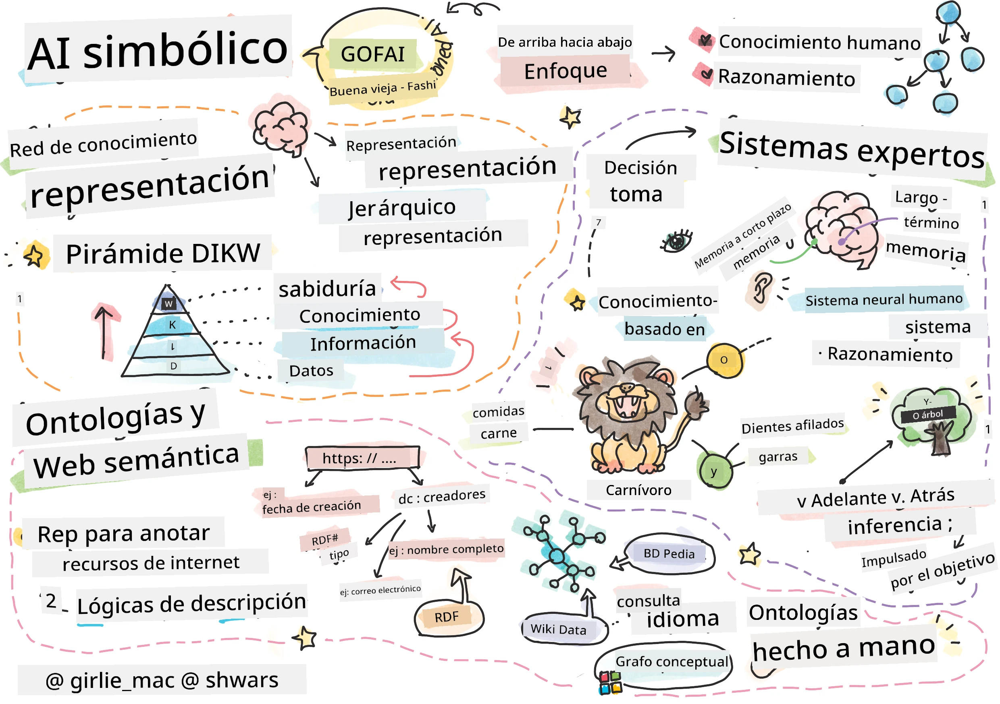
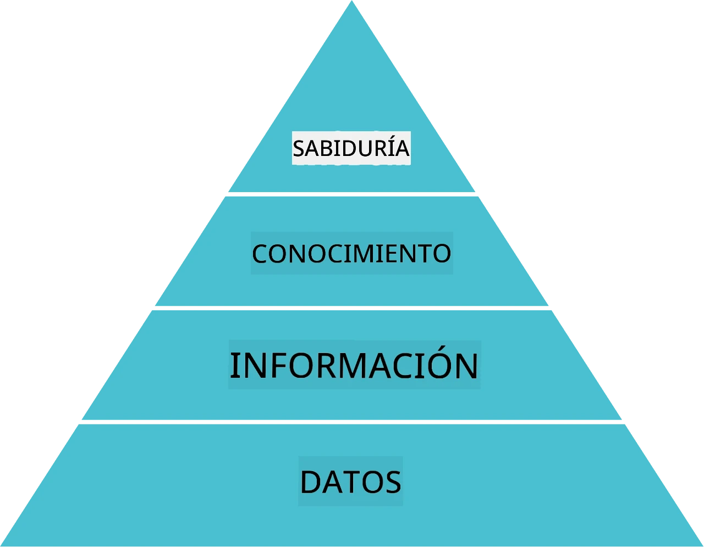
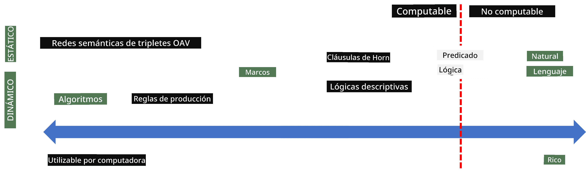
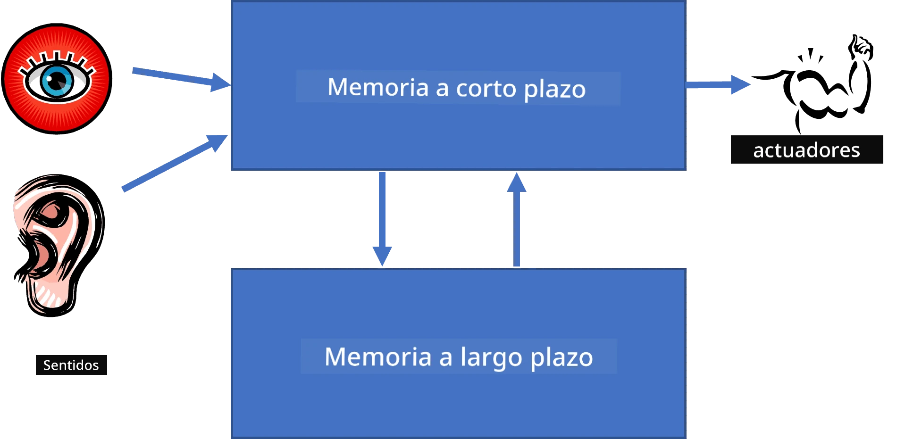
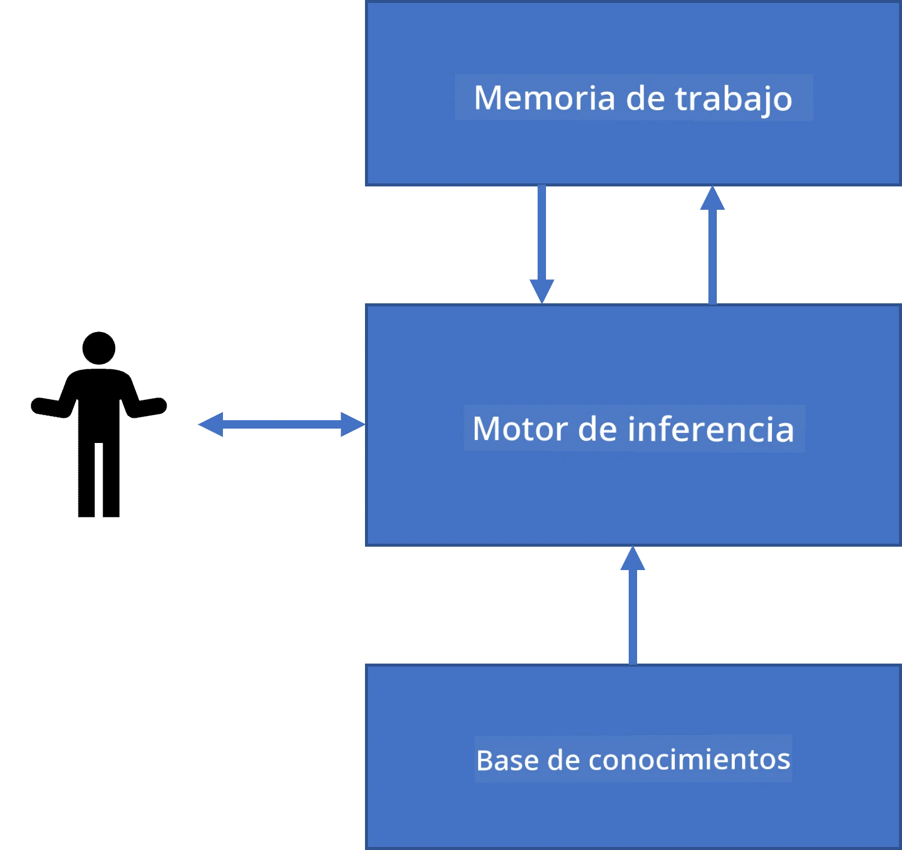
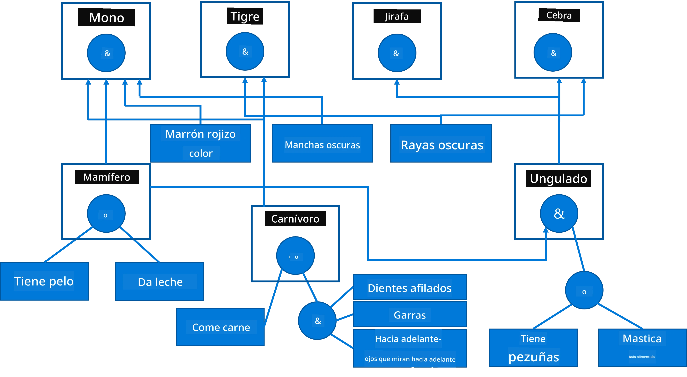
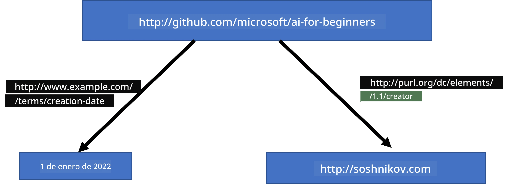
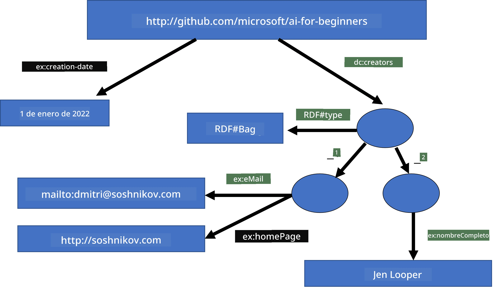
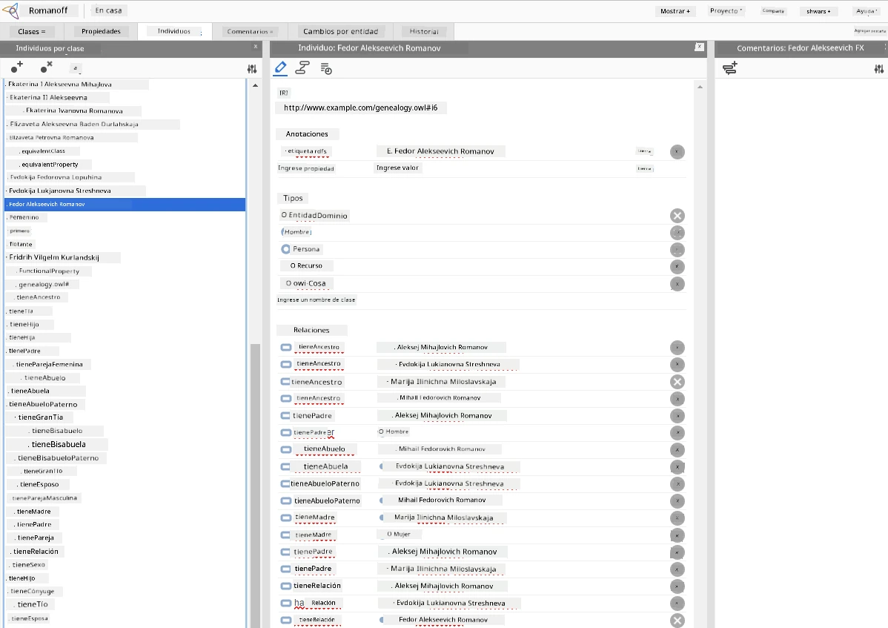

# Representación del Conocimiento y Sistemas Expertos



> Sketchnote por [Tomomi Imura](https://twitter.com/girlie_mac)

La búsqueda de la inteligencia artificial se basa en una búsqueda de conocimiento, para comprender el mundo de manera similar a como lo hacen los humanos. Pero, ¿cómo puedes lograr esto?

## [Cuestionario previo a la clase](https://ff-quizzes.netlify.app/en/ai/quiz/3)

En los primeros días de la IA, el enfoque de arriba hacia abajo para crear sistemas inteligentes (discutido en la lección anterior) era popular. La idea era extraer el conocimiento de las personas a alguna forma legible por máquina, y luego usarlo para resolver problemas automáticamente. Este enfoque se basaba en dos grandes ideas:

* Representación del Conocimiento
* Razonamiento

## Representación del Conocimiento

Uno de los conceptos importantes en la IA Simbólica es el **conocimiento**. Es importante diferenciar el conocimiento de la *información* o los *datos*. Por ejemplo, se puede decir que los libros contienen conocimiento, porque uno puede estudiar libros y volverse un experto. Sin embargo, lo que los libros en realidad contienen se llama *datos*, y al leer libros e integrar estos datos en nuestro modelo del mundo convertimos estos datos en conocimiento.

> ✅ **Conocimiento** es algo que está contenido en nuestra mente y representa nuestra comprensión del mundo. Se obtiene mediante un proceso activo de **aprendizaje**, que integra fragmentos de información que recibimos en nuestro modelo activo del mundo.

Generalmente, no definimos estrictamente el conocimiento, sino que lo alineamos con otros conceptos relacionados usando la [Pirámide DIKW](https://en.wikipedia.org/wiki/DIKW_pyramid). Contiene los siguientes conceptos:

* **Datos** son algo representado en medios físicos, como texto escrito o palabras habladas. Los datos existen independientemente de los humanos y pueden ser transmitidos entre personas.
* **Información** es cómo interpretamos los datos en nuestra mente. Por ejemplo, cuando escuchamos la palabra *computadora*, tenemos alguna comprensión de qué es.
* **Conocimiento** es la información integrada en nuestro modelo del mundo. Por ejemplo, una vez que aprendemos qué es una computadora, empezamos a tener algunas ideas sobre cómo funciona, cuánto cuesta y para qué puede usarse. Esta red de conceptos interrelacionados forma nuestro conocimiento.
* **Sabiduría** es un nivel más de nuestra comprensión del mundo, y representa *meta-conocimiento*, por ejemplo, alguna noción de cómo y cuándo debe usarse el conocimiento.



*Imagen [de Wikipedia](https://commons.wikimedia.org/w/index.php?curid=37705247), Por Longlivetheux - Trabajo propio, CC BY-SA 4.0*

Así, el problema de la **representación del conocimiento** es hallar alguna forma efectiva de representar el conocimiento dentro de una computadora en forma de datos, para hacerlo automáticamente utilizable. Esto puede verse como un espectro:



> Imagen por [Dmitry Soshnikov](http://soshnikov.com)

* A la izquierda, hay tipos muy simples de representaciones del conocimiento que pueden ser efectivamente usados por computadoras. La más simple es la algorítmica, cuando el conocimiento es representado por un programa de computadora. Esto, sin embargo, no es la mejor forma de representar el conocimiento, porque no es flexible. El conocimiento dentro de nuestra cabeza a menudo no es algorítmico.
* A la derecha, hay representaciones como el texto natural. Es la más poderosa, pero no puede usarse para razonamiento automático.

> ✅ Piensa por un minuto cómo representas el conocimiento en tu mente y lo conviertes en notas. ¿Hay algún formato particular que funcione bien para ayudarte a retener la información?

## Clasificación de Representaciones de Conocimiento en Computadoras

Podemos clasificar diferentes métodos de representación del conocimiento computacional en las siguientes categorías:

* Las **representaciones en red** se basan en el hecho de que tenemos una red de conceptos interrelacionados dentro de nuestra mente. Podemos intentar reproducir esas mismas redes como un grafo dentro de una computadora: una llamada **red semántica**.

1. **Tripletas Objeto-Atributo-Valor** o **pares atributo-valor**. Puesto que un grafo puede ser representado dentro de una computadora como una lista de nodos y aristas, podemos representar una red semántica mediante una lista de tripletas que contienen objetos, atributos y valores. Por ejemplo, construimos las siguientes tripletas sobre lenguajes de programación:

Objeto | Atributo | Valor
-------|----------|-------
Python | es | Lenguaje no tipado
Python | inventado-por | Guido van Rossum
Python | sintaxis-de-bloques | indentación
Lenguaje no tipado | no tiene | definiciones de tipo

> ✅ Piensa cómo las tripletas pueden usarse para representar otros tipos de conocimiento.

2. Las **representaciones jerárquicas** enfatizan el hecho de que a menudo creamos una jerarquía de objetos en nuestra mente. Por ejemplo, sabemos que el canario es un pájaro, y todos los pájaros tienen alas. También tenemos alguna idea de qué color suele ser un canario y cuál es su velocidad de vuelo.

   - La **representación por marcos** se basa en representar cada objeto o clase de objetos como un **marco** que contiene **espacios (slots)**. Los espacios tienen posibles valores por defecto, restricciones de valor o procedimientos almacenados que pueden llamarse para obtener el valor de un espacio. Todos los marcos forman una jerarquía similar a una jerarquía de objetos en lenguajes de programación orientados a objetos.
   - **Escenarios** son un tipo especial de marcos que representan situaciones complejas que pueden desarrollarse en el tiempo.

**Python**

Espacio | Valor | Valor por defecto | Intervalo |
--------|-------|-------------------|-----------|
Nombre | Python | | |
Es-Un | Lenguaje no tipado | | |
Estilo de variable | | CamelCase | |
Longitud del programa | | | 5-5000 líneas |
Sintaxis de bloques | Indentación | | |

3. Las **representaciones procedurales** se basan en representar el conocimiento mediante una lista de acciones que pueden ejecutarse cuando ocurre cierta condición.
   - Las reglas de producción son sentencias si-entonces que nos permiten sacar conclusiones. Por ejemplo, un médico puede tener una regla que dice que **SI** un paciente tiene fiebre alta **O** un nivel alto de proteína C reactiva en análisis de sangre **ENTONCES** tiene una inflamación. Una vez que encontramos una de las condiciones, podemos concluir inflamación y usarla en razonamientos posteriores.
   - Los algoritmos pueden considerarse otra forma de representación procedural, aunque casi nunca se usan directamente en sistemas basados en conocimiento.

4. La **lógica** fue originalmente propuesta por Aristóteles como una forma de representar el conocimiento humano universal.
   - La Lógica de Predicados como teoría matemática es demasiado compleja para ser calculable, por lo que normalmente se usa algún subconjunto, como las cláusulas de Horn usadas en Prolog.
   - La Lógica Descriptiva es una familia de sistemas lógicos usados para representar y razonar sobre jerarquías de objetos distribuidos en representaciones del conocimiento como la *web semántica*.

## Sistemas Expertos

Uno de los primeros éxitos de la IA simbólica fueron los llamados **sistemas expertos**: sistemas computacionales diseñados para actuar como un experto en un dominio problemático limitado. Se basaban en una **base de conocimiento** extraída de uno o más expertos humanos, y contenían un **motor de inferencia** que realizaba razonamientos sobre ella.

 | 
---------------------------------------------|------------------------------------------------
Estructura simplificada del sistema neural humano | Arquitectura de un sistema basado en conocimiento

Los sistemas expertos están construidos como el sistema de razonamiento humano, que contiene **memoria a corto plazo** y **memoria a largo plazo**. De forma similar, en sistemas basados en conocimiento distinguimos los siguientes componentes:

* **Memoria del problema**: contiene el conocimiento sobre el problema que se está resolviendo actualmente, es decir, la temperatura o presión sanguínea de un paciente, si tiene inflamación o no, etc. Este conocimiento también se llama **conocimiento estático**, porque contiene una instantánea de lo que actualmente sabemos sobre el problema - el llamado *estado del problema*.
* **Base de conocimiento**: representa el conocimiento a largo plazo sobre un dominio problemático. Se extrae manualmente de expertos humanos y no cambia entre consultas. Debido a que nos permite navegar de un estado a otro, también se llama **conocimiento dinámico**.
* **Motor de inferencia**: orquesta todo el proceso de búsqueda en el espacio de estados del problema, realizando preguntas al usuario cuando es necesario. También es responsable de encontrar las reglas correctas para aplicar en cada estado.

Como ejemplo, consideremos el siguiente sistema experto para determinar un animal según sus características físicas:



> Imagen por [Dmitry Soshnikov](http://soshnikov.com)

Este diagrama se llama **árbol AND-OR**, y es una representación gráfica de un conjunto de reglas de producción. Dibujar un árbol es útil al inicio de la extracción del conocimiento del experto. Para representar el conocimiento dentro de la computadora es más conveniente usar reglas:

```
IF the animal eats meat
OR (animal has sharp teeth
    AND animal has claws
    AND animal has forward-looking eyes
) 
THEN the animal is a carnivore
```

Puedes notar que cada condición a la izquierda de la regla y la acción son esencialmente tripletas objeto-atributo-valor (OAV). La **memoria de trabajo** contiene el conjunto de tripletas OAV que corresponden al problema que se está resolviendo actualmente. Un **motor de reglas** busca reglas cuyas condiciones se satisfacen y las aplica, añadiendo otra tripleta a la memoria de trabajo.

> ✅ ¡Escribe tu propio árbol AND-OR sobre un tema que te guste!

### Inferencia hacia adelante vs. hacia atrás

El proceso descrito arriba se llama **inferencia hacia adelante**. Empieza con algunos datos iniciales sobre el problema disponibles en la memoria de trabajo, y luego ejecuta el siguiente ciclo de razonamiento:

1. Si el atributo objetivo está presente en la memoria de trabajo, detenerse y dar el resultado
2. Buscar todas las reglas cuyas condiciones se satisfacen actualmente - obtener el **conjunto de conflicto** de reglas.
3. Realizar **resolución de conflicto** - seleccionar una regla que será ejecutada en este paso. Puede haber diferentes estrategias de resolución de conflicto:
   - Seleccionar la primera regla aplicable en la base de conocimiento
   - Seleccionar una regla aleatoria
   - Seleccionar una regla *más específica*, es decir, la que cumple con más condiciones en el "lado izquierdo" (LHS)
4. Aplicar la regla seleccionada e insertar nueva pieza de conocimiento en el estado del problema
5. Repetir desde el paso 1.

Sin embargo, en algunos casos podríamos querer empezar con conocimiento vacío sobre el problema y hacer preguntas que nos ayuden a llegar a la conclusión. Por ejemplo, al hacer un diagnóstico médico, normalmente no realizamos todos los análisis médicos de antemano antes de empezar a diagnosticar al paciente. Más bien queremos hacer análisis cuando sea necesario.

Este proceso puede modelarse usando **inferencia hacia atrás**. Está dirigido por el **objetivo**, es decir, el valor del atributo que queremos encontrar:

1. Seleccionar todas las reglas que nos pueden dar el valor de un objetivo (es decir, con el objetivo en el Lado Derecho ("right-hand-side")) - un conjunto de conflicto
1. Si no hay reglas para este atributo, o hay una regla que dice que debemos consultar el valor al usuario, preguntarlo; de lo contrario:
1. Usar la estrategia de resolución de conflicto para seleccionar una regla que usaremos como *hipótesis* - trataremos de probarla
1. Repetir recursivamente el proceso para todos los atributos en el Lado Izquierdo (LHS) de la regla, tratando de probarlos como objetivos
1. Si en algún momento el proceso falla, usar otra regla en el paso 3.

> ✅ ¿En qué situaciones es más apropiada la inferencia hacia adelante? ¿Y la inferencia hacia atrás?

### Implementación de Sistemas Expertos

Los sistemas expertos pueden implementarse usando diferentes herramientas:

* Programándolos directamente en algún lenguaje de alto nivel. Esto no es la mejor idea, porque la ventaja principal de un sistema basado en conocimiento es que el conocimiento está separado de la inferencia, y potencialmente un experto en el dominio problemático debería ser capaz de escribir reglas sin entender los detalles del proceso de inferencia
* Usando un **entorno de desarrollo para sistemas expertos**, es decir, un sistema diseñado específicamente para ser poblado con conocimiento usando algún lenguaje de representación del conocimiento.

## ✍️ Ejercicio: Inferencia de Animales

Consulta [Animals.ipynb](https://github.com/microsoft/AI-For-Beginners/blob/main/lessons/2-Symbolic/Animals.ipynb) para un ejemplo de implementación de un sistema experto de inferencia hacia adelante y hacia atrás.

> **Nota**: Este ejemplo es bastante simple y solo da una idea de cómo es un sistema experto. Cuando empieces a crear un sistema así, notarás un comportamiento *inteligente* solo una vez alcances cierto número de reglas, alrededor de 200+. En algún punto, las reglas se vuelven demasiado complejas para recordarlas todas, y entonces puedes empezar a preguntarte por qué un sistema toma ciertas decisiones. Sin embargo, la característica importante de los sistemas basados en conocimiento es que siempre puedes *explicar* exactamente cómo se tomó cualquier decisión.

## Ontologías y la Web Semántica

A finales del siglo XX hubo una iniciativa para usar la representación del conocimiento para anotar recursos de Internet, de modo que fuera posible encontrar recursos que correspondan a consultas muy específicas. Este movimiento se llamó **Web Semántica**, y se basó en varios conceptos:

- Una representación especial del conocimiento basada en **[lógicas descriptivas](https://en.wikipedia.org/wiki/Description_logic)** (DL). Es similar a la representación por marcos, porque construye una jerarquía de objetos con propiedades, pero tiene semántica formal lógica e inferencia. Existe una familia de DLs que balancean la expresividad y la complejidad algorítmica de la inferencia.
- Representación distribuida del conocimiento, donde todos los conceptos están representados por un identificador URI global, haciendo posible crear jerarquías de conocimiento a lo largo de internet.
- Una familia de lenguajes basados en XML para la descripción del conocimiento: RDF (Resource Description Framework), RDFS (RDF Schema), OWL (Ontology Web Language).

Un concepto central en la Web Semántica es el concepto de **Ontología**. Se refiere a una especificación explícita de un dominio de problema utilizando alguna representación formal del conocimiento. La ontología más simple puede ser solo una jerarquía de objetos en un dominio de problema, pero ontologías más complejas incluirán reglas que pueden usarse para inferencia.

En la web semántica, todas las representaciones se basan en tripletas. Cada objeto y cada relación se identifican de manera única mediante la URI. Por ejemplo, si queremos afirmar el hecho de que este Curriculum de IA fue desarrollado por Dmitry Soshnikov el 1 de enero de 2022, aquí están las tripletas que podemos usar:



```
http://github.com/microsoft/ai-for-beginners http://www.example.com/terms/creation-date “Jan 1, 2022”
http://github.com/microsoft/ai-for-beginners http://purl.org/dc/elements/1.1/creator http://soshnikov.com
```

> ✅ Aquí `http://www.example.com/terms/creation-date` y `http://purl.org/dc/elements/1.1/creator` son algunas URIs bien conocidas y universalmente aceptadas para expresar los conceptos de *creador* y *fecha de creación*.

En un caso más complejo, si queremos definir una lista de creadores, podemos usar algunas estructuras de datos definidas en RDF.



> Diagramas arriba por [Dmitry Soshnikov](http://soshnikov.com)

El progreso de construir la Web Semántica fue de alguna manera ralentizado por el éxito de los motores de búsqueda y las técnicas de procesamiento del lenguaje natural, que permiten extraer datos estructurados del texto. Sin embargo, en algunas áreas todavía existen esfuerzos significativos para mantener ontologías y bases de conocimiento. Algunos proyectos destacables:

* [WikiData](https://wikidata.org/) es una colección de bases de conocimiento legibles por máquina asociadas con Wikipedia. La mayor parte de los datos se extraen de los *InfoBoxes* de Wikipedia, fragmentos de contenido estructurado dentro de las páginas de Wikipedia. Puedes [consultar](https://query.wikidata.org/) wikidata en SPARQL, un lenguaje de consulta especial para la Web Semántica. Aquí hay una consulta de ejemplo que muestra los colores de ojos más populares entre los humanos:

```sparql
#defaultView:BubbleChart
SELECT ?eyeColorLabel (COUNT(?human) AS ?count)
WHERE
{
  ?human wdt:P31 wd:Q5.       # human instance-of homo sapiens
  ?human wdt:P1340 ?eyeColor. # human eye-color ?eyeColor
  SERVICE wikibase:label { bd:serviceParam wikibase:language "en". }
}
GROUP BY ?eyeColorLabel
```

* [DBpedia](https://www.dbpedia.org/) es otro esfuerzo similar a WikiData.

> ✅ Si quieres experimentar con la construcción de tus propias ontologías, o abrir ontologías existentes, hay un gran editor visual de ontologías llamado [Protégé](https://protege.stanford.edu/). Descárgalo o úsalo en línea.



*Editor Web Protégé abierto con la ontología de la familia Romanov. Captura de pantalla por Dmitry Soshnikov*

## ✍️ Ejercicio: Una Ontología Familiar

Consulta [FamilyOntology.ipynb](https://github.com/Ezana135/AI-For-Beginners/blob/main/lessons/2-Symbolic/FamilyOntology.ipynb) para un ejemplo de uso de técnicas de la Web Semántica para razonar sobre las relaciones familiares. Tomaremos un árbol genealógico representado en el formato común GEDCOM y una ontología de relaciones familiares para construir un grafo de todas las relaciones familiares para un conjunto dado de individuos.

## Microsoft Concept Graph

En la mayoría de los casos, las ontologías son cuidadosamente creadas a mano. Sin embargo, también es posible **minar** ontologías a partir de datos no estructurados, por ejemplo, de textos en lenguaje natural.

Un intento así fue realizado por Microsoft Research, y resultó en [Microsoft Concept Graph](https://blogs.microsoft.com/ai/microsoft-researchers-release-graph-that-helps-machines-conceptualize/?WT.mc_id=academic-77998-cacaste).

Es una gran colección de entidades agrupadas usando la relación de herencia `is-a`. Permite responder preguntas como "¿Qué es Microsoft?" — la respuesta siendo algo como "una empresa con probabilidad 0.87, y una marca con probabilidad 0.75".

El Grafo está disponible tanto como API REST, así como un gran archivo de texto descargable que lista todos los pares de entidades.

## ✍️ Ejercicio: Un Grafo de Conceptos

Prueba el cuaderno [MSConceptGraph.ipynb](https://github.com/microsoft/AI-For-Beginners/blob/main/lessons/2-Symbolic/MSConceptGraph.ipynb) para ver cómo podemos usar Microsoft Concept Graph para agrupar artículos de noticias en varias categorías.

## Conclusión

Hoy en día, la IA a menudo se considera sinónimo de *Aprendizaje Automático* o *Redes Neuronales*. Sin embargo, un ser humano también exhibe razonamiento explícito, que es algo que actualmente no manejan las redes neuronales. En proyectos del mundo real, el razonamiento explícito todavía se usa para realizar tareas que requieren explicaciones, o que permiten modificar el comportamiento del sistema de una manera controlada.

## 🚀 Desafío

En el cuaderno Ontología Familiar asociado a esta lección, hay una oportunidad para experimentar con otras relaciones familiares. Intenta descubrir nuevas conexiones entre personas en el árbol genealógico.

## [Cuestionario posterior a la conferencia](https://ff-quizzes.netlify.app/en/ai/quiz/4)

## Revisión y Autoestudio

Haz una investigación en internet para descubrir áreas donde los humanos han intentado cuantificar y codificar el conocimiento. Echa un vistazo a la Taxonomía de Bloom y regresa en la historia para aprender cómo los humanos intentaron comprender su mundo. Explora el trabajo de Linneo para crear una taxonomía de organismos, y observa la forma en que Dmitri Mendeléyev creó una manera para describir y agrupar elementos químicos. ¿Qué otros ejemplos interesantes puedes encontrar?

**Tarea**: [Construir una Ontología](assignment.md)

---

<!-- CO-OP TRANSLATOR DISCLAIMER START -->
**Aviso legal**:
Este documento ha sido traducido utilizando el servicio de traducción automática [Co-op Translator](https://github.com/Azure/co-op-translator). Aunque nos esforzamos por la precisión, tenga en cuenta que las traducciones automáticas pueden contener errores o inexactitudes. El documento original en su idioma nativo debe considerarse la fuente autorizada. Para información crítica, se recomienda la traducción profesional realizada por humanos. No nos responsabilizamos por cualquier malentendido o interpretación errónea derivada del uso de esta traducción.
<!-- CO-OP TRANSLATOR DISCLAIMER END -->