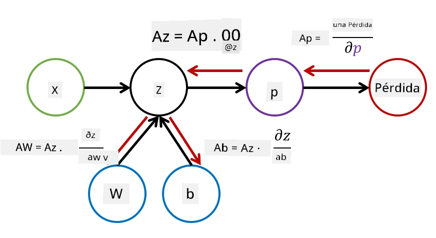

# Introducción a Redes Neuronales. Perceptrón Multicapa

En la sección anterior, aprendiste sobre el modelo de red neuronal más simple: el perceptrón de una sola capa, un modelo lineal de clasificación de dos clases.

En esta sección, extenderemos este modelo a un marco más flexible que nos permitirá:

* realizar **clasificación multiclase** además de clasificación de dos clases
* resolver **problemas de regresión** además de clasificación
* separar clases que no son linealmente separables

También desarrollaremos nuestro propio marco modular en Python que nos permitirá construir diferentes arquitecturas de redes neuronales.

## [Cuestionario previo a la lección](https://ff-quizzes.netlify.app/en/ai/quiz/7)

## Formalización del Aprendizaje Automático

Comencemos formalizando el problema de Aprendizaje Automático. Supongamos que tenemos un conjunto de datos de entrenamiento **X** con etiquetas **Y**, y necesitamos construir un modelo *f* que haga predicciones lo más precisas posible. La calidad de las predicciones se mide mediante la **función de pérdida** &lagran;. Las siguientes funciones de pérdida se utilizan comúnmente:

* Para problemas de regresión, cuando necesitamos predecir un número, podemos usar el **error absoluto** &sum;i|f(x(i))-y(i)|, o el **error cuadrático** &sum;i(f(x(i))-y(i))2
* Para clasificación, usamos la **pérdida 0-1** (que es esencialmente lo mismo que la **precisión** del modelo), o la **pérdida logística**.

Para el perceptrón de una sola capa, la función *f* se definía como una función lineal *f(x)=wx+b* (donde *w* es la matriz de pesos, *x* es el vector de características de entrada, y *b* es el vector de sesgo). Para diferentes arquitecturas de redes neuronales, esta función puede tomar una forma más compleja.

> En el caso de clasificación, a menudo es deseable obtener probabilidades de las clases correspondientes como salida de la red. Para convertir números arbitrarios en probabilidades (por ejemplo, para normalizar la salida), a menudo usamos la función **softmax** &sigma;, y la función *f* se convierte en *f(x)=&sigma;(wx+b)*

En la definición de *f* anterior, *w* y *b* se llaman **parámetros** &theta;=⟨*w,b*⟩. Dado el conjunto de datos ⟨**X**,**Y**⟩, podemos calcular un error general en todo el conjunto de datos como una función de los parámetros &theta;.

> ✅ **El objetivo del entrenamiento de redes neuronales es minimizar el error variando los parámetros &theta;**

## Optimización por Descenso de Gradiente

Existe un método bien conocido de optimización de funciones llamado **descenso de gradiente**. La idea es que podemos calcular una derivada (en el caso multidimensional llamada **gradiente**) de la función de pérdida con respecto a los parámetros, y variar los parámetros de tal manera que el error disminuya. Esto se puede formalizar de la siguiente manera:

* Inicializar los parámetros con algunos valores aleatorios w(0), b(0)
* Repetir el siguiente paso muchas veces:
    - w(i+1) = w(i)-&eta;&part;&lagran;/&part;w
    - b(i+1) = b(i)-&eta;&part;&lagran;/&part;b

Durante el entrenamiento, se supone que los pasos de optimización se calculan considerando todo el conjunto de datos (recuerda que la pérdida se calcula como una suma a través de todas las muestras de entrenamiento). Sin embargo, en la práctica tomamos pequeñas porciones del conjunto de datos llamadas **minibatches**, y calculamos los gradientes basándonos en un subconjunto de datos. Debido a que el subconjunto se toma aleatoriamente cada vez, este método se llama **descenso de gradiente estocástico** (SGD).

## Perceptrones Multicapa y Retropropagación

Una red de una sola capa, como hemos visto anteriormente, es capaz de clasificar clases linealmente separables. Para construir un modelo más rico, podemos combinar varias capas de la red. Matemáticamente, esto significaría que la función *f* tendría una forma más compleja y se calcularía en varios pasos:
* z1=w1x+b1
* z2=w2&alpha;(z1)+b2
* f = &sigma;(z2)

Aquí, &alpha; es una **función de activación no lineal**, &sigma; es una función softmax, y los parámetros &theta;=<*w1,b1,w2,b2*>.

El algoritmo de descenso de gradiente permanecería igual, pero sería más difícil calcular los gradientes. Dado el principio de diferenciación en cadena, podemos calcular las derivadas como:

* &part;&lagran;/&part;w2 = (&part;&lagran;/&part;&sigma;)(&part;&sigma;/&part;z2)(&part;z2/&part;w2)
* &part;&lagran;/&part;w1 = (&part;&lagran;/&part;&sigma;)(&part;&sigma;/&part;z2)(&part;z2/&part;&alpha;)(&part;&alpha;/&part;z1)(&part;z1/&part;w1)

> ✅ La regla de diferenciación en cadena se utiliza para calcular las derivadas de la función de pérdida con respecto a los parámetros.

Nota que la parte más a la izquierda de todas estas expresiones es la misma, y por lo tanto podemos calcular eficazmente las derivadas comenzando desde la función de pérdida y avanzando "hacia atrás" a través del gráfico computacional. Por lo tanto, el método de entrenamiento de un perceptrón multicapa se llama **retropropagación**, o 'backprop'.

> TODO: cita de la imagen

> ✅ Cubriremos la retropropagación con mucho más detalle en nuestro ejemplo de notebook.  

## Conclusión

En esta lección, hemos construido nuestra propia biblioteca de redes neuronales y la hemos utilizado para una tarea de clasificación bidimensional simple.

## 🚀 Desafío

En el notebook que acompaña esta lección, implementarás tu propio marco para construir y entrenar perceptrones multicapa. Podrás ver en detalle cómo operan las redes neuronales modernas.

Accede al notebook [OwnFramework](OwnFramework.ipynb) y trabaja en él.

## [Cuestionario posterior a la lección](https://ff-quizzes.netlify.app/en/ai/quiz/8)

## Revisión y Estudio Autónomo

La retropropagación es un algoritmo común utilizado en IA y ML, vale la pena estudiarlo [en más detalle](https://wikipedia.org/wiki/Backpropagation)

## [Asignación](lab/README.md)

En este laboratorio, se te pide que utilices el marco que construiste en esta lección para resolver la clasificación de dígitos escritos a mano del conjunto de datos MNIST.

* [Instrucciones](lab/README.md)
* [Notebook](lab/MyFW_MNIST.ipynb)

---

