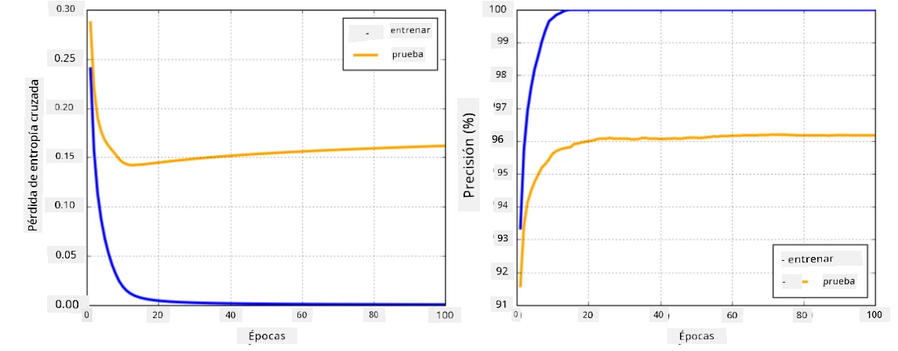

# Frameworks de Redes Neuronales

Como ya hemos aprendido, para entrenar redes neuronales de manera eficiente necesitamos hacer dos cosas:

* Operar con tensores, por ejemplo, multiplicar, sumar y calcular algunas funciones como sigmoid o softmax.
* Calcular gradientes de todas las expresiones, para realizar la optimización mediante descenso de gradiente.

## [Cuestionario previo a la lección](https://ff-quizzes.netlify.app/en/ai/quiz/9)

Aunque la biblioteca `numpy` puede realizar la primera parte, necesitamos algún mecanismo para calcular gradientes. En [nuestro framework](../04-OwnFramework/OwnFramework.ipynb) que desarrollamos en la sección anterior, tuvimos que programar manualmente todas las funciones derivadas dentro del método `backward`, que realiza la retropropagación. Idealmente, un framework debería ofrecernos la posibilidad de calcular gradientes de *cualquier expresión* que podamos definir.

Otro aspecto importante es poder realizar cálculos en GPU, u otras unidades de cómputo especializadas, como [TPU](https://en.wikipedia.org/wiki/Tensor_Processing_Unit). El entrenamiento de redes neuronales profundas requiere *muchos* cálculos, y poder paralelizar esos cálculos en GPUs es muy importante.

> ✅ El término 'paralelizar' significa distribuir los cálculos en múltiples dispositivos.

Actualmente, los dos frameworks de redes neuronales más populares son: [TensorFlow](http://TensorFlow.org) y [PyTorch](https://pytorch.org/). Ambos proporcionan una API de bajo nivel para operar con tensores tanto en CPU como en GPU. Además de la API de bajo nivel, también existe una API de alto nivel, llamada [Keras](https://keras.io/) y [PyTorch Lightning](https://pytorchlightning.ai/) respectivamente.

API de Bajo Nivel | [TensorFlow](http://TensorFlow.org) | [PyTorch](https://pytorch.org/)
-------------------|-------------------------------------|--------------------------------
API de Alto Nivel  | [Keras](https://keras.io/)         | [PyTorch Lightning](https://pytorchlightning.ai/)

Las **APIs de bajo nivel** en ambos frameworks permiten construir los llamados **gráficos computacionales**. Este gráfico define cómo calcular la salida (generalmente la función de pérdida) con los parámetros de entrada dados, y puede enviarse para su cálculo en GPU, si está disponible. Hay funciones para diferenciar este gráfico computacional y calcular gradientes, que luego pueden usarse para optimizar los parámetros del modelo.

Las **APIs de alto nivel** consideran las redes neuronales como una **secuencia de capas**, y facilitan mucho la construcción de la mayoría de las redes neuronales. Entrenar el modelo generalmente requiere preparar los datos y luego llamar a una función `fit` para realizar el trabajo.

La API de alto nivel permite construir redes neuronales típicas muy rápidamente sin preocuparse por muchos detalles. Al mismo tiempo, las APIs de bajo nivel ofrecen mucho más control sobre el proceso de entrenamiento, y por eso se utilizan mucho en investigación, cuando se trabaja con nuevas arquitecturas de redes neuronales.

También es importante entender que se pueden usar ambas APIs juntas. Por ejemplo, puedes desarrollar tu propia arquitectura de capa de red utilizando la API de bajo nivel, y luego usarla dentro de una red más grande construida y entrenada con la API de alto nivel. O puedes definir una red utilizando la API de alto nivel como una secuencia de capas, y luego usar tu propio bucle de entrenamiento de bajo nivel para realizar la optimización. Ambas APIs utilizan los mismos conceptos básicos subyacentes y están diseñadas para trabajar bien juntas.

## Aprendizaje

En este curso, ofrecemos la mayoría del contenido tanto para PyTorch como para TensorFlow. Puedes elegir tu framework preferido y solo trabajar con los notebooks correspondientes. Si no estás seguro de qué framework elegir, lee algunas discusiones en internet sobre **PyTorch vs. TensorFlow**. También puedes echar un vistazo a ambos frameworks para obtener una mejor comprensión.

Cuando sea posible, utilizaremos APIs de alto nivel por simplicidad. Sin embargo, creemos que es importante entender cómo funcionan las redes neuronales desde cero, por lo que al principio comenzamos trabajando con la API de bajo nivel y tensores. Sin embargo, si deseas avanzar rápidamente y no quieres dedicar mucho tiempo a aprender estos detalles, puedes omitirlos e ir directamente a los notebooks de la API de alto nivel.

## ✍️ Ejercicios: Frameworks

Continúa tu aprendizaje en los siguientes notebooks:

API de Bajo Nivel | [Notebook TensorFlow+Keras](IntroKerasTF.ipynb) | [PyTorch](IntroPyTorch.ipynb)
-------------------|-------------------------------------|--------------------------------
API de Alto Nivel  | [Keras](IntroKeras.ipynb)          | *PyTorch Lightning*

Después de dominar los frameworks, repasemos el concepto de sobreajuste.

# Sobreajuste

El sobreajuste es un concepto extremadamente importante en el aprendizaje automático, ¡y es crucial entenderlo bien!

Considera el siguiente problema de aproximar 5 puntos (representados por `x` en los gráficos a continuación):

 | 
-------------------------|--------------------------
**Modelo lineal, 2 parámetros** | **Modelo no lineal, 7 parámetros**
Error de entrenamiento = 5.3 | Error de entrenamiento = 0
Error de validación = 5.1 | Error de validación = 20

* A la izquierda, vemos una buena aproximación con una línea recta. Debido a que el número de parámetros es adecuado, el modelo capta correctamente la distribución de los puntos.
* A la derecha, el modelo es demasiado potente. Como solo tenemos 5 puntos y el modelo tiene 7 parámetros, puede ajustarse de tal manera que pase por todos los puntos, haciendo que el error de entrenamiento sea 0. Sin embargo, esto impide que el modelo entienda el patrón correcto detrás de los datos, por lo que el error de validación es muy alto.

Es muy importante encontrar un equilibrio correcto entre la complejidad del modelo (número de parámetros) y la cantidad de muestras de entrenamiento.

## Por qué ocurre el sobreajuste

  * No hay suficientes datos de entrenamiento.
  * El modelo es demasiado potente.
  * Hay demasiado ruido en los datos de entrada.

## Cómo detectar el sobreajuste

Como puedes ver en el gráfico anterior, el sobreajuste puede detectarse por un error de entrenamiento muy bajo y un error de validación alto. Normalmente, durante el entrenamiento veremos que tanto el error de entrenamiento como el de validación comienzan a disminuir, y luego, en algún punto, el error de validación podría dejar de disminuir y empezar a aumentar. Esto será una señal de sobreajuste y un indicador de que probablemente deberíamos detener el entrenamiento en ese punto (o al menos hacer una instantánea del modelo).

## Cómo prevenir el sobreajuste

Si detectas que ocurre sobreajuste, puedes hacer lo siguiente:

 * Aumentar la cantidad de datos de entrenamiento.
 * Disminuir la complejidad del modelo.
 * Usar alguna [técnica de regularización](../../4-ComputerVision/08-TransferLearning/TrainingTricks.md), como [Dropout](../../4-ComputerVision/08-TransferLearning/TrainingTricks.md#Dropout), que veremos más adelante.

## Sobreajuste y el compromiso sesgo-varianza

El sobreajuste es en realidad un caso de un problema más general en estadística llamado [compromiso sesgo-varianza](https://en.wikipedia.org/wiki/Bias%E2%80%93variance_tradeoff). Si consideramos las posibles fuentes de error en nuestro modelo, podemos identificar dos tipos de errores:

* **Errores de sesgo**, causados por nuestro algoritmo al no capturar correctamente la relación entre los datos de entrenamiento. Esto puede deberse a que nuestro modelo no es lo suficientemente potente (**subajuste**).
* **Errores de varianza**, causados por el modelo al aproximar ruido en los datos de entrada en lugar de relaciones significativas (**sobreajuste**).

Durante el entrenamiento, el error de sesgo disminuye (a medida que nuestro modelo aprende a aproximar los datos) y el error de varianza aumenta. Es importante detener el entrenamiento, ya sea manualmente (cuando detectamos sobreajuste) o automáticamente (introduciendo regularización), para prevenir el sobreajuste.

## Conclusión

En esta lección, aprendiste sobre las diferencias entre las diversas APIs de los dos frameworks de IA más populares, TensorFlow y PyTorch. Además, aprendiste sobre un tema muy importante: el sobreajuste.

## 🚀 Desafío

En los notebooks adjuntos, encontrarás 'tareas' al final; trabaja en los notebooks y completa las tareas.

## [Cuestionario posterior a la lección](https://ff-quizzes.netlify.app/en/ai/quiz/10)

## Revisión y autoestudio

Investiga sobre los siguientes temas:

- TensorFlow
- PyTorch
- Sobreajuste

Hazte las siguientes preguntas:

- ¿Cuál es la diferencia entre TensorFlow y PyTorch?
- ¿Cuál es la diferencia entre sobreajuste y subajuste?

## [Asignación](lab/README.md)

En este laboratorio, se te pide resolver dos problemas de clasificación utilizando redes completamente conectadas de una y varias capas con PyTorch o TensorFlow.

* [Instrucciones](lab/README.md)
* [Notebook](lab/LabFrameworks.ipynb)

---

