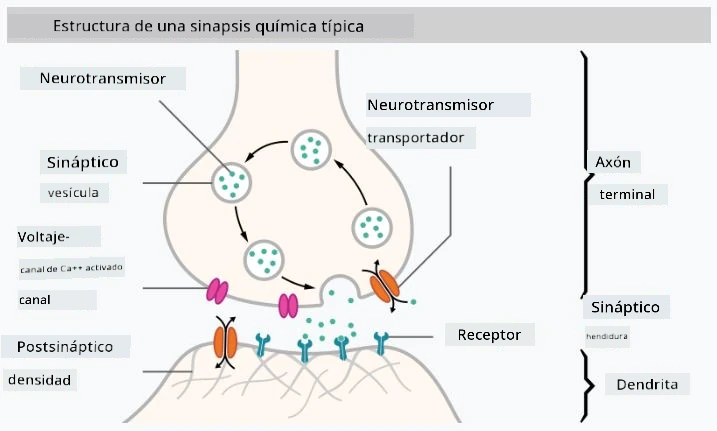

# Introducción a las Redes Neuronales

Como discutimos en la introducción, una de las formas de lograr inteligencia es entrenar un **modelo computacional** o un **cerebro artificial**. Desde mediados del siglo XX, los investigadores han probado diferentes modelos matemáticos, hasta que en los últimos años esta dirección demostró ser enormemente exitosa. Estos modelos matemáticos del cerebro se llaman **redes neuronales**.

> A veces, las redes neuronales se llaman *Redes Neuronales Artificiales* o ANNs, para indicar que estamos hablando de modelos, no de redes reales de neuronas.

## Aprendizaje Automático

Las Redes Neuronales forman parte de una disciplina más amplia llamada **Aprendizaje Automático** (Machine Learning), cuyo objetivo es usar datos para entrenar modelos computacionales capaces de resolver problemas. El Aprendizaje Automático constituye una gran parte de la Inteligencia Artificial; sin embargo, no cubrimos el aprendizaje automático clásico en este plan de estudios.

> Visita nuestro plan de estudios separado **[Machine Learning for Beginners](http://github.com/microsoft/ml-for-beginners)** para aprender más sobre el Aprendizaje Automático clásico.

En el Aprendizaje Automático, asumimos que tenemos un conjunto de datos de ejemplos **X** y valores de salida correspondientes **Y**. Los ejemplos suelen ser vectores N-dimensionales que consisten en **características**, y las salidas se llaman **etiquetas**.

Consideraremos los dos problemas más comunes del aprendizaje automático:

* **Clasificación**, donde necesitamos clasificar un objeto de entrada en dos o más clases.
* **Regresión**, donde necesitamos predecir un valor numérico para cada una de las muestras de entrada.

> Al representar entradas y salidas como tensores, el conjunto de datos de entrada es una matriz de tamaño M&times;N, donde M es el número de muestras y N es el número de características. Las etiquetas de salida Y son un vector de tamaño M.

En este plan de estudios, nos centraremos únicamente en modelos de redes neuronales.

## Un Modelo de Neurona

De la biología, sabemos que nuestro cerebro está compuesto por células neuronales (neuronas), cada una de las cuales tiene múltiples "entradas" (dendritas) y una única "salida" (axón). Tanto las dendritas como los axones pueden conducir señales eléctricas, y las conexiones entre ellos — conocidas como sinapsis — pueden mostrar diferentes grados de conductividad, que son regulados por neurotransmisores.

 | 
----|----
Neurona Real *([Imagen](https://en.wikipedia.org/wiki/Synapse#/media/File:SynapseSchematic_lines.svg) de Wikipedia)* | Neurona Artificial *(Imagen del Autor)*

Por lo tanto, el modelo matemático más simple de una neurona contiene varias entradas X1, ..., XN y una salida Y, junto con una serie de pesos W1, ..., WN. La salida se calcula como:

donde f es alguna **función de activación** no lineal.

> Los primeros modelos de neuronas fueron descritos en el artículo clásico [A logical calculus of the ideas immanent in nervous activity](https://www.cs.cmu.edu/~./epxing/Class/10715/reading/McCulloch.and.Pitts.pdf) por Warren McCullock y Walter Pitts en 1943. Donald Hebb, en su libro "[The Organization of Behavior: A Neuropsychological Theory](https://books.google.com/books?id=VNetYrB8EBoC)", propuso la forma en que estas redes pueden ser entrenadas.

## En esta Sección

En esta sección aprenderemos sobre:
* [Perceptrón](03-Perceptron/README.md), uno de los primeros modelos de redes neuronales para clasificación binaria.
* [Redes multicapa](04-OwnFramework/README.md) con un cuaderno asociado [cómo construir nuestro propio marco](04-OwnFramework/OwnFramework.ipynb).
* [Frameworks de Redes Neuronales](05-Frameworks/README.md), con estos cuadernos: [PyTorch](05-Frameworks/IntroPyTorch.ipynb) y [Keras/Tensorflow](05-Frameworks/IntroKerasTF.ipynb).
* [Sobreajuste](../../../../lessons/3-NeuralNetworks/05-Frameworks).

---

**Descargo de responsabilidad**:  
Este documento ha sido traducido utilizando el servicio de traducción automática [Co-op Translator](https://github.com/Azure/co-op-translator). Aunque nos esforzamos por garantizar la precisión, tenga en cuenta que las traducciones automatizadas pueden contener errores o imprecisiones. El documento original en su idioma nativo debe considerarse como la fuente autorizada. Para información crítica, se recomienda una traducción profesional realizada por humanos. No nos hacemos responsables de malentendidos o interpretaciones erróneas que puedan surgir del uso de esta traducción.