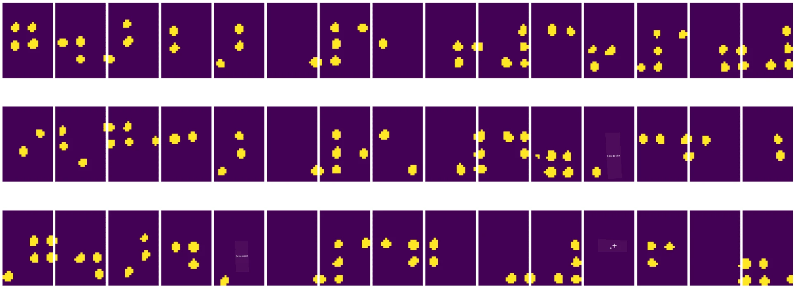
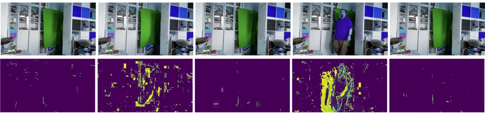

# Introducción a la Visión por Computadora

[Visión por Computadora](https://wikipedia.org/wiki/Computer_vision) es una disciplina cuyo objetivo es permitir que las computadoras comprendan imágenes digitales a un nivel avanzado. Esta es una definición bastante amplia, ya que *comprender* puede significar muchas cosas diferentes, como encontrar un objeto en una imagen (**detección de objetos**), entender qué está ocurriendo (**detección de eventos**), describir una imagen en texto o reconstruir una escena en 3D. También hay tareas específicas relacionadas con imágenes humanas: estimación de edad y emociones, detección e identificación de rostros, y estimación de poses en 3D, entre otras.

## [Cuestionario previo a la clase](https://ff-quizzes.netlify.app/en/ai/quiz/11)

Una de las tareas más simples de la visión por computadora es la **clasificación de imágenes**.

La visión por computadora se considera a menudo una rama de la IA. Hoy en día, la mayoría de las tareas de visión por computadora se resuelven utilizando redes neuronales. Aprenderemos más sobre el tipo especial de redes neuronales utilizadas para visión por computadora, [redes neuronales convolucionales](../07-ConvNets/README.md), a lo largo de esta sección.

Sin embargo, antes de pasar una imagen a una red neuronal, en muchos casos tiene sentido usar algunas técnicas algorítmicas para mejorar la imagen.

Existen varias bibliotecas de Python disponibles para el procesamiento de imágenes:

* **[imageio](https://imageio.readthedocs.io/en/stable/)** se puede usar para leer/escribir diferentes formatos de imágenes. También soporta ffmpeg, una herramienta útil para convertir fotogramas de video en imágenes.
* **[Pillow](https://pillow.readthedocs.io/en/stable/index.html)** (también conocida como PIL) es un poco más potente y también admite manipulación de imágenes como morphing, ajustes de paleta y más.
* **[OpenCV](https://opencv.org/)** es una poderosa biblioteca de procesamiento de imágenes escrita en C++, que se ha convertido en el estándar *de facto* para el procesamiento de imágenes. Tiene una interfaz conveniente en Python.
* **[dlib](http://dlib.net/)** es una biblioteca en C++ que implementa muchos algoritmos de aprendizaje automático, incluidos algunos de los algoritmos de visión por computadora. También tiene una interfaz en Python y puede usarse para tareas desafiantes como la detección de rostros y puntos clave faciales.

## OpenCV

[OpenCV](https://opencv.org/) se considera el estándar *de facto* para el procesamiento de imágenes. Contiene muchos algoritmos útiles, implementados en C++. También puedes usar OpenCV desde Python.

Un buen lugar para aprender OpenCV es [este curso de Learn OpenCV](https://learnopencv.com/getting-started-with-opencv/). En nuestro plan de estudios, nuestro objetivo no es aprender OpenCV, sino mostrarte algunos ejemplos de cuándo puede usarse y cómo.

### Cargar imágenes

Las imágenes en Python pueden representarse convenientemente mediante arreglos de NumPy. Por ejemplo, las imágenes en escala de grises con un tamaño de 320x200 píxeles se almacenarían en un arreglo de 200x320, y las imágenes en color de la misma dimensión tendrían una forma de 200x320x3 (para 3 canales de color). Para cargar una imagen, puedes usar el siguiente código:

```python
import cv2
import matplotlib.pyplot as plt

im = cv2.imread('image.jpeg')
plt.imshow(im)
```

Tradicionalmente, OpenCV utiliza codificación BGR (Azul-Verde-Rojo) para imágenes en color, mientras que el resto de las herramientas de Python usan la más tradicional RGB (Rojo-Verde-Azul). Para que la imagen se vea correctamente, necesitas convertirla al espacio de color RGB, ya sea intercambiando dimensiones en el arreglo de NumPy o llamando a una función de OpenCV:

```python
im = cv2.cvtColor(im,cv2.COLOR_BGR2RGB)
```

La misma función `cvtColor` puede usarse para realizar otras transformaciones de espacio de color, como convertir una imagen a escala de grises o al espacio de color HSV (Matiz-Saturación-Valor).

También puedes usar OpenCV para cargar fotogramas de video uno por uno; se da un ejemplo en el ejercicio [OpenCV Notebook](OpenCV.ipynb).

### Procesamiento de imágenes

Antes de alimentar una imagen a una red neuronal, es posible que desees aplicar varios pasos de preprocesamiento. OpenCV puede hacer muchas cosas, incluyendo:

* **Redimensionar** la imagen usando `im = cv2.resize(im, (320,200),interpolation=cv2.INTER_LANCZOS)`
* **Desenfocar** la imagen usando `im = cv2.medianBlur(im,3)` o `im = cv2.GaussianBlur(im, (3,3), 0)`
* Cambiar el **brillo y contraste** de la imagen puede hacerse mediante manipulaciones de arreglos de NumPy, como se describe [en esta nota de Stackoverflow](https://stackoverflow.com/questions/39308030/how-do-i-increase-the-contrast-of-an-image-in-python-opencv).
* Usar [umbralización](https://docs.opencv.org/4.x/d7/d4d/tutorial_py_thresholding.html) llamando a las funciones `cv2.threshold`/`cv2.adaptiveThreshold`, lo cual a menudo es preferible a ajustar el brillo o contraste.
* Aplicar diferentes [transformaciones](https://docs.opencv.org/4.5.5/da/d6e/tutorial_py_geometric_transformations.html) a la imagen:
    - **[Transformaciones afines](https://docs.opencv.org/4.5.5/d4/d61/tutorial_warp_affine.html)** pueden ser útiles si necesitas combinar rotación, redimensionamiento e inclinación en la imagen y conoces la ubicación de origen y destino de tres puntos en la imagen. Las transformaciones afines mantienen las líneas paralelas paralelas.
    - **[Transformaciones de perspectiva](https://medium.com/analytics-vidhya/opencv-perspective-transformation-9edffefb2143)** pueden ser útiles cuando conoces las posiciones de origen y destino de 4 puntos en la imagen. Por ejemplo, si tomas una foto de un documento rectangular con la cámara de un smartphone desde algún ángulo y quieres hacer una imagen rectangular del documento en sí.
* Entender el movimiento dentro de la imagen usando **[flujo óptico](https://docs.opencv.org/4.5.5/d4/dee/tutorial_optical_flow.html)**.

## Ejemplos de uso de la Visión por Computadora

En nuestro [OpenCV Notebook](OpenCV.ipynb), damos algunos ejemplos de cuándo la visión por computadora puede usarse para realizar tareas específicas:

* **Preprocesar una fotografía de un libro en Braille**. Nos enfocamos en cómo podemos usar umbralización, detección de características, transformación de perspectiva y manipulaciones de NumPy para separar símbolos individuales de Braille para su posterior clasificación por una red neuronal.

 |  | 
----|-----|-----

> Imagen de [OpenCV.ipynb](OpenCV.ipynb)

* **Detectar movimiento en video usando diferencia de fotogramas**. Si la cámara está fija, los fotogramas del feed de la cámara deberían ser bastante similares entre sí. Dado que los fotogramas se representan como arreglos, simplemente al restar esos arreglos de dos fotogramas consecutivos obtendremos la diferencia de píxeles, que debería ser baja para fotogramas estáticos y aumentar cuando haya un movimiento sustancial en la imagen.



> Imagen de [OpenCV.ipynb](OpenCV.ipynb)

* **Detectar movimiento usando Flujo Óptico**. [Flujo óptico](https://docs.opencv.org/3.4/d4/dee/tutorial_optical_flow.html) nos permite entender cómo se mueven los píxeles individuales en los fotogramas de video. Hay dos tipos de flujo óptico:

   - **Flujo Óptico Denso** calcula el campo vectorial que muestra para cada píxel hacia dónde se está moviendo.
   - **Flujo Óptico Escaso** se basa en tomar algunas características distintivas en la imagen (por ejemplo, bordes) y construir su trayectoria de fotograma a fotograma.


> Imagen de [OpenCV.ipynb](OpenCV.ipynb)

## ✍️ Ejemplo de Notebooks: OpenCV [prueba OpenCV en acción](OpenCV.ipynb)

Hagamos algunos experimentos con OpenCV explorando [OpenCV Notebook](OpenCV.ipynb)

## Conclusión

A veces, tareas relativamente complejas como la detección de movimiento o la detección de la punta de los dedos pueden resolverse únicamente mediante visión por computadora. Por lo tanto, es muy útil conocer las técnicas básicas de visión por computadora y lo que bibliotecas como OpenCV pueden hacer.

## 🚀 Desafío

Mira [este video](https://docs.microsoft.com/shows/ai-show/ai-show--2021-opencv-ai-competition--grand-prize-winners--cortic-tigers--episode-32?WT.mc_id=academic-77998-cacaste) del AI Show para aprender sobre el proyecto Cortic Tigers y cómo construyeron una solución basada en bloques para democratizar las tareas de visión por computadora mediante un robot. Investiga otros proyectos como este que ayudan a nuevos aprendices a iniciarse en el campo.

## [Cuestionario posterior a la clase](https://ff-quizzes.netlify.app/en/ai/quiz/12)

## Revisión y Autoestudio

Lee más sobre flujo óptico [en este excelente tutorial](https://learnopencv.com/optical-flow-in-opencv/).

## [Asignación](lab/README.md)

En este laboratorio, tomarás un video con gestos simples, y tu objetivo será extraer movimientos hacia arriba/abajo/izquierda/derecha usando flujo óptico.


---

