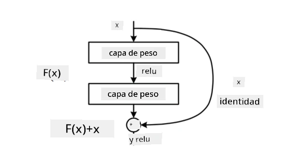
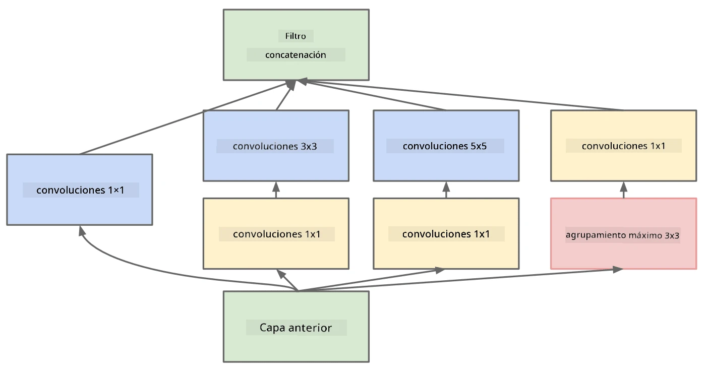

# Arquitecturas CNN Reconocidas

### VGG-16

VGG-16 es una red que alcanzó un 92.7% de precisión en la clasificación top-5 de ImageNet en 2014. Tiene la siguiente estructura de capas:

Como puedes ver, VGG sigue una arquitectura piramidal tradicional, que es una secuencia de capas de convolución y agrupamiento.

> Imagen de [Researchgate](https://www.researchgate.net/figure/Vgg16-model-structure-To-get-the-VGG-NIN-model-we-replace-the-2-nd-4-th-6-th-7-th_fig2_335194493)

### ResNet

ResNet es una familia de modelos propuesta por Microsoft Research en 2015. La idea principal de ResNet es usar **bloques residuales**:

> Imagen de [este artículo](https://arxiv.org/pdf/1512.03385.pdf)

La razón para usar el paso de identidad es que nuestra capa prediga **la diferencia** entre el resultado de una capa anterior y la salida del bloque residual, de ahí el nombre *residual*. Estos bloques son mucho más fáciles de entrenar, y se pueden construir redes con varios cientos de estos bloques (las variantes más comunes son ResNet-52, ResNet-101 y ResNet-152).

También puedes pensar en esta red como capaz de ajustar su complejidad al conjunto de datos. Inicialmente, cuando comienzas a entrenar la red, los valores de los pesos son pequeños y la mayor parte de la señal pasa a través de las capas de identidad. A medida que el entrenamiento avanza y los pesos se vuelven más grandes, la importancia de los parámetros de la red crece, y la red se ajusta para acomodar el poder expresivo necesario para clasificar correctamente las imágenes de entrenamiento.

### Google Inception

La arquitectura Google Inception lleva esta idea un paso más allá y construye cada capa de la red como una combinación de varios caminos diferentes:

> Imagen de [Researchgate](https://www.researchgate.net/figure/Inception-module-with-dimension-reductions-left-and-schema-for-Inception-ResNet-v1_fig2_355547454)

Aquí, debemos destacar el papel de las convoluciones 1x1, porque al principio no tienen mucho sentido. ¿Por qué necesitaríamos recorrer la imagen con un filtro 1x1? Sin embargo, debes recordar que los filtros de convolución también trabajan con varios canales de profundidad (originalmente colores RGB, en capas posteriores canales para diferentes filtros), y la convolución 1x1 se utiliza para mezclar esos canales de entrada usando diferentes pesos entrenables. También puede verse como una reducción de dimensión (agrupamiento) sobre el eje de los canales.

Aquí tienes [un buen artículo](https://medium.com/analytics-vidhya/talented-mr-1x1-comprehensive-look-at-1x1-convolution-in-deep-learning-f6b355825578) sobre el tema, y [el artículo original](https://arxiv.org/pdf/1312.4400.pdf).

### MobileNet

MobileNet es una familia de modelos con tamaño reducido, adecuados para dispositivos móviles. Úsalos si tienes recursos limitados y puedes sacrificar un poco de precisión. La idea principal detrás de ellos es la llamada **convolución separable por profundidad**, que permite representar los filtros de convolución mediante una composición de convoluciones espaciales y convolución 1x1 sobre los canales de profundidad. Esto reduce significativamente el número de parámetros, haciendo que la red sea más pequeña en tamaño y también más fácil de entrenar con menos datos.

Aquí tienes [un buen artículo sobre MobileNet](https://medium.com/analytics-vidhya/image-classification-with-mobilenet-cc6fbb2cd470).

## Conclusión

En esta unidad, has aprendido el concepto principal detrás de las redes neuronales de visión por computadora: las redes convolucionales. Las arquitecturas reales que impulsan la clasificación de imágenes, la detección de objetos e incluso las redes de generación de imágenes están todas basadas en CNNs, solo con más capas y algunos trucos adicionales de entrenamiento.

## 🚀 Desafío

En los cuadernos adjuntos, hay notas al final sobre cómo obtener mayor precisión. Haz algunos experimentos para ver si puedes lograr una mayor precisión.

## [Cuestionario posterior a la clase](https://ff-quizzes.netlify.app/en/ai/quiz/14)

## Revisión y Autoestudio

Aunque las CNNs se utilizan más comúnmente para tareas de visión por computadora, en general son buenas para extraer patrones de tamaño fijo. Por ejemplo, si estamos trabajando con sonidos, también podríamos querer usar CNNs para buscar patrones específicos en señales de audio, en cuyo caso los filtros serían unidimensionales (y esta CNN se llamaría 1D-CNN). Además, a veces se utiliza 3D-CNN para extraer características en un espacio multidimensional, como ciertos eventos que ocurren en un video; la CNN puede capturar ciertos patrones de cambio de características a lo largo del tiempo. Haz una revisión y autoestudio sobre otras tareas que se pueden realizar con CNNs.

## [Tarea](lab/README.md)

En este laboratorio, tu tarea es clasificar diferentes razas de gatos y perros. Estas imágenes son más complejas que el conjunto de datos MNIST, tienen dimensiones más altas y hay más de 10 clases.

---

