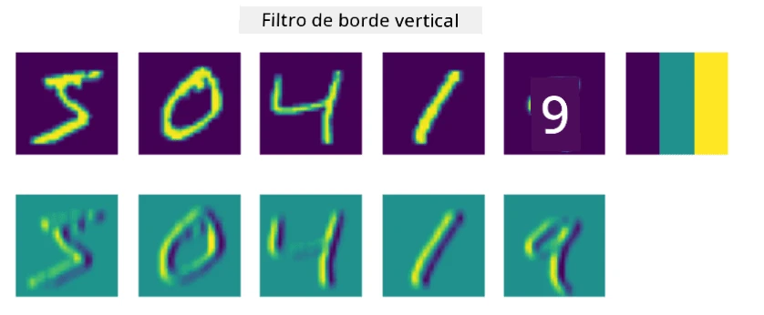
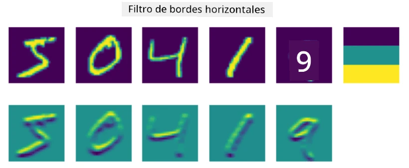
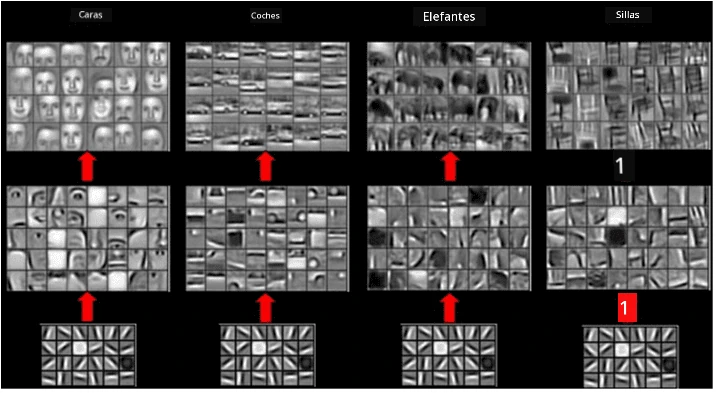
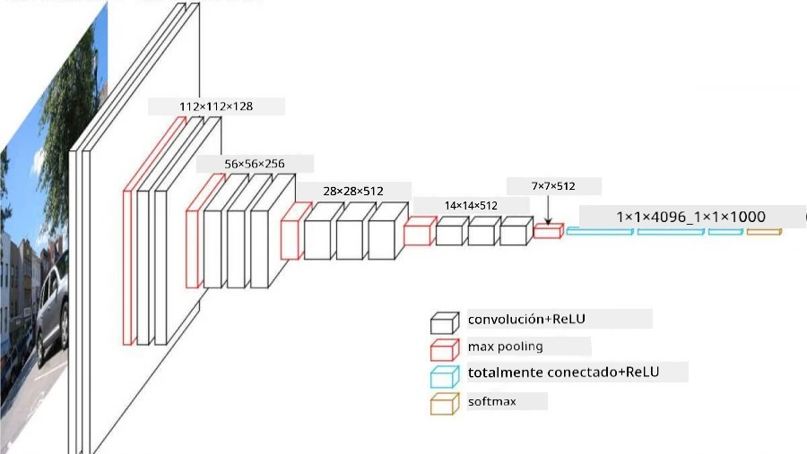

# Redes Neuronales Convolucionales

Hemos visto anteriormente que las redes neuronales son bastante buenas para trabajar con imágenes, e incluso un perceptrón de una sola capa es capaz de reconocer dígitos escritos a mano del conjunto de datos MNIST con una precisión razonable. Sin embargo, el conjunto de datos MNIST es muy especial, ya que todos los dígitos están centrados dentro de la imagen, lo que simplifica la tarea.

## [Cuestionario previo a la clase](https://ff-quizzes.netlify.app/en/ai/quiz/13)

En la vida real, queremos ser capaces de reconocer objetos en una imagen sin importar su ubicación exacta dentro de ella. La visión por computadora es diferente de la clasificación genérica, porque cuando intentamos encontrar un objeto específico en una imagen, estamos escaneándola en busca de ciertos **patrones** y sus combinaciones. Por ejemplo, al buscar un gato, primero podríamos buscar líneas horizontales que formen los bigotes, y luego una combinación específica de bigotes podría indicarnos que se trata de una imagen de un gato. La posición relativa y la presencia de ciertos patrones son importantes, no su ubicación exacta en la imagen.

Para extraer patrones, utilizaremos el concepto de **filtros convolucionales**. Como sabes, una imagen se representa mediante una matriz 2D o un tensor 3D con profundidad de color. Aplicar un filtro significa que tomamos una matriz relativamente pequeña llamada **kernel del filtro**, y para cada píxel de la imagen original calculamos el promedio ponderado con los puntos vecinos. Podemos imaginar esto como una pequeña ventana que se desliza sobre toda la imagen, promediando todos los píxeles según los pesos en la matriz del kernel del filtro.

 | 
----|----

> Imagen por Dmitry Soshnikov

Por ejemplo, si aplicamos filtros de borde vertical y horizontal de 3x3 a los dígitos de MNIST, podemos resaltar (por ejemplo, valores altos) donde hay bordes verticales y horizontales en nuestra imagen original. Por lo tanto, esos dos filtros pueden usarse para "buscar" bordes. De manera similar, podemos diseñar diferentes filtros para buscar otros patrones de bajo nivel:

> Imagen del [Banco de Filtros Leung-Malik](https://www.robots.ox.ac.uk/~vgg/research/texclass/filters.html)

Sin embargo, aunque podemos diseñar manualmente los filtros para extraer algunos patrones, también podemos diseñar la red de manera que aprenda los patrones automáticamente. Esta es una de las ideas principales detrás de las CNN.

## Ideas principales detrás de las CNN

El funcionamiento de las CNN se basa en las siguientes ideas importantes:

* Los filtros convolucionales pueden extraer patrones.
* Podemos diseñar la red de manera que los filtros se entrenen automáticamente.
* Podemos usar el mismo enfoque para encontrar patrones en características de alto nivel, no solo en la imagen original. Así, la extracción de características en las CNN funciona en una jerarquía de características, comenzando con combinaciones de píxeles de bajo nivel, hasta combinaciones de alto nivel de partes de la imagen.

> Imagen de [un artículo de Hislop-Lynch](https://www.semanticscholar.org/paper/Computer-vision-based-pedestrian-trajectory-Hislop-Lynch/26e6f74853fc9bbb7487b06dc2cf095d36c9021d), basado en [su investigación](https://dl.acm.org/doi/abs/10.1145/1553374.1553453)

## ✍️ Ejercicios: Redes Neuronales Convolucionales

Continuemos explorando cómo funcionan las redes neuronales convolucionales y cómo podemos lograr filtros entrenables, trabajando con los siguientes cuadernos:

* [Redes Neuronales Convolucionales - PyTorch](ConvNetsPyTorch.ipynb)
* [Redes Neuronales Convolucionales - TensorFlow](ConvNetsTF.ipynb)

## Arquitectura Piramidal

La mayoría de las CNN utilizadas para el procesamiento de imágenes siguen una arquitectura llamada piramidal. La primera capa convolucional aplicada a las imágenes originales generalmente tiene un número relativamente bajo de filtros (8-16), que corresponden a diferentes combinaciones de píxeles, como líneas horizontales/verticales o trazos. En el siguiente nivel, reducimos la dimensión espacial de la red y aumentamos el número de filtros, lo que corresponde a más combinaciones posibles de características simples. Con cada capa, a medida que nos acercamos al clasificador final, las dimensiones espaciales de la imagen disminuyen y el número de filtros aumenta.

Como ejemplo, veamos la arquitectura de VGG-16, una red que logró un 92.7% de precisión en la clasificación top-5 de ImageNet en 2014:

> Imagen de [Researchgate](https://www.researchgate.net/figure/Vgg16-model-structure-To-get-the-VGG-NIN-model-we-replace-the-2-nd-4-th-6-th-7-th_fig2_335194493)

## Arquitecturas de CNN más conocidas

[Continúa tu estudio sobre las arquitecturas de CNN más conocidas](CNN_Architectures.md)

---

