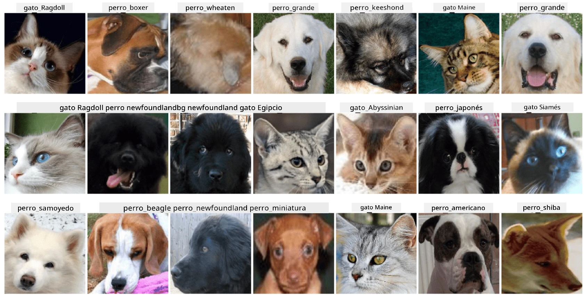

# Clasificación de Caras de Mascotas

Asignación de laboratorio del [Currículo de AI para Principiantes](https://github.com/microsoft/ai-for-beginners).

## Tarea

Imagina que necesitas desarrollar una aplicación para una guardería de mascotas para catalogar a todas las mascotas. Una de las grandes características de dicha aplicación sería descubrir automáticamente la raza a partir de una fotografía. Esto se puede lograr exitosamente utilizando redes neuronales.

Necesitas entrenar una red neuronal convolucional para clasificar diferentes razas de gatos y perros utilizando el conjunto de datos **Pet Faces**.

## El Conjunto de Datos

Usaremos el [Oxford-IIIT Pet Dataset](https://www.robots.ox.ac.uk/~vgg/data/pets/), que contiene imágenes de 37 razas diferentes de perros y gatos.



Para descargar el conjunto de datos, utiliza este fragmento de código:

```python
!wget https://thor.robots.ox.ac.uk/~vgg/data/pets/images.tar.gz
!tar xfz images.tar.gz
!rm images.tar.gz
```

**Nota:** Las imágenes del Oxford-IIIT Pet Dataset están organizadas por nombre de archivo (por ejemplo, `Abyssinian_1.jpg`, `Bengal_2.jpg`). El notebook incluye código para organizar estas imágenes en subdirectorios específicos de razas para facilitar la clasificación.

## Notebook Inicial

Comienza el laboratorio abriendo [PetFaces.ipynb](PetFaces.ipynb)

## Conclusión

¡Has resuelto un problema relativamente complejo de clasificación de imágenes desde cero! Había bastantes clases, y aun así lograste obtener una precisión razonable. También tiene sentido medir la precisión top-k, porque es fácil confundir algunas clases que no son claramente diferentes incluso para los seres humanos.

---

**Descargo de responsabilidad**:  
Este documento ha sido traducido utilizando el servicio de traducción automática [Co-op Translator](https://github.com/Azure/co-op-translator). Aunque nos esforzamos por garantizar la precisión, tenga en cuenta que las traducciones automatizadas pueden contener errores o imprecisiones. El documento original en su idioma nativo debe considerarse como la fuente autorizada. Para información crítica, se recomienda una traducción profesional realizada por humanos. No nos hacemos responsables de malentendidos o interpretaciones erróneas que puedan surgir del uso de esta traducción.