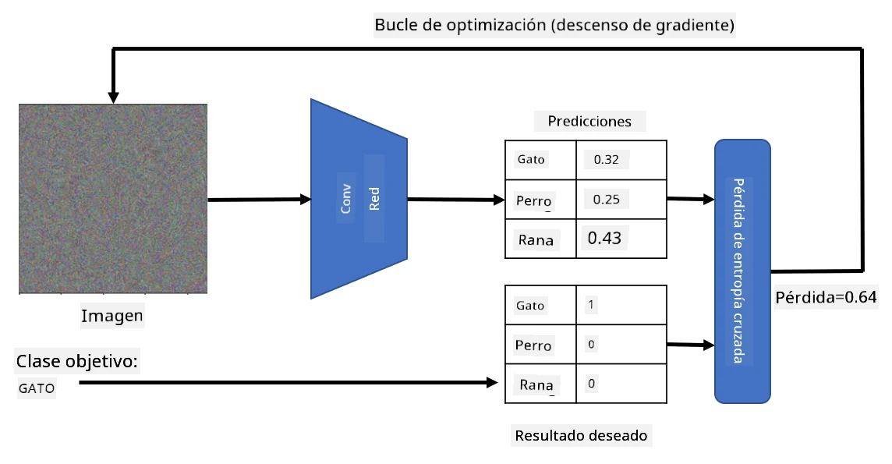

# Redes Pre-entrenadas y Aprendizaje por Transferencia

Entrenar redes neuronales convolucionales (CNNs) puede llevar mucho tiempo y requiere una gran cantidad de datos. Sin embargo, gran parte del tiempo se invierte en aprender los mejores filtros de bajo nivel que una red puede usar para extraer patrones de las imágenes. Surge una pregunta natural: ¿podemos usar una red neuronal entrenada en un conjunto de datos y adaptarla para clasificar imágenes diferentes sin necesidad de un proceso completo de entrenamiento?

## [Cuestionario previo a la clase](https://ff-quizzes.netlify.app/en/ai/quiz/15)

Este enfoque se llama **aprendizaje por transferencia**, porque transferimos conocimiento de un modelo de red neuronal a otro. En el aprendizaje por transferencia, normalmente comenzamos con un modelo pre-entrenado, que ha sido entrenado en un gran conjunto de datos de imágenes, como **ImageNet**. Estos modelos ya son buenos extrayendo diferentes características de imágenes genéricas, y en muchos casos, simplemente construir un clasificador sobre esas características extraídas puede dar buenos resultados.

> ✅ El aprendizaje por transferencia es un término que también se encuentra en otros campos académicos, como la Educación. Se refiere al proceso de tomar conocimiento de un dominio y aplicarlo a otro.

## Modelos Pre-entrenados como Extractores de Características

Las redes convolucionales que hemos mencionado en la sección anterior contienen varias capas, cada una de las cuales está diseñada para extraer características de la imagen, comenzando con combinaciones de píxeles de bajo nivel (como líneas horizontales/verticales o trazos), hasta combinaciones de características de nivel superior, correspondientes a cosas como el ojo de una llama. Si entrenamos una CNN en un conjunto de datos suficientemente grande de imágenes genéricas y diversas, la red debería aprender a extraer esas características comunes.

Tanto Keras como PyTorch contienen funciones para cargar fácilmente pesos de redes neuronales pre-entrenadas para algunas arquitecturas comunes, la mayoría de las cuales fueron entrenadas con imágenes de ImageNet. Las más utilizadas se describen en la página [Arquitecturas de CNN](../07-ConvNets/CNN_Architectures.md) de la lección anterior. En particular, podrías considerar usar una de las siguientes:

* **VGG-16/VGG-19**, que son modelos relativamente simples pero que aún ofrecen buena precisión. Usar VGG como primer intento es una buena opción para ver cómo funciona el aprendizaje por transferencia.
* **ResNet**, una familia de modelos propuesta por Microsoft Research en 2015. Tienen más capas y, por lo tanto, requieren más recursos.
* **MobileNet**, una familia de modelos con tamaño reducido, adecuados para dispositivos móviles. Úsalos si tienes recursos limitados y puedes sacrificar un poco de precisión.

Aquí hay características extraídas de una imagen de un gato por la red VGG-16:

## Conjunto de Datos de Gatos vs. Perros

En este ejemplo, utilizaremos un conjunto de datos de [Gatos y Perros](https://www.microsoft.com/download/details.aspx?id=54765&WT.mc_id=academic-77998-cacaste), que está muy cerca de un escenario real de clasificación de imágenes.

## ✍️ Ejercicio: Aprendizaje por Transferencia

Veamos el aprendizaje por transferencia en acción en los notebooks correspondientes:

* [Transfer Learning - PyTorch](TransferLearningPyTorch.ipynb)
* [Transfer Learning - TensorFlow](TransferLearningTF.ipynb)

## Visualizando un Gato Adversarial

Una red neuronal pre-entrenada contiene diferentes patrones en su *cerebro*, incluyendo nociones de **gato ideal** (así como perro ideal, cebra ideal, etc.). Sería interesante de alguna manera **visualizar esta imagen**. Sin embargo, no es sencillo, porque los patrones están distribuidos por todos los pesos de la red y organizados en una estructura jerárquica.

Un enfoque que podemos tomar es comenzar con una imagen aleatoria y luego usar la técnica de **optimización por descenso de gradiente** para ajustar esa imagen de tal manera que la red comience a pensar que es un gato.

Sin embargo, si hacemos esto, obtendremos algo muy similar a un ruido aleatorio. Esto se debe a que *hay muchas formas de hacer que la red piense que la imagen de entrada es un gato*, incluyendo algunas que no tienen sentido visualmente. Aunque esas imágenes contienen muchos patrones típicos de un gato, no hay nada que las restrinja a ser visualmente distintivas.

Para mejorar el resultado, podemos agregar otro término a la función de pérdida, llamado **pérdida de variación**. Es una métrica que muestra cuán similares son los píxeles vecinos de la imagen. Minimizar la pérdida de variación hace que la imagen sea más suave y elimina el ruido, revelando patrones más atractivos visualmente. Aquí hay un ejemplo de imágenes "ideales" que son clasificadas como gato y como cebra con alta probabilidad:

 | 
-----|-----
 *Gato Ideal* | *Cebra Ideal*

Un enfoque similar puede usarse para realizar los llamados **ataques adversariales** en una red neuronal. Supongamos que queremos engañar a una red neuronal y hacer que un perro parezca un gato. Si tomamos la imagen de un perro, que es reconocida por la red como un perro, podemos ajustarla un poco usando optimización por descenso de gradiente hasta que la red comience a clasificarla como un gato:

 | 
-----|-----
*Imagen original de un perro* | *Imagen de un perro clasificada como un gato*

Consulta el código para reproducir los resultados anteriores en el siguiente notebook:

* [Ideal y Gato Adversarial - TensorFlow](AdversarialCat_TF.ipynb)

## Conclusión

Usando el aprendizaje por transferencia, puedes armar rápidamente un clasificador para una tarea de clasificación de objetos personalizada y lograr alta precisión. Puedes ver que las tareas más complejas que estamos resolviendo ahora requieren mayor poder computacional y no pueden resolverse fácilmente en la CPU. En la próxima unidad, intentaremos usar una implementación más ligera para entrenar el mismo modelo utilizando menos recursos computacionales, lo que resulta en una precisión ligeramente menor.

## 🚀 Desafío

En los notebooks acompañantes, hay notas al final sobre cómo el conocimiento transferido funciona mejor con datos de entrenamiento algo similares (quizás un nuevo tipo de animal). Haz experimentos con tipos de imágenes completamente nuevos para ver qué tan bien o mal funcionan tus modelos de conocimiento transferido.

## [Cuestionario posterior a la clase](https://ff-quizzes.netlify.app/en/ai/quiz/16)

## Revisión y Autoestudio

Lee [TrainingTricks.md](TrainingTricks.md) para profundizar tu conocimiento sobre otras formas de entrenar tus modelos.

## [Asignación](lab/README.md)

En este laboratorio, utilizaremos el conjunto de datos real [Oxford-IIIT](https://www.robots.ox.ac.uk/~vgg/data/pets/) de mascotas con 35 razas de gatos y perros, y construiremos un clasificador de aprendizaje por transferencia.

---

