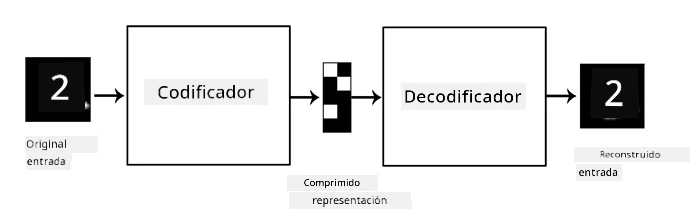
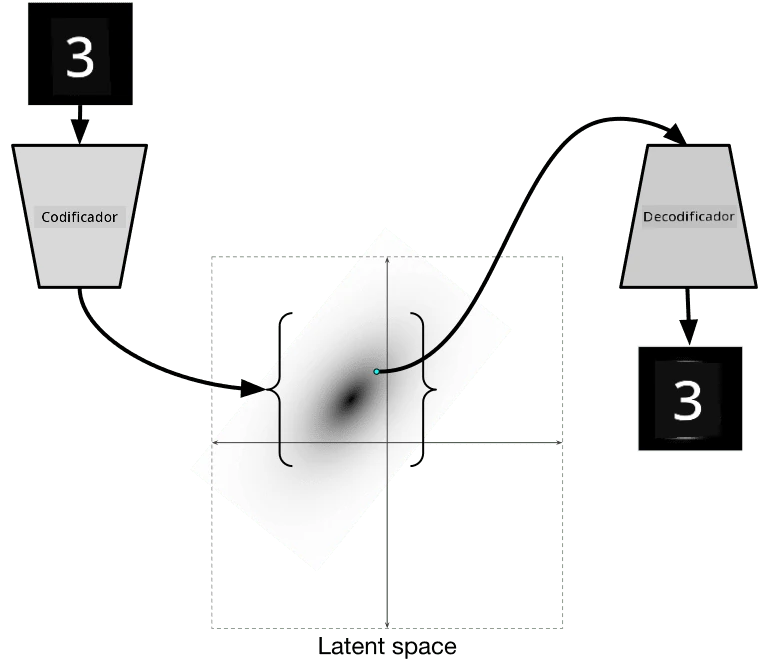

# Autoencoders

Al entrenar CNNs, uno de los problemas es que necesitamos una gran cantidad de datos etiquetados. En el caso de la clasificación de imágenes, debemos separar las imágenes en diferentes clases, lo cual requiere un esfuerzo manual.

## [Pre-lecture quiz](https://ff-quizzes.netlify.app/en/ai/quiz/17)

Sin embargo, podríamos querer usar datos sin procesar (no etiquetados) para entrenar extractores de características de CNN, lo que se llama **aprendizaje auto-supervisado**. En lugar de etiquetas, utilizaremos las imágenes de entrenamiento como entrada y salida de la red. La idea principal de un **autoencoder** es que tendremos una **red codificadora** que convierte la imagen de entrada en algún **espacio latente** (normalmente es solo un vector de menor tamaño), y luego una **red decodificadora**, cuyo objetivo será reconstruir la imagen original.

> ✅ Un [autoencoder](https://wikipedia.org/wiki/Autoencoder) es "un tipo de red neuronal artificial utilizada para aprender codificaciones eficientes de datos no etiquetados."

Dado que estamos entrenando un autoencoder para capturar la mayor cantidad de información posible de la imagen original para una reconstrucción precisa, la red intenta encontrar la mejor **representación** de las imágenes de entrada para capturar su significado.

> Imagen de [Keras blog](https://blog.keras.io/building-autoencoders-in-keras.html)

## Escenarios para usar Autoencoders

Aunque reconstruir imágenes originales no parece útil por sí mismo, hay algunos escenarios donde los autoencoders son especialmente útiles:

* **Reducir la dimensión de las imágenes para visualización** o **entrenar representaciones de imágenes**. Generalmente, los autoencoders ofrecen mejores resultados que PCA, porque tienen en cuenta la naturaleza espacial de las imágenes y las características jerárquicas.
* **Eliminación de ruido**, es decir, eliminar el ruido de la imagen. Como el ruido contiene mucha información inútil, el autoencoder no puede ajustarlo todo en un espacio latente relativamente pequeño, y por lo tanto captura solo la parte importante de la imagen. Al entrenar eliminadores de ruido, comenzamos con imágenes originales y usamos imágenes con ruido artificial añadido como entrada para el autoencoder.
* **Super-resolución**, aumentar la resolución de las imágenes. Comenzamos con imágenes de alta resolución y usamos la imagen de menor resolución como entrada del autoencoder.
* **Modelos generativos**. Una vez que entrenamos el autoencoder, la parte decodificadora puede usarse para crear nuevos objetos a partir de vectores latentes aleatorios.

## Autoencoders Variacionales (VAE)

Los autoencoders tradicionales reducen la dimensión de los datos de entrada de alguna manera, identificando las características importantes de las imágenes de entrada. Sin embargo, los vectores latentes a menudo no tienen mucho sentido. En otras palabras, tomando como ejemplo el conjunto de datos MNIST, identificar qué dígitos corresponden a diferentes vectores latentes no es una tarea fácil, porque los vectores latentes cercanos no necesariamente corresponden a los mismos dígitos.

Por otro lado, para entrenar modelos *generativos* es mejor tener cierta comprensión del espacio latente. Esta idea nos lleva al **autoencoder variacional** (VAE).

El VAE es un autoencoder que aprende a predecir la *distribución estadística* de los parámetros latentes, llamada **distribución latente**. Por ejemplo, podríamos querer que los vectores latentes se distribuyan normalmente con una media zmean y una desviación estándar zsigma (tanto la media como la desviación estándar son vectores de alguna dimensionalidad d). El codificador en el VAE aprende a predecir esos parámetros, y luego el decodificador toma un vector aleatorio de esta distribución para reconstruir el objeto.

En resumen:

 * A partir del vector de entrada, predecimos `z_mean` y `z_log_sigma` (en lugar de predecir la desviación estándar directamente, predecimos su logaritmo).
 * Muestreamos un vector `sample` de la distribución N(zmean,exp(zlog\_sigma)).
 * El decodificador intenta decodificar la imagen original usando `sample` como vector de entrada.

 

> Imagen de [este blog](https://ijdykeman.github.io/ml/2016/12/21/cvae.html) por Isaak Dykeman

Los autoencoders variacionales utilizan una función de pérdida compleja que consta de dos partes:

* **Pérdida de reconstrucción**, que es la función de pérdida que muestra qué tan cerca está una imagen reconstruida del objetivo (puede ser el Error Cuadrático Medio, o MSE). Es la misma función de pérdida que en los autoencoders normales.
* **Pérdida KL**, que asegura que las distribuciones de las variables latentes se mantengan cercanas a una distribución normal. Se basa en la noción de [divergencia de Kullback-Leibler](https://www.countbayesie.com/blog/2017/5/9/kullback-leibler-divergence-explained), una métrica para estimar qué tan similares son dos distribuciones estadísticas.

Una ventaja importante de los VAEs es que nos permiten generar nuevas imágenes de manera relativamente sencilla, porque sabemos de qué distribución muestrear los vectores latentes. Por ejemplo, si entrenamos un VAE con un vector latente 2D en MNIST, luego podemos variar los componentes del vector latente para obtener diferentes dígitos:

> Imagen por [Dmitry Soshnikov](http://soshnikov.com)

Observa cómo las imágenes se mezclan entre sí, a medida que comenzamos a obtener vectores latentes de diferentes partes del espacio de parámetros latentes. También podemos visualizar este espacio en 2D:

 

> Imagen por [Dmitry Soshnikov](http://soshnikov.com)

## ✍️ Ejercicios: Autoencoders

Aprende más sobre autoencoders en estos notebooks correspondientes:

* [Autoencoders en TensorFlow](AutoencodersTF.ipynb)
* [Autoencoders en PyTorch](AutoEncodersPyTorch.ipynb)

## Propiedades de los Autoencoders

* **Específicos de los datos** - solo funcionan bien con el tipo de imágenes con las que han sido entrenados. Por ejemplo, si entrenamos una red de super-resolución en flores, no funcionará bien en retratos. Esto se debe a que la red puede producir imágenes de mayor resolución tomando detalles finos de las características aprendidas del conjunto de datos de entrenamiento.
* **Con pérdida** - la imagen reconstruida no es igual a la imagen original. La naturaleza de la pérdida está definida por la *función de pérdida* utilizada durante el entrenamiento.
* Funciona con **datos no etiquetados**.

## [Post-lecture quiz](https://ff-quizzes.netlify.app/en/ai/quiz/18)

## Conclusión

En esta lección, aprendiste sobre los diferentes tipos de autoencoders disponibles para el científico de IA. Aprendiste cómo construirlos y cómo usarlos para reconstruir imágenes. También aprendiste sobre el VAE y cómo usarlo para generar nuevas imágenes.

## 🚀 Desafío

En esta lección, aprendiste sobre el uso de autoencoders para imágenes. ¡Pero también pueden usarse para música! Explora el proyecto [MusicVAE](https://magenta.tensorflow.org/music-vae) de Magenta, que utiliza autoencoders para aprender a reconstruir música. Realiza algunos [experimentos](https://colab.research.google.com/github/magenta/magenta-demos/blob/master/colab-notebooks/Multitrack_MusicVAE.ipynb) con esta biblioteca para ver qué puedes crear.

## [Post-lecture quiz](https://ff-quizzes.netlify.app/en/ai/quiz/16)

## Revisión y Autoestudio

Para referencia, lee más sobre autoencoders en estos recursos:

* [Construyendo Autoencoders en Keras](https://blog.keras.io/building-autoencoders-in-keras.html)
* [Publicación en el blog de NeuroHive](https://neurohive.io/ru/osnovy-data-science/variacionnyj-avtojenkoder-vae/)
* [Autoencoders Variacionales Explicados](https://kvfrans.com/variational-autoencoders-explained/)
* [Autoencoders Variacionales Condicionales](https://ijdykeman.github.io/ml/2016/12/21/cvae.html)

## Tarea

Al final de [este notebook usando TensorFlow](AutoencodersTF.ipynb), encontrarás una 'tarea': úsala como tu asignación.

---

