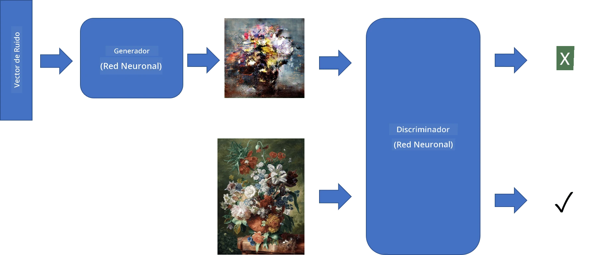
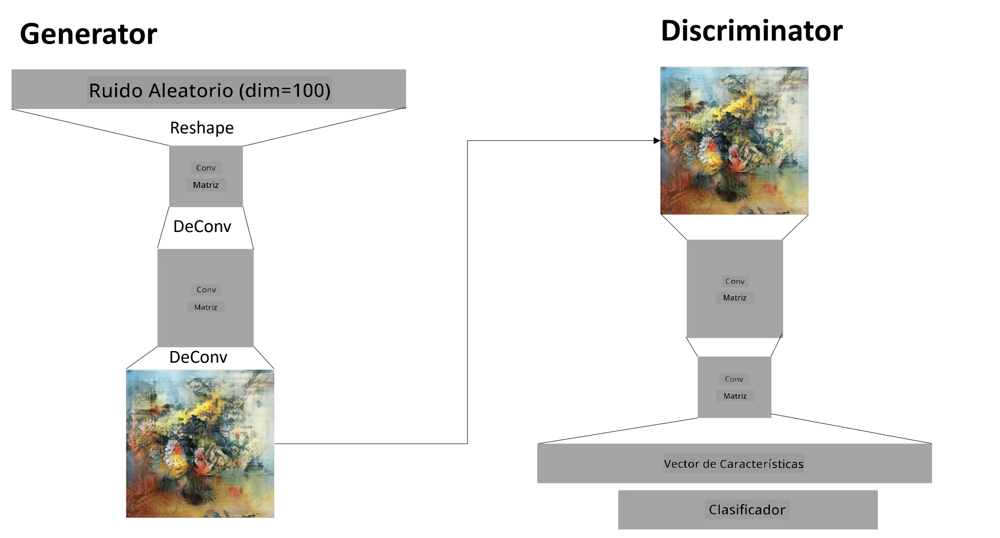

# Redes Generativas Antagónicas

En la sección anterior, aprendimos sobre los **modelos generativos**: modelos que pueden generar nuevas imágenes similares a las del conjunto de datos de entrenamiento. VAE fue un buen ejemplo de un modelo generativo.

## [Cuestionario previo a la lección](https://ff-quizzes.netlify.app/en/ai/quiz/19)

Sin embargo, si intentamos generar algo realmente significativo, como una pintura con una resolución razonable, usando VAE, veremos que el entrenamiento no converge bien. Para este caso de uso, debemos aprender sobre otra arquitectura específicamente diseñada para modelos generativos: las **Redes Generativas Antagónicas**, o GANs.

La idea principal de una GAN es tener dos redes neuronales que se entrenan una contra la otra:

> Imagen por [Dmitry Soshnikov](http://soshnikov.com)

> ✅ Un poco de vocabulario:
> * **Generador**: es una red que toma un vector aleatorio y produce una imagen como resultado.
> * **Discriminador**: es una red que toma una imagen y debe determinar si es una imagen real (del conjunto de datos de entrenamiento) o si fue generada por el generador. Es esencialmente un clasificador de imágenes.

### Discriminador

La arquitectura del discriminador no difiere de una red de clasificación de imágenes ordinaria. En el caso más simple, puede ser un clasificador completamente conectado, pero lo más probable es que sea una [red convolucional](../07-ConvNets/README.md).

> ✅ Una GAN basada en redes convolucionales se llama [DCGAN](https://arxiv.org/pdf/1511.06434.pdf)

Un discriminador CNN consta de las siguientes capas: varias convoluciones+poolings (con tamaño espacial decreciente) y una o más capas completamente conectadas para obtener un "vector de características", y finalmente un clasificador binario.

> ✅ Un 'pooling' en este contexto es una técnica que reduce el tamaño de la imagen. "Las capas de pooling reducen las dimensiones de los datos combinando las salidas de los clústeres de neuronas en una capa en una sola neurona en la siguiente capa." - [fuente](https://wikipedia.org/wiki/Convolutional_neural_network#Pooling_layers)

### Generador

Un Generador es un poco más complicado. Puedes considerarlo como un discriminador invertido. Partiendo de un vector latente (en lugar de un vector de características), tiene una capa completamente conectada para convertirlo en el tamaño/forma requerida, seguida de deconvoluciones+escalado. Esto es similar a la parte de *decodificador* de un [autoencoder](../09-Autoencoders/README.md).

> ✅ Debido a que la capa de convolución se implementa como un filtro lineal que recorre la imagen, la deconvolución es esencialmente similar a la convolución y puede implementarse utilizando la misma lógica de capa.

> Imagen por [Dmitry Soshnikov](http://soshnikov.com)

### Entrenamiento de la GAN

Las GANs se llaman **antagónicas** porque hay una competencia constante entre el generador y el discriminador. Durante esta competencia, tanto el generador como el discriminador mejoran, y la red aprende a producir imágenes cada vez mejores.

El entrenamiento ocurre en dos etapas:

* **Entrenamiento del discriminador**. Esta tarea es bastante sencilla: generamos un lote de imágenes con el generador, etiquetándolas como 0, lo que significa imagen falsa, y tomamos un lote de imágenes del conjunto de datos de entrada (con etiqueta 1, imagen real). Obtenemos una *pérdida del discriminador* y realizamos backprop.
* **Entrenamiento del generador**. Esto es un poco más complicado porque no conocemos directamente la salida esperada para el generador. Tomamos toda la red GAN que consiste en un generador seguido por un discriminador, la alimentamos con algunos vectores aleatorios y esperamos que el resultado sea 1 (correspondiente a imágenes reales). Luego congelamos los parámetros del discriminador (no queremos que se entrene en este paso) y realizamos el backprop.

Durante este proceso, las pérdidas tanto del generador como del discriminador no disminuyen significativamente. En la situación ideal, deberían oscilar, lo que corresponde a que ambas redes mejoran su rendimiento.

## ✍️ Ejercicios: GANs

* [Notebook de GAN en TensorFlow/Keras](GANTF.ipynb)
* [Notebook de GAN en PyTorch](GANPyTorch.ipynb)

### Problemas con el entrenamiento de GANs

Las GANs son conocidas por ser especialmente difíciles de entrenar. Aquí hay algunos problemas:

* **Colapso de modo**. Este término se refiere a que el generador aprende a producir una imagen exitosa que engaña al discriminador, pero no una variedad de imágenes diferentes.
* **Sensibilidad a los hiperparámetros**. A menudo puedes ver que una GAN no converge en absoluto, y luego, de repente, una disminución en la tasa de aprendizaje lleva a la convergencia.
* Mantener un **equilibrio** entre el generador y el discriminador. En muchos casos, la pérdida del discriminador puede caer a cero relativamente rápido, lo que resulta en que el generador no pueda entrenarse más. Para superar esto, podemos intentar establecer diferentes tasas de aprendizaje para el generador y el discriminador, o saltar el entrenamiento del discriminador si la pérdida ya es demasiado baja.
* Entrenamiento para **alta resolución**. Reflejando el mismo problema que con los autoencoders, este problema se desencadena porque reconstruir demasiadas capas de una red convolucional lleva a artefactos. Este problema se resuelve típicamente con el llamado **crecimiento progresivo**, donde primero se entrenan unas pocas capas en imágenes de baja resolución y luego se "desbloquean" o se añaden capas. Otra solución sería agregar conexiones adicionales entre capas y entrenar varias resoluciones a la vez; consulta este artículo sobre [Multi-Scale Gradient GANs](https://arxiv.org/abs/1903.06048) para más detalles.

## Transferencia de Estilo

Las GANs son una excelente manera de generar imágenes artísticas. Otra técnica interesante es la llamada **transferencia de estilo**, que toma una **imagen de contenido** y la redibuja en un estilo diferente, aplicando filtros de una **imagen de estilo**.

El funcionamiento es el siguiente:
* Comenzamos con una imagen de ruido aleatorio (o con una imagen de contenido, pero para entenderlo es más fácil comenzar con ruido aleatorio).
* Nuestro objetivo será crear una imagen que sea cercana tanto a la imagen de contenido como a la imagen de estilo. Esto se determinará mediante dos funciones de pérdida:
   - **Pérdida de contenido**: se calcula en función de las características extraídas por la CNN en algunas capas de la imagen actual y la imagen de contenido.
   - **Pérdida de estilo**: se calcula entre la imagen actual y la imagen de estilo de una manera ingeniosa utilizando matrices de Gram (más detalles en el [notebook de ejemplo](StyleTransfer.ipynb)).
* Para hacer la imagen más suave y eliminar el ruido, también introducimos la **pérdida de variación**, que calcula la distancia promedio entre píxeles vecinos.
* El bucle principal de optimización ajusta la imagen actual utilizando descenso de gradiente (u otro algoritmo de optimización) para minimizar la pérdida total, que es una suma ponderada de las tres pérdidas.

## ✍️ Ejemplo: [Transferencia de Estilo](StyleTransfer.ipynb)

## [Cuestionario posterior a la lección](https://ff-quizzes.netlify.app/en/ai/quiz/20)

## Conclusión

En esta lección, aprendiste sobre las GANs y cómo entrenarlas. También aprendiste sobre los desafíos especiales que este tipo de red neuronal puede enfrentar y algunas estrategias para superarlos.

## 🚀 Desafío

Ejecuta el [notebook de Transferencia de Estilo](StyleTransfer.ipynb) usando tus propias imágenes.

## Revisión y Estudio Personal

Para referencia, lee más sobre GANs en estos recursos:

* Marco Pasini, [10 Lecciones que Aprendí Entrenando GANs durante un Año](https://towardsdatascience.com/10-lessons-i-learned-training-generative-adversarial-networks-gans-for-a-year-c9071159628)
* [StyleGAN](https://en.wikipedia.org/wiki/StyleGAN), una arquitectura GAN *de facto* a considerar.
* [Creando Arte Generativo usando GANs en Azure ML](https://soshnikov.com/scienceart/creating-generative-art-using-gan-on-azureml/)

## Tarea

Revisa uno de los dos notebooks asociados a esta lección y vuelve a entrenar la GAN con tus propias imágenes. ¿Qué puedes crear?

---

