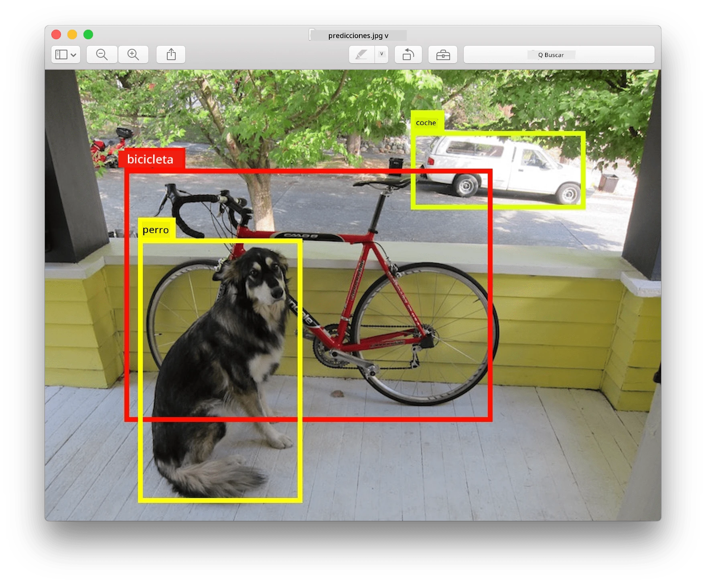
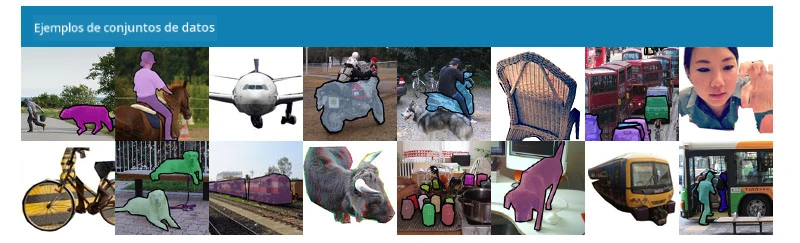
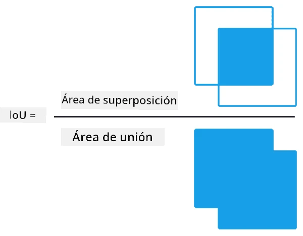
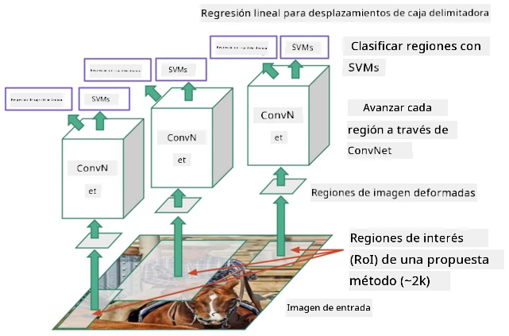
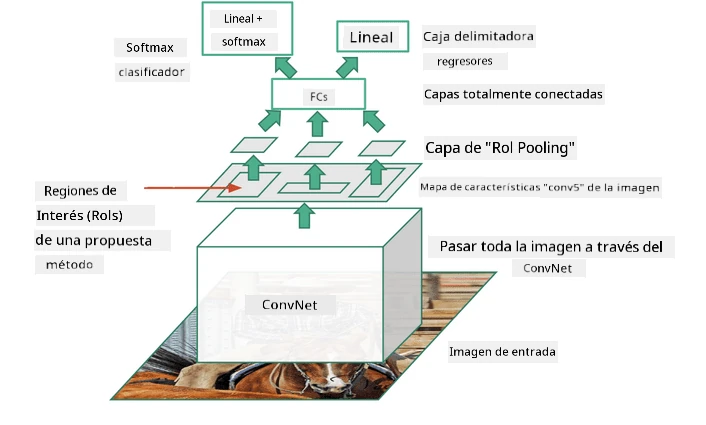
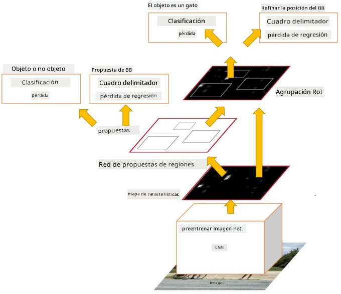
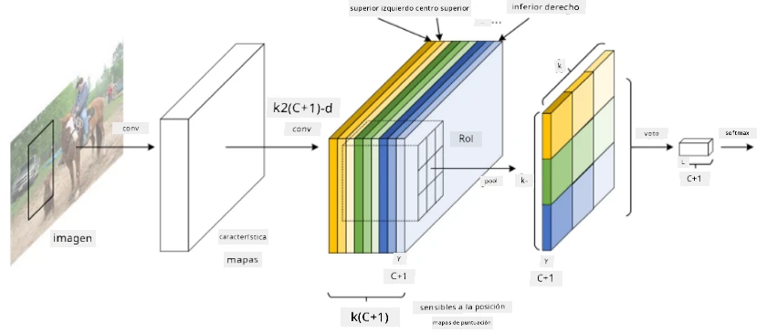
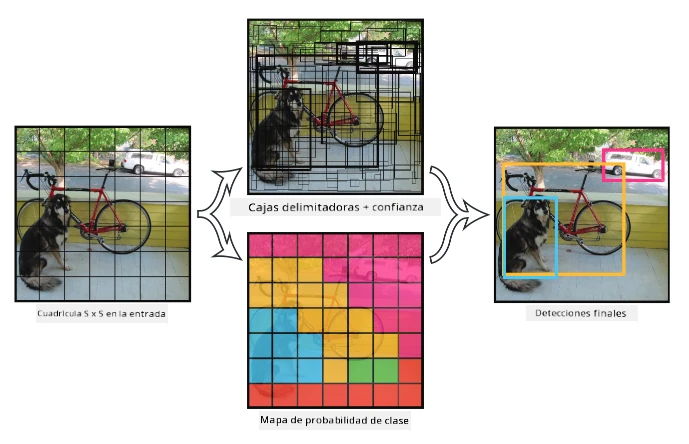

# Detección de Objetos

Los modelos de clasificación de imágenes que hemos tratado hasta ahora toman una imagen y producen un resultado categórico, como la clase 'número' en un problema de MNIST. Sin embargo, en muchos casos no solo queremos saber que una imagen contiene objetos, sino que queremos determinar su ubicación precisa. Este es precisamente el objetivo de la **detección de objetos**.

## [Cuestionario previo a la lección](https://ff-quizzes.netlify.app/en/ai/quiz/21)

> Imagen de [sitio web de YOLO v2](https://pjreddie.com/darknet/yolov2/)

## Un Enfoque Ingenuo para la Detección de Objetos

Supongamos que queremos encontrar un gato en una imagen. Un enfoque muy ingenuo para la detección de objetos sería el siguiente:

1. Dividir la imagen en varias secciones.
2. Ejecutar clasificación de imágenes en cada sección.
3. Las secciones que resulten en una activación suficientemente alta pueden considerarse que contienen el objeto en cuestión.

> *Imagen del [Cuaderno de Ejercicios](ObjectDetection-TF.ipynb)*

Sin embargo, este enfoque está lejos de ser ideal, ya que solo permite al algoritmo localizar el cuadro delimitador del objeto de manera muy imprecisa. Para una ubicación más precisa, necesitamos ejecutar algún tipo de **regresión** para predecir las coordenadas de los cuadros delimitadores, y para ello necesitamos conjuntos de datos específicos.

## Regresión para la Detección de Objetos

[Este artículo](https://towardsdatascience.com/object-detection-with-neural-networks-a4e2c46b4491) ofrece una excelente introducción a la detección de formas.

## Conjuntos de Datos para la Detección de Objetos

Es posible que encuentres los siguientes conjuntos de datos para esta tarea:

* [PASCAL VOC](http://host.robots.ox.ac.uk/pascal/VOC/) - 20 clases
* [COCO](http://cocodataset.org/#home) - Objetos Comunes en Contexto. 80 clases, cuadros delimitadores y máscaras de segmentación.

## Métricas de Detección de Objetos

### Intersección sobre Unión

Mientras que para la clasificación de imágenes es fácil medir qué tan bien funciona el algoritmo, para la detección de objetos necesitamos medir tanto la corrección de la clase como la precisión de la ubicación inferida del cuadro delimitador. Para esto último, usamos la llamada **Intersección sobre Unión** (IoU), que mide qué tan bien se superponen dos cuadros (o dos áreas arbitrarias).

> *Figura 2 de [este excelente artículo sobre IoU](https://pyimagesearch.com/2016/11/07/intersection-over-union-iou-for-object-detection/)*

La idea es simple: dividimos el área de intersección entre dos figuras por el área de su unión. Para dos áreas idénticas, IoU sería 1, mientras que para áreas completamente separadas será 0. En otros casos, variará de 0 a 1. Normalmente solo consideramos aquellos cuadros delimitadores para los cuales IoU está por encima de un cierto valor.

### Precisión Promedio

Supongamos que queremos medir qué tan bien se reconoce una clase de objetos $C$. Para medirlo, usamos la métrica de **Precisión Promedio**, que se calcula de la siguiente manera:

1. Considerar la curva de Precisión-Recall que muestra la precisión dependiendo de un valor de umbral de detección (de 0 a 1).
2. Dependiendo del umbral, obtendremos más o menos objetos detectados en la imagen y diferentes valores de precisión y recall.
3. La curva se verá así:

> *Imagen de [NeuroWorkshop](http://github.com/shwars/NeuroWorkshop)*

La Precisión Promedio para una clase dada $C$ es el área bajo esta curva. Más precisamente, el eje de Recall se divide típicamente en 10 partes, y la Precisión se promedia en todos esos puntos:

$$
AP = {1\over11}\sum_{i=0}^{10}\mbox{Precision}(\mbox{Recall}={i\over10})
$$

### AP e IoU

Solo consideraremos aquellas detecciones para las cuales IoU está por encima de un cierto valor. Por ejemplo, en el conjunto de datos PASCAL VOC típicamente $\mbox{IoU Threshold} = 0.5$, mientras que en COCO AP se mide para diferentes valores de $\mbox{IoU Threshold}$.

> *Imagen de [NeuroWorkshop](http://github.com/shwars/NeuroWorkshop)*

### Precisión Promedio Media - mAP

La métrica principal para la detección de objetos se llama **Precisión Promedio Media**, o **mAP**. Es el valor de la Precisión Promedio, promediado entre todas las clases de objetos, y a veces también sobre $\mbox{IoU Threshold}$. En más detalle, el proceso de cálculo de **mAP** se describe
[en este artículo](https://medium.com/@timothycarlen/understanding-the-map-evaluation-metric-for-object-detection-a07fe6962cf3), y también [aquí con ejemplos de código](https://gist.github.com/tarlen5/008809c3decf19313de216b9208f3734).

## Diferentes Enfoques para la Detección de Objetos

Existen dos grandes clases de algoritmos de detección de objetos:

* **Redes de Propuesta de Regiones** (R-CNN, Fast R-CNN, Faster R-CNN). La idea principal es generar **Regiones de Interés** (ROI) y ejecutar CNN sobre ellas, buscando la activación máxima. Es un poco similar al enfoque ingenuo, con la excepción de que las ROI se generan de manera más inteligente. Una de las principales desventajas de estos métodos es que son lentos, porque necesitamos muchas pasadas del clasificador CNN sobre la imagen.
* Métodos de **una sola pasada** (YOLO, SSD, RetinaNet). En estas arquitecturas diseñamos la red para predecir tanto las clases como las ROI en una sola pasada.

### R-CNN: CNN Basada en Regiones

[R-CNN](http://islab.ulsan.ac.kr/files/announcement/513/rcnn_pami.pdf) utiliza [Selective Search](http://www.huppelen.nl/publications/selectiveSearchDraft.pdf) para generar una estructura jerárquica de regiones ROI, que luego se pasan por extractores de características CNN y clasificadores SVM para determinar la clase del objeto, y regresión lineal para determinar las coordenadas del *cuadro delimitador*. [Artículo Oficial](https://arxiv.org/pdf/1506.01497v1.pdf)

> *Imagen de van de Sande et al. ICCV’11*

> *Imágenes de [este artículo](https://towardsdatascience.com/r-cnn-fast-r-cnn-faster-r-cnn-yolo-object-detection-algorithms-36d53571365e)*

### F-RCNN - Fast R-CNN

Este enfoque es similar a R-CNN, pero las regiones se definen después de que se han aplicado las capas de convolución.

> Imagen del [Artículo Oficial](https://www.cv-foundation.org/openaccess/content_iccv_2015/papers/Girshick_Fast_R-CNN_ICCV_2015_paper.pdf), [arXiv](https://arxiv.org/pdf/1504.08083.pdf), 2015

### Faster R-CNN

La idea principal de este enfoque es usar una red neuronal para predecir las ROI, llamada *Red de Propuesta de Regiones*. [Artículo](https://arxiv.org/pdf/1506.01497.pdf), 2016

> Imagen del [Artículo Oficial](https://arxiv.org/pdf/1506.01497.pdf)

### R-FCN: Red Totalmente Convolucional Basada en Regiones

Este algoritmo es incluso más rápido que Faster R-CNN. La idea principal es la siguiente:

1. Extraemos características usando ResNet-101.
1. Las características se procesan mediante **Position-Sensitive Score Map**. Cada objeto de $C$ clases se divide en regiones de $k\times k$, y entrenamos para predecir partes de objetos.
1. Para cada parte de las regiones de $k\times k$, todas las redes votan por las clases de objetos, y se selecciona la clase de objeto con el voto máximo.

> Imagen del [Artículo Oficial](https://arxiv.org/abs/1605.06409)

### YOLO - You Only Look Once

YOLO es un algoritmo de una sola pasada en tiempo real. La idea principal es la siguiente:

 * La imagen se divide en regiones de $S\times S$.
 * Para cada región, **CNN** predice $n$ posibles objetos, las coordenadas del *cuadro delimitador* y la *confianza*=*probabilidad* * IoU.

 

> Imagen del [Artículo Oficial](https://arxiv.org/abs/1506.02640)

### Otros Algoritmos

* RetinaNet: [Artículo Oficial](https://arxiv.org/abs/1708.02002)
   - [Implementación en PyTorch en Torchvision](https://pytorch.org/vision/stable/_modules/torchvision/models/detection/retinanet.html)
   - [Implementación en Keras](https://github.com/fizyr/keras-retinanet)
   - [Detección de Objetos con RetinaNet](https://keras.io/examples/vision/retinanet/) en ejemplos de Keras.
* SSD (Single Shot Detector): [Artículo Oficial](https://arxiv.org/abs/1512.02325)

## ✍️ Ejercicios: Detección de Objetos

Continúa tu aprendizaje en el siguiente cuaderno:

[ObjectDetection.ipynb](ObjectDetection.ipynb)

## Conclusión

En esta lección hiciste un recorrido rápido por las diversas formas en que se puede lograr la detección de objetos.

## 🚀 Desafío

Lee estos artículos y cuadernos sobre YOLO y pruébalos por ti mismo:

* [Buen artículo](https://www.analyticsvidhya.com/blog/2018/12/practical-guide-object-detection-yolo-framewor-python/) que describe YOLO.
 * [Sitio oficial](https://pjreddie.com/darknet/yolo/)
 * YOLO: [Implementación en Keras](https://github.com/experiencor/keras-yolo2), [cuaderno paso a paso](https://github.com/experiencor/basic-yolo-keras/blob/master/Yolo%20Step-by-Step.ipynb)
 * YOLO v2: [Implementación en Keras](https://github.com/experiencor/keras-yolo2), [cuaderno paso a paso](https://github.com/experiencor/keras-yolo2/blob/master/Yolo%20Step-by-Step.ipynb)

## [Cuestionario posterior a la lección](https://ff-quizzes.netlify.app/en/ai/quiz/22)

## Revisión y Autoestudio

* [Detección de Objetos](https://tjmachinelearning.com/lectures/1718/obj/) por Nikhil Sardana.
* [Una buena comparación de algoritmos de detección de objetos](https://lilianweng.github.io/lil-log/2018/12/27/object-detection-part-4.html).
* [Revisión de algoritmos de aprendizaje profundo para la detección de objetos](https://medium.com/comet-app/review-of-deep-learning-algorithms-for-object-detection-c1f3d437b852).
* [Introducción paso a paso a los algoritmos básicos de detección de objetos](https://www.analyticsvidhya.com/blog/2018/10/a-step-by-step-introduction-to-the-basic-object-detection-algorithms-part-1/).
* [Implementación de Faster R-CNN en Python para la detección de objetos](https://www.analyticsvidhya.com/blog/2018/11/implementation-faster-r-cnn-python-object-detection/).

## [Asignación: Detección de Objetos](lab/README.md)

---

