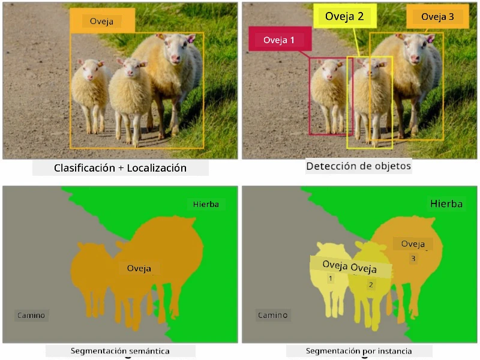
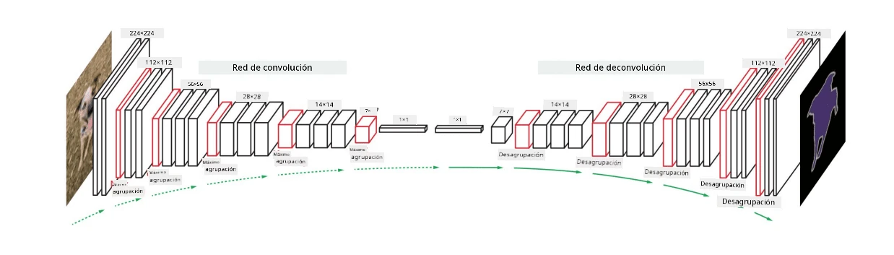

# Segmentación

Anteriormente hemos aprendido sobre la Detección de Objetos, que nos permite localizar objetos en una imagen prediciendo sus *cajas delimitadoras*. Sin embargo, para algunas tareas no solo necesitamos cajas delimitadoras, sino también una localización más precisa de los objetos. Esta tarea se llama **segmentación**.

## [Cuestionario previo a la lección](https://ff-quizzes.netlify.app/en/ai/quiz/23)

La segmentación puede considerarse como una **clasificación de píxeles**, en la que para **cada** píxel de la imagen debemos predecir su clase (*fondo* siendo una de las clases). Existen dos principales algoritmos de segmentación:

* **Segmentación semántica** solo indica la clase del píxel, sin distinguir entre diferentes objetos de la misma clase.
* **Segmentación por instancia** divide las clases en diferentes instancias.

Por ejemplo, en la segmentación por instancia, estas ovejas son objetos diferentes, pero en la segmentación semántica todas las ovejas se representan como una sola clase.

> Imagen tomada de [este artículo](https://nirmalamurali.medium.com/image-classification-vs-semantic-segmentation-vs-instance-segmentation-625c33a08d50)

Existen diferentes arquitecturas neuronales para la segmentación, pero todas tienen la misma estructura. En cierto modo, es similar al autoencoder que aprendiste anteriormente, pero en lugar de reconstruir la imagen original, nuestro objetivo es reconstruir una **máscara**. Por lo tanto, una red de segmentación tiene las siguientes partes:

* **Codificador** que extrae características de la imagen de entrada.
* **Decodificador** que transforma esas características en la **imagen de máscara**, con el mismo tamaño y número de canales correspondientes al número de clases.

> Imagen tomada de [esta publicación](https://arxiv.org/pdf/2001.05566.pdf)

Es importante mencionar la función de pérdida que se utiliza para la segmentación. Al usar autoencoders clásicos, necesitamos medir la similitud entre dos imágenes, y podemos usar el error cuadrático medio (MSE) para ello. En la segmentación, cada píxel en la imagen de máscara objetivo representa el número de clase (codificado en formato one-hot a lo largo de la tercera dimensión), por lo que necesitamos usar funciones de pérdida específicas para clasificación: pérdida de entropía cruzada, promediada sobre todos los píxeles. Si la máscara es binaria, se utiliza la **pérdida de entropía cruzada binaria** (BCE).

> ✅ La codificación one-hot es una forma de codificar una etiqueta de clase en un vector de longitud igual al número de clases. Consulta [este artículo](https://datagy.io/sklearn-one-hot-encode/) para aprender más sobre esta técnica.

## Segmentación en Imágenes Médicas

En esta lección, veremos la segmentación en acción entrenando una red para reconocer nevos humanos (también conocidos como lunares) en imágenes médicas. Usaremos la <a href="https://www.fc.up.pt/addi/ph2%20database.html">Base de Datos PH2</a> de imágenes de dermoscopía como fuente de imágenes. Este conjunto de datos contiene 200 imágenes de tres clases: nevo típico, nevo atípico y melanoma. Todas las imágenes también incluyen una **máscara** que delimita el nevo.

> ✅ Esta técnica es particularmente adecuada para este tipo de imágenes médicas, pero ¿qué otras aplicaciones del mundo real podrías imaginar?

> Imagen tomada de la Base de Datos PH2

Entrenaremos un modelo para segmentar cualquier nevo de su fondo.

## ✍️ Ejercicios: Segmentación Semántica

Abre los siguientes notebooks para aprender más sobre diferentes arquitecturas de segmentación semántica, practicar con ellas y verlas en acción.

* [Segmentación Semántica Pytorch](SemanticSegmentationPytorch.ipynb)
* [Segmentación Semántica TensorFlow](SemanticSegmentationTF.ipynb)

## [Cuestionario posterior a la lección](https://ff-quizzes.netlify.app/en/ai/quiz/24)

## Conclusión

La segmentación es una técnica muy poderosa para la clasificación de imágenes, que va más allá de las cajas delimitadoras para la clasificación a nivel de píxel. Es una técnica utilizada en imágenes médicas, entre otras aplicaciones.

## 🚀 Desafío

La segmentación corporal es solo una de las tareas comunes que podemos realizar con imágenes de personas. Otras tareas importantes incluyen la **detección de esqueletos** y la **detección de poses**. Prueba la biblioteca [OpenPose](https://github.com/CMU-Perceptual-Computing-Lab/openpose) para ver cómo se puede usar la detección de poses.

## Revisión y Autoestudio

Este [artículo de Wikipedia](https://wikipedia.org/wiki/Image_segmentation) ofrece una buena visión general de las diversas aplicaciones de esta técnica. Aprende más por tu cuenta sobre los subdominios de la segmentación por instancia y la segmentación panóptica en este campo de estudio.

## [Tarea](lab/README.md)

En este laboratorio, intenta la **segmentación del cuerpo humano** utilizando el [Conjunto de Datos de Segmentación Corporal Completa MADS](https://www.kaggle.com/datasets/tapakah68/segmentation-full-body-mads-dataset) de Kaggle.

---

