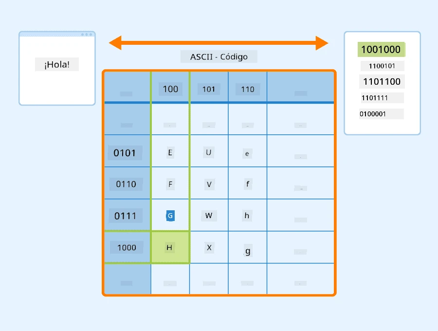
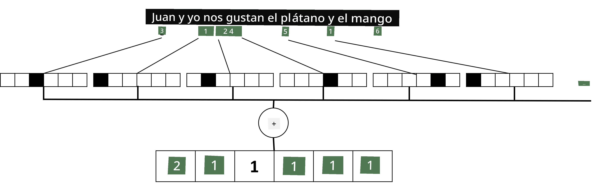

# Representar texto como tensores

## [Cuestionario previo a la clase](https://ff-quizzes.netlify.app/en/ai/quiz/25)

## Clasificación de texto

En la primera parte de esta sección, nos enfocaremos en la tarea de **clasificación de texto**. Utilizaremos el conjunto de datos [AG News](https://www.kaggle.com/amananandrai/ag-news-classification-dataset), que contiene artículos de noticias como el siguiente:

* Categoría: Ciencia/Tecnología  
* Título: Empresa de Ky. gana subvención para estudiar péptidos (AP)  
* Cuerpo: AP - Una empresa fundada por un investigador de química de la Universidad de Louisville ganó una subvención para desarrollar...

Nuestro objetivo será clasificar el artículo de noticias en una de las categorías basándonos en el texto.

## Representar texto

Si queremos resolver tareas de Procesamiento de Lenguaje Natural (NLP) con redes neuronales, necesitamos una forma de representar el texto como tensores. Las computadoras ya representan caracteres textuales como números que se asignan a fuentes en tu pantalla utilizando codificaciones como ASCII o UTF-8.

> [Fuente de la imagen](https://www.seobility.net/en/wiki/ASCII)

Como humanos, entendemos lo que cada letra **representa** y cómo todos los caracteres se combinan para formar las palabras de una oración. Sin embargo, las computadoras por sí solas no tienen tal comprensión, y la red neuronal debe aprender el significado durante el entrenamiento.

Por lo tanto, podemos usar diferentes enfoques para representar texto:

* **Representación a nivel de caracteres**, donde representamos el texto tratando cada carácter como un número. Dado que tenemos *C* caracteres diferentes en nuestro corpus de texto, la palabra *Hello* se representaría por un tensor de 5x*C*. Cada letra correspondería a una columna del tensor en codificación one-hot.  
* **Representación a nivel de palabras**, en la que creamos un **vocabulario** de todas las palabras en nuestro texto y luego representamos las palabras utilizando codificación one-hot. Este enfoque es algo mejor, porque cada letra por sí sola no tiene mucho significado, y al usar conceptos semánticos de nivel superior - palabras - simplificamos la tarea para la red neuronal. Sin embargo, dado el tamaño del diccionario, necesitamos manejar tensores dispersos de alta dimensión.

Independientemente de la representación, primero necesitamos convertir el texto en una secuencia de **tokens**, siendo un token un carácter, una palabra o incluso parte de una palabra. Luego, convertimos el token en un número, típicamente usando un **vocabulario**, y este número puede ser alimentado a una red neuronal utilizando codificación one-hot.

## N-Gramas

En el lenguaje natural, el significado preciso de las palabras solo puede determinarse en contexto. Por ejemplo, los significados de *red neuronal* y *red de pesca* son completamente diferentes. Una de las formas de tener esto en cuenta es construir nuestro modelo basado en pares de palabras, considerando los pares de palabras como tokens separados del vocabulario. De esta manera, la oración *Me gusta ir a pescar* se representará por la siguiente secuencia de tokens: *Me gusta*, *gusta ir*, *ir a*, *a pescar*. El problema con este enfoque es que el tamaño del diccionario crece significativamente, y combinaciones como *a pescar* y *a comprar* se presentan como tokens diferentes, que no comparten ninguna similitud semántica a pesar del mismo verbo.

En algunos casos, podemos considerar usar tri-gramas, combinaciones de tres palabras. Por lo tanto, este enfoque se denomina **n-gramas**. También tiene sentido usar n-gramas con representación a nivel de caracteres, en cuyo caso los n-gramas corresponderán aproximadamente a diferentes sílabas.

## Bag-of-Words y TF/IDF

Cuando resolvemos tareas como la clasificación de texto, necesitamos poder representar el texto mediante un vector de tamaño fijo, que utilizaremos como entrada para el clasificador denso final. Una de las formas más simples de hacerlo es combinar todas las representaciones individuales de palabras, por ejemplo, sumándolas. Si sumamos las codificaciones one-hot de cada palabra, terminaremos con un vector de frecuencias que muestra cuántas veces aparece cada palabra dentro del texto. Tal representación del texto se llama **bag of words** (BoW).

> Imagen del autor

Un BoW esencialmente representa qué palabras aparecen en el texto y en qué cantidades, lo que puede ser una buena indicación de qué trata el texto. Por ejemplo, un artículo de noticias sobre política probablemente contenga palabras como *presidente* y *país*, mientras que una publicación científica podría tener algo como *colisionador*, *descubierto*, etc. Por lo tanto, las frecuencias de palabras pueden ser en muchos casos un buen indicador del contenido del texto.

El problema con BoW es que ciertas palabras comunes, como *y*, *es*, etc., aparecen en la mayoría de los textos y tienen las frecuencias más altas, ocultando las palabras que realmente son importantes. Podemos reducir la importancia de esas palabras teniendo en cuenta la frecuencia con la que ocurren en toda la colección de documentos. Esta es la idea principal detrás del enfoque TF/IDF, que se cubre en más detalle en los cuadernos adjuntos a esta lección.

Sin embargo, ninguno de estos enfoques puede tener en cuenta completamente la **semántica** del texto. Necesitamos modelos de redes neuronales más poderosos para hacerlo, los cuales discutiremos más adelante en esta sección.

## ✍️ Ejercicios: Representación de texto

Continúa tu aprendizaje en los siguientes cuadernos:

* [Representación de texto con PyTorch](TextRepresentationPyTorch.ipynb)  
* [Representación de texto con TensorFlow](TextRepresentationTF.ipynb)  

## Conclusión

Hasta ahora, hemos estudiado técnicas que pueden agregar peso de frecuencia a diferentes palabras. Sin embargo, estas no son capaces de representar el significado o el orden. Como dijo el famoso lingüista J. R. Firth en 1935: "El significado completo de una palabra siempre es contextual, y ningún estudio de significado fuera del contexto puede tomarse en serio". Más adelante en el curso aprenderemos cómo capturar información contextual del texto utilizando modelos de lenguaje.

## 🚀 Desafío

Prueba algunos otros ejercicios utilizando bag-of-words y diferentes modelos de datos. Podrías inspirarte en esta [competencia en Kaggle](https://www.kaggle.com/competitions/word2vec-nlp-tutorial/overview/part-1-for-beginners-bag-of-words)

## [Cuestionario posterior a la clase](https://ff-quizzes.netlify.app/en/ai/quiz/26)

## Repaso y autoestudio

Practica tus habilidades con técnicas de embeddings de texto y bag-of-words en [Microsoft Learn](https://docs.microsoft.com/learn/modules/intro-natural-language-processing-pytorch/?WT.mc_id=academic-77998-cacaste)

## [Asignación: Cuadernos](assignment.md)

---

