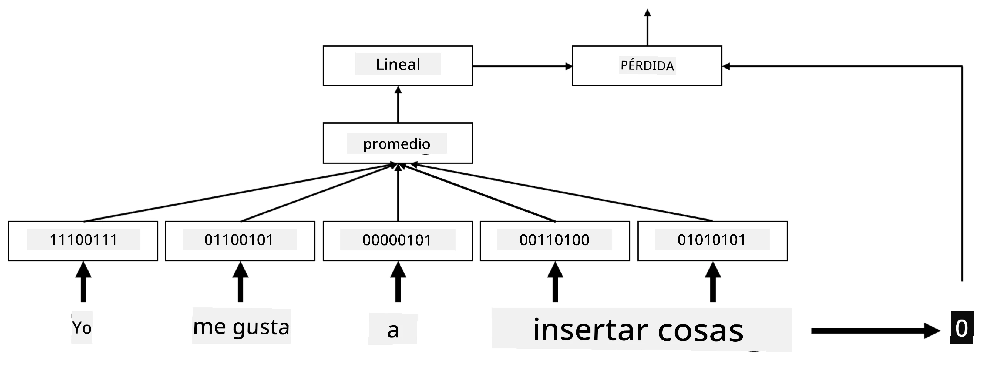

# Embeddings

## [Pre-lecture quiz](https://ff-quizzes.netlify.app/en/ai/quiz/27)

Al entrenar clasificadores basados en BoW o TF/IDF, trabajábamos con vectores de bolsa de palabras de alta dimensión con longitud `vocab_size`, y convertíamos explícitamente de vectores de representación posicional de baja dimensión a representaciones dispersas de una sola posición activa (one-hot). Sin embargo, esta representación one-hot no es eficiente en términos de memoria. Además, cada palabra se trata de manera independiente, es decir, los vectores codificados en one-hot no expresan ninguna similitud semántica entre palabras.

La idea de **embedding** es representar las palabras mediante vectores densos de menor dimensión, que de alguna manera reflejen el significado semántico de una palabra. Más adelante discutiremos cómo construir embeddings de palabras significativos, pero por ahora pensemos en los embeddings como una forma de reducir la dimensionalidad de un vector de palabras.

Entonces, la capa de embedding tomaría una palabra como entrada y produciría un vector de salida con un tamaño especificado `embedding_size`. En cierto sentido, es muy similar a una capa `Linear`, pero en lugar de tomar un vector codificado en one-hot, podrá tomar un número de palabra como entrada, permitiéndonos evitar la creación de grandes vectores codificados en one-hot.

Al usar una capa de embedding como la primera capa en nuestra red clasificadora, podemos cambiar de un modelo de bolsa de palabras a un modelo de **embedding bag**, donde primero convertimos cada palabra en nuestro texto en su correspondiente embedding, y luego calculamos alguna función de agregación sobre todos esos embeddings, como `sum`, `average` o `max`.  

> Imagen por el autor

## ✍️ Ejercicios: Embeddings

Continúa tu aprendizaje en los siguientes notebooks:
* [Embeddings con PyTorch](EmbeddingsPyTorch.ipynb)
* [Embeddings con TensorFlow](EmbeddingsTF.ipynb)

## Embeddings Semánticos: Word2Vec

Aunque la capa de embedding aprendió a mapear palabras a representaciones vectoriales, esta representación no necesariamente tiene mucho significado semántico. Sería ideal aprender una representación vectorial tal que palabras similares o sinónimos correspondan a vectores cercanos entre sí en términos de alguna distancia vectorial (por ejemplo, distancia euclidiana).

Para lograr esto, necesitamos preentrenar nuestro modelo de embedding en una gran colección de texto de una manera específica. Una forma de entrenar embeddings semánticos se llama [Word2Vec](https://en.wikipedia.org/wiki/Word2vec). Se basa en dos arquitecturas principales que se utilizan para producir una representación distribuida de palabras:

 - **Continuous bag-of-words** (CBoW) — en esta arquitectura, entrenamos el modelo para predecir una palabra a partir del contexto circundante. Dado el ngram $(W_{-2},W_{-1},W_0,W_1,W_2)$, el objetivo del modelo es predecir $W_0$ a partir de $(W_{-2},W_{-1},W_1,W_2)$.
 - **Continuous skip-gram** es opuesto a CBoW. El modelo utiliza una ventana de palabras de contexto circundante para predecir la palabra actual.

CBoW es más rápido, mientras que skip-gram es más lento, pero hace un mejor trabajo representando palabras poco frecuentes.

> Imagen tomada de [este artículo](https://arxiv.org/pdf/1301.3781.pdf)

Los embeddings preentrenados de Word2Vec (así como otros modelos similares, como GloVe) también pueden usarse en lugar de la capa de embedding en redes neuronales. Sin embargo, debemos lidiar con los vocabularios, porque el vocabulario utilizado para preentrenar Word2Vec/GloVe probablemente será diferente del vocabulario en nuestro corpus de texto. Revisa los notebooks mencionados anteriormente para ver cómo se puede resolver este problema.

## Embeddings Contextuales

Una limitación clave de las representaciones tradicionales de embeddings preentrenados como Word2Vec es el problema de la desambiguación del sentido de las palabras. Aunque los embeddings preentrenados pueden capturar parte del significado de las palabras en contexto, todos los posibles significados de una palabra se codifican en el mismo embedding. Esto puede causar problemas en los modelos posteriores, ya que muchas palabras, como la palabra 'play', tienen diferentes significados dependiendo del contexto en el que se usan.

Por ejemplo, la palabra 'play' en estas dos oraciones tiene significados bastante diferentes:

- Fui a una **obra** en el teatro.
- John quiere **jugar** con sus amigos.

Los embeddings preentrenados mencionados anteriormente representan ambos significados de la palabra 'play' en el mismo embedding. Para superar esta limitación, necesitamos construir embeddings basados en el **modelo de lenguaje**, que se entrena en un gran corpus de texto y *sabe* cómo las palabras pueden combinarse en diferentes contextos. Discutir embeddings contextuales está fuera del alcance de este tutorial, pero volveremos a ellos cuando hablemos de modelos de lenguaje más adelante en el curso.

## Conclusión

En esta lección, descubriste cómo construir y usar capas de embedding en TensorFlow y PyTorch para reflejar mejor los significados semánticos de las palabras.

## 🚀 Desafío

Word2Vec se ha utilizado para algunas aplicaciones interesantes, incluyendo la generación de letras de canciones y poesía. Echa un vistazo a [este artículo](https://www.politetype.com/blog/word2vec-color-poems) que explica cómo el autor utilizó Word2Vec para generar poesía. Mira también [este video de Dan Shiffmann](https://www.youtube.com/watch?v=LSS_bos_TPI&ab_channel=TheCodingTrain) para descubrir una explicación diferente de esta técnica. Luego intenta aplicar estas técnicas a tu propio corpus de texto, quizás obtenido de Kaggle.

## [Post-lecture quiz](https://ff-quizzes.netlify.app/en/ai/quiz/28)

## Revisión y Autoestudio

Lee este artículo sobre Word2Vec: [Efficient Estimation of Word Representations in Vector Space](https://arxiv.org/pdf/1301.3781.pdf)

## [Asignación: Notebooks](assignment.md)

---

