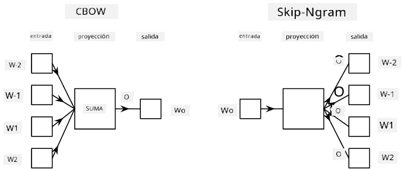

# Modelado de Lenguaje

Las incrustaciones semánticas, como Word2Vec y GloVe, son de hecho un primer paso hacia el **modelado de lenguaje**: crear modelos que de alguna manera *entiendan* (o *representen*) la naturaleza del lenguaje.

## [Cuestionario previo a la clase](https://ff-quizzes.netlify.app/en/ai/quiz/29)

La idea principal detrás del modelado de lenguaje es entrenar los modelos en conjuntos de datos no etiquetados de manera no supervisada. Esto es importante porque tenemos enormes cantidades de texto no etiquetado disponible, mientras que la cantidad de texto etiquetado siempre estará limitada por el esfuerzo que podemos dedicar a etiquetarlo. Con mayor frecuencia, podemos construir modelos de lenguaje que puedan **predecir palabras faltantes** en el texto, ya que es fácil ocultar una palabra aleatoria en el texto y usarla como muestra de entrenamiento.

## Entrenamiento de Incrustaciones

En nuestros ejemplos anteriores, utilizamos incrustaciones semánticas preentrenadas, pero es interesante ver cómo se pueden entrenar esas incrustaciones. Hay varias ideas posibles que se pueden usar:

* **Modelado de lenguaje N-Gram**, donde predecimos un token observando los N tokens anteriores (N-grama).
* **Continuous Bag-of-Words** (CBoW), donde predecimos el token central $W_0$ en una secuencia de tokens $W_{-N}$, ..., $W_N$.
* **Skip-gram**, donde predecimos un conjunto de tokens vecinos {$W_{-N},\dots, W_{-1}, W_1,\dots, W_N$} a partir del token central $W_0$.

> Imagen tomada de [este artículo](https://arxiv.org/pdf/1301.3781.pdf)

## ✍️ Ejemplo de Notebooks: Entrenamiento del modelo CBoW

Continúa tu aprendizaje en los siguientes notebooks:

* [Entrenamiento de CBoW Word2Vec con TensorFlow](CBoW-TF.ipynb)
* [Entrenamiento de CBoW Word2Vec con PyTorch](CBoW-PyTorch.ipynb)

## Conclusión

En la lección anterior vimos que las incrustaciones de palabras funcionan como magia. Ahora sabemos que entrenar incrustaciones de palabras no es una tarea muy compleja, y deberíamos ser capaces de entrenar nuestras propias incrustaciones de palabras para texto específico de un dominio si es necesario.

## [Cuestionario posterior a la clase](https://ff-quizzes.netlify.app/en/ai/quiz/30)

## Revisión y Estudio Autónomo

* [Tutorial oficial de PyTorch sobre Modelado de Lenguaje](https://pytorch.org/tutorials/beginner/nlp/word_embeddings_tutorial.html).
* [Tutorial oficial de TensorFlow sobre entrenamiento del modelo Word2Vec](https://www.TensorFlow.org/tutorials/text/word2vec).
* Usar el marco **gensim** para entrenar las incrustaciones más comúnmente utilizadas en unas pocas líneas de código se describe [en esta documentación](https://pytorch.org/tutorials/beginner/nlp/word_embeddings_tutorial.html).

## 🚀 [Asignación: Entrenar Modelo Skip-Gram](lab/README.md)

En el laboratorio, te desafiamos a modificar el código de esta lección para entrenar un modelo skip-gram en lugar de CBoW. [Lee los detalles](lab/README.md)

---

