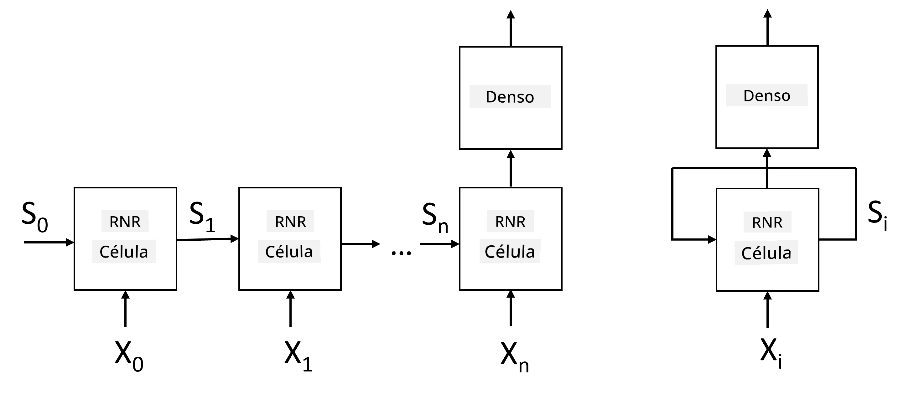
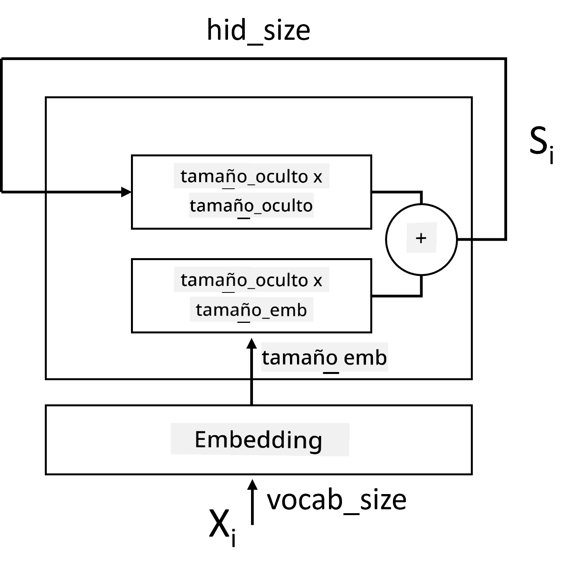
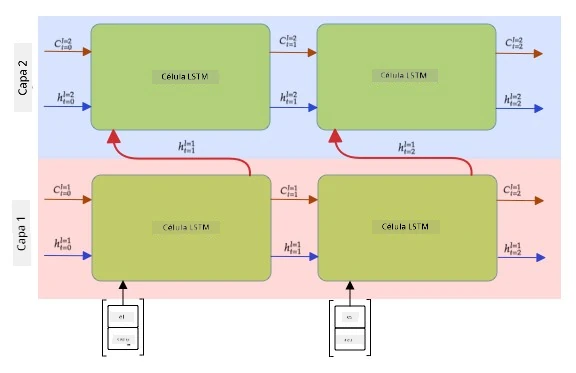

# Redes Neuronales Recurrentes

## [Cuestionario previo a la clase](https://ff-quizzes.netlify.app/en/ai/quiz/31)

En secciones anteriores, hemos estado utilizando representaciones semánticas enriquecidas de texto y un clasificador lineal simple sobre las incrustaciones. Lo que hace esta arquitectura es capturar el significado agregado de las palabras en una oración, pero no toma en cuenta el **orden** de las palabras, ya que la operación de agregación sobre las incrustaciones elimina esta información del texto original. Debido a que estos modelos no pueden modelar el orden de las palabras, no pueden resolver tareas más complejas o ambiguas como la generación de texto o la respuesta a preguntas.

Para capturar el significado de una secuencia de texto, necesitamos usar otra arquitectura de red neuronal, llamada **red neuronal recurrente**, o RNN. En una RNN, pasamos nuestra oración a través de la red un símbolo a la vez, y la red produce un **estado**, que luego pasamos nuevamente a la red junto con el siguiente símbolo.

> Imagen del autor

Dada la secuencia de entrada de tokens X0,...,Xn, la RNN crea una secuencia de bloques de red neuronal y entrena esta secuencia de extremo a extremo utilizando retropropagación. Cada bloque de red toma un par (Xi,Si) como entrada y produce Si+1 como resultado. El estado final Sn o (salida Yn) se pasa a un clasificador lineal para producir el resultado. Todos los bloques de red comparten los mismos pesos y se entrenan de extremo a extremo utilizando una sola pasada de retropropagación.

Debido a que los vectores de estado S0,...,Sn se pasan a través de la red, esta es capaz de aprender las dependencias secuenciales entre palabras. Por ejemplo, cuando la palabra *no* aparece en algún lugar de la secuencia, puede aprender a negar ciertos elementos dentro del vector de estado, resultando en una negación.

> ✅ Dado que los pesos de todos los bloques de RNN en la imagen anterior son compartidos, la misma imagen puede representarse como un solo bloque (a la derecha) con un bucle de retroalimentación recurrente, que pasa el estado de salida de la red nuevamente a la entrada.

## Anatomía de una Célula RNN

Veamos cómo está organizada una célula RNN simple. Acepta el estado anterior Si-1 y el símbolo actual Xi como entradas, y debe producir el estado de salida Si (y, a veces, también estamos interesados en alguna otra salida Yi, como en el caso de redes generativas).

Una célula RNN simple tiene dos matrices de pesos internas: una transforma un símbolo de entrada (llamémosla W) y otra transforma un estado de entrada (H). En este caso, la salida de la red se calcula como &sigma;(W&times;Xi+H&times;Si-1+b), donde &sigma; es la función de activación y b es un sesgo adicional.

> Imagen del autor

En muchos casos, los tokens de entrada se pasan a través de la capa de incrustación antes de ingresar a la RNN para reducir la dimensionalidad. En este caso, si la dimensión de los vectores de entrada es *emb_size*, y el vector de estado es *hid_size*, el tamaño de W es *emb_size*&times;*hid_size*, y el tamaño de H es *hid_size*&times;*hid_size*.

## Memoria a Largo y Corto Plazo (LSTM)

Uno de los principales problemas de las RNN clásicas es el llamado problema de **gradientes que se desvanecen**. Debido a que las RNN se entrenan de extremo a extremo en una sola pasada de retropropagación, tienen dificultades para propagar el error a las primeras capas de la red, y por lo tanto, la red no puede aprender relaciones entre tokens distantes. Una de las formas de evitar este problema es introducir **gestión explícita del estado** utilizando los llamados **puertas**. Hay dos arquitecturas bien conocidas de este tipo: **Memoria a Largo y Corto Plazo** (LSTM) y **Unidad de Relevo con Puerta** (GRU).

> Fuente de la imagen por determinar

La red LSTM está organizada de manera similar a la RNN, pero hay dos estados que se pasan de capa a capa: el estado real C y el vector oculto H. En cada unidad, el vector oculto Hi se concatena con la entrada Xi, y controlan lo que sucede con el estado C a través de **puertas**. Cada puerta es una red neuronal con activación sigmoide (salida en el rango [0,1]), que puede considerarse como una máscara de bits cuando se multiplica por el vector de estado. Las puertas son las siguientes (de izquierda a derecha en la imagen anterior):

* La **puerta de olvido** toma un vector oculto y determina qué componentes del vector C necesitamos olvidar y cuáles pasar.
* La **puerta de entrada** toma información de los vectores de entrada y ocultos e inserta esta información en el estado.
* La **puerta de salida** transforma el estado a través de una capa lineal con activación *tanh*, luego selecciona algunos de sus componentes utilizando un vector oculto Hi para producir un nuevo estado Ci+1.

Los componentes del estado C pueden considerarse como algunas banderas que pueden activarse o desactivarse. Por ejemplo, cuando encontramos un nombre como *Alice* en la secuencia, podríamos asumir que se refiere a un personaje femenino y activar la bandera en el estado que indica que tenemos un sustantivo femenino en la oración. Cuando más adelante encontramos frases como *y Tom*, activaremos la bandera que indica que tenemos un sustantivo plural. Así, manipulando el estado, podemos supuestamente realizar un seguimiento de las propiedades gramaticales de las partes de la oración.

> ✅ Un excelente recurso para entender los detalles internos de LSTM es este gran artículo [Understanding LSTM Networks](https://colah.github.io/posts/2015-08-Understanding-LSTMs/) de Christopher Olah.

## RNN Bidireccionales y Multicapa

Hemos discutido redes recurrentes que operan en una dirección, desde el inicio de una secuencia hasta el final. Esto parece natural, ya que se asemeja a la forma en que leemos y escuchamos el habla. Sin embargo, dado que en muchos casos prácticos tenemos acceso aleatorio a la secuencia de entrada, podría tener sentido realizar cálculos recurrentes en ambas direcciones. Estas redes se llaman **RNN bidireccionales**. Al trabajar con una red bidireccional, necesitaríamos dos vectores de estado oculto, uno para cada dirección.

Una red recurrente, ya sea unidireccional o bidireccional, captura ciertos patrones dentro de una secuencia y puede almacenarlos en un vector de estado o pasarlos a la salida. Al igual que con las redes convolucionales, podemos construir otra capa recurrente sobre la primera para capturar patrones de nivel superior y construir a partir de los patrones de bajo nivel extraídos por la primera capa. Esto nos lleva a la noción de una **RNN multicapa**, que consiste en dos o más redes recurrentes, donde la salida de la capa anterior se pasa a la siguiente capa como entrada.

*Imagen tomada de [este maravilloso artículo](https://towardsdatascience.com/from-a-lstm-cell-to-a-multilayer-lstm-network-with-pytorch-2899eb5696f3) de Fernando López*

## ✍️ Ejercicios: Incrustaciones

Continúa tu aprendizaje en los siguientes cuadernos:

* [RNNs con PyTorch](RNNPyTorch.ipynb)
* [RNNs con TensorFlow](RNNTF.ipynb)

## Conclusión

En esta unidad, hemos visto que las RNN pueden usarse para la clasificación de secuencias, pero de hecho, pueden manejar muchas más tareas, como generación de texto, traducción automática y más. Consideraremos esas tareas en la próxima unidad.

## 🚀 Desafío

Lee algo de literatura sobre LSTMs y considera sus aplicaciones:

- [Grid Long Short-Term Memory](https://arxiv.org/pdf/1507.01526v1.pdf)
- [Show, Attend and Tell: Neural Image Caption
Generation with Visual Attention](https://arxiv.org/pdf/1502.03044v2.pdf)

## [Cuestionario posterior a la clase](https://ff-quizzes.netlify.app/en/ai/quiz/32)

## Revisión y Estudio Autónomo

- [Understanding LSTM Networks](https://colah.github.io/posts/2015-08-Understanding-LSTMs/) de Christopher Olah.

## [Asignación: Cuadernos](assignment.md)

---

