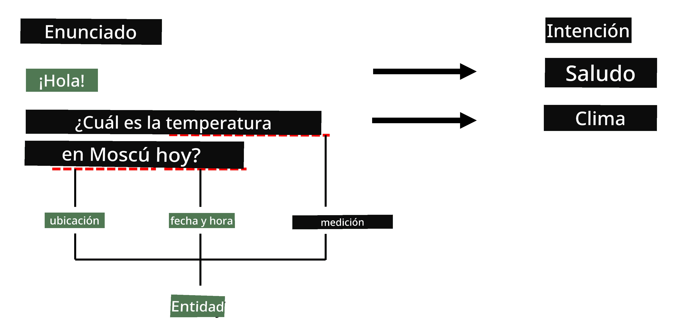
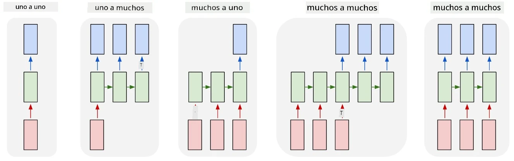

# Reconocimiento de Entidades Nombradas

Hasta ahora, nos hemos concentrado principalmente en una tarea de PLN: la clasificación. Sin embargo, existen otras tareas de PLN que pueden realizarse con redes neuronales. Una de esas tareas es **[Reconocimiento de Entidades Nombradas](https://wikipedia.org/wiki/Named-entity_recognition)** (NER), que se ocupa de identificar entidades específicas dentro del texto, como lugares, nombres de personas, intervalos de tiempo, fórmulas químicas, entre otros.

## [Cuestionario previo a la clase](https://ff-quizzes.netlify.app/en/ai/quiz/37)

## Ejemplo de Uso de NER

Supongamos que quieres desarrollar un chatbot de lenguaje natural, similar a Amazon Alexa o Google Assistant. La forma en que funcionan los chatbots inteligentes es *entendiendo* lo que el usuario quiere mediante la clasificación de texto en la frase de entrada. El resultado de esta clasificación es el llamado **intento**, que determina lo que el chatbot debe hacer.

> Imagen del autor

Sin embargo, un usuario puede proporcionar algunos parámetros como parte de la frase. Por ejemplo, al preguntar por el clima, puede especificar una ubicación o una fecha. Un bot debería ser capaz de entender esas entidades y completar los espacios de los parámetros antes de realizar la acción. Aquí es donde entra en juego NER.

> ✅ Otro ejemplo sería [analizar artículos científicos médicos](https://soshnikov.com/science/analyzing-medical-papers-with-azure-and-text-analytics-for-health/). Una de las principales cosas que necesitamos buscar son términos médicos específicos, como enfermedades y sustancias médicas. Mientras que un pequeño número de enfermedades probablemente se pueda extraer mediante búsqueda de subcadenas, entidades más complejas, como compuestos químicos y nombres de medicamentos, requieren un enfoque más sofisticado.

## NER como Clasificación de Tokens

Los modelos NER son esencialmente **modelos de clasificación de tokens**, porque para cada uno de los tokens de entrada debemos decidir si pertenece a una entidad o no, y si lo hace, a qué clase de entidad pertenece.

Considera el siguiente título de un artículo:

**Regurgitación de la válvula tricúspide** y **carbonato de litio** **toxicidad** en un recién nacido.

Las entidades aquí son:

* Regurgitación de la válvula tricúspide es una enfermedad (`DIS`)
* Carbonato de litio es una sustancia química (`CHEM`)
* Toxicidad también es una enfermedad (`DIS`)

Nota que una entidad puede abarcar varios tokens. Y, como en este caso, necesitamos distinguir entre dos entidades consecutivas. Por lo tanto, es común usar dos clases para cada entidad: una que especifica el primer token de la entidad (a menudo se usa el prefijo `B-`, para **b**eginning, inicio) y otra para la continuación de una entidad (`I-`, para **i**nner token, interno). También usamos `O` como clase para representar todos los tokens **o**tros. Este etiquetado de tokens se llama [etiquetado BIO](https://en.wikipedia.org/wiki/Inside%E2%80%93outside%E2%80%93beginning_(tagging)) (o IOB). Cuando se etiqueta, nuestro título se verá así:

Token | Etiqueta
------|---------
Tricuspid | B-DIS
valve | I-DIS
regurgitation | I-DIS
and | O
lithium | B-CHEM
carbonate | I-CHEM
toxicity | B-DIS
in | O
a | O
newborn | O
infant | O
. | O

Dado que necesitamos construir una correspondencia uno a uno entre tokens y clases, podemos entrenar un modelo neuronal **muchos a muchos** como el que se muestra en esta imagen:

> *Imagen tomada de [este artículo](http://karpathy.github.io/2015/05/21/rnn-effectiveness/) de [Andrej Karpathy](http://karpathy.github.io/). Los modelos de clasificación de tokens NER corresponden a la arquitectura de red más a la derecha en esta imagen.*

## Entrenamiento de Modelos NER

Dado que un modelo NER es esencialmente un modelo de clasificación de tokens, podemos usar RNNs, con las que ya estamos familiarizados, para esta tarea. En este caso, cada bloque de la red recurrente devolverá el ID del token. El siguiente cuaderno de ejemplo muestra cómo entrenar un LSTM para la clasificación de tokens.

## ✍️ Cuadernos de Ejemplo: NER

Continúa tu aprendizaje en el siguiente cuaderno:

* [NER con TensorFlow](NER-TF.ipynb)

## Conclusión

Un modelo NER es un **modelo de clasificación de tokens**, lo que significa que puede usarse para realizar clasificación de tokens. Esta es una tarea muy común en PLN, que ayuda a reconocer entidades específicas dentro del texto, incluyendo lugares, nombres, fechas y más.

## 🚀 Desafío

Completa la tarea vinculada a continuación para entrenar un modelo de reconocimiento de entidades nombradas para términos médicos, y luego pruébalo en un conjunto de datos diferente.

## [Cuestionario posterior a la clase](https://ff-quizzes.netlify.app/en/ai/quiz/38)

## Revisión y Autoestudio

Lee el blog [La Efectividad Inesperada de las Redes Neuronales Recurrentes](http://karpathy.github.io/2015/05/21/rnn-effectiveness/) y sigue la sección de Lecturas Adicionales en ese artículo para profundizar tu conocimiento.

## [Tarea](lab/README.md)

En la tarea de esta lección, tendrás que entrenar un modelo de reconocimiento de entidades médicas. Puedes comenzar entrenando un modelo LSTM como se describe en esta lección y luego avanzar a usar el modelo transformador BERT. Lee [las instrucciones](lab/README.md) para obtener todos los detalles.

---

