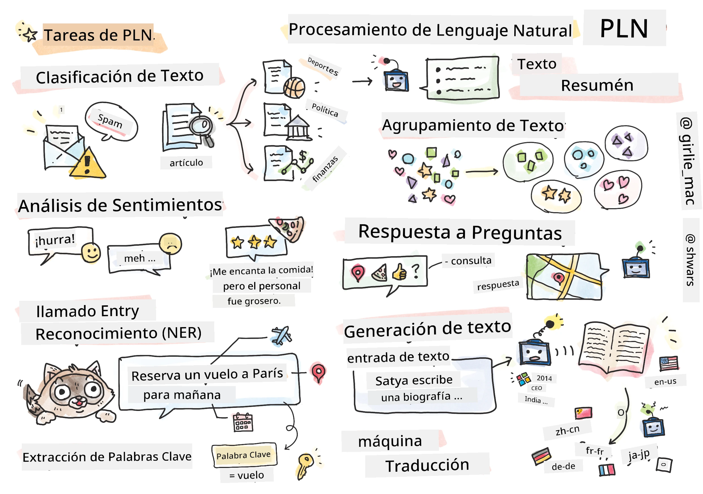

# Procesamiento de Lenguaje Natural



En esta sección, nos centraremos en usar Redes Neuronales para manejar tareas relacionadas con el **Procesamiento de Lenguaje Natural (PLN)**. Hay muchos problemas de PLN que queremos que las computadoras puedan resolver:

* **Clasificación de texto** es un problema típico de clasificación relacionado con secuencias de texto. Ejemplos incluyen clasificar mensajes de correo electrónico como spam vs. no spam, o categorizar artículos como deportes, negocios, política, etc. Además, al desarrollar bots de conversación, a menudo necesitamos entender lo que un usuario quiso decir — en este caso estamos tratando con **clasificación de intención**. A menudo, en la clasificación de intención necesitamos manejar muchas categorías.
* **Análisis de sentimiento** es un problema típico de regresión, donde necesitamos atribuir un número (un sentimiento) que corresponde a qué tan positivo/negativo es el significado de una frase. Una versión más avanzada del análisis de sentimiento es el **análisis de sentimiento basado en aspectos** (ABSA), donde atribuimos sentimiento no a toda la frase, sino a diferentes partes de ella (aspectos), por ejemplo, *En este restaurante, me gustó la cocina, pero la atmósfera fue terrible*.
* **Reconocimiento de Entidades Nombradas** (REN) se refiere al problema de extraer ciertas entidades del texto. Por ejemplo, podríamos necesitar entender que en la frase *Necesito volar a París mañana* la palabra *mañana* se refiere a FECHA, y *París* es una UBICACIÓN.  
* **Extracción de palabras clave** es similar al REN, pero necesitamos extraer automáticamente palabras importantes para el significado de la frase, sin preentrenamiento para tipos específicos de entidades.
* **Agrupamiento de texto** puede ser útil cuando queremos agrupar frases similares, por ejemplo, solicitudes semejantes en conversaciones de soporte técnico.
* **Respuesta a preguntas** se refiere a la capacidad de un modelo para responder a una pregunta específica. El modelo recibe un pasaje de texto y una pregunta como entradas, y debe proporcionar un lugar en el texto donde se contiene la respuesta a la pregunta (o, a veces, generar el texto de la respuesta).
* **Generación de texto** es la capacidad de un modelo para generar texto nuevo. Puede considerarse como una tarea de clasificación que predice la siguiente letra/palabra basada en un *mensaje de texto*. Modelos avanzados de generación de texto, como GPT-3, son capaces de resolver otras tareas de PLN como clasificación usando una técnica llamada [programación de mensajes](https://towardsdatascience.com/software-3-0-how-prompting-will-change-the-rules-of-the-game-a982fbfe1e0) o [ingeniería de mensajes](https://medium.com/swlh/openai-gpt-3-and-prompt-engineering-dcdc2c5fcd29)
* **Resumen de texto** es una técnica cuando queremos que una computadora "lea" un texto largo y lo resuma en pocas oraciones.
* **Traducción automática** puede verse como una combinación de comprensión de texto en un idioma, y generación de texto en otro.

Inicialmente, la mayoría de tareas de PLN se resolvieron usando métodos tradicionales como gramáticas. Por ejemplo, en la traducción automática se usaban analizadores sintácticos para transformar la frase inicial en un árbol sintáctico, luego se extraían estructuras semánticas de nivel superior para representar el significado de la frase, y basándose en este significado y la gramática del idioma objetivo se generaba el resultado. Hoy en día, muchas tareas de PLN se resuelven de manera más efectiva usando redes neuronales.

> Muchos métodos clásicos de PLN están implementados en la biblioteca Python [Natural Language Processing Toolkit (NLTK)](https://www.nltk.org). Hay un excelente [libro NLTK](https://www.nltk.org/book/) disponible en línea que cubre cómo diferentes tareas de PLN pueden ser resueltas usando NLTK.

En nuestro curso, nos centraremos principalmente en el uso de Redes Neuronales para PLN, y usaremos NLTK cuando sea necesario.

Ya hemos aprendido sobre el uso de redes neuronales para manejar datos tabulares y con imágenes. La principal diferencia entre esos tipos de datos y el texto es que el texto es una secuencia de longitud variable, mientras que el tamaño de entrada en el caso de imágenes se conoce de antemano. Mientras que las redes convolucionales pueden extraer patrones de los datos de entrada, los patrones en texto son más complejos. Por ejemplo, podemos tener una negación separada del sujeto por muchas palabras arbitrarias (por ejemplo, *No me gustan las naranjas*, vs. *No me gustan esas grandes, coloridas y sabrosas naranjas*), y eso aún debería interpretarse como un patrón. Por lo tanto, para manejar el lenguaje necesitamos introducir nuevos tipos de redes neuronales, tales como *redes recurrentes* y *transformers*.

## Instalar Librerías

Si usas una instalación local de Python para ejecutar este curso, es posible que necesites instalar todas las librerías necesarias para PLN usando los siguientes comandos:

**Para PyTorch**
```bash
pip install -r requirements-pytorch.txt
```
**Para TensorFlow**
```bash
pip install -r requirements-tf.txt
```

> Puedes probar PLN con TensorFlow en [Microsoft Learn](https://docs.microsoft.com/learn/modules/intro-natural-language-processing-tensorflow/?WT.mc_id=academic-77998-cacaste)

## Advertencia sobre GPU

En esta sección, en algunos de los ejemplos entrenaremos modelos bastante grandes.
* **Usa una computadora con GPU**: Es recomendable ejecutar tus notebooks en una computadora con GPU para reducir los tiempos de espera al trabajar con modelos grandes.
* **Restricciones de memoria GPU**: Ejecutar con GPU puede llevar a situaciones donde se agote la memoria de la GPU, especialmente al entrenar modelos grandes.
* **Consumo de memoria GPU**: La cantidad de memoria GPU consumida durante el entrenamiento depende de varios factores, incluyendo el tamaño del minibatch.
* **Minimiza el tamaño del minibatch**: Si tienes problemas de memoria GPU, considera reducir el tamaño del minibatch en tu código como posible solución.
* **Liberación de memoria GPU en TensorFlow**: Las versiones antiguas de TensorFlow pueden no liberar correctamente la memoria de GPU al entrenar múltiples modelos dentro de un mismo kernel de Python. Para manejar bien el uso de memoria de GPU, puedes configurar TensorFlow para que asigne memoria GPU solo cuando sea necesario.
* **Inclusión de código**: Para configurar TensorFlow para que aumente la asignación de memoria GPU solo cuando se requiera, incluye el siguiente código en tus notebooks:

```python
physical_devices = tf.config.list_physical_devices('GPU') 
if len(physical_devices)>0:
    tf.config.experimental.set_memory_growth(physical_devices[0], True) 
```

Si te interesa aprender sobre PLN desde una perspectiva clásica de ML, visita [este conjunto de lecciones](https://github.com/microsoft/ML-For-Beginners/tree/main/6-NLP)

## En esta Sección
En esta sección aprenderemos sobre:

* [Representar texto como tensores](13-TextRep/README.md)
* [Representaciones de palabras (Word Embeddings)](14-Embeddings/README.md)
* [Modelado de lenguaje](15-LanguageModeling/README.md)
* [Redes neuronales recurrentes](16-RNN/README.md)
* [Redes generativas](17-GenerativeNetworks/README.md)
* [Transformers](18-Transformers/README.md)

---

<!-- CO-OP TRANSLATOR DISCLAIMER START -->
**Descargo de responsabilidad**:
Este documento ha sido traducido utilizando el servicio de traducción automática [Co-op Translator](https://github.com/Azure/co-op-translator). Aunque nos esforzamos por la precisión, tenga en cuenta que las traducciones automatizadas pueden contener errores o inexactitudes. El documento original en su idioma nativo debe considerarse la fuente autorizada. Para información crítica, se recomienda una traducción profesional humana. No somos responsables de cualquier malentendido o interpretación errónea que surja del uso de esta traducción.
<!-- CO-OP TRANSLATOR DISCLAIMER END -->