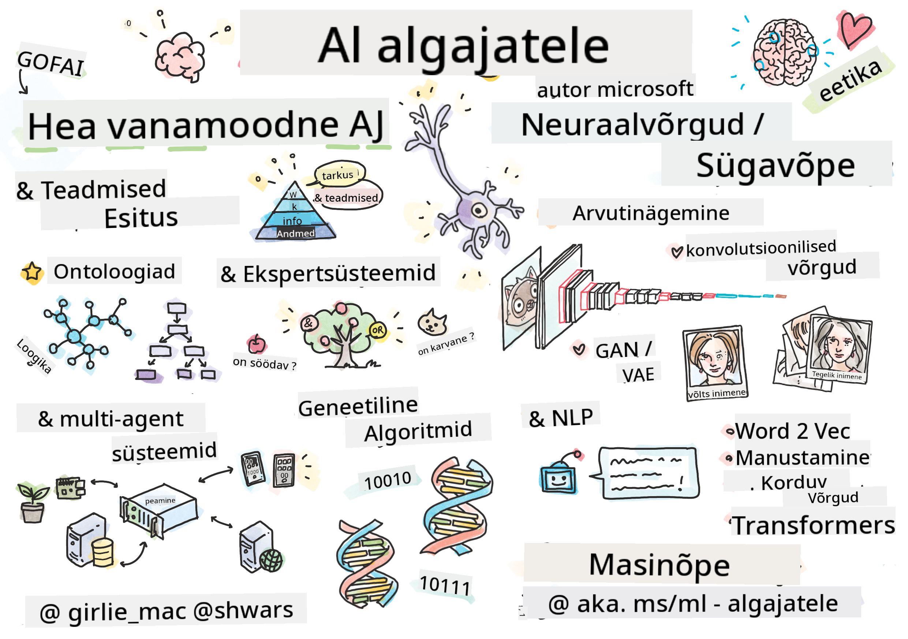

<!--
CO_OP_TRANSLATOR_METADATA:
{
  "original_hash": "14816e97d79b296c87811724f7785923",
  "translation_date": "2026-01-01T13:48:19+00:00",
  "source_file": "README.md",
  "language_code": "et"
}
-->

# Tehisintellekt alustajatele - õppekava

||
|:---:|
| AI For Beginners - _Sketchnote autorilt [@girlie_mac](https://twitter.com/girlie_mac)_ |

Uurige **tehisintellekti** (AI) maailma meie 12-nädalase, 24-õppetunniga õppekavaga! See sisaldab praktilisi tunde, viktoriine ja laboreid. Õppekava sobib algajatele ning käsitleb tööriistu nagu TensorFlow ja PyTorch ning ka tehisintellekti eetikat.

### 🌐 Mitmekeelne tugi

#### Toetatakse GitHub Actioni kaudu (automaatselt ja alati ajakohane)

<!-- CO-OP TRANSLATOR LANGUAGES TABLE START -->
[araabia](../ar/README.md) | [bengali](../bn/README.md) | [bulgaaria](../bg/README.md) | [birma (Myanmar)](../my/README.md) | [hiina (lihtsustatud)](../zh/README.md) | [hiina (traditsiooniline, Hongkong)](../hk/README.md) | [hiina (traditsiooniline, Macao)](../mo/README.md) | [hiina (traditsiooniline, Taiwan)](../tw/README.md) | [horvaadi](../hr/README.md) | [tšehhi](../cs/README.md) | [taani](../da/README.md) | [hollandi](../nl/README.md) | [eesti](./README.md) | [soome](../fi/README.md) | [prantsuse](../fr/README.md) | [saksa](../de/README.md) | [kreeka](../el/README.md) | [heebrea](../he/README.md) | [hindi](../hi/README.md) | [ungari](../hu/README.md) | [indoneesia](../id/README.md) | [itaalia](../it/README.md) | [jaapani](../ja/README.md) | [kannada](../kn/README.md) | [korea](../ko/README.md) | [leedu](../lt/README.md) | [malai](../ms/README.md) | [malayalam](../ml/README.md) | [marathi](../mr/README.md) | [nepali](../ne/README.md) | [Nigeeria pidžin](../pcm/README.md) | [norra](../no/README.md) | [pärsia (farsi)](../fa/README.md) | [poola](../pl/README.md) | [portugali (Brasiilia)](../br/README.md) | [portugali (Portugal)](../pt/README.md) | [punjabi (Gurmukhi)](../pa/README.md) | [rumeenia](../ro/README.md) | [vene](../ru/README.md) | [serbia (kirillitsa)](../sr/README.md) | [slovaki](../sk/README.md) | [sloveeni](../sl/README.md) | [hispaania](../es/README.md) | [suahiili](../sw/README.md) | [rootsi](../sv/README.md) | [tagalogi (filipiino)](../tl/README.md) | [tamil](../ta/README.md) | [telugu](../te/README.md) | [tai](../th/README.md) | [türgi](../tr/README.md) | [ukraina](../uk/README.md) | [urdu](../ur/README.md) | [vietnami](../vi/README.md)
<!-- CO-OP TRANSLATOR LANGUAGES TABLE END -->

**Kui soovite, et toetataks täiendavaid tõlkeid, on toetatud keeled loetletud [siin](https://github.com/Azure/co-op-translator/blob/main/getting_started/supported-languages.md)**

## Liitu kogukonnaga

## Mida sa õpid

**[Kursuse mõttekaart](http://soshnikov.com/courses/ai-for-beginners/mindmap.html)**

Selles õppekavas õpid sa:

* Erinevaid lähenemisi tehisintellektile, sealhulgas „hea vana“ sümboolset lähenemist koos **teadmiste esindamise** ja järeldamisega ([GOFAI](https://en.wikipedia.org/wiki/Symbolic_artificial_intelligence)).
* **Närvivõrgud** ja **sügavõpe**, mis on kaasaegse AI tuum. Me illustreerime nende oluliste teemade taga olevaid kontseptsioone koodi abil kahes populaarseimas raamistikus - [TensorFlow](http://Tensorflow.org) ja [PyTorch](http://pytorch.org).
* **Neuraalarhitektuurid** piltide ja teksti töötlemiseks. Käsitleme viimaseid mudeleid, kuid võime olla mõnevõrra maas tipptasemest.
* Vähem levinud AI-lähenemisi, nagu **geneetilised algoritmid** ja **mitmeagendi süsteemid**.

Mida me selles õppekavas ei käsitle:

> [Leidke kõik täiendavad selle kursuse ressursid meie Microsoft Learn kollektsioonist](https://learn.microsoft.com/en-us/collections/7w28iy2xrqzdj0?WT.mc_id=academic-77998-bethanycheum)

* Äripõhised juhtumiuuringud tehisintellekti kasutamisest. Kaaluge Microsoft Learn'is õppeteekide [Sissejuhatus AI ärikasutajatele](https://docs.microsoft.com/learn/paths/introduction-ai-for-business-users/?WT.mc_id=academic-77998-bethanycheum) läbimist või [AI Business School](https://www.microsoft.com/ai/ai-business-school/?WT.mc_id=academic-77998-bethanycheum) kursust, mis on välja töötatud koostöös [INSEAD](https://www.insead.edu/)-iga.
* **Klassikaline masinõpe**, mis on hästi kirjeldatud meie [Masinõpe algajatele - õppekava](http://github.com/Microsoft/ML-for-Beginners).
* Praktilised AI rakendused, mis on ehitatud kasutades **[Cognitive Services](https://azure.microsoft.com/services/cognitive-services/?WT.mc_id=academic-77998-bethanycheum)**. Selleks soovitame alustada Microsoft Learn'i moodulitest arvutinägemise jaoks ([vision](https://docs.microsoft.com/learn/paths/create-computer-vision-solutions-azure-cognitive-services/?WT.mc_id=academic-77998-bethanycheum)), loomuliku keele töötluse jaoks ([natural language processing](https://docs.microsoft.com/learn/paths/explore-natural-language-processing/?WT.mc_id=academic-77998-bethanycheum)), **[Generatiivne AI Azure OpenAI teenusega](https://learn.microsoft.com/en-us/training/paths/develop-ai-solutions-azure-openai/?WT.mc_id=academic-77998-bethanycheum)** ja teistelt.
* Spetsiifilised ML **pilveraamistikud**, nagu [Azure Machine Learning](https://azure.microsoft.com/services/machine-learning/?WT.mc_id=academic-77998-bethanycheum), [Microsoft Fabric](https://learn.microsoft.com/en-us/training/paths/get-started-fabric/?WT.mc_id=academic-77998-bethanycheum), või [Azure Databricks](https://docs.microsoft.com/learn/paths/data-engineer-azure-databricks?WT.mc_id=academic-77998-bethanycheum). Kaaluge Microsoft Learn'i õppeteid [Build and operate machine learning solutions with Azure Machine Learning](https://docs.microsoft.com/learn/paths/build-ai-solutions-with-azure-ml-service/?WT.mc_id=academic-77998-bethanycheum) ja [Build and Operate Machine Learning Solutions with Azure Databricks](https://docs.microsoft.com/learn/paths/build-operate-machine-learning-solutions-azure-databricks/?WT.mc_id=academic-77998-bethanycheum).
* **Vestluslik AI** ja **vestlusrobotid**. Selle kohta on eraldi õppeteek [Create conversational AI solutions](https://docs.microsoft.com/learn/paths/create-conversational-ai-solutions/?WT.mc_id=academic-77998-bethanycheum), ning lisateabe saamiseks võite vaadata ka [seda blogipostitust](https://soshnikov.com/azure/hello-bot-conversational-ai-on-microsoft-platform/).
* **Sügav matemaatika** sügava õppimise taga. Selle jaoks soovitame raamatu [Deep Learning](https://www.amazon.com/Deep-Learning-Adaptive-Computation-Machine/dp/0262035618) autoritelt Ian Goodfellow, Yoshua Bengio ja Aaron Courville, mis on saadaval ka veebis aadressil [https://www.deeplearningbook.org/](https://www.deeplearningbook.org/).

Õrnemaks sissejuhatuseks pilves AI teemadesse võite kaaluda õppeteed [Get started with artificial intelligence on Azure](https://docs.microsoft.com/learn/paths/get-started-with-artificial-intelligence-on-azure/?WT.mc_id=academic-77998-bethanycheum).

# Sisu

|     |                                                                 Loengu link                                                                  |                                           PyTorch/Keras/TensorFlow                                          | Labor                                                            |
| :-: | :------------------------------------------------------------------------------------------------------------------------------------------: | :---------------------------------------------------------------------------------------------: | ------------------------------------------------------------------------------ |
| 0  |                                 [Kursuse häälestus](./lessons/0-course-setup/setup.md)                                 |                      [Seadista oma arenduskeskkond](./lessons/0-course-setup/how-to-run.md)                       |   |
| I  |               [**Sissejuhatus tehisintellekti**](./lessons/1-Intro/README.md)      | | |
| 01  |       [Sissejuhatus ja tehisintellekti ajalugu](./lessons/1-Intro/README.md)       |           -                            | -  |
| II |              **Sümboolne AI**              |
| 02  |       [Teadmiste esindamine ja ekspertsüsteemid](./lessons/2-Symbolic/README.md)       |            [Ekspertsüsteemid](./lessons/2-Symbolic/Animals.ipynb) /  [Ontoloogia](./lessons/2-Symbolic/FamilyOntology.ipynb) /[Kontseptsioonigraaf](./lessons/2-Symbolic/MSConceptGraph.ipynb)                             |  |
| III |                        [**Sissejuhatus närvivõrkudesse**](./lessons/3-NeuralNetworks/README.md) |||
| 03  |                [Perceptron](./lessons/3-NeuralNetworks/03-Perceptron/README.md)                 |                       [Märkmik](./lessons/3-NeuralNetworks/03-Perceptron/Perceptron.ipynb)                      | [Labor](./lessons/3-NeuralNetworks/03-Perceptron/lab/README.md) |
| 04  |                   [Mitmekihiline perceptron ja oma raamistikku loomine](./lessons/3-NeuralNetworks/04-OwnFramework/README.md)                   |        [Märkmik](./lessons/3-NeuralNetworks/04-OwnFramework/OwnFramework.ipynb)        | [Labor](./lessons/3-NeuralNetworks/04-OwnFramework/lab/README.md) |
| 05  |            [Sissejuhatus raamistikesse (PyTorch/TensorFlow) ja üleõppimine](./lessons/3-NeuralNetworks/05-Frameworks/README.md)             |           [PyTorch](./lessons/3-NeuralNetworks/05-Frameworks/IntroPyTorch.ipynb) / [Keras](./lessons/3-NeuralNetworks/05-Frameworks/IntroKeras.ipynb) / [TensorFlow](./lessons/3-NeuralNetworks/05-Frameworks/IntroKerasTF.ipynb)             | [Labor](./lessons/3-NeuralNetworks/05-Frameworks/lab/README.md) |
| IV  |            [**Arvutinägemine**](./lessons/4-ComputerVision/README.md)             | [PyTorch](https://docs.microsoft.com/learn/modules/intro-computer-vision-pytorch/?WT.mc_id=academic-77998-cacaste) / [TensorFlow](https://docs.microsoft.com/learn/modules/intro-computer-vision-TensorFlow/?WT.mc_id=academic-77998-cacaste)| [Avasta arvutinägemine Microsoft Azure'is](https://learn.microsoft.com/en-us/collections/7w28iy2xrqzdj0?WT.mc_id=academic-77998-bethanycheum) |
| 06  |            [Sissejuhatus arvutinägemisse. OpenCV](./lessons/4-ComputerVision/06-IntroCV/README.md)             |           [Märkmik](./lessons/4-ComputerVision/06-IntroCV/OpenCV.ipynb)         | [Labor](./lessons/4-ComputerVision/06-IntroCV/lab/README.md) |
| 07  |            [Konvolutsioonilised närvivõrgud](./lessons/4-ComputerVision/07-ConvNets/README.md) &  [CNN arhitektuurid](./lessons/4-ComputerVision/07-ConvNets/CNN_Architectures.md)             |           [PyTorch](./lessons/4-ComputerVision/07-ConvNets/ConvNetsPyTorch.ipynb) /[TensorFlow](./lessons/4-ComputerVision/07-ConvNets/ConvNetsTF.ipynb)             | [Labor](./lessons/4-ComputerVision/07-ConvNets/lab/README.md) |
| 08  |            [Ettelaaditud võrgud ja ülekandeõpe](./lessons/4-ComputerVision/08-TransferLearning/README.md) and [Treeningutrikid](./lessons/4-ComputerVision/08-TransferLearning/TrainingTricks.md)             |           [PyTorch](./lessons/4-ComputerVision/08-TransferLearning/TransferLearningPyTorch.ipynb) / [TensorFlow](./lessons/3-NeuralNetworks/05-Frameworks/IntroKerasTF.ipynb)             | [Labor](./lessons/4-ComputerVision/08-TransferLearning/lab/README.md) |
| 09  |            [Autoenkooderid ja VAE-d](./lessons/4-ComputerVision/09-Autoencoders/README.md)             |           [PyTorch](./lessons/4-ComputerVision/09-Autoencoders/AutoEncodersPyTorch.ipynb) / [TensorFlow](./lessons/4-ComputerVision/09-Autoencoders/AutoencodersTF.ipynb)             |  |
| 10  |            [Generatiivsed vastandvõrgud & kunstilise stiili ülekandmine](./lessons/4-ComputerVision/10-GANs/README.md)             |           [PyTorch](./lessons/4-ComputerVision/10-GANs/GANPyTorch.ipynb) / [TensorFlow](./lessons/4-ComputerVision/10-GANs/GANTF.ipynb)             |  |
| 11  |            [Objektituvastus](./lessons/4-ComputerVision/11-ObjectDetection/README.md)             |         [TensorFlow](./lessons/4-ComputerVision/11-ObjectDetection/ObjectDetection.ipynb)             | [Labor](./lessons/4-ComputerVision/11-ObjectDetection/lab/README.md) |
| 12  |            [Semantiline segmentimine. U-Net](./lessons/4-ComputerVision/12-Segmentation/README.md)             |           [PyTorch](./lessons/4-ComputerVision/12-Segmentation/SemanticSegmentationPytorch.ipynb) / [TensorFlow](./lessons/4-ComputerVision/12-Segmentation/SemanticSegmentationTF.ipynb)             |  |
| V  |            [**Loodusliku keele töötlus**](./lessons/5-NLP/README.md)             | [PyTorch](https://docs.microsoft.com/learn/modules/intro-natural-language-processing-pytorch/?WT.mc_id=academic-77998-cacaste) /[TensorFlow](https://docs.microsoft.com/learn/modules/intro-natural-language-processing-TensorFlow/?WT.mc_id=academic-77998-cacaste) | [Avasta loodusliku keele töötlus Microsoft Azure'is](https://learn.microsoft.com/en-us/collections/7w28iy2xrqzdj0?WT.mc_id=academic-77998-bethanycheum)|
| 13  |            [Teksti esitus. BoW/TF-IDF](./lessons/5-NLP/13-TextRep/README.md)             |           [PyTorch](https://github.com/microsoft/AI-For-Beginners/blob/main/lessons/5-NLP/13-TextRep/TextRepresentationPyTorch.ipynb) / [TensorFlow](https://github.com/microsoft/AI-For-Beginners/blob/main/lessons/5-NLP/13-TextRep/TextRepresentationTF.ipynb)             | |
| 14  |            [Semantilised sõnavektorid. Word2Vec ja GloVe](./lessons/5-NLP/14-Embeddings/README.md)             |           [PyTorch](https://github.com/microsoft/AI-For-Beginners/blob/main/lessons/5-NLP/14-Embeddings/EmbeddingsPyTorch.ipynb) / [TensorFlow](https://github.com/microsoft/AI-For-Beginners/blob/main/lessons/5-NLP/14-Embeddings/EmbeddingsTF.ipynb)             |  |
| 15  |            [Keelemudeldus. Oma embeddingute treenimine](./lessons/5-NLP/15-LanguageModeling/README.md)             |           [PyTorch](https://github.com/microsoft/AI-For-Beginners/blob/main/lessons/5-NLP/15-LanguageModeling/CBoW-PyTorch.ipynb) / [TensorFlow](https://github.com/microsoft/AI-For-Beginners/blob/main/lessons/5-NLP/15-LanguageModeling/CBoW-TF.ipynb)             | [Labor](./lessons/5-NLP/15-LanguageModeling/lab/README.md) |
| 16  |            [Rekursiivsed närvivõrgud](./lessons/5-NLP/16-RNN/README.md)             |           [PyTorch](https://github.com/microsoft/AI-For-Beginners/blob/main/lessons/5-NLP/16-RNN/RNNPyTorch.ipynb) / [TensorFlow](https://github.com/microsoft/AI-For-Beginners/blob/main/lessons/5-NLP/16-RNN/RNNTF.ipynb)             |  |
| 17  |            [Generatiivsed rekurrentvõrgud](./lessons/5-NLP/17-GenerativeNetworks/README.md)             |           [PyTorch](https://github.com/microsoft/AI-For-Beginners/blob/main/lessons/5-NLP/17-GenerativeNetworks/GenerativePyTorch.ipynb) / [TensorFlow](https://github.com/microsoft/AI-For-Beginners/blob/main/lessons/5-NLP/17-GenerativeNetworks/GenerativeTF.ipynb)             | [Labor](./lessons/5-NLP/17-GenerativeNetworks/lab/README.md) |
| 18  |            [Transformers. BERT.](./lessons/5-NLP/18-Transformers/README.md)             |           [PyTorch](https://github.com/microsoft/AI-For-Beginners/blob/main/lessons/5-NLP/18-Transformers/TransformersPyTorch.ipynb) /[TensorFlow](https://github.com/microsoft/AI-For-Beginners/blob/main/lessons/5-NLP/18-Transformers/TransformersTF.ipynb)             |  |
| 19  |            [Nimetatud üksuste tuvastamine](./lessons/5-NLP/19-NER/README.md)             |           [TensorFlow](https://microsoft.github.io/AI-For-Beginners/lessons/5-NLP/19-NER/NER-TF.ipynb)             | [Labor](./lessons/5-NLP/19-NER/lab/README.md) |
| 20  |            [Suured keelemudelid, promptide programmeerimine ja vähese õppega ülesanded](./lessons/5-NLP/20-LangModels/README.md)             |           [PyTorch](https://microsoft.github.io/AI-For-Beginners/lessons/5-NLP/20-LangModels/GPT-PyTorch.ipynb) | |
| VI |            **Muud tehisintellekti tehnikad** || |
| 21  |            [Geneetilised algoritmid](./lessons/6-Other/21-GeneticAlgorithms/README.md)             |           [Märkmik](./lessons/6-Other/21-GeneticAlgorithms/Genetic.ipynb) | |
| 22  |            [Sügav tugevdamisõpe](./lessons/6-Other/22-DeepRL/README.md)             |           [PyTorch](./lessons/6-Other/22-DeepRL/CartPole-RL-PyTorch.ipynb) /[TensorFlow](./lessons/6-Other/22-DeepRL/CartPole-RL-TF.ipynb)             | [Labor](./lessons/6-Other/22-DeepRL/lab/README.md) |
| 23  |            [Mitmeagendilised süsteemid](./lessons/6-Other/23-MultiagentSystems/README.md)             |  | |
| VII |            **Tehisintellekti eetika** | | |
| 24  |            [Tehisintellekti eetika ja vastutustundlik tehisintellekt](./lessons/7-Ethics/README.md)             |           [Microsoft Learn: Vastutustundliku tehisintellekti põhimõtted](https://docs.microsoft.com/learn/paths/responsible-ai-business-principles/?WT.mc_id=academic-77998-cacaste) | |
| IX  |            **Lisad** | | |
| 25  |            [Mitmemodaalsed võrgud, CLIP ja VQGAN](./lessons/X-Extras/X1-MultiModal/README.md)             |           [Märkmik](./lessons/X-Extras/X1-MultiModal/Clip.ipynb)    | |

## Iga õppetund sisaldab

* Eelnevalt loetav materjal
* Täidetavad Jupyteri märkmikud, mis sageli on spetsiifilised konkreetsele raamistikule (**PyTorch** või **TensorFlow**). Täidetav märkmik sisaldab ka palju teoreetilist materjali, seega teema mõistmiseks peate läbi tegema vähemalt ühe märkmiku versiooni (kas **PyTorch** või **TensorFlow**).
* **Laborid** on saadaval mõnede teemade puhul, mis annavad võimaluse proovida õpitut rakendada konkreetse probleemi lahendamisel.
* Mõned osad sisaldavad linke [**MS Learn**](https://learn.microsoft.com/en-us/collections/7w28iy2xrqzdj0?WT.mc_id=academic-77998-bethanycheum) moodulitele, mis käsitlevad seotud teemasid.

## Alustamine

### 🎯 Uus tehisintellekti alal? Alusta siit!

Kui oled tehisintellektiga täiesti uus ja soovid kiireid praktilisi näiteid, vaata meie [**Algajasõbralikud näited**](./examples/README.md)! Need sisaldavad:

- 🌟 **Hello AI World** - Sinu esimene tehisintellekti programm (mustri tuvastamine)
- 🧠 **Simple Neural Network** - Ehita närvivõrk nullist  
- 🖼️ **Image Classifier** - Klassifitseeri pilte koos põhjalike kommentaaridega
- 💬 **Teksti meeleolu** - analüüsi teksti positiivsust/negatiivsust

Need näited on mõeldud aitama teil tehisintellekti mõisteid mõista enne täieliku õppekava juurde asumist.

### 📚 Täieliku õppekava seadistamine

- Oleme loonud a [seadistustunni](./lessons/0-course-setup/setup.md), et aidata teil arenduskeskkonda seadistada. - Õpetajatele oleme loonud ka [õppekava seadistuse tunni](./lessons/0-course-setup/for-teachers.md)!
- Kuidas [käivitada koodi VSCode'is või Codepace'is](./lessons/0-course-setup/how-to-run.md)

Järgige neid samme:

Fork the Repository: Click on the "Fork" button at the top-right corner of this page.

Klooni hoidla: `git clone https://github.com/microsoft/AI-For-Beginners.git`

Ärge unustage sellele hoidlale tärni (🌟) anda, et seda hiljem kergemini leida.

## Tutvuge teiste õppuritega

Liituge meie [ametliku AI Discordi serveriga](https://aka.ms/genai-discord?WT.mc_id=academic-105485-bethanycheum), et kohtuda ja võrgustuda teiste selle kursuse osalejatega ning saada tuge.

Kui teil on toote tagasisidet või küsimusi ehitamise ajal, külastage meie [Azure AI Foundry arendajate foorumit](https://aka.ms/foundry/forum)

## Viktoriinid 

> **Märkus viktoriinide kohta**: Kõik viktoriinid asuvad Quiz-app kaustas aadressil etc\quiz-app, või [Veebis siin](https://ff-quizzes.netlify.app/) Need on lingitud õppetundidesse; viktoriini rakendust saab käitada lokaalselt või juurutada Azure'i; järgige juhiseid `quiz-app` kaustas. Neid lokaliseeritakse järk-järgult.

## Abi soovitud

Kas teil on ettepanekuid või leidsid kirjavigu või koodivigu? Avage issue või esitage pull request.

## Erilised tänud

* **✍️ Peamine autor:** [Dmitry Soshnikov](http://soshnikov.com), PhD
* **🔥 Toimetaja:** [Jen Looper](https://twitter.com/jenlooper), PhD
* **🎨 Sketchnote'i illustraator:** [Tomomi Imura](https://twitter.com/girlie_mac)
* **✅ Viktoriinide looja:** [Lateefah Bello](https://github.com/CinnamonXI), [MLSA](https://studentambassadors.microsoft.com/)
* **🙏 Põhikontribuendid:** [Evgenii Pishchik](https://github.com/Pe4enIks)

## Muud õppekavad

Meie meeskond toodab ka teisi õppekavu! Vaadake:

<!-- CO-OP TRANSLATOR OTHER COURSES START -->
### LangChain

---

### Azure / Edge / MCP / Agendid

---
 
### Generatiivne AI sari

[-9333EA?style=for-the-badge&labelColor=E5E7EB&color=9333EA)](https://github.com/microsoft/Generative-AI-for-beginners-dotnet?WT.mc_id=academic-105485-koreyst)
[-C084FC?style=for-the-badge&labelColor=E5E7EB&color=C084FC)](https://github.com/microsoft/generative-ai-for-beginners-java?WT.mc_id=academic-105485-koreyst)
[-E879F9?style=for-the-badge&labelColor=E5E7EB&color=E879F9)](https://github.com/microsoft/generative-ai-with-javascript?WT.mc_id=academic-105485-koreyst)

---
 
### Põhialane õpe

---
 
### Copilot sari

<!-- CO-OP TRANSLATOR OTHER COURSES END -->

## Abi saamine

Kui jääte hätta või teil on küsimusi AI-rakenduste ehitamise kohta, liituge teiste õppurite ja kogenud arendajatega aruteludes MCP teemal. See on toetav kogukond, kus küsimused on teretulnud ja teadmisi jagatakse vabalt.

Kui teil on toote tagasisidet või ehitamise käigus vigu, külastage:

---

<!-- CO-OP TRANSLATOR DISCLAIMER START -->
Vastutusest loobumine:
See dokument on tõlgitud tehisintellekti-põhise tõlketeenuse Co-op Translator (https://github.com/Azure/co-op-translator) abil. Kuigi me püüame tagada täpsust, tuleb arvestada, et automatiseeritud tõlked võivad sisaldada vigu või ebatäpsusi. Originaaldokumenti selle algkeeles tuleks pidada autoriteetseks allikaks. Kriitilise teabe puhul on soovitatav kasutada professionaalset inimtõlget. Me ei vastuta arusaamatuste ega väärtõlgenduste eest, mis tulenevad selle tõlke kasutamisest.
<!-- CO-OP TRANSLATOR DISCLAIMER END -->