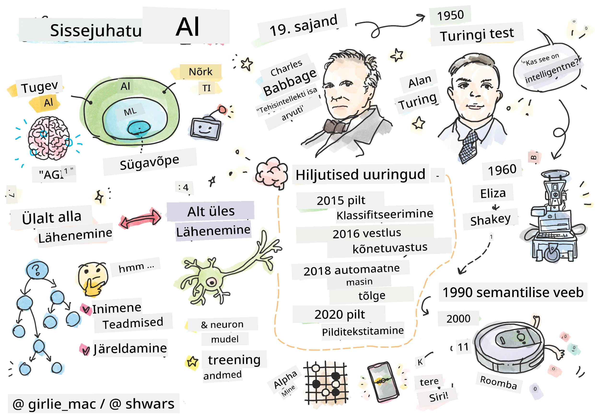
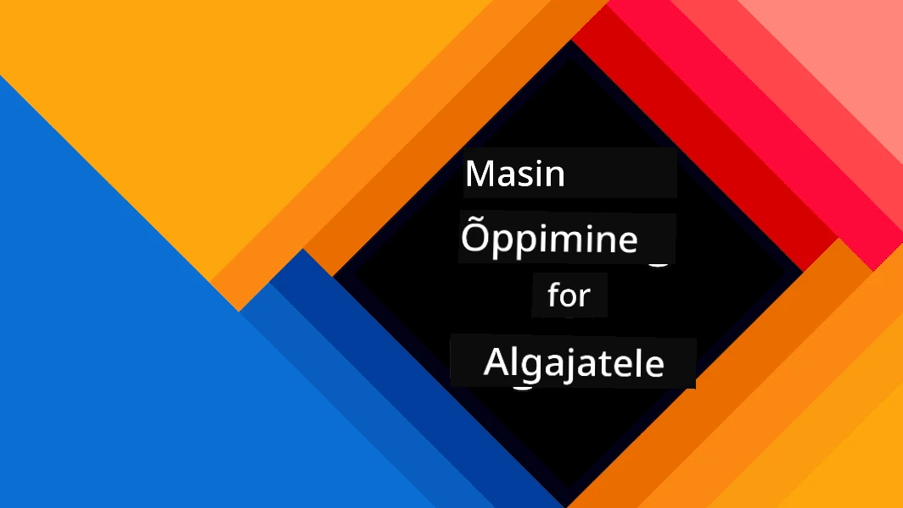
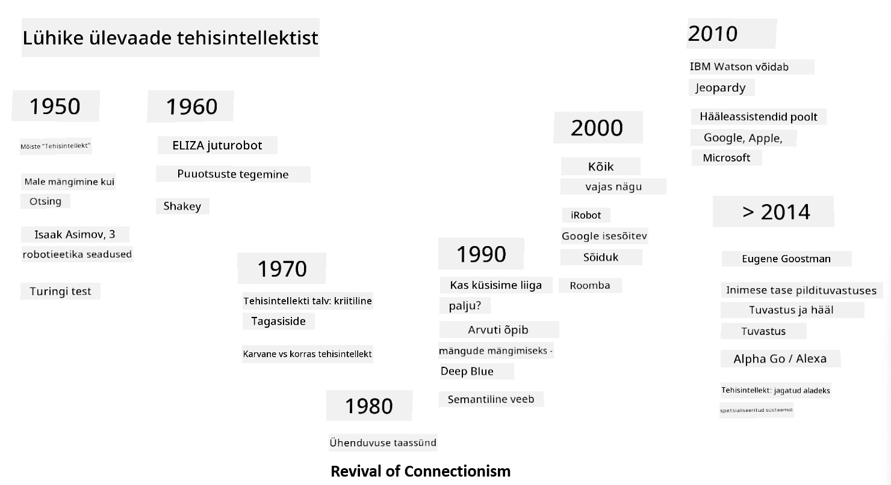
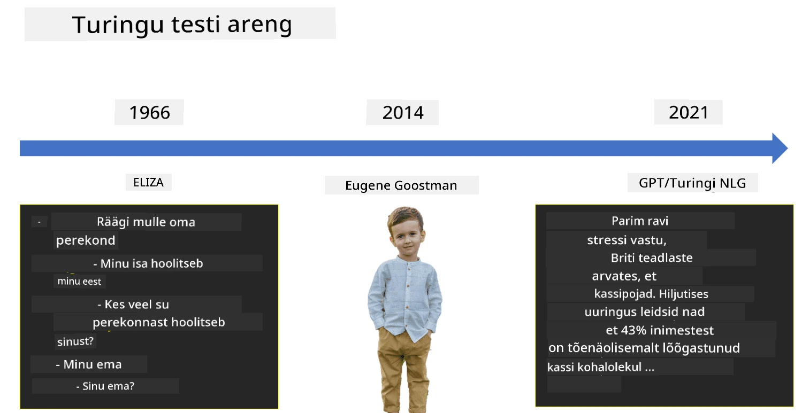

# Sissejuhatus tehisintellekti

> Sketchnote autor: [Tomomi Imura](https://twitter.com/girlie_mac)

## [Eelloengu viktoriin](https://ff-quizzes.netlify.app/en/ai/quiz/1)

**Tehisintellekt** on põnev teadusvaldkond, mis uurib, kuidas panna arvutid käituma intelligentselt, näiteks tegema asju, milles inimesed on osavad.

Algselt leiutas [Charles Babbage](https://en.wikipedia.org/wiki/Charles_Babbage) arvutid, et need töötleksid numbreid kindla protseduuri ehk algoritmi järgi. Kaasaegsed arvutid, kuigi palju arenenumad kui 19. sajandil välja pakutud mudel, järgivad endiselt sama ideed kontrollitud arvutustest. Seega on võimalik programmeerida arvutit midagi tegema, kui me teame täpset sammude jada, mida eesmärgi saavutamiseks vaja on.

> Foto autor: [Vickie Soshnikova](http://twitter.com/vickievalerie)

> ✅ Inimese vanuse määramine tema fotolt on ülesanne, mida ei saa selgesõnaliselt programmeerida, sest me ei tea, kuidas me oma peas selle numbri välja mõtleme.

---

Siiski on ülesandeid, mille lahendamise viisi me ei tea täpselt. Näiteks inimese vanuse määramine tema fotolt. Me õpime seda kuidagi tegema, sest oleme näinud palju erinevas vanuses inimesi, kuid me ei oska selgitada, kuidas me seda teeme, ega ka programmeerida arvutit seda tegema. Just sellised ülesanded ongi **tehisintellekti** (lühendatult TI) huviobjektiks.

✅ Mõtle mõnele ülesandele, mida saaksid arvutile delegeerida ja mis võiks TI-st kasu saada. Mõtle valdkondadele nagu rahandus, meditsiin ja kunst – kuidas need valdkonnad täna TI-st kasu saavad?

## Nõrk TI vs. Tugev TI

Nõrk TI | Tugev TI
---------------------------------------|-------------------------------------
Nõrk TI viitab süsteemidele, mis on loodud ja treenitud konkreetse ülesande või kitsaste ülesannete täitmiseks.|Tugev TI ehk üldine tehisintellekt (AGI) viitab süsteemidele, millel on inimtasemel intelligentsus ja arusaamine.
Need süsteemid ei ole üldiselt intelligentsed; nad on suurepärased kindla ülesande täitmisel, kuid neil puudub tõeline arusaamine või teadvus.|Need süsteemid suudavad täita kõiki intellektuaalseid ülesandeid, mida inimene suudab, kohaneda erinevate valdkondadega ja omada teatud teadvust või eneseteadvust.
Näited nõrgast TI-st on virtuaalsed assistendid nagu Siri või Alexa, voogedastusteenuste soovitusalgoritmid ja klienditeeninduseks mõeldud vestlusrobotid.|Tugeva TI saavutamine on TI uurimise pikaajaline eesmärk ja see nõuaks süsteemide arendamist, mis suudavad mõelda, õppida, mõista ja kohaneda laia ülesannete ja kontekstide valikuga.
Nõrk TI on väga spetsialiseeritud ja sellel puuduvad inimlikud kognitiivsed võimed või üldised probleemilahendusoskused väljaspool oma kitsast valdkonda.|Tugev TI on praegu teoreetiline kontseptsioon ja ükski süsteem pole veel sellise üldise intelligentsuse tasemeni jõudnud.

Lisateabe saamiseks vaata **[Üldine tehisintellekt](https://en.wikipedia.org/wiki/Artificial_general_intelligence)** (AGI).

## Intelligentsuse määratlus ja Turingi test

Üks probleem **[intelligentsuse](https://en.wikipedia.org/wiki/Intelligence)** mõistega tegelemisel on see, et sellel puudub selge määratlus. Võib väita, et intelligentsus on seotud **abstraktse mõtlemise** või **eneseteadvusega**, kuid me ei suuda seda korralikult defineerida.

> [Foto](https://unsplash.com/photos/75715CVEJhI) autor: [Amber Kipp](https://unsplash.com/@sadmax) Unsplashist

Et näha, kui mitmetähenduslik on mõiste *intelligentsus*, proovi vastata küsimusele: "Kas kass on intelligentne?". Erinevad inimesed annavad sellele küsimusele erinevaid vastuseid, kuna puudub universaalselt aktsepteeritud test, mis tõestaks väite tõesust või väärust. Ja kui sa arvad, et selline test on olemas – proovi oma kassi IQ-testiga läbi viia...

✅ Mõtle hetkeks, kuidas sa defineerid intelligentsust. Kas vares, kes suudab lahendada labürindi ja saada toitu, on intelligentne? Kas laps on intelligentne?

---

Kui räägime AGI-st, peame leidma viisi, kuidas kindlaks teha, kas oleme loonud tõeliselt intelligentse süsteemi. [Alan Turing](https://en.wikipedia.org/wiki/Alan_Turing) pakkus välja meetodi nimega **[Turingi test](https://en.wikipedia.org/wiki/Turing_test)**, mis toimib ka intelligentsuse määratlusena. Test võrdleb antud süsteemi millegi olemuslikult intelligentsega – reaalse inimesega, ja kuna automaatset võrdlust saab arvutiprogrammiga petta, kasutame inimküsitlejat. Kui inimene ei suuda tekstipõhises dialoogis eristada reaalset inimest ja arvutisüsteemi, loetakse süsteem intelligentseks.

> Vestlusrobot nimega [Eugene Goostman](https://en.wikipedia.org/wiki/Eugene_Goostman), mis arendati Peterburis, jõudis 2014. aastal Turingi testi läbimisele lähedale, kasutades nutikat isiksuse trikki. See teatas kohe alguses, et on 13-aastane Ukraina poiss, mis selgitas teadmiste puudumist ja mõningaid tekstilisi vastuolusid. Robot veenis 30% kohtunikest, et ta on inimene pärast 5-minutilist dialoogi – see on mõõdik, mille Turing uskus, et masin suudab saavutada aastaks 2000. Siiski tuleb mõista, et see ei tähenda, et oleme loonud intelligentse süsteemi või et arvutisüsteem on petnud inimküsitlejat – süsteem ei petnud inimesi, vaid pigem tegid seda roboti loojad!

✅ Kas sind on kunagi petnud vestlusrobot, nii et arvasid, et räägid inimesega? Kuidas see sind veenis?

## Erinevad lähenemised TI-le

Kui tahame, et arvuti käituks nagu inimene, peame kuidagi modelleerima arvutis meie mõtlemisviisi. Seega peame püüdma mõista, mis teeb inimese intelligentseks.

> Selleks, et programmeerida masinasse intelligentsust, peame mõistma, kuidas meie enda otsustusprotsessid toimivad. Kui teed natuke eneseanalüüsi, mõistad, et mõned protsessid toimuvad alateadlikult – näiteks suudame eristada kassi koerast ilma sellele mõtlemata –, samas kui teised hõlmavad arutlemist.

Selle probleemi lahendamiseks on kaks võimalikku lähenemist:

Ülalt-alla lähenemine (sümboolne arutlemine) | Alt-üles lähenemine (närvivõrgud)
---------------------------------------|-------------------------------------
Ülalt-alla lähenemine modelleerib viisi, kuidas inimene probleemi lahendamiseks arutleb. See hõlmab **teadmiste** eraldamist inimeselt ja nende esitamist arvutile loetaval kujul. Samuti peame välja töötama viisi, kuidas modelleerida **arutlemist** arvutis.|Alt-üles lähenemine modelleerib inimese aju struktuuri, mis koosneb suurest hulgast lihtsatest üksustest, mida nimetatakse **neuroniteks**. Iga neuron toimib oma sisendite kaalutud keskmisena ja me saame treenida neuronivõrku kasulike probleemide lahendamiseks, pakkudes **treeningandmeid**.

On ka teisi võimalikke lähenemisi intelligentsusele:

* **Emergentne**, **sünergeetiline** või **multiagentne lähenemine** põhineb faktil, et keeruline intelligentne käitumine võib tekkida suure hulga lihtsate agentide vastastikmõjust. Vastavalt [evolutsioonilisele küberneetikale](https://en.wikipedia.org/wiki/Global_brain#Evolutionary_cybernetics) võib intelligentsus *tekkida* lihtsamast, reaktiivsest käitumisest *metasüsteemi ülemineku* käigus.

* **Evolutsiooniline lähenemine** või **geneetiline algoritm** on optimeerimisprotsess, mis põhineb evolutsiooni põhimõtetel.

Neid lähenemisi käsitleme kursuse hilisemas osas, kuid praegu keskendume kahele peamisele suunale: ülalt-alla ja alt-üles.

### Ülalt-alla lähenemine

**Ülalt-alla lähenemises** püüame modelleerida oma arutlemist. Kuna suudame oma mõtteid jälgida, kui arutleme, võime proovida seda protsessi formaliseerida ja programmeerida see arvutisse. Seda nimetatakse **sümboolseks arutlemiseks**.

Inimestel on tavaliselt peas mõned reeglid, mis juhivad nende otsustusprotsesse. Näiteks kui arst diagnoosib patsienti, võib ta märgata, et inimesel on palavik, ja järeldada, et kehas võib olla põletik. Rakendades suurt hulka reegleid konkreetsele probleemile, võib arst jõuda lõpliku diagnoosini.

See lähenemine tugineb suuresti **teadmiste esindamisele** ja **arutlemisele**. Teadmiste eraldamine inimspetsialistilt võib olla kõige keerulisem osa, sest arst ei pruugi paljudel juhtudel täpselt teada, miks ta jõuab konkreetse diagnoosini. Mõnikord tekib lahendus lihtsalt tema peas ilma selgesõnalise mõtlemiseta. Mõningaid ülesandeid, näiteks inimese vanuse määramist fotolt, ei saa üldse taandada teadmiste manipuleerimisele.

### Alt-üles lähenemine

Teise võimalusena võime proovida modelleerida meie aju kõige lihtsamaid elemente – neuroneid. Saame arvutis luua nn **tehisnärvivõrgu** ja seejärel proovida õpetada seda probleeme lahendama, andes sellele näiteid. See protsess sarnaneb sellega, kuidas vastsündinud laps õpib oma ümbrust tundma, tehes tähelepanekuid.

✅ Tee natuke uurimistööd selle kohta, kuidas beebid õpivad. Millised on beebi aju põhielemendid?

> | Aga ML?         |      |
> |--------------|-----------|
> | Tehisintellekti osa, mis põhineb arvuti õppimisel probleemi lahendamiseks andmete põhjal, nimetatakse **masinõppeks**. Me ei käsitle selles kursuses klassikalist masinõpet – soovitame tutvuda eraldi [Masinõppe algajatele](http://aka.ms/ml-beginners) õppekavaga. |       |

## Lühike ülevaade TI ajaloost

Tehisintellekt kui valdkond sai alguse 20. sajandi keskel. Alguses oli sümboolne arutlemine valdav lähenemine ja see tõi kaasa mitmeid olulisi edusamme, näiteks ekspertsüsteemid – arvutiprogrammid, mis suutsid tegutseda eksperdina mõnes piiratud probleemivaldkonnas. Kuid peagi sai selgeks, et selline lähenemine ei ole hästi skaleeritav. Teadmiste eraldamine eksperdilt, nende esitamine arvutis ja teadmistebaasi täpsuse säilitamine osutus väga keeruliseks ja paljudel juhtudel liiga kulukaks. See viis nn [TI talveni](https://en.wikipedia.org/wiki/AI_winter) 1970. aastatel.

> Pildi autor: [Dmitry Soshnikov](http://soshnikov.com)

Aja möödudes muutusid arvutusressursid odavamaks ja rohkem andmeid sai kättesaadavaks, mistõttu närvivõrkudel põhinevad lähenemised hakkasid näitama suurepärast jõudlust, konkureerides inimestega paljudes valdkondades, nagu arvutinägemine või kõne mõistmine. Viimase kümnendi jooksul on mõistet tehisintellekt enamasti kasutatud sünonüümina närvivõrkudele, sest enamik TI edusamme, millest me kuuleme, põhinevad neil.

Näeme, kuidas lähenemised muutusid näiteks malemängu arvutiprogrammi loomisel:

* Varased maleprogrammid põhinesid otsingul – programm püüdis selgesõnaliselt hinnata vastase võimalikke käike teatud arvu järgmiste käikude jaoks ja valis optimaalse käigu, lähtudes parimast positsioonist, mida mõne käiguga saavutada saab. See viis nn [alfa-beeta kärpimise](https://en.wikipedia.org/wiki/Alpha%E2%80%93beta_pruning) otsingualgoritmi väljatöötamiseni.
* Otsingustrateegiad töötavad hästi mängu lõpus, kus otsinguruum on piiratud väikese arvu võimalike käikudega. Kuid mängu alguses on otsinguruum tohutu ja algoritmi saab täiustada, õppides olemasolevatest inimeste vahel mängitud partiidest. Järgnevad eksperimendid kasutasid nn [juhtumipõhist arutlemist](https://en.wikipedia.org/wiki/Case-based_reasoning), kus programm otsis teadmistebaasist juhtumeid, mis on mängu praeguse positsiooniga väga sarnased.
* Kaasaegsed programmid, mis võidavad inimeste üle, põhinevad närvivõrkudel ja [tugevdamisõppel](https://en.wikipedia.org/wiki/Reinforcement_learning), kus programmid õpivad mängima, mängides pikka aega iseenda vastu ja õppides oma vigadest – sarnaselt inimestega, kes õpivad malet mängima. Kuid arvutiprogramm suudab mängida palju rohkem mänge palju lühema ajaga ja seega õppida palju kiiremini.

✅ Tee natuke uurimistööd teiste mängude kohta, mida TI on mänginud.

Samamoodi näeme, kuidas lähenemine "rääkivate programmide" (mis võiksid läbida Turingi testi) loomisele on muutunud:

* Sellised varased programmid nagu [Eliza](https://en.wikipedia.org/wiki/ELIZA) põhinesid väga lihtsatel grammatika reeglitel ja sisendlause ümberkujundamisel küsimuseks.
* Kaasaegsed assistendid, nagu Cortana, Siri või Google Assistant, on kõik hübriidsüsteemid, mis kasutavad närvivõrke kõne tekstiks teisendamiseks ja meie kavatsuste tuvastamiseks ning seejärel rakendavad mõningaid arutlusi või selgesõnalisi algoritme vajalike toimingute tegemiseks.
* Tulevikus võime oodata täielikult närvivõrkudel põhinevat mudelit, mis suudab dialoogi iseseisvalt hallata. Hiljutised GPT ja [Turing-NLG](https://www.microsoft.com/research/blog/turing-nlg-a-17-billion-parameter-language-model-by-microsoft) närvivõrkude perekonnad näitavad selles valdkonnas suurt edu.

> Pilt Dmitry Soshnikovilt, [foto](https://unsplash.com/photos/r8LmVbUKgns) autoriks [Marina Abrosimova](https://unsplash.com/@abrosimova_marina_foto), Unsplash

## Viimased tehisintellekti uuringud

Neuraalvõrkude uurimise tohutu kasv algas umbes 2010. aastal, kui avalikud andmekogumid muutusid kättesaadavaks. Suur pildikogu nimega [ImageNet](https://en.wikipedia.org/wiki/ImageNet), mis sisaldab umbes 14 miljonit märgendatud pilti, andis alguse [ImageNeti suurmastaabilisele visuaalse äratundmise väljakutsele](https://image-net.org/challenges/LSVRC/).

> Pilt autorilt [Dmitry Soshnikov](http://soshnikov.com)

2012. aastal kasutati esimest korda [konvolutsioonilisi neuraalvõrke](../4-ComputerVision/07-ConvNets/README.md) pildiklassifikatsioonis, mis tõi kaasa klassifitseerimisvigade olulise vähenemise (peaaegu 30%-lt 16,4%-ni). 2015. aastal saavutas Microsoft Researchi ResNet arhitektuur [inimtasemel täpsuse](https://doi.org/10.1109/ICCV.2015.123).

Sellest ajast alates on neuraalvõrgud näidanud väga edukat käitumist paljudes ülesannetes:

---

Aasta | Inimtasemel täpsus saavutatud
-----|--------
2015 | [Pildiklassifikatsioon](https://doi.org/10.1109/ICCV.2015.123)
2016 | [Vestlusliku kõne äratundmine](https://arxiv.org/abs/1610.05256)
2018 | [Automaatne masintõlge](https://arxiv.org/abs/1803.05567) (hiina keelest inglise keelde)
2020 | [Pildiallkirjastamine](https://arxiv.org/abs/2009.13682)

Viimastel aastatel oleme näinud suuri edusamme suurte keelemudelitega, nagu BERT ja GPT-3. See on juhtunud peamiselt tänu sellele, et on olemas palju üldist tekstipõhist andmestikku, mis võimaldab treenida mudeleid tekstide struktuuri ja tähenduse tabamiseks, neid üldiste tekstikogumite põhjal eeltreenida ning seejärel spetsialiseerida need mudelid konkreetsemateks ülesanneteks. Me õpime [loomuliku keele töötlemise](../5-NLP/README.md) kohta rohkem hiljem selles kursuses.

## 🚀 Väljakutse

Tee internetis ringkäik, et määrata, kus sinu arvates kasutatakse tehisintellekti kõige tõhusamalt. Kas see on kaardirakenduses, kõnest tekstiks teenuses või videomängus? Uuri, kuidas see süsteem on üles ehitatud.

## [Loengu-järgne viktoriin](https://ff-quizzes.netlify.app/en/ai/quiz/2)

## Ülevaade ja iseseisev õppimine

Vaata üle tehisintellekti ja masinõppe ajalugu, lugedes läbi [selle õppetunni](https://github.com/microsoft/ML-For-Beginners/tree/main/1-Introduction/2-history-of-ML). Vali sketšimärkmetest selle õppetunni alguses või siinsest õppetunnist üks element ja uuri seda sügavamalt, et mõista selle arengut mõjutanud kultuurilist konteksti.

**Ülesanne**: [Mängu Jam](assignment.md)

---

<!-- CO-OP TRANSLATOR DISCLAIMER START -->
**Lahtiütlus**:  
See dokument on tõlgitud AI tõlketeenuse [Co-op Translator](https://github.com/Azure/co-op-translator) abil. Kuigi püüame tagada täpsust, palume arvestada, et automaatsed tõlked võivad sisaldada vigu või ebatäpsusi. Algne dokument selle algses keeles tuleks pidada autoriteetseks allikaks. Olulise teabe puhul soovitame kasutada professionaalset inimtõlget. Me ei vastuta selle tõlke kasutamisest tulenevate arusaamatuste või valesti tõlgenduste eest.
<!-- CO-OP TRANSLATOR DISCLAIMER END -->