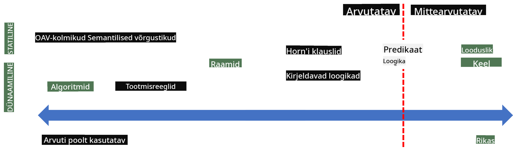
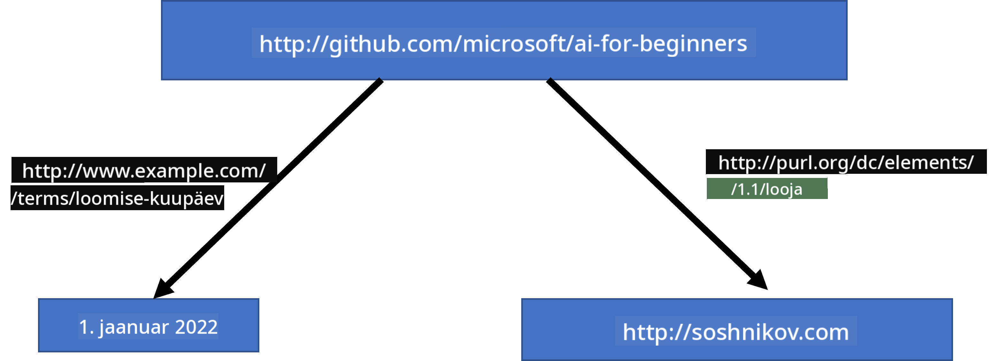

<!--
CO_OP_TRANSLATOR_METADATA:
{
  "original_hash": "7d097f7fda9166ead615e4c34552381b",
  "translation_date": "2025-10-11T11:36:43+00:00",
  "source_file": "lessons/2-Symbolic/README.md",
  "language_code": "et"
}
-->
# Teadmiste esitus ja ekspertsüsteemid


> Sketchnote autorilt [Tomomi Imura](https://twitter.com/girlie_mac)

Tehisintellekti otsing põhineb teadmiste otsimisel, et mõista maailma sarnaselt sellele, kuidas inimesed seda teevad. Aga kuidas seda saavutada?

## [Loengu-eelne viktoriin](https://ff-quizzes.netlify.app/en/ai/quiz/3)

AI varajastel päevadel oli populaarne ülalt-alla lähenemine intelligentsete süsteemide loomisele (arutatud eelmises tunnis). Idee seisnes selles, et teadmised inimestelt tuleb masinloetavasse vormi viia ja seejärel kasutada neid probleemide automaatseks lahendamiseks. See lähenemine põhines kahel suurel ideel:

* Teadmiste esitus
* Järeldamine

## Teadmiste esitus

Üks sümboolse AI olulisi mõisteid on **teadmised**. Oluline on eristada teadmisi *informatsioonist* või *andmetest*. Näiteks võib öelda, et raamatud sisaldavad teadmisi, sest nende uurimine võib muuta inimese eksperdiks. Kuid tegelikult sisaldavad raamatud *andmeid*, ja raamatute lugemise ning nende andmete integreerimise kaudu meie maailmamudelisse muudame need andmed teadmiseks.

> ✅ **Teadmised** on midagi, mis on meie peas ja esindab meie arusaamist maailmast. Need saadakse aktiivse **õppimise** protsessi kaudu, mis integreerib saadud informatsiooni meie aktiivsesse maailmamudelisse.

Enamasti me ei defineeri teadmisi rangelt, vaid seostame neid teiste seotud mõistetega, kasutades [DIKW püramiidi](https://en.wikipedia.org/wiki/DIKW_pyramid). See sisaldab järgmisi mõisteid:

* **Andmed** on midagi, mis on esitatud füüsilises meedias, nagu kirjutatud tekst või räägitud sõnad. Andmed eksisteerivad sõltumatult inimestest ja neid saab inimestele edasi anda.
* **Informatsioon** on see, kuidas me andmeid oma peas tõlgendame. Näiteks, kui kuuleme sõna *arvuti*, on meil mingi arusaam, mis see on.
* **Teadmised** on informatsioon, mis on integreeritud meie maailmamudelisse. Näiteks, kui õpime, mis on arvuti, hakkame mõistma, kuidas see töötab, kui palju see maksab ja milleks seda saab kasutada. See omavahel seotud mõistete võrgustik moodustab meie teadmised.
* **Tarkus** on veel üks tasand meie arusaamisest maailmast ja esindab *meta-teadmisi*, näiteks arusaama, kuidas ja millal teadmisi kasutada.


*Pilt [Wikipedia-st](https://commons.wikimedia.org/w/index.php?curid=37705247), autor Longlivetheux - Oma töö, CC BY-SA 4.0*

Seega on **teadmiste esitamise** probleem leida tõhus viis teadmiste esitamiseks arvutis andmete kujul, et neid automaatselt kasutada. Seda võib vaadelda spektrina:



> Pilt autorilt [Dmitry Soshnikov](http://soshnikov.com)

* Vasakul on väga lihtsad teadmiste esitamise tüübid, mida arvutid saavad tõhusalt kasutada. Lihtsaim neist on algoritmiline, kus teadmised esitatakse arvutiprogrammi kujul. See pole aga parim viis teadmiste esitamiseks, kuna see pole paindlik. Meie peas olevad teadmised on sageli mittealgoritmilised.
* Paremal on esitusviisid nagu loomulik tekst. See on kõige võimsam, kuid ei sobi automaatseks järeldamiseks.

> ✅ Mõtle hetkeks, kuidas sa esitad teadmisi oma peas ja muudad need märkmeteks. Kas on olemas konkreetne formaat, mis aitab sul paremini meelde jätta?

## Arvutite teadmiste esitamise klassifikatsioon

Erinevaid arvutite teadmiste esitamise meetodeid saab klassifitseerida järgmistesse kategooriatesse:

* **Võrguesitused** põhinevad faktil, et meie peas on omavahel seotud mõistete võrgustik. Me võime proovida luua sama võrgustikku graafina arvutis - nn **semantiline võrgustik**.

1. **Objekt-atribuut-väärtus kolmikud** või **atribuut-väärtus paarid**. Kuna graafi saab arvutis esitada sõlmede ja servade loendina, saame semantilist võrgustikku esitada kolmikute loendina, mis sisaldavad objekte, atribuute ja väärtusi. Näiteks loome järgmised kolmikud programmeerimiskeelte kohta:

Objekt | Atribuut | Väärtus
-------|----------|-------
Python | on | Tüübita keel
Python | leiutatud | Guido van Rossum
Python | ploki süntaks | taanded
Tüübita keel | ei sisalda | tüübimääratlusi

> ✅ Mõtle, kuidas kolmikuid saab kasutada teiste teadmiste tüüpide esitamiseks.

2. **Hierarhilised esitused** rõhutavad fakti, et me loome sageli oma peas objektide hierarhia. Näiteks teame, et kanaarilind on lind ja kõik linnud omavad tiibu. Samuti on meil mingi ettekujutus, mis värvi kanaarilinnud tavaliselt on ja milline on nende lennukiirus.

   - **Raamiesitus** põhineb iga objekti või objektiklassi esitamisel **raamina**, mis sisaldab **pesi**. Pesadel on võimalikud vaikimisi väärtused, väärtuste piirangud või salvestatud protseduurid, mida saab kasutada pesa väärtuse saamiseks. Kõik raamid moodustavad hierarhia, mis sarnaneb objektide hierarhiaga objektorienteeritud programmeerimiskeeltes.
   - **Stsenaariumid** on eriline raamide tüüp, mis esindab keerulisi olukordi, mis võivad aja jooksul areneda.

**Python**

Pesa | Väärtus | Vaikimisi väärtus | Intervall |
-----|--------|-------------------|----------|
Nimi | Python | | |
On | Tüübita keel | | |
Muutuja vorm | | CamelCase | |
Programmi pikkus | | | 5-5000 rida |
Ploki süntaks | Taanded | | |

3. **Protseduurilised esitused** põhinevad teadmiste esitamisel tegevuste loendina, mida saab teatud tingimuse korral täita.
   - Tootmisreeglid on if-then laused, mis võimaldavad meil järeldusi teha. Näiteks võib arstil olla reegel, mis ütleb, et **KUI** patsiendil on kõrge palavik **VÕI** kõrge C-reaktiivse valgu tase vereanalüüsis, **SIIS** tal on põletik. Kui kohtame ühte tingimustest, saame teha järelduse põletiku kohta ja kasutada seda edasiseks järeldamiseks.
   - Algoritme võib pidada teiseks protseduurilise esituse vormiks, kuigi neid peaaegu kunagi ei kasutata otse teadmistepõhistes süsteemides.

4. **Loogika** pakkus algselt välja Aristoteles universaalsete inimteadmiste esitamise viisina.
   - Predikaatloogika kui matemaatiline teooria on liiga rikkalik, et olla arvutatav, seetõttu kasutatakse tavaliselt selle alamhulka, näiteks Horni klausleid, mida kasutatakse Prologis.
   - Kirjeldav loogika on loogikasüsteemide perekond, mida kasutatakse objektide hierarhiate ja hajutatud teadmiste esituste, näiteks *semantilise veebi*, esitamiseks ja järeldamiseks.

## Ekspertsüsteemid

Sümboolse AI varajased edusammud olid nn **ekspertsüsteemid** - arvutisüsteemid, mis olid loodud tegutsema eksperdina mõnes piiratud probleemivaldkonnas. Need põhinesid **teadmistebaasil**, mis oli saadud ühelt või mitmelt inimeksperdilt, ja sisaldasid **järeldusmootorit**, mis tegi selle põhjal järeldusi.

 | 
---------------------------------------------|------------------------------------------------
Lihtsustatud inimese närvisüsteemi struktuur | Teadmistepõhise süsteemi arhitektuur

Ekspertsüsteemid on ehitatud nagu inimese järeldussüsteem, mis sisaldab **lühiajalist mälu** ja **pikaajalist mälu**. Samamoodi eristame teadmistepõhistes süsteemides järgmisi komponente:

* **Probleemimälu**: sisaldab teadmisi praegu lahendatavast probleemist, nt patsiendi temperatuur või vererõhk, kas tal on põletik või mitte jne. Neid teadmisi nimetatakse ka **staatilisteks teadmiseks**, kuna need sisaldavad hetkeolukorra teadmist - nn *probleemi seisundit*.
* **Teadmistebaas**: esindab pikaajalisi teadmisi probleemivaldkonna kohta. See saadakse käsitsi inimekspertidelt ja ei muutu konsultatsioonist konsultatsioonini. Kuna see võimaldab meil liikuda ühest probleemiseisundist teise, nimetatakse seda ka **dünaamiliseks teadmiseks**.
* **Järeldusmootor**: korraldab kogu protsessi probleemiseisundi ruumis otsimiseks, vajadusel kasutajalt küsimuste küsimiseks. See vastutab ka iga seisundi jaoks sobivate reeglite leidmise eest.

Näiteks vaatame järgmist ekspertsüsteemi, mis määrab looma füüsiliste omaduste põhjal:


> Pilt autorilt [Dmitry Soshnikov](http://soshnikov.com)

See diagramm on nn **AND-OR puu**, ja see on tootmisreeglite graafiline esitus. Puu joonistamine on kasulik eksperdilt teadmiste hankimise alguses. Teadmiste esitamiseks arvutis on mugavam kasutada reegleid:

```
IF the animal eats meat
OR (animal has sharp teeth
    AND animal has claws
    AND animal has forward-looking eyes
) 
THEN the animal is a carnivore
```

Võite märgata, et iga tingimus reegli vasakul küljel ja tegevus on sisuliselt objekt-atribuut-väärtus (OAV) kolmikud. **Töömälus** on OAV kolmikute komplekt, mis vastab praegu lahendatavale probleemile. **Reeglimootor** otsib reegleid, mille tingimus on täidetud, ja rakendab neid, lisades töömällu uue kolmiku.

> ✅ Joonista oma AND-OR puu teemal, mis sulle meeldib!

### Edasi- ja tagasijäreldamine

Ülal kirjeldatud protsessi nimetatakse **edasi järeldamiseks**. See algab mõne algandmega probleemi kohta, mis on töömälus, ja seejärel täidab järgmise järeldamisringi:

1. Kui sihtatribuut on töömälus olemas - peatu ja anna tulemus
2. Otsi kõik reeglid, mille tingimus on praegu täidetud - moodusta **konfliktikomplekt** reeglitest.
3. Teosta **konfliktide lahendamine** - vali üks reegel, mida sellel sammul täidetakse. Võib olla erinevaid konfliktide lahendamise strateegiaid:
   - Vali esimene rakendatav reegel teadmistebaasis
   - Vali juhuslik reegel
   - Vali *spetsiifilisem* reegel, st see, mis vastab kõige rohkem tingimustele reegli "vasakul küljel" (LHS)
4. Rakenda valitud reegel ja lisa uus teadmistükk probleemiseisundisse
5. Korda alates sammust 1.

Kuid mõnel juhul võime soovida alustada probleemist teadmata ja esitada küsimusi, mis aitavad meil järelduseni jõuda. Näiteks meditsiinilise diagnoosi tegemisel ei tee me tavaliselt kõiki meditsiinilisi analüüse ette enne patsiendi diagnoosimist. Pigem tahame analüüse teha, kui otsus tuleb langetada.

Seda protsessi saab modelleerida **tagasijäreldamise** abil. Seda juhib **eesmärk** - atribuudi väärtus, mida me otsime:

1. Vali kõik reeglid, mis võivad anda meile eesmärgi väärtuse (st eesmärk reegli paremal küljel (RHS)) - konfliktikomplekt
1. Kui selle atribuudi jaoks pole reegleid või on reegel, mis ütleb, et peaksime kasutajalt väärtust küsima - küsi seda, muidu:
1. Kasuta konfliktide lahendamise strateegiat, et valida üks reegel, mida me kasutame *hüpoteesina* - proovime seda tõestada
1. Korda protsessi rekursiivselt kõigi reegli vasakul küljel olevate atribuutide jaoks, püüdes neid eesmärkidena tõestada
1. Kui protsess mingil hetkel ebaõnnestub - kasuta sammus 3 teist reeglit.

> ✅ Millistes olukordades on edasi järeldamine sobivam? Aga tagasijäreldamine?

### Ekspertsüsteemide rakendamine

Ekspertsüsteeme saab rakendada erinevate tööriistade abil:

* Programmeerides neid otse mõnes kõrgetasemelises programmeerimiskeeles. See pole parim idee, kuna teadmistepõhise süsteemi peamine eelis on see, et teadmised on järeldusest eraldatud ja potentsiaalselt peaks probleemivaldkonna ekspert suutma reegleid kirjutada ilma järeldusprotsessi üksikasju mõistmata.
* Kasutades **ekspertsüsteemi kesta**, st süsteemi, mis on spetsiaalselt loodud teadmiste täitmiseks, kasutades mõnda teadmiste esitamise keelt.

## ✍️ Harjutus: Loomade järeldamine

Vaata [Animals.ipynb](https://github.com/microsoft/AI-For-Beginners/blob/main/lessons/2-Symbolic/Animals.ipynb) näidet edasi- ja tagasijäreldamise ekspertsüsteemi rakendamisest.

> **Märkus**: See näide on üsna lihtne ja annab ainult ettekujutuse, kuidas ekspertsüsteem välja näeb. Kui hakkate sellist süsteemi looma, märkate *intelligentset* käitumist alles siis, kui jõuate teatud arvu reegliteni, umbes 200+. Mingil hetkel muutuvad reeglid liiga keerukaks, et kõiki neid meeles pidada, ja siis võite hakata mõtlema, miks süsteem teeb teatud otsuseid. Kuid teadmistepõhiste süsteemide oluline omadus on see, et saate alati *selgitada*, kuidas ükskõik milline otsus tehti.

## Ontoloogiad ja semantiline veeb

20. sajandi lõpus oli algatus kasutada teadmiste esitamist Interneti ressursside märgistamiseks, et oleks võimalik leida ressursse, mis vastavad väga spetsiifilistele päringutele. Seda liikumist nimetati **semantiliseks veebiks**, ja see tugines mitmele kontseptsioonile:

- Eriline teadmiste esitus, mis põhineb **[kirjeldusloogikal](https://en.wikipedia.org/wiki/Description_logic)** (DL). See sarnaneb raamiesitusega, kuna loob objektide hierarhia omadustega, kuid sellel on formaalne loogiline semantika ja järeldus. DL-de perekond tasakaalustab väljendusrikkuse ja järelduse algoritmilise keerukuse vahel.
- Hajutatud teadmiste esitus, kus kõik mõisted esitatakse globaalse URI identifikaatoriga, võimaldades luua teadmiste hierarhiaid, mis ulatuvad üle interneti.
- XML-põhiste keelte perekond teadmiste kirjeldamiseks: RDF (Resource Description Framework), RDFS (RDF Schema), OWL (Ontology Web Language).

Semantilise veebi keskne mõiste on **ontoloogia**. See viitab probleemivaldkonna selgesõnalisele spetsifikatsioonile, kasutades mõnda formaalset teadmiste esitusviisi. Lihtsaim ontoloogia võib olla lihtsalt objektide hierarhia probleemivaldkonnas, kuid keerukamad ontoloogiad sisaldavad reegleid, mida saab kasutada järelduste tegemiseks.

Semantilises veebis põhinevad kõik esitusviisid kolmikutel. Iga objekt ja iga seos on unikaalselt identifitseeritud URI abil. Näiteks, kui soovime väita, et see AI õppekava on koostanud Dmitry Soshnikov 1. jaanuaril 2022, siis siin on kolmikud, mida saame kasutada:



```
http://github.com/microsoft/ai-for-beginners http://www.example.com/terms/creation-date “Jan 13, 2007”
http://github.com/microsoft/ai-for-beginners http://purl.org/dc/elements/1.1/creator http://soshnikov.com
```

> ✅ Siin `http://www.example.com/terms/creation-date` ja `http://purl.org/dc/elements/1.1/creator` on mõned tuntud ja universaalselt aktsepteeritud URI-d, et väljendada *looja* ja *loomiskuupäeva* mõisteid.

Keerukamal juhul, kui soovime määratleda loojate nimekirja, saame kasutada RDF-is määratletud andmestruktuure.


> Ülaltoodud diagrammid: [Dmitry Soshnikov](http://soshnikov.com)

Semantilise veebi arendamine aeglustus mingil määral otsingumootorite ja loomuliku keele töötlemise tehnikate edu tõttu, mis võimaldavad tekstist struktureeritud andmeid välja võtta. Kuid mõnes valdkonnas tehakse endiselt märkimisväärseid jõupingutusi ontoloogiate ja teadmistebaaside säilitamiseks. Mõned tähelepanuväärsed projektid:

* [WikiData](https://wikidata.org/) on masinloetavate teadmistebaaside kogum, mis on seotud Wikipediaga. Enamik andmeid on kaevandatud Wikipedia *InfoBoxidest*, struktureeritud sisust Wikipedia lehtedel. Wikidatat saab [pärida](https://query.wikidata.org/) SPARQL-i abil, mis on semantilise veebi jaoks mõeldud päringukeel. Siin on näidis päring, mis kuvab inimeste seas populaarseimad silmavärvid:

```sparql
#defaultView:BubbleChart
SELECT ?eyeColorLabel (COUNT(?human) AS ?count)
WHERE
{
  ?human wdt:P31 wd:Q5.       # human instance-of homo sapiens
  ?human wdt:P1340 ?eyeColor. # human eye-color ?eyeColor
  SERVICE wikibase:label { bd:serviceParam wikibase:language "en". }
}
GROUP BY ?eyeColorLabel
```

* [DBpedia](https://www.dbpedia.org/) on sarnane projekt WikiDataga.

> ✅ Kui soovite katsetada oma ontoloogiate loomist või olemasolevate avamist, on suurepärane visuaalne ontoloogia redaktor nimega [Protégé](https://protege.stanford.edu/). Laadige see alla või kasutage seda veebis.


*Web Protégé redaktor avatud Romanovite perekonna ontoloogiaga. Ekraanipilt: Dmitry Soshnikov*

## ✍️ Harjutus: Perekonna ontoloogia

Vaadake [FamilyOntology.ipynb](https://github.com/Ezana135/AI-For-Beginners/blob/main/lessons/2-Symbolic/FamilyOntology.ipynb) näidet semantilise veebi tehnikate kasutamisest perekondlike suhete analüüsimiseks. Võtame perekonna puu, mis on esitatud tavalises GEDCOM formaadis, ja perekondlike suhete ontoloogia ning loome graafi kõigist perekondlikest suhetest antud isikute komplekti jaoks.

## Microsofti kontseptsioonigraaf

Enamasti luuakse ontoloogiad hoolikalt käsitsi. Kuid ontoloogiaid on võimalik ka **kaevandada** struktureerimata andmetest, näiteks loomuliku keele tekstidest.

Üks selline katse tehti Microsoft Researchi poolt ja tulemuseks oli [Microsoft Concept Graph](https://blogs.microsoft.com/ai/microsoft-researchers-release-graph-that-helps-machines-conceptualize/?WT.mc_id=academic-77998-cacaste).

See on suur kogum entiteete, mis on rühmitatud `is-a` pärilikkussuhete abil. See võimaldab vastata küsimustele nagu "Mis on Microsoft?" - vastus oleks midagi sellist nagu "ettevõte tõenäosusega 0.87 ja bränd tõenäosusega 0.75".

Graaf on saadaval kas REST API-na või suure allalaaditava tekstifailina, mis loetleb kõik entiteetide paarid.

## ✍️ Harjutus: Kontseptsioonigraaf

Proovige [MSConceptGraph.ipynb](https://github.com/microsoft/AI-For-Beginners/blob/main/lessons/2-Symbolic/MSConceptGraph.ipynb) märkmikku, et näha, kuidas saame kasutada Microsofti kontseptsioonigraafi uudisteartiklite rühmitamiseks mitmesse kategooriasse.

## Kokkuvõte

Tänapäeval peetakse AI-d sageli *masinõppe* või *närvivõrkude* sünonüümiks. Kuid inimene näitab ka selgesõnalist arutlemist, mis on midagi, mida närvivõrgud praegu ei käsitle. Päriselu projektides kasutatakse selgesõnalist arutlemist endiselt ülesannete täitmiseks, mis nõuavad selgitusi või süsteemi käitumise kontrollitud viisil muutmist.

## 🚀 Väljakutse

Perekonna ontoloogia märkmikus, mis on seotud selle õppetunniga, on võimalus katsetada teiste perekondlike suhetega. Proovige avastada uusi seoseid inimeste vahel perekonna puus.

## [Loengu järgne viktoriin](https://ff-quizzes.netlify.app/en/ai/quiz/4)

## Ülevaade ja iseseisev õpe

Tehke internetis uurimistööd, et avastada valdkondi, kus inimesed on püüdnud teadmisi kvantifitseerida ja kodeerida. Vaadake Bloom'i taksonoomiat ja minge ajaloos tagasi, et õppida, kuidas inimesed püüdsid oma maailma mõista. Uurige Linnaeuse tööd organismide taksonoomia loomiseks ja jälgige, kuidas Dmitri Mendelejev lõi viisi keemiliste elementide kirjeldamiseks ja rühmitamiseks. Milliseid huvitavaid näiteid veel leiate?

**Ülesanne**: [Loo ontoloogia](assignment.md)

---

**Lahtiütlus**:  
See dokument on tõlgitud tehisintellekti tõlketeenuse [Co-op Translator](https://github.com/Azure/co-op-translator) abil. Kuigi püüame tagada tõlke täpsuse, palume arvestada, et automaatsed tõlked võivad sisaldada vigu või ebatäpsusi. Algne dokument selle algses keeles tuleks lugeda autoriteetseks allikaks. Olulise teabe puhul soovitame kasutada professionaalset inimtõlget. Me ei vastuta selle tõlke kasutamisest tulenevate arusaamatuste või valede tõlgenduste eest.