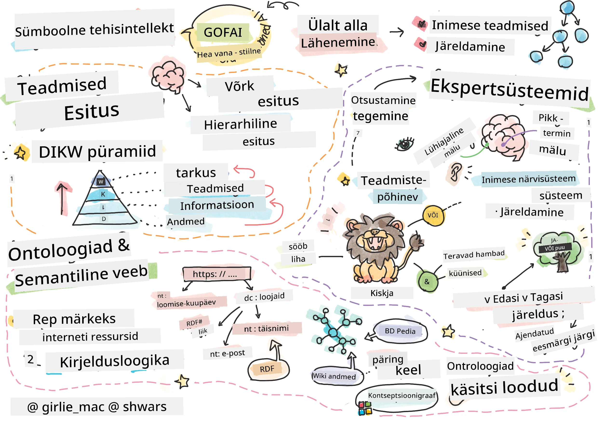
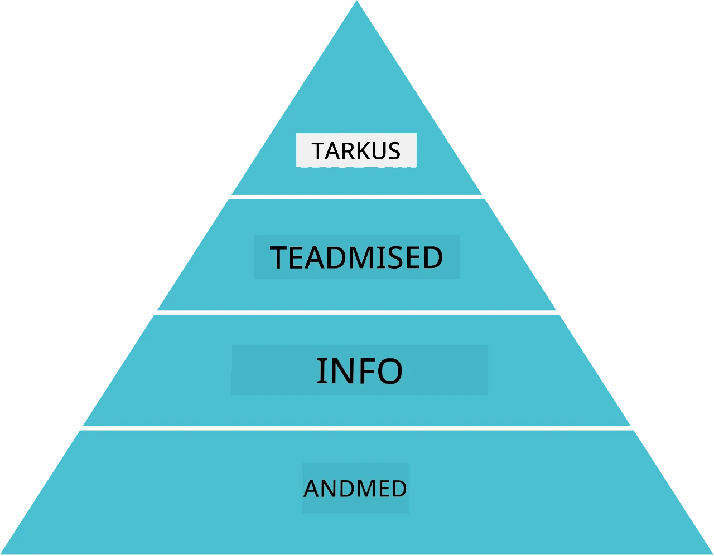
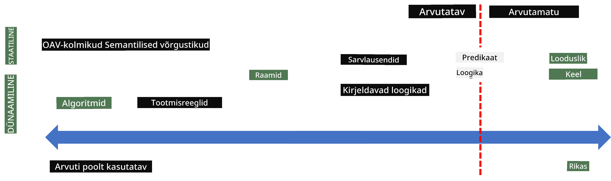
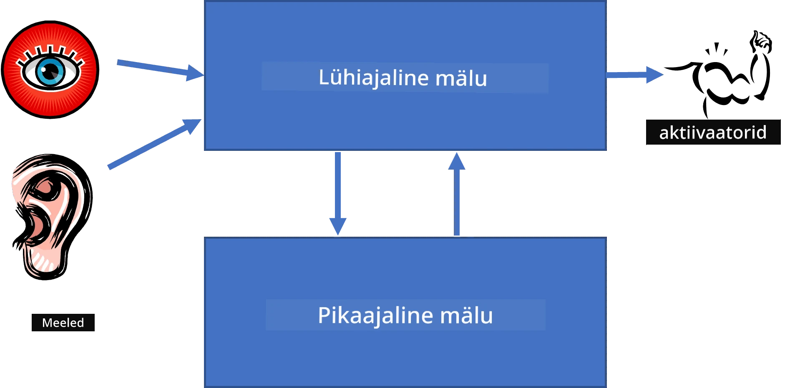
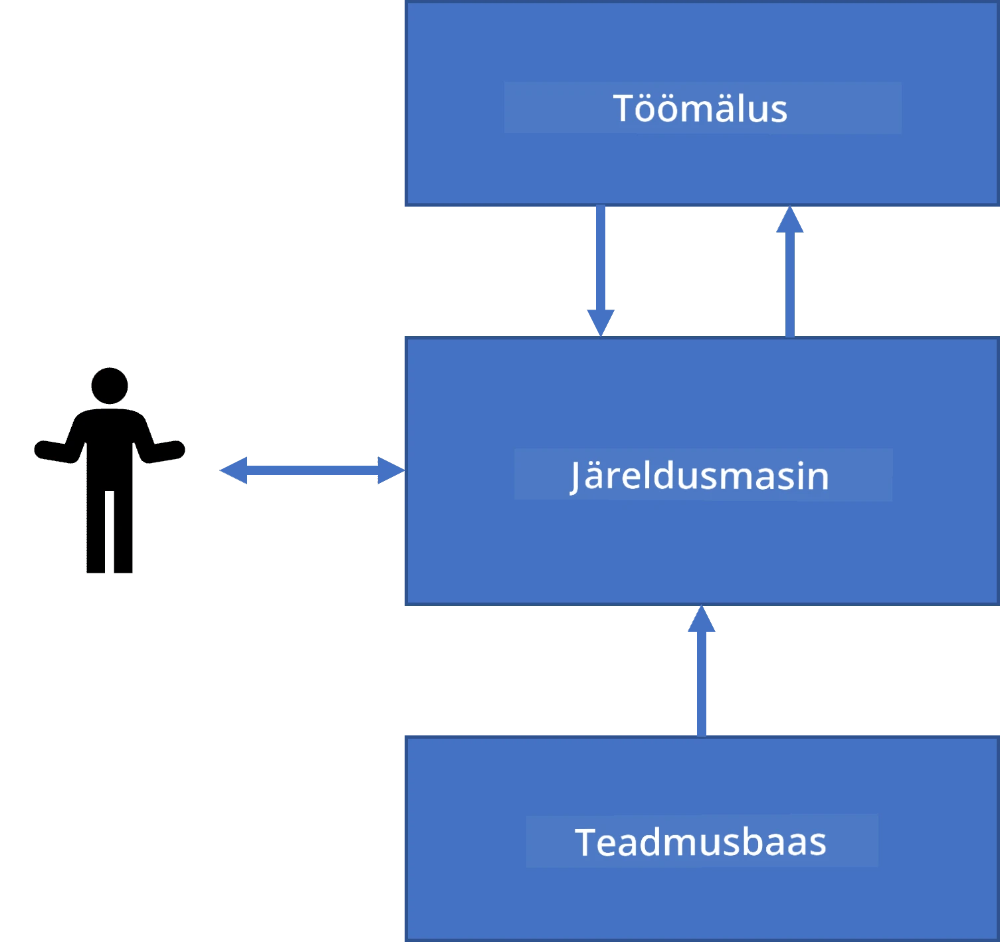
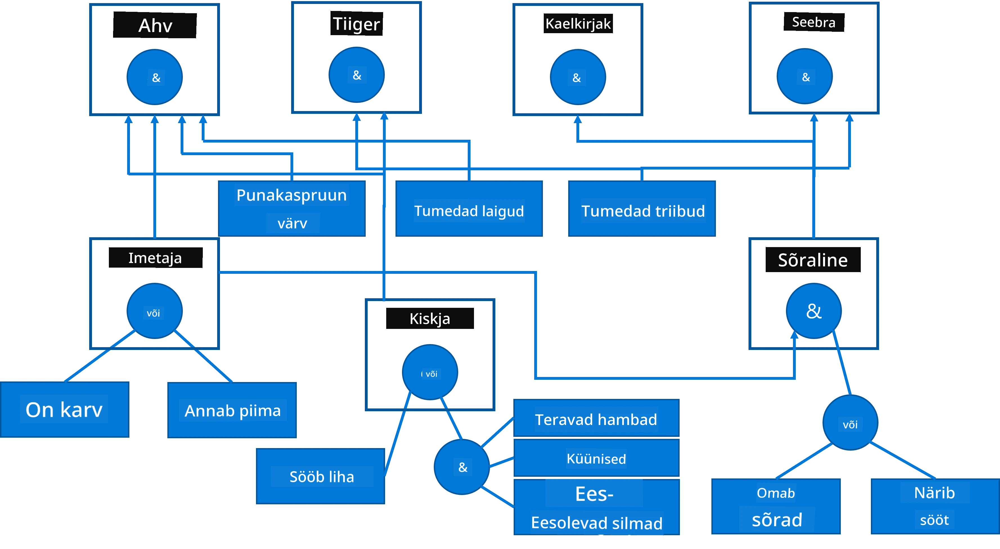
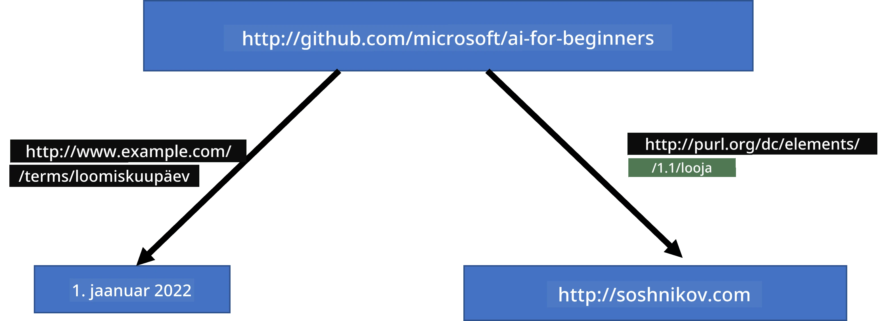
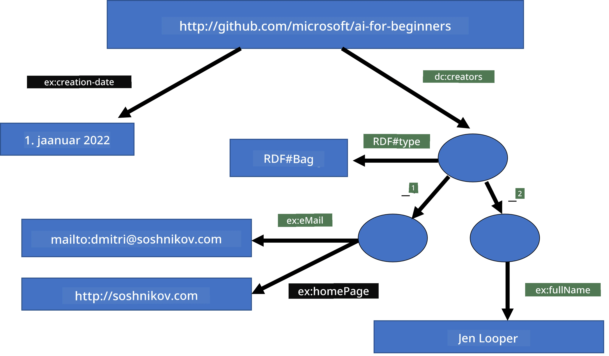
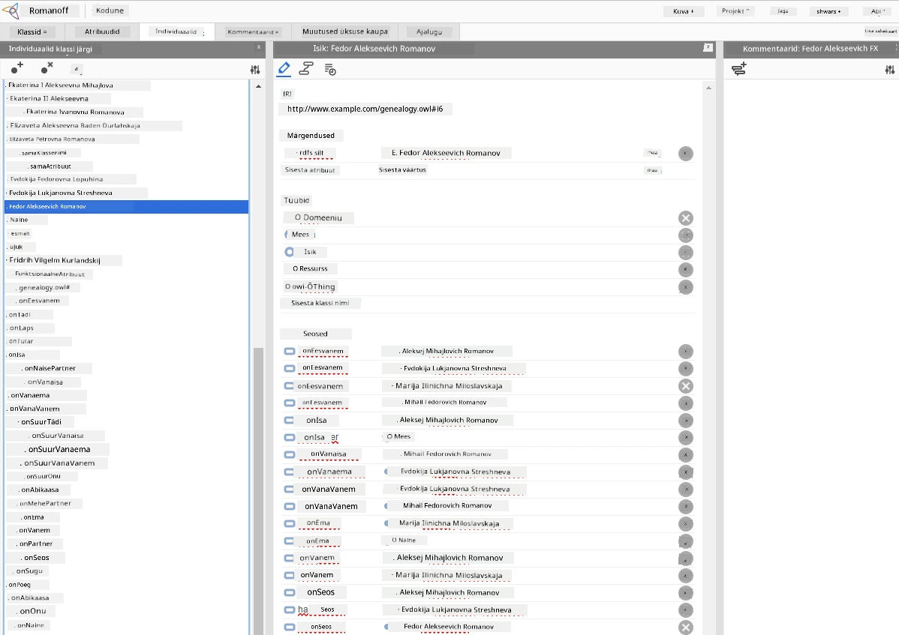

# Teadmus Representatsioon ja Ekspertsüsteemid



> Sketchnote autor [Tomomi Imura](https://twitter.com/girlie_mac)

Tehisintellekti otsing põhineb teadmiste otsimisel, et maailma mõtestada sarnaselt inimestega. Aga kuidas sellega alustada?

## [Eel-loengu test](https://ff-quizzes.netlify.app/en/ai/quiz/3)

Tehisintellekti algusaegadel oli populaarne ülalt-alla lähenemine intelligentsete süsteemide loomisele (kõnealusest eelmises peatükis). Idee seisnes teadmiste väljavõtmises inimestelt masinakõlblikuks vormiks ja selle automaatseks kasutamiseks probleemide lahendamisel. See lähenemine põhines kahel suurel ideel:

* Teadmiste representatsioon
* Järeldamine

## Teadmiste Representatsioon

Sümboolse tehisintellekti üks tähtsamaid mõisteid on **teadmus**. Oluline on eristada teadmust *infost* või *andmetest*. Näiteks võib öelda, et raamatud sisaldavad teadmust, sest nende uurimisega saab ekspertiks. Kuid tegelikult sisaldavad raamatud *andmeid*, ja neid lugedes ning andmeid oma maailmamudelis integreerides muudame need teadmuseks.

> ✅ **Teadmus** on midagi, mis asub meie peas ja peegeldab meie maailma mõistmist. Seda omandatakse aktiivse **õppimise** protsessi käigus, mis liidab saadud teabe meie aktiivse maailmamudeliga.

Tihti ei defineerita teadmust täpselt, vaid kooskõlastatakse see teiste seotud mõistetega kasutades [DIKW püramiidi](https://en.wikipedia.org/wiki/DIKW_pyramid). See sisaldab järgmisi mõisteid:

* **Andmed** on midagi, mis on esitatud füüsilises kandjas, nagu kirjutatud tekst või räägitud sõnad. Andmed eksisteerivad iseseisvalt inimestest ja neid võib üle anda.
* **Info** on see, kuidas me tõlgendame andmeid oma peas. Näiteks kui kuuleme sõna *arvuti*, siis meil on mingisugune arusaamine, mis see on.
* **Teadmus** on info, mis integreeritakse meie maailmamudelisse. Näiteks kui me õpime, mis on arvuti, hakkame teadvustama, kuidas see töötab, kui palju maksab ja milleks seda kasutatakse. See omavahel seotud mõistete võrgustik moodustab meie teadmus.
* **Tarkus** on veel üks tase meie maailmamõistmises, mis tähistab *meta-knowledge’i*, st teadmisi selle kohta, kuidas ja millal teadmust kasutada.



*Pilt [Vikipeediast](https://commons.wikimedia.org/w/index.php?curid=37705247), autor Longlivetheux - enda töö, CC BY-SA 4.0*

Seega seisneb **teadmiste representatsiooni** probleem selles, et leida mõni tõhus viis teadmiste esindamiseks arvutis andmete kujul, et neid saaks automaatselt kasutada. Seda võib vaadelda spektrina:



> Pilt autor Dmitry Soshnikov [http://soshnikov.com](http://soshnikov.com)

* Vasakul on väga lihtsad teadmusrepresentatsiooni tüübid, mida arvutid efektiivselt kasutada saavad. Kõige lihtsam on algoritmiline, kus teadmus on esindatud arvutiprogrammina. Kuid see pole parim viis teadmiste esindamiseks, sest see pole paindlik. Meie peas olev teadmus on sageli mitte-algoritmiline.
* Paremal on esindused nagu loomulik tekst. See on kõige võimsam, kuid ei sobi automaatseks järeldamiseks.

> ✅ Mõtle korra, kuidas sa esindad teadmust oma peas ja kanaldate seda märkmeteks. Kas on mingi formaat, mis sulle hästi aitab teadmiste meeldejätmisel?

## Arvuti Teadmiste Representatsiooni Klassifitseerimine

Võime erinevaid arvuti teadmusrepresentatsiooni meetodeid liigitada järgmisteks kategooriateks:

* **Võrgu esindused** põhinevad tõsiasjal, et meie peas on omavahel seotud mõistete võrgustik. Saame proovida sama võrku arvutis graafikuna taastada - nn **semantiline võrk**.

1. **Objekt-atribuut-väärtus tripletid** ehk **atribuut-väärtus paarid**. Kuna graafikut saab arvutis esitada sõlmede ja servade nimekirjana, saame semantilise võrgu esindada tripletite nimekirjana, mis sisaldab objekte, atribuute ja väärtusi. Näiteks koostame järgmised tripletid programmeerimiskeelte kohta:

Objekt | Atribuut | Väärtus
-------|-----------|------
Python | on | Tüübita keel
Python | leiutas | Guido van Rossum
Python | plokisüntaks | taandumine
Tüübita keel | ei oma | tüübimääratlusi

> ✅ Mõtle, kuidas tripleteid saab kasutada teiste teadmiste esindamiseks.

2. **Hierarhilised esindused** rõhutavad, et me loome sageli oma peas objektide hierarhia. Näiteks teame, et kanarilind on lind ja kõik linnud omavad tiibu. Samuti on meil aimu, mis värvi kanarilind tavaliselt on ja kui kiiresti nad lendavad.

   - **Raamistiku representatsioon** põhineb iga objekti või objekti klassi kujutamisel **raamistikuna**, mis sisaldab **pesasid**. Pesad võivad omada vaikeväärtusi, väärtusepiiranguid või salvestatud protseduure, mida saab kutsuda pesa väärtuse saamiseks. Kõik raamistikud moodustavad hierarhia, mis sarnaneb objektihierarhiaga objektorienteeritud programmeerimiskeeltes.
   - **Stsenaariumid** on eriliik raamistikke, mis esindavad keerulisi olukordi, mis võivad ajas areneda.

**Python**

Pesa | Väärtus | Vaikeväärtus | Vahemik |
-----|----------|--------------|---------|
Nimi | Python | | |
On-Tüüpi | Tüübita keel | | |
Muutuja Kirjutus | | CamelCase | |
Programmi Pikkus | | | 5–5000 rida |
Ploki Süntaks | Taandumine | | |

3. **Proceduurilised esindused** põhinevad teadmiste kujutamisel tegevuste nimekirjana, mida saab käivitada, kui mingi tingimus täitub.
   - Tootmisreeglid on kui-siis laused, mis võimaldavad järeldusi teha. Näiteks võib arst omada reeglit, mis ütleb, et **KUI** patsiendil on kõrge palavik **VÕI** kõrge C-reaktiivse valgu tase vereanalüüsis, **SIIS** on tal põletik. Kui kohtame üht tingimust, saame järeldada põletiku olemasolu ja kasutada seda edasises järeldamises.
   - Algoritme võib pidada teiseks vormiks proceduurilise representatsiooni puhul, kuigi neid peaaegu kunagi teadmistepõhistes süsteemides otse ei kasutata.

4. **Loogika** pakkus Aristoteles algselt universaliseeritud inimese teadmiste esindamise vahendina.
   - Predikaatloogika kui matemaatiline teooria on liiga lai, et olla kõikehõlmav, seega kasutatakse enamasti selle alamkomplekte, näiteks Horn'-klausleid Prologis.
   - Kirjeldav loogika on loogikasüsteemide perekond, mida kasutatakse objektide hierarhiate ja jaotatud teadmiste representatsioonide nagu *semantilise veebina* esindamiseks ja nende üle järeldamiseks.

## Ekspertsüsteemid

Üks sümboolse tehisintellekti varajasi edusamme olid nn **ekspertsüsteemid** — arvutisüsteemid, mis olid loodud käituma nagu ekspert kitsas probleemivaldkonnas. Need põhinesid **teadmistebaasil**, mis oli kogutud ühelt või mitmelt inimeselt, ja sisaldasid **järeldusmootorit**, mis teostas järeldamist selle põhjal.

 | 
---------------------------------------------|------------------------------------------------
Inimese närvisüsteemi lihtsustatud struktuur | Teadmistepõhise süsteemi arhitektuur

Ekspertsüsteemid on üles ehitatud inimese mõtlemise süsteemile sarnaselt, mis sisaldab **lühimälu** ja **pikaajalist mälu**. Samamoodi eristame teadmistepõhistes süsteemides järgmisi komponente:

* **Probleemimälu**: sisaldab teadmisi praegu lahendatava probleemi kohta, nt patsiendi temperatuuri või vererõhku, kas tal on põletik või mitte jne. Seda nimetatakse ka **staatiliseks teadmuseks**, sest see sisaldab hetkepilti sellest, mida me probleemist parasjagu teame – nn *probleemitilanne*.
* **Teadmistebaas**: esindab pikaajalisi teadmisi antud probleemivaldkonnas. See on käsitsi kogutud inimekspertidelt ja ei muutu konsultatsioonide vahel. Kuna see võimaldab navigeerida ühest probleemistilast teise, nimetatakse seda ka **dünaamiliseks teadmuseks**.
* **Järeldusmootor**: juhib kogu protsessi probleemitilanne ruumis otsides, küsides kasutajalt vajadusel küsimusi. See vastutab ka õigete reeglite leidmise eest igas etapis.

Näiteks oluline ekspert­süsteemi näide on looma määramine füüsiliste omaduste põhjal:



> Pilt autor Dmitry Soshnikov [http://soshnikov.com](http://soshnikov.com)

See diagramm on nimetatud **JA-VÕI puuks** ja see on tootmisreeglite kogumi graafiline kujutis. Puu joonistamine on kasulik alguses teadmiste väljatöötamisel eksperdilt. Teadmisi arvutis esindamiseks on mugavam kasutada reegleid:

```
IF the animal eats meat
OR (animal has sharp teeth
    AND animal has claws
    AND animal has forward-looking eyes
) 
THEN the animal is a carnivore
```
  
Võid märgata, et iga vasakpoolse tingimuse ja tegevuse osa reeglites on sisuliselt objekt-atribuut-väärtus kolmikud (OAV). **Töömälus** hoitakse komplekti OAV kolmikutest, mis vastavad hetkel lahendatavale probleemile. **Reeglimootor** otsib reegleid, mille tingimus on rahuldatud, ja rakendab neid, lisades uue kolmiku töömällu.

> ✅ Kirjuta oma JA-VÕI puu mõnel sulle huvipakkuval teemal!

### Edasi- ja Tagasi-Järeldamine

Ülal kirjeldatud protsessi nimetatakse **edasi-järeldamiseks**. See algab esialgsete andmetega, mis on töömälus olemas ja teeb järgmise järeldusliku tsükli:

1. Kui sihtatribuut on töömälus olemas – peatu ja anna tulemus
2. Otsi välja kõik reeglid, mille tingimus on täidetud – moodusta **konfliktikomplekt**.
3. Tee **konfliktilahendus** – vali üks reegel, mida käesoleval sammul rakendada. Konfliktilahendusstrateegiaid on mitmeid:
   - vali teadmistebaasist esimene rakendatav reegel
   - vali juhuslik reegel
   - vali *täpsem* reegel, mis vastab kõige rohkem tingimustele vasakul pool
4. Rakenda valitud reegel ja lisa uus teadmus probleemitilanne'i
5. Korda kõiki samme alates 1

Mõnikord soovime aga alustada probleemist väheste teadmistega ja esitada küsimusi, mis aitavad jõuda järeldusele. Näiteks meditsiinilise diagnoosi puhul ei tee tavaliselt kohe kõiki analüüse enne patsiendi uurimist, vaid teevad vajalikke analüüse arvestades diagnoosimist.

Seda protsessi saab modelleerida **tagasi-järeldamisega**. See algab **eesmärgist** – otsitu atribuudi väärtusest:

1. Vali kõik reeglid, mis võivad anda eesmärgi väärtuse (st mille “paremapoolsel” ehk RHS-l on eesmärk) – konfliktikomplekt
1. Kui selle atribuudi kohta reegleid pole või on reegel, mis ütleb, et kasutajalt tuleb küsida, küsige väärtust kasutajalt, muul juhul:
1. Kasuta konfliktilahendust ühe hüpoteesi valimiseks – püüa seda tõestada
1. Korda seda protsessi kõikide reegli vasaku poole (LHS) atribuutide puhul, püüdes neid tõestada eesmärkidena
1. Kui protsess ebaõnnestub – proovi valida muu reegel sammus 3.

> ✅ Millistes olukordades on edasi-järeldamine sobivam? Kuidas tagasi-järeldamine?

### Ekspertsüsteemide Rakendamine

Ekspertsüsteemid saab rakendada erinevatel viisidel:

* Otse programmeerides kõrgema taseme programmeerimiskeeles. See pole parim valik, sest teadmistepõhise süsteemi peamine eelis on teadmistest ja järeldamisest eraldamine ning probleemi eksperdil võiks olla võimalik kirjutada reegleid ilma järeldamisprotsessi detailideta mõistmata.
* Kasutades **ekspertsüsteemi kestat**, st süsteemi, mis on spetsiaalselt loodud teadmiste sisestamiseks mingis teadmusrepresentatsiooni keeles.

## ✍️ Harjutus: Loomade Järeldamine

Näide edasi- ja tagasi-järeldamise ekspert­süsteemi loomise kohta leiad failist [Animals.ipynb](https://github.com/microsoft/AI-For-Beginners/blob/main/lessons/2-Symbolic/Animals.ipynb).

> **Märkus**: See näide on suhteliselt lihtne ja annab idee, kuidas ekspert­süsteem välja näeb. Süsteemi loomisel märkad, et *intelligentne* käitumine ilmneb alles reeglite arvu jõudes ligikaudu 200+ juurde. Sel hetkel muutuvad reeglid liiga keerukaks meelde jätta ja tekib küsimus, miks süsteem teatud otsuseid teeb. Kuid oluline iseärasus teadmusbaasilistel süsteemidel on see, et nende otsuseid saab alati *selgitada* täpselt, kuidas need tehti.

## Ontoloogiad ja Semantiline Veeb

20. sajandi lõpus algatati teadmiste representatsiooni kasutamine interneti ressursside märgistamiseks, et oleks võimalik leida ressursse väga spetsiifiliste päringute jaoks. Seda algatust kutsuti **semantiliseks veebiks** ja see toetus mitmele mõistele:

- Eriline teadmiste esindus, mis tugineb **[kirjeldavatele loogikatele](https://en.wikipedia.org/wiki/Description_logic)** (DL). See on sarnane raamistike esindamisega, sest loob objektide hierarhia omadustega, kuid omab formaalset loogilist semantikat ja järeldamist. DL-id on erineva väljendusvõime ja järeldamisalgoritmi keerukusega süsteemide perekond.
- Hajutatud teadmiste representatsioon, kus kõik mõisted on esindatud globaalse URI identifikaatoriga, võimaldades luua teadmiste hierarhiaid, mis ulatuvad üle interneti.
- Perekond XML-põhistest keeltest teadmiste kirjeldamiseks: RDF (Resource Description Framework), RDFS (RDF Schema), OWL (Ontology Web Language).

Semantilises veebis on keskne mõiste **Ontoloogia**. See viitab probleemitsooni selgele spetsifikatsioonile, kasutades mõnda formaalset teadmiste esitamise meetodit. Lihtsaim ontoloogia võib olla lihtsalt objektide hierarhia probleemitsoonis, kuid keerukamad ontoloogiad sisaldavad reegleid, mida saab kasutada järeldamiseks.

Semantilises veebis põhinevad kõik esitlused triplettidel. Iga objekt ja iga seos on unikaalselt identifitseeritud URI-ga. Näiteks, kui tahame väita fakti, et see AI õppekava töötas Dmitry Soshnikov välja 1. jaanuaril 2022 - siin on tripletid, mida saame kasutada:



```
http://github.com/microsoft/ai-for-beginners http://www.example.com/terms/creation-date “Jan 1, 2022”
http://github.com/microsoft/ai-for-beginners http://purl.org/dc/elements/1.1/creator http://soshnikov.com
```

> ✅ Siin on `http://www.example.com/terms/creation-date` ja `http://purl.org/dc/elements/1.1/creator` tuntud ja üldtunnustatud URI-d, mis väljendavad mõisteid *looja* ja *loomise kuupäev*.

Keerukamas olukorras, kui tahame määratleda loojate nimekirja, võime kasutada mõnda RDF-is määratletud andmestruktuuri.



> Ülaltoodud diagrammid autorilt [Dmitry Soshnikov](http://soshnikov.com)

Semantilise veebiga seotud arendust on mingil määral aeglustanud otsingumootorite ja loomuliku keele töötlemise tehnoloogiate edu, mis võimaldavad tekstist struktureeritud andmeid eraldada. Kuid mõnes valdkonnas tehakse jätkuvalt olulist tööd ontoloogiate ja teadmistebaaside haldamiseks. Mõned silmapaistvad projektid:

* [WikiData](https://wikidata.org/) on masinloetavate teadmistebaaside kogum, mis on seotud Vikipeediaga. Enamik andmeid on otsitud Vikipeedia *InfoBoxidest*, mis on Vikipeedia lehtede sees olevad struktureeritud sisutükid. WikiData-s saab SPARQL-iga, semantilise veebipäringu keelega, [päringuid esitada](https://query.wikidata.org/). Siin on näide päringust, mis kuvab inimeste seas kõige populaarsemad silmavärvid:

```sparql
#defaultView:BubbleChart
SELECT ?eyeColorLabel (COUNT(?human) AS ?count)
WHERE
{
  ?human wdt:P31 wd:Q5.       # human instance-of homo sapiens
  ?human wdt:P1340 ?eyeColor. # human eye-color ?eyeColor
  SERVICE wikibase:label { bd:serviceParam wikibase:language "en". }
}
GROUP BY ?eyeColorLabel
```

* [DBpedia](https://www.dbpedia.org/) on veel üks sarnane ettevõtmine nagu WikiData.

> ✅ Kui soovid katsetada oma ontoloogiate loomist või olemasolevate avamist, on olemas suurepärane visuaalne ontoloogia redaktor nimega [Protégé](https://protege.stanford.edu/). Laadi see alla või kasuta veebis.



*Veebiredaktor Protégé avatud Romanovi perekonna ontoloogiaga. Ekraanipilt Dmitry Soshnikovilt*

## ✍️ Harjutus: Perekonna ontoloogia

Vaata [FamilyOntology.ipynb](https://github.com/Ezana135/AI-For-Beginners/blob/main/lessons/2-Symbolic/FamilyOntology.ipynb), mis on näide semantilise veebi tehnikate kasutamisest perekonna suhete järeldamiseks. Võtame perekonnaseisu puu, mis on esitatud tavalises GEDCOM formaadis, ja perekondlike suhete ontoloogiaga ehitame graafi kõigi antud isikute suhete kohta.

## Microsoft Concept Graph

Enamikul juhtudel luuakse ontoloogiad hoolikalt käsitsi. Kuid on võimalik ka ontoloogiate **kaevandamine** struktureerimata andmetest, näiteks loomulikus keeles tekstidest.

Üks selline katse tehti Microsoft Researchi poolt, mille tulemuseks oli [Microsoft Concept Graph](https://blogs.microsoft.com/ai/microsoft-researchers-release-graph-that-helps-machines-conceptualize/?WT.mc_id=academic-77998-cacaste).

See on suur üksuste kogum, mis on grupeeritud pärandumissuhtes `is-a`. See võimaldab vastata küsimustele nagu "Mis on Microsoft?" - vastus oleks midagi sarnast "ettevõte tõenäosusega 0.87 ja bränd tõenäosusega 0.75".

See graafik on saadaval kas REST API-na või suurena allalaaditava tekstifailina, mis loetleb kõik üksuste paarid.

## ✍️ Harjutus: Kontseptsioonide graafik

Proovi [MSConceptGraph.ipynb](https://github.com/microsoft/AI-For-Beginners/blob/main/lessons/2-Symbolic/MSConceptGraph.ipynb) märkmikku, et näha, kuidas Microsoft Concept Graphi saab kasutada uudisteartiklite rühmitamiseks mitmesse kategooriasse.

## Kokkuvõte

Tänapäeval peetakse AI-d sageli masinõppe või närvivõrkude sünonüümiks. Kuid inimene näitab ka otsest järeldamist, mida närvivõrgud praegu ei käsitle. Reaalsetes projektides kasutatakse otsest järeldamist endiselt ülesannete lahendamiseks, mis vajavad selgitusi või süsteemi käitumise muutmise võimalust kontrollitud viisil.

## 🚀 Väljakutse

Selle õppetüki perekonna ontoloogia märkmikus on võimalus katsetada muid perekondlikke suhteid. Proovi leida uusi ühendusi inimeste vahel perekonna puus.

## [Loengu järeltest](https://ff-quizzes.netlify.app/en/ai/quiz/4)

## Ülevaade ja iseseisev õpe

Uuri internetist, kus valdkondades on inimesed püüdnud teadmisi kvantifitseerida ja kodeerida. Vaata Bloom'i taksonoomiat ja mine ajas tagasi, et õppida, kuidas inimesed on püüdnud maailma mõista. Uuri Linnaeuse tööd organismide taksonoomia loomiseks ning jälgi, kuidas Dmitri Mendelejev lõi keemilistelementide kirjeldamiseks ja rühmitamiseks süsteemi. Milliseid teisi huvitavaid näiteid suudad leida?

**Kodutöö**: [Loo ontoloogia](assignment.md)

---

<!-- CO-OP TRANSLATOR DISCLAIMER START -->
**Ärge usaldage täielikult**:
See dokument on tõlgitud kasutades tehisintellekti tõlketeenust [Co-op Translator](https://github.com/Azure/co-op-translator). Kuigi püüame täpsust, palun pidage meeles, et automaatsed tõlked võivad sisaldada vigu või ebatäpsusi. Originaaldokument oma algkeeles loetakse usaldusväärseks allikaks. Olulise teabe puhul soovitatakse kasutada professionaalset inimtõlget. Me ei vastuta mis tahes arusaamatuste või valesti mõistmiste eest, mis võivad sellest tõlkest tuleneda.
<!-- CO-OP TRANSLATOR DISCLAIMER END -->