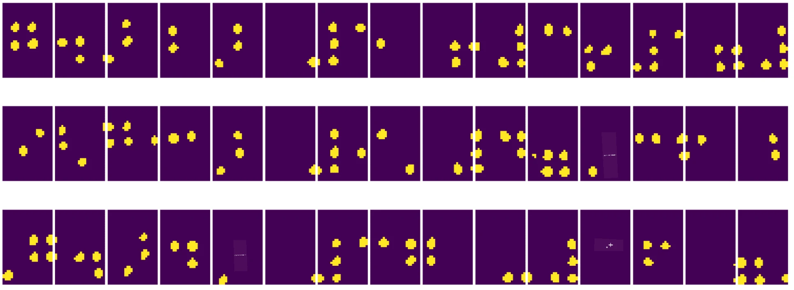

# Sissejuhatus arvutinägemisse

[Arvutinägemine](https://wikipedia.org/wiki/Computer_vision) on valdkond, mille eesmärk on võimaldada arvutitel saavutada kõrgetasemeline arusaam digitaalsetest piltidest. See on üsna lai määratlus, kuna *arusaamine* võib tähendada mitmeid erinevaid asju, sealhulgas objekti leidmist pildilt (**objekti tuvastamine**), toimuvast aru saamist (**sündmuste tuvastamine**), pildi kirjeldamist tekstis või stseeni rekonstrueerimist 3D-s. Samuti on olemas eraldi ülesanded, mis on seotud inimeste piltidega: vanuse ja emotsioonide hindamine, näo tuvastamine ja identifitseerimine ning 3D poosi hindamine, kui nimetada vaid mõnda.

## [Eelloengu viktoriin](https://ff-quizzes.netlify.app/en/ai/quiz/11)

Üks lihtsamaid arvutinägemise ülesandeid on **piltide klassifitseerimine**.

Arvutinägemist peetakse sageli tehisintellekti haruks. Tänapäeval lahendatakse enamik arvutinägemise ülesandeid närvivõrkude abil. Me õpime rohkem arvutinägemise jaoks kasutatava erilise tüüpi närvivõrkude kohta, [konvolutsioonilised närvivõrgud](../07-ConvNets/README.md), kogu selle jaotise jooksul.

Siiski, enne kui pilt närvivõrgule edastatakse, on paljudel juhtudel mõistlik kasutada mõningaid algoritmilisi tehnikaid pildi täiustamiseks.

Pilditöötluseks on saadaval mitmeid Python'i teeke:

* **[imageio](https://imageio.readthedocs.io/en/stable/)** võimaldab lugeda/kirjutada erinevaid pildiformaate. See toetab ka ffmpeg-i, kasulikku tööriista videokaadrite piltideks konverteerimiseks.
* **[Pillow](https://pillow.readthedocs.io/en/stable/index.html)** (tuntud ka kui PIL) on veidi võimsam ja toetab ka mõningaid pildimanipulatsioone, nagu morfeerimine, paleti kohandamine ja palju muud.
* **[OpenCV](https://opencv.org/)** on võimas pilditöötluse teek, mis on kirjutatud C++ keeles ja on muutunud pilditöötluse *de facto* standardiks. Sellel on mugav Python'i liides.
* **[dlib](http://dlib.net/)** on C++ teek, mis rakendab mitmeid masinõppe algoritme, sealhulgas mõningaid arvutinägemise algoritme. Sellel on ka Python'i liides ja seda saab kasutada keeruliste ülesannete jaoks, nagu näo ja näo tunnuste tuvastamine.

## OpenCV

[OpenCV](https://opencv.org/) peetakse pilditöötluse *de facto* standardiks. See sisaldab palju kasulikke algoritme, mis on rakendatud C++ keeles. OpenCV-d saab kasutada ka Python'is.

Hea koht OpenCV õppimiseks on [see Learn OpenCV kursus](https://learnopencv.com/getting-started-with-opencv/). Meie õppekavas ei ole eesmärk OpenCV-d õppida, vaid näidata mõningaid näiteid, millal seda saab kasutada ja kuidas.

### Piltide laadimine

Pilte Python'is saab mugavalt esitada NumPy massiivide abil. Näiteks halltoonides pildid, mille suurus on 320x200 pikslit, salvestatakse 200x320 massiivis, ja värvilised pildid sama mõõtmega oleksid kujuga 200x320x3 (3 värvikanali jaoks). Pildi laadimiseks saate kasutada järgmist koodi:

```python
import cv2
import matplotlib.pyplot as plt

im = cv2.imread('image.jpeg')
plt.imshow(im)
```

Traditsiooniliselt kasutab OpenCV värviliste piltide jaoks BGR (sinine-roheline-punane) kodeeringut, samas kui ülejäänud Python'i tööriistad kasutavad traditsioonilisemat RGB (punane-roheline-sinine). Selleks, et pilt näeks õige välja, peate selle teisendama RGB värviruumi, kas vahetades NumPy massiivi dimensioone või kutsudes OpenCV funktsiooni:

```python
im = cv2.cvtColor(im,cv2.COLOR_BGR2RGB)
```

Sama `cvtColor` funktsiooni saab kasutada ka teiste värviruumi teisenduste tegemiseks, näiteks pildi teisendamiseks halltoonidesse või HSV (toon-küllastus-väärtus) värviruumi.

OpenCV-d saab kasutada ka video kaadrite kaupa laadimiseks - näide on antud harjutuses [OpenCV Notebook](OpenCV.ipynb).

### Pilditöötlus

Enne pildi edastamist närvivõrgule võite soovida rakendada mitmeid eeltöötluse samme. OpenCV suudab teha palju asju, sealhulgas:

* **Pildi suuruse muutmine** kasutades `im = cv2.resize(im, (320,200),interpolation=cv2.INTER_LANCZOS)`
* **Pildi hägustamine** kasutades `im = cv2.medianBlur(im,3)` või `im = cv2.GaussianBlur(im, (3,3), 0)`
* Pildi **heledust ja kontrasti** saab muuta NumPy massiivide manipuleerimise abil, nagu kirjeldatud [selles Stackoverflow märkuses](https://stackoverflow.com/questions/39308030/how-do-i-increase-the-contrast-of-an-image-in-python-opencv).
* [Läve määramine](https://docs.opencv.org/4.x/d7/d4d/tutorial_py_thresholding.html) kutsudes `cv2.threshold`/`cv2.adaptiveThreshold` funktsioone, mis on sageli eelistatavamad kui heleduse või kontrasti kohandamine.
* Erinevate [teisenduste](https://docs.opencv.org/4.5.5/da/d6e/tutorial_py_geometric_transformations.html) rakendamine pildile:
    - **[Afiinsed teisendused](https://docs.opencv.org/4.5.5/d4/d61/tutorial_warp_affine.html)** võivad olla kasulikud, kui peate kombineerima pildi pööramise, suuruse muutmise ja kallutamise ning teate pildi kolme punkti lähte- ja sihtkohta. Afiinsed teisendused säilitavad paralleelsed jooned paralleelsena.
    - **[Perspektiiviteisendused](https://medium.com/analytics-vidhya/opencv-perspective-transformation-9edffefb2143)** võivad olla kasulikud, kui teate pildi nelja punkti lähte- ja sihtkohta. Näiteks, kui teete nutitelefoni kaameraga nurga alt pilti ristkülikukujulisest dokumendist ja soovite dokumendi enda ristkülikukujulist pilti.
* Liikumise mõistmine pildi sees, kasutades **[optilist voolu](https://docs.opencv.org/4.5.5/d4/dee/tutorial_optical_flow.html)**.

## Näited arvutinägemise kasutamisest

Meie [OpenCV Notebook](OpenCV.ipynb) näitab mõningaid näiteid, millal arvutinägemist saab kasutada konkreetsete ülesannete täitmiseks:

* **Pildi eeltöötlus Braille'i raamatu fotol**. Keskendume sellele, kuidas kasutada läve määramist, tunnuste tuvastamist, perspektiiviteisendust ja NumPy manipuleerimist, et eraldada individuaalsed Braille'i sümbolid edasiseks klassifitseerimiseks närvivõrgu abil.

 |  | 
----|-----|-----

> Pilt [OpenCV.ipynb](OpenCV.ipynb) failist

* **Liikumise tuvastamine videos kaadrite erinevuse abil**. Kui kaamera on fikseeritud, peaksid kaadrid kaamera voos olema üksteisega üsna sarnased. Kuna kaadreid esitatakse massiividena, siis lihtsalt lahutades need massiivid kahe järjestikuse kaadri jaoks saame pikslite erinevuse, mis peaks olema madal staatiliste kaadrite puhul ja muutuma suuremaks, kui pildil toimub märkimisväärne liikumine.


> Pilt [OpenCV.ipynb](OpenCV.ipynb) failist

* **Liikumise tuvastamine optilise voolu abil**. [Optiline vool](https://docs.opencv.org/3.4/d4/dee/tutorial_optical_flow.html) võimaldab mõista, kuidas individuaalsed pikslid videokaadritel liiguvad. Optilist voolu on kahte tüüpi:

   - **Tihe optiline vool** arvutab vektorvälja, mis näitab iga piksli liikumissuunda.
   - **Hõre optiline vool** põhineb mõningate eristuvate tunnuste (nt servade) võtmisele pildil ja nende trajektoori ehitamisele kaadrist kaadrisse.


> Pilt [OpenCV.ipynb](OpenCV.ipynb) failist

## ✍️ Näidisnotebookid: OpenCV [proovi OpenCV tegevuses](OpenCV.ipynb)

Teeme mõned eksperimendid OpenCV-ga, uurides [OpenCV Notebook](OpenCV.ipynb).

## Kokkuvõte

Mõnikord saab suhteliselt keerulisi ülesandeid, nagu liikumise tuvastamine või sõrmeotsa tuvastamine, lahendada ainult arvutinägemise abil. Seega on väga kasulik teada arvutinägemise põhitehnikaid ja seda, mida sellised teegid nagu OpenCV suudavad teha.

## 🚀 Väljakutse

Vaata [seda videot](https://docs.microsoft.com/shows/ai-show/ai-show--2021-opencv-ai-competition--grand-prize-winners--cortic-tigers--episode-32?WT.mc_id=academic-77998-cacaste) AI Show'st, et õppida Cortic Tigers'i projekti kohta ja kuidas nad ehitasid plokipõhise lahenduse arvutinägemise ülesannete demokratiseerimiseks roboti abil. Uuri teisi sarnaseid projekte, mis aitavad uusi õppijaid valdkonda sisse tuua.

## [Järelloengu viktoriin](https://ff-quizzes.netlify.app/en/ai/quiz/12)

## Ülevaade ja iseseisev õppimine

Loe rohkem optilise voolu kohta [selles suurepärases juhendis](https://learnopencv.com/optical-flow-in-opencv/).

## [Ülesanne](lab/README.md)

Selles laboris teete video lihtsate žestidega ja teie eesmärk on optilise voolu abil tuvastada üles/alla/vasakule/paremale liikumised.


---

**Lahtiütlus**:  
See dokument on tõlgitud AI tõlketeenuse [Co-op Translator](https://github.com/Azure/co-op-translator) abil. Kuigi püüame tagada täpsust, palume arvestada, et automaatsed tõlked võivad sisaldada vigu või ebatäpsusi. Algne dokument selle algses keeles tuleks pidada autoriteetseks allikaks. Olulise teabe puhul soovitame kasutada professionaalset inimtõlget. Me ei vastuta selle tõlke kasutamisest tulenevate arusaamatuste või valesti tõlgenduste eest.