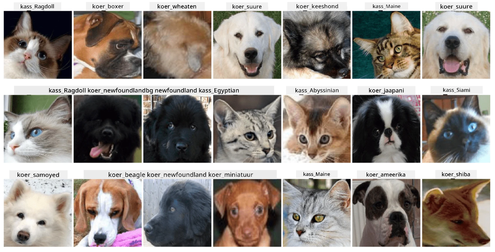

# Lemmikloomade nägude klassifikatsioon

Laboriülesanne [AI for Beginners Curriculum](https://github.com/microsoft/ai-for-beginners) programmist.

## Ülesanne

Kujutage ette, et peate looma rakenduse lemmikloomade lasteaiale, et kataloogida kõik lemmikloomad. Üks sellise rakenduse suurepäraseid funktsioone oleks tõu automaatne tuvastamine fotolt. Seda saab edukalt teha, kasutades tehisnärvivõrke.

Te peate treenima konvolutsioonilise närvivõrgu, et klassifitseerida erinevaid kasside ja koerte tõuge, kasutades **Pet Faces** andmestikku.

## Andmestik

Me kasutame [Oxford-IIIT Pet Dataset](https://www.robots.ox.ac.uk/~vgg/data/pets/) andmestikku, mis sisaldab pilte 37 erinevast koerte ja kasside tõust.



Andmestiku allalaadimiseks kasutage järgmist koodilõiku:

```python
!wget https://thor.robots.ox.ac.uk/~vgg/data/pets/images.tar.gz
!tar xfz images.tar.gz
!rm images.tar.gz
```

**Märkus:** Oxford-IIIT Pet Dataset pildid on organiseeritud failinimede järgi (nt `Abyssinian_1.jpg`, `Bengal_2.jpg`). Märkmik sisaldab koodi, mis organiseerib need pildid tõuspetsiifilistesse alamkataloogidesse, et klassifikatsioon oleks lihtsam.

## Märkmiku avamine

Alustage laborit, avades [PetFaces.ipynb](PetFaces.ipynb)

## Õppetunnid

Olete lahendanud suhteliselt keerulise pildiklassifikatsiooni probleemi algusest peale! Tõuge oli üsna palju, kuid suutsite siiski saavutada mõistliku täpsuse! Samuti on mõistlik mõõta top-k täpsust, kuna mõningaid klasse on lihtne segamini ajada, eriti kui need pole isegi inimestele selgelt eristatavad.

---

**Lahtiütlus**:  
See dokument on tõlgitud AI tõlketeenuse [Co-op Translator](https://github.com/Azure/co-op-translator) abil. Kuigi püüame tagada täpsust, palume arvestada, et automaatsed tõlked võivad sisaldada vigu või ebatäpsusi. Algne dokument selle algses keeles tuleks pidada autoriteetseks allikaks. Olulise teabe puhul soovitame kasutada professionaalset inimtõlget. Me ei vastuta selle tõlke kasutamisest tulenevate arusaamatuste või valesti tõlgenduste eest.