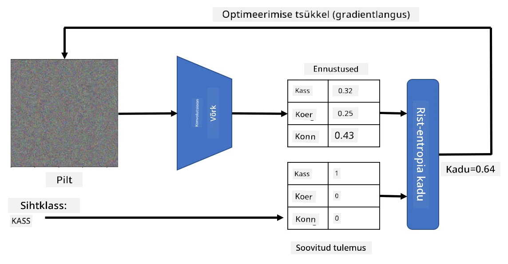

# Eelnevalt treenitud võrgud ja ülekandeõpe

CNN-ide treenimine võib võtta palju aega ja nõuda suurt hulka andmeid. Suur osa ajast kulub aga parimate madala taseme filtrite õppimisele, mida võrk saab kasutada mustrite tuvastamiseks piltidelt. Tekib loomulik küsimus – kas saaksime kasutada ühel andmestikul treenitud närvivõrku ja kohandada seda erinevate piltide klassifitseerimiseks ilma täieliku treenimisprotsessita?

## [Eelloengu viktoriin](https://ff-quizzes.netlify.app/en/ai/quiz/15)

Seda lähenemist nimetatakse **ülekandeõppeks**, kuna me kanname osa teadmistest ühest närvivõrgumudelist teise. Ülekandeõppes alustame tavaliselt eelnevalt treenitud mudeliga, mis on treenitud mõnel suurel pildianmestikul, näiteks **ImageNet**. Need mudelid suudavad juba hästi tuvastada erinevaid omadusi üldistest piltidest, ja paljudel juhtudel võib nende tuvastatud omaduste peale ehitatud klassifikaator anda häid tulemusi.

> ✅ Ülekandeõpe on termin, mida leidub ka teistes akadeemilistes valdkondades, näiteks hariduses. See viitab protsessile, kus teadmisi ühest valdkonnast rakendatakse teises.

## Eelnevalt treenitud mudelid kui omaduste tuvastajad

Konvolutsioonivõrgud, millest rääkisime eelmises osas, sisaldavad mitmeid kihte, millest igaüks peaks tuvastama pildilt teatud omadusi, alustades madala taseme pikslikombinatsioonidest (näiteks horisontaalne/vertikaalne joon või joonistus), kuni kõrgema taseme omaduste kombinatsioonideni, mis vastavad näiteks leegisilmale. Kui treenime CNN-i piisavalt suurel üldiste ja mitmekesiste piltide andmestikul, peaks võrk õppima tuvastama neid ühiseid omadusi.

Nii Keras kui PyTorch sisaldavad funktsioone, mis võimaldavad hõlpsalt laadida eelnevalt treenitud närvivõrgu kaalusid mõnele levinud arhitektuurile, millest enamik on treenitud ImageNet piltidel. Kõige sagedamini kasutatavad mudelid on kirjeldatud eelmise õppetunni [CNN arhitektuuride](../07-ConvNets/CNN_Architectures.md) lehel. Eelkõige võiksite kaaluda ühe järgmistest kasutamist:

* **VGG-16/VGG-19**, mis on suhteliselt lihtsad mudelid, kuid annavad siiski head täpsust. Sageli on VGG kasutamine esimese katse jaoks hea valik, et näha, kuidas ülekandeõpe töötab.
* **ResNet** on mudelite perekond, mille Microsoft Research esitas 2015. aastal. Neil on rohkem kihte ja seetõttu vajavad nad rohkem ressursse.
* **MobileNet** on mudelite perekond, mille suurus on vähendatud, sobides mobiilseadmetele. Kasutage neid, kui teil on ressursipuudus ja saate ohverdada veidi täpsust.

Siin on näide omadustest, mille VGG-16 võrk kassipildilt tuvastas:

## Kasside ja koerte andmestik

Selles näites kasutame [Kasside ja koerte](https://www.microsoft.com/download/details.aspx?id=54765&WT.mc_id=academic-77998-cacaste) andmestikku, mis on väga lähedane päriselulisele pildiklassifikatsiooni stsenaariumile.

## ✍️ Harjutus: Ülekandeõpe

Vaatame ülekandeõpet tegevuses vastavates märkmikes:

* [Ülekandeõpe - PyTorch](TransferLearningPyTorch.ipynb)
* [Ülekandeõpe - TensorFlow](TransferLearningTF.ipynb)

## Adversariaalse kassi visualiseerimine

Eelnevalt treenitud närvivõrk sisaldab oma *ajus* erinevaid mustreid, sealhulgas **ideaalse kassi** (samuti ideaalse koera, ideaalse sebra jne) mõisteid. Oleks huvitav kuidagi **visualiseerida seda pilti**. Kuid see pole lihtne, kuna mustrid on hajutatud üle võrgu kaalude ja organiseeritud hierarhilises struktuuris.

Üks lähenemine, mida saame kasutada, on alustada juhuslikust pildist ja seejärel proovida kasutada **gradientide optimeerimise** tehnikat, et kohandada seda pilti nii, et võrk hakkaks arvama, et see on kass.

Kui me seda teeme, saame tulemuseks midagi, mis on väga sarnane juhusliku müraga. See on tingitud sellest, et *on palju viise, kuidas panna võrk arvama, et sisendpilt on kass*, sealhulgas mõned, mis visuaalselt ei ole mõistlikud. Kuigi need pildid sisaldavad palju kassile tüüpilisi mustreid, pole midagi, mis sunniks neid olema visuaalselt eristatavad.

Tulemuse parandamiseks saame lisada kaotuse funktsiooni teise termini, mida nimetatakse **variatsioonikaotuseks**. See on mõõdik, mis näitab, kui sarnased on pildi naaberpikslid. Variatsioonikaotuse minimeerimine muudab pildi sujuvamaks ja eemaldab müra – paljastades visuaalselt meeldivamad mustrid. Siin on näide sellistest "ideaalse" piltidest, mis klassifitseeritakse suure tõenäosusega kassiks ja sebraks:

 | 
-----|-----
 *Ideaalne kass* | *Ideaalne sebra*

Sarnast lähenemist saab kasutada nn **adversariaalsete rünnakute** läbiviimiseks närvivõrgule. Oletame, et tahame petta närvivõrku ja panna koera välja nägema nagu kass. Kui võtame koera pildi, mida võrk tuvastab koerana, saame seda veidi kohandada, kasutades gradientide optimeerimist, kuni võrk hakkab seda klassifitseerima kassina:

 | 
-----|-----
*Originaalne koera pilt* | *Koera pilt, mis klassifitseeritakse kassina*

Vaadake koodi, et ülaltoodud tulemusi reprodutseerida, järgmises märkmikus:

* [Ideaalne ja adversariaalne kass - TensorFlow](AdversarialCat_TF.ipynb)

## Kokkuvõte

Ülekandeõppe abil saate kiiresti kokku panna klassifikaatori kohandatud objektide klassifitseerimise ülesande jaoks ja saavutada kõrge täpsuse. Näete, et keerukamad ülesanded, mida me nüüd lahendame, nõuavad suuremat arvutusvõimsust ja neid ei saa lihtsalt lahendada CPU-l. Järgmises osas proovime kasutada kergemat rakendust, et treenida sama mudelit madalamate arvutusressurssidega, mis toob kaasa vaid veidi madalama täpsuse.

## 🚀 Väljakutse

Kaasaolevates märkmikes on märkused selle kohta, kuidas ülekande teadmised toimivad kõige paremini sarnaste treeningandmetega (näiteks uus loomaliik). Katsetage täiesti uute pilditüüpidega, et näha, kui hästi või halvasti teie ülekande teadmiste mudelid toimivad.

## [Järelloengu viktoriin](https://ff-quizzes.netlify.app/en/ai/quiz/16)

## Ülevaade ja iseseisev õppimine

Lugege läbi [TrainingTricks.md](TrainingTricks.md), et süvendada oma teadmisi mudelite treenimise muudest viisidest.

## [Ülesanne](lab/README.md)

Selles laboris kasutame päriselulist [Oxford-IIIT](https://www.robots.ox.ac.uk/~vgg/data/pets/) lemmikloomade andmestikku, mis sisaldab 35 kassi- ja koeratõugu, ning ehitame ülekandeõppe klassifikaatori.

---

**Lahtiütlus**:  
See dokument on tõlgitud, kasutades AI tõlketeenust [Co-op Translator](https://github.com/Azure/co-op-translator). Kuigi püüame tagada täpsust, palun arvestage, et automaatsed tõlked võivad sisaldada vigu või ebatäpsusi. Algne dokument selle algses keeles tuleks lugeda autoriteetseks allikaks. Olulise teabe puhul on soovitatav kasutada professionaalset inimtõlget. Me ei vastuta selle tõlke kasutamisest tulenevate arusaamatuste või valede tõlgenduste eest.