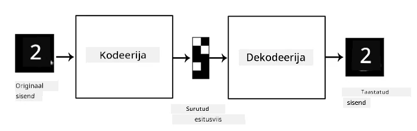
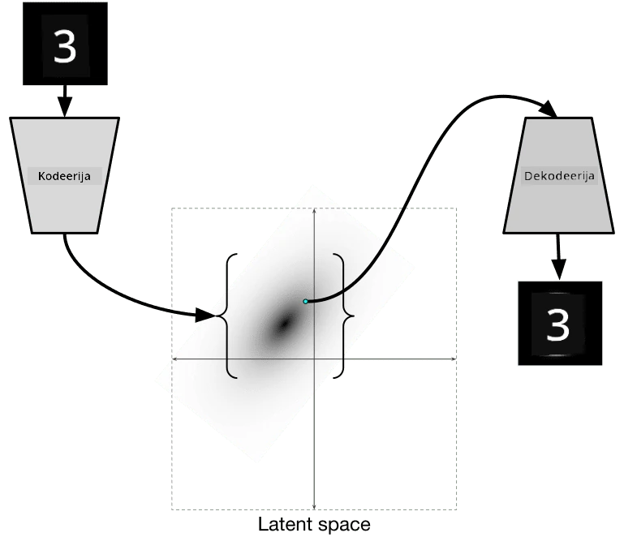

# Autoenkoodrid

CNN-ide treenimisel on üheks probleemiks see, et vajame palju märgistatud andmeid. Näiteks pildiklassifikatsiooni puhul peame pildid jagama erinevatesse klassidesse, mis on käsitsi tehtav töö.

## [Eelloengu viktoriin](https://ff-quizzes.netlify.app/en/ai/quiz/17)

Siiski võime soovida kasutada toorandmeid (märgistamata) CNN-i funktsioonide ekstraktorite treenimiseks, mida nimetatakse **iseseisvaks õppimiseks**. Siltide asemel kasutame treeningpilte nii võrgu sisendina kui ka väljundina. **Autoenkoodri** peamine idee seisneb selles, et meil on **enkoodrivõrk**, mis teisendab sisendpildi mingisse **latentruumi** (tavaliselt on see lihtsalt väiksema suurusega vektor), ja **dekoodrivõrk**, mille eesmärk on taastada algne pilt.

> ✅ [Autoenkooder](https://wikipedia.org/wiki/Autoencoder) on "tehisnärvivõrkude tüüp, mida kasutatakse märgistamata andmete tõhusate kodeeringute õppimiseks."

Kuna treenime autoenkoodrit, et haarata võimalikult palju teavet algsest pildist täpseks taastamiseks, püüab võrk leida parima **sisendpiltide representatsiooni**, et tabada nende tähendus.

> Pilt [Kerase blogist](https://blog.keras.io/building-autoencoders-in-keras.html)

## Autoenkoodrite kasutamise stsenaariumid

Kuigi algsete piltide taastamine ei pruugi iseenesest tunduda kasulik, on mõned stsenaariumid, kus autoenkoodrid on eriti kasulikud:

* **Piltide dimensiooni vähendamine visualiseerimiseks** või **piltide representatsioonide treenimine**. Tavaliselt annavad autoenkoodrid paremaid tulemusi kui PCA, kuna nad arvestavad piltide ruumilist olemust ja hierarhilisi omadusi.
* **Müravähendus**, st müra eemaldamine pildilt. Kuna müra sisaldab palju kasutut teavet, ei suuda autoenkooder seda kõike suhteliselt väikesesse latentruumi mahutada ja seega haarab ainult olulise osa pildist. Müravähendajate treenimisel alustame algsetest piltidest ja kasutame autoenkoodri sisendina pilte, millele on kunstlikult müra lisatud.
* **Superresolutsioon**, pildi eraldusvõime suurendamine. Alustame kõrge eraldusvõimega piltidest ja kasutame autoenkoodri sisendina madalama eraldusvõimega pilti.
* **Generatiivsed mudelid**. Kui oleme autoenkoodri treeninud, saab dekoodri osa kasutada uute objektide loomiseks, alustades juhuslikest latentvektoritest.

## Variatsioonilised autoenkoodrid (VAE)

Traditsioonilised autoenkoodrid vähendavad sisendandmete dimensiooni, tuvastades sisendpiltide olulised omadused. Kuid latentvektorid ei pruugi sageli olla mõistlikud. Teisisõnu, kui võtta MNIST andmestik näiteks, siis pole lihtne aru saada, millised numbrid vastavad erinevatele latentvektoritele, kuna lähedased latentvektorid ei pruugi tingimata vastata samadele numbritele.

Generatiivsete mudelite treenimiseks on aga parem omada mingit arusaama latentruumist. See idee viib meid **variatsioonilise autoenkoodrini** (VAE).

VAE on autoenkooder, mis õpib ennustama latentparameetrite *statistilist jaotust*, nn **latentjaotust**. Näiteks võime soovida, et latentvektorid jaotuksid normaalselt mingi keskmise zmean ja standardhälbe zsigma järgi (nii keskmine kui ka standardhälve on mingis dimensioonis d vektorid). VAE enkooder õpib ennustama neid parameetreid ja dekooder võtab seejärel juhusliku vektori sellest jaotusest, et objekti taastada.

Kokkuvõtteks:

 * Sisendvektorist ennustame `z_mean` ja `z_log_sigma` (standardhälbe asemel ennustame selle logaritmi)
 * Valime vektori `sample` jaotusest N(zmean,exp(zlog\_sigma))
 * Dekooder püüab dekodeerida algset pilti, kasutades `sample` sisendvektorina

 

> Pilt [sellest blogipostitusest](https://ijdykeman.github.io/ml/2016/12/21/cvae.html) autorilt Isaak Dykeman

Variatsioonilised autoenkoodrid kasutavad keerulist kaotusefunktsiooni, mis koosneb kahest osast:

* **Taastamiskaotus** on kaotusefunktsioon, mis näitab, kui lähedane taastatud pilt on sihtpildile (see võib olla keskmine ruutude summa ehk MSE). See on sama kaotusefunktsioon nagu tavalistes autoenkoodrites.
* **KL-kaotus**, mis tagab, et latentmuutuja jaotused jäävad normaalse jaotuse lähedale. See põhineb [Kullback-Leibleri divergentsi](https://www.countbayesie.com/blog/2017/5/9/kullback-leibler-divergence-explained) mõistel - meetrikal, mis hindab, kui sarnased kaks statistilist jaotust on.

Üks oluline eelis VAE-de puhul on see, et need võimaldavad meil suhteliselt lihtsalt uusi pilte genereerida, kuna teame, millist jaotust latentvektorite valimiseks kasutada. Näiteks kui treenime VAE-d 2D latentvektoriga MNIST andmestikul, saame seejärel muuta latentvektori komponente, et saada erinevaid numbreid:

> Pilt autorilt [Dmitry Soshnikov](http://soshnikov.com)

Vaadake, kuidas pildid sulanduvad üksteisesse, kui hakkame saama latentvektoreid latentparameetrite ruumi erinevatest osadest. Samuti saame visualiseerida seda ruumi 2D-s:

 

> Pilt autorilt [Dmitry Soshnikov](http://soshnikov.com)

## ✍️ Harjutused: Autoenkoodrid

Tutvuge autoenkoodritega nendes vastavates märkmikes:

* [Autoenkoodrid TensorFlow's](AutoencodersTF.ipynb)
* [Autoenkoodrid PyTorchis](AutoEncodersPyTorch.ipynb)

## Autoenkoodrite omadused

* **Andmespetsiifilised** - need töötavad hästi ainult selliste piltidega, millel nad on treenitud. Näiteks kui treenime superresolutsioonivõrku lillede peal, ei tööta see hästi portreede puhul. See on tingitud sellest, et võrk suudab luua kõrgema eraldusvõimega pilte, kasutades peeneid detaile, mis on treeningandmestikust õpitud.
* **Kaotusega** - taastatud pilt ei ole sama mis algne pilt. Kaotuse olemus määratakse treeningu ajal kasutatud *kaotusefunktsiooni* järgi.
* Töötab **märgistamata andmetega**

## [Järelloengu viktoriin](https://ff-quizzes.netlify.app/en/ai/quiz/18)

## Kokkuvõte

Selles õppetükis õppisite erinevat tüüpi autoenkoodrite kohta, mis on AI teadlasele kättesaadavad. Õppisite, kuidas neid ehitada ja kasutada piltide taastamiseks. Samuti õppisite VAE kohta ja kuidas seda kasutada uute piltide genereerimiseks.

## 🚀 Väljakutse

Selles õppetükis õppisite autoenkoodrite kasutamist piltide jaoks. Kuid neid saab kasutada ka muusika jaoks! Vaadake Magenta projekti [MusicVAE](https://magenta.tensorflow.org/music-vae) projekti, mis kasutab autoenkoodreid muusika taastamise õppimiseks. Tehke [katseid](https://colab.research.google.com/github/magenta/magenta-demos/blob/master/colab-notebooks/Multitrack_MusicVAE.ipynb) selle teegiga, et näha, mida suudate luua.

## [Järelloengu viktoriin](https://ff-quizzes.netlify.app/en/ai/quiz/16)

## Ülevaade ja iseseisev õppimine

Lisateabe saamiseks autoenkoodrite kohta lugege neid ressursse:

* [Autoenkoodrite ehitamine Kerasis](https://blog.keras.io/building-autoencoders-in-keras.html)
* [Blogipostitus NeuroHive'is](https://neurohive.io/ru/osnovy-data-science/variacionnyj-avtojenkoder-vae/)
* [Variatsioonilised autoenkoodrid selgitatud](https://kvfrans.com/variational-autoencoders-explained/)
* [Tingimuslikud variatsioonilised autoenkoodrid](https://ijdykeman.github.io/ml/2016/12/21/cvae.html)

## Ülesanne

[TensorFlow märkmiku](AutoencodersTF.ipynb) lõpus leiate "ülesande" - kasutage seda oma kodutööna.

---

**Lahtiütlus**:  
See dokument on tõlgitud AI tõlketeenuse [Co-op Translator](https://github.com/Azure/co-op-translator) abil. Kuigi püüame tagada täpsust, palume arvestada, et automaatsed tõlked võivad sisaldada vigu või ebatäpsusi. Algne dokument selle algses keeles tuleks pidada autoriteetseks allikaks. Olulise teabe puhul soovitame kasutada professionaalset inimtõlget. Me ei vastuta selle tõlke kasutamisest tulenevate arusaamatuste või valesti tõlgenduste eest.