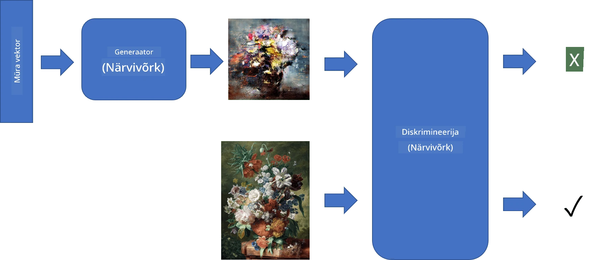
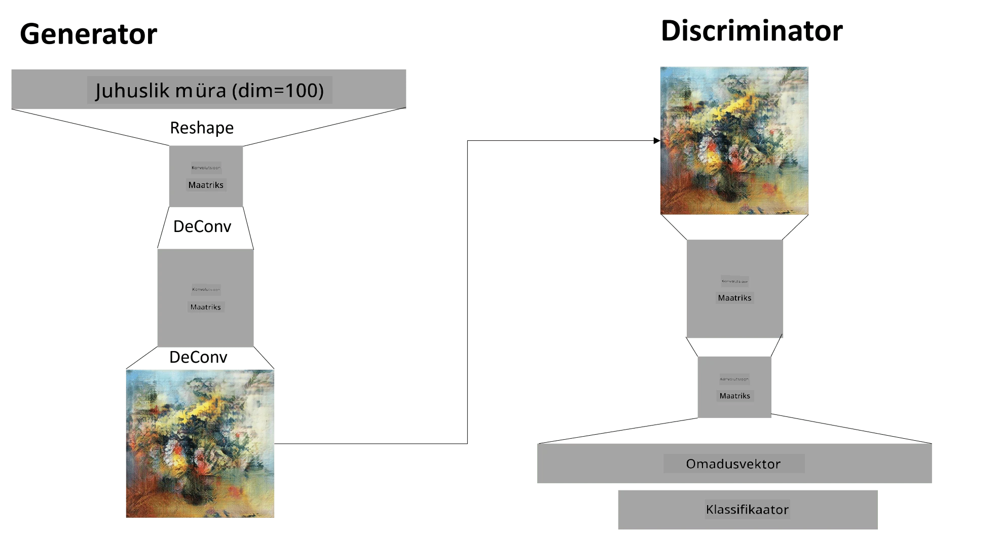

# Generatiivsed vastandlikud võrgud

Eelmises osas õppisime **generatiivsete mudelite** kohta: mudelid, mis suudavad luua uusi pilte, mis sarnanevad treeningandmestikus olevatele. VAE oli hea näide generatiivsest mudelist.

## [Eelloengu viktoriin](https://ff-quizzes.netlify.app/en/ai/quiz/19)

Kui aga proovime luua midagi tõeliselt tähenduslikku, näiteks maali mõistlikus resolutsioonis, siis VAE-ga treenimine ei pruugi hästi õnnestuda. Selleks kasutusjuhtumiks peaksime õppima tundma teist arhitektuuri, mis on spetsiaalselt suunatud generatiivsetele mudelitele - **Generatiivsed vastandlikud võrgud** ehk GAN-id.

GAN-i peamine idee on kasutada kahte närvivõrku, mis treenivad üksteise vastu:

> Pilt: [Dmitry Soshnikov](http://soshnikov.com)

> ✅ Väike sõnavara:
> * **Generaator** on võrk, mis võtab sisendiks juhusliku vektori ja genereerib tulemuseks pildi.
> * **Diskrimineerija** on võrk, mis võtab sisendiks pildi ja peaks otsustama, kas tegemist on päris pildiga (treeningandmestikust) või generaatori loodud pildiga. Sisuliselt on see pildiklassifikaator.

### Diskrimineerija

Diskrimineerija arhitektuur ei erine tavalisest pildiklassifikatsiooni võrgust. Lihtsaimal juhul võib see olla täielikult ühendatud klassifikaator, kuid tõenäoliselt kasutatakse [konvolutsioonivõrku](../07-ConvNets/README.md).

> ✅ Konvolutsioonivõrkudel põhinevat GAN-i nimetatakse [DCGAN-iks](https://arxiv.org/pdf/1511.06434.pdf)

CNN-diskrimineerija koosneb järgmistest kihtidest: mitu konvolutsiooni+ühendamist (ruumilise suuruse vähendamiseks) ja üks või mitu täielikult ühendatud kihti, et saada "tunnuste vektor", ning lõpuks binaarne klassifikaator.

> ✅ 'Ühendamine' (pooling) selles kontekstis on tehnika, mis vähendab pildi suurust. "Ühendamiskihid vähendavad andmete dimensioone, kombineerides ühe kihi neuroniklastrite väljundid üheks neuroniks järgmises kihis." - [allikas](https://wikipedia.org/wiki/Convolutional_neural_network#Pooling_layers)

### Generaator

Generaator on veidi keerulisem. Seda võib pidada pööratud diskrimineerijaks. Alustades latentvektorist (tunnuste vektori asemel), on sellel täielikult ühendatud kiht, mis teisendab selle vajalikku suurusesse/kuju, millele järgnevad dekonvolutsioonid+suurendamine. See on sarnane [autokodeerija](../09-Autoencoders/README.md) *dekooder* osale.

> ✅ Kuna konvolutsioonikiht rakendatakse lineaarse filtrina, mis liigub üle pildi, on dekonvolutsioon sisuliselt sarnane konvolutsiooniga ja seda saab rakendada sama kihi loogikaga.

> Pilt: [Dmitry Soshnikov](http://soshnikov.com)

### GAN-i treenimine

GAN-e nimetatakse **vastandlikeks**, kuna generaatori ja diskrimineerija vahel toimub pidev konkurents. Selle konkurentsi käigus paranevad mõlemad, generaator ja diskrimineerija, ning võrk õpib looma järjest paremaid pilte.

Treening toimub kahes etapis:

* **Diskrimineerija treenimine**. See ülesanne on üsna lihtne: genereerime generaatori abil pildipartii, märgistades need 0-ga (mis tähistab võltsitud pilti), ja võtame treeningandmestikust pildipartii (märgisega 1, päris pilt). Saame *diskrimineerija kaotuse* ja teostame tagasilevikut.
* **Generaatori treenimine**. See on veidi keerulisem, kuna me ei tea generaatori oodatud väljundit otseselt. Võtame kogu GAN-võrgu, mis koosneb generaatorist ja diskrimineerijast, anname sellele juhuslikud vektorid ja eeldame, et tulemus on 1 (mis vastab päris piltidele). Seejärel külmutame diskrimineerija parameetrid (me ei soovi seda selles etapis treenida) ja teostame tagasilevikut.

Selle protsessi käigus ei lange generaatori ja diskrimineerija kaotused märkimisväärselt. Ideaalis peaksid need võnkuma, mis näitab, et mõlemad võrgud parandavad oma jõudlust.

## ✍️ Harjutused: GAN-id

* [GAN-i märkmik TensorFlow/Keras-is](GANTF.ipynb)
* [GAN-i märkmik PyTorch-is](GANPyTorch.ipynb)

### Probleemid GAN-i treenimisel

GAN-e peetakse eriti keeruliseks treenida. Siin on mõned probleemid:

* **Režiimi kokkuvarisemine**. See tähendab, et generaator õpib looma ühte edukat pilti, mis petab diskrimineerijat, kuid ei loo erinevaid pilte.
* **Tundlikkus hüperparameetritele**. Sageli võib näha, et GAN ei konvergeeri üldse, ja siis äkitselt õnnestub konvergents õppemäära vähendamisega.
* **Tasakaalu hoidmine** generaatori ja diskrimineerija vahel. Paljudel juhtudel võib diskrimineerija kaotus kiiresti nulli langeda, mis takistab generaatoril edasist treenimist. Selle ületamiseks võib proovida määrata generaatorile ja diskrimineerijale erinevaid õppemäärasid või jätta diskrimineerija treenimine vahele, kui kaotus on juba liiga madal.
* **Kõrge resolutsiooni treenimine**. Sama probleem nagu autokodeerijatega, see probleem tekib, kuna liiga paljude konvolutsioonivõrgu kihtide rekonstrueerimine põhjustab artefakte. Seda probleemi lahendatakse tavaliselt nn **progressiivse kasvuga**, kus esimesed kihid treenitakse madala resolutsiooniga piltidel ja seejärel kihid "avatakse" või lisatakse. Teine lahendus oleks lisada lisakonnektorid kihtide vahel ja treenida mitut resolutsiooni korraga - vaata selle kohta [Multi-Scale Gradient GANs artiklit](https://arxiv.org/abs/1903.06048).

## Stiiliedastus

GAN-id on suurepärane viis kunstiliste piltide loomiseks. Teine huvitav tehnika on nn **stiiliedastus**, mis võtab ühe **sisu pildi** ja joonistab selle ümber teises stiilis, rakendades filtreid **stiilipildist**.

Kuidas see töötab:
* Alustame juhusliku mürapildiga (või sisu pildiga, kuid mõistmise huvides on lihtsam alustada juhuslikust mürast)
* Meie eesmärk on luua selline pilt, mis oleks lähedane nii sisu pildile kui ka stiilipildile. Seda määravad kaks kaotusfunktsiooni:
   - **Sisu kaotus** arvutatakse CNN-i poolt teatud kihtides praeguse pildi ja sisu pildi vaheliste tunnuste põhjal
   - **Stiili kaotus** arvutatakse praeguse pildi ja stiilipildi vahel nutikalt Gram-maatriksite abil (rohkem detaile [näidismärkmikus](StyleTransfer.ipynb))
* Pildi sujuvamaks muutmiseks ja müra eemaldamiseks lisame ka **variatsiooni kaotuse**, mis arvutab naaberpikslite keskmise kauguse
* Peamine optimeerimistsükkel kohandab praegust pilti, kasutades gradientide langust (või mõnda muud optimeerimisalgoritmi), et minimeerida kogukaotust, mis on kõigi kolme kaotuse kaalutud summa.

## ✍️ Näide: [Stiiliedastus](StyleTransfer.ipynb)

## [Järelloengu viktoriin](https://ff-quizzes.netlify.app/en/ai/quiz/20)

## Kokkuvõte

Selles õppetunnis õppisite GAN-e ja nende treenimist. Samuti õppisite tundma eriprobleeme, millega seda tüüpi närvivõrk võib kokku puutuda, ja mõningaid strateegiaid nende ületamiseks.

## 🚀 Väljakutse

Käivitage [Stiiliedastuse märkmik](StyleTransfer.ipynb), kasutades oma pilte.

## Ülevaade ja iseseisev õppimine

Lisateabe saamiseks lugege GAN-ide kohta järgmistest ressurssidest:

* Marco Pasini, [10 õppetundi, mida õppisin GAN-e treenides ühe aasta jooksul](https://towardsdatascience.com/10-lessons-i-learned-training-generative-adversarial-networks-gans-for-a-year-c9071159628)
* [StyleGAN](https://en.wikipedia.org/wiki/StyleGAN), *de facto* GAN arhitektuur, mida kaaluda
* [Generatiivse kunsti loomine GAN-idega Azure ML-is](https://soshnikov.com/scienceart/creating-generative-art-using-gan-on-azureml/)

## Ülesanne

Vaadake uuesti ühte kahest selle õppetunniga seotud märkmikust ja treenige GAN-i oma piltidega. Mida suudate luua?

---

**Lahtiütlus**:  
See dokument on tõlgitud AI tõlketeenuse [Co-op Translator](https://github.com/Azure/co-op-translator) abil. Kuigi püüame tagada täpsust, palume arvestada, et automaatsed tõlked võivad sisaldada vigu või ebatäpsusi. Algne dokument selle algses keeles tuleks pidada autoriteetseks allikaks. Olulise teabe puhul soovitame kasutada professionaalset inimtõlget. Me ei vastuta selle tõlke kasutamisest tulenevate arusaamatuste või valesti tõlgenduste eest.