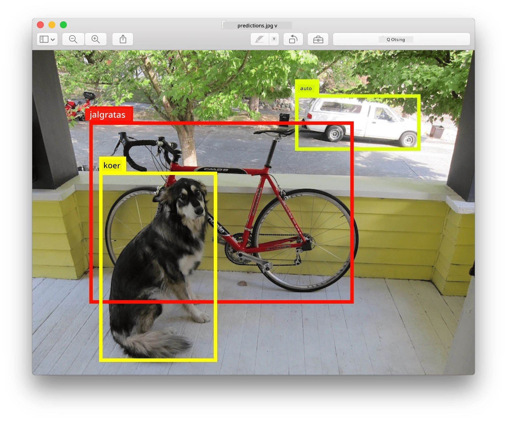
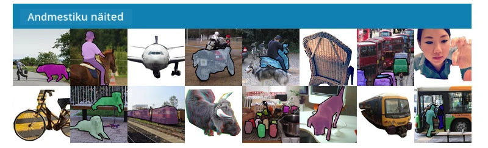
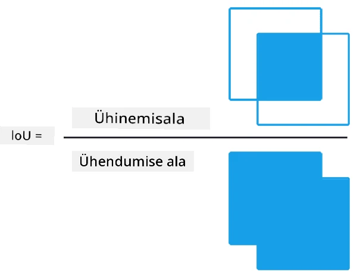
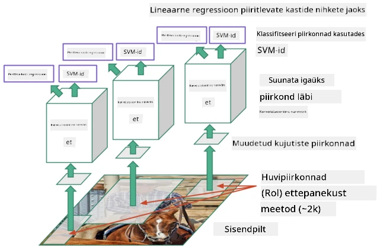
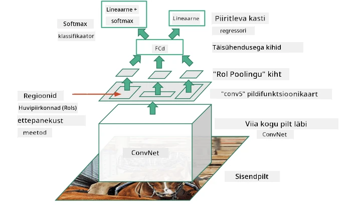
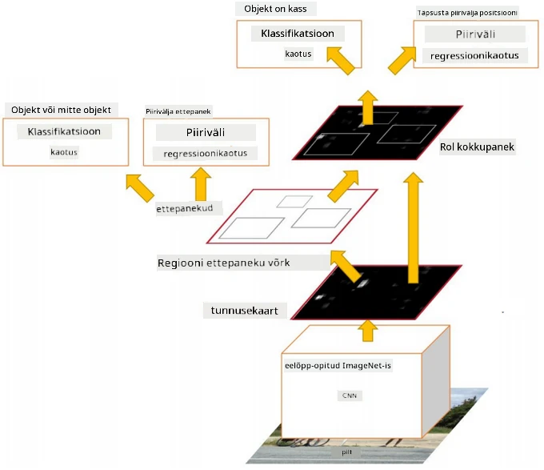
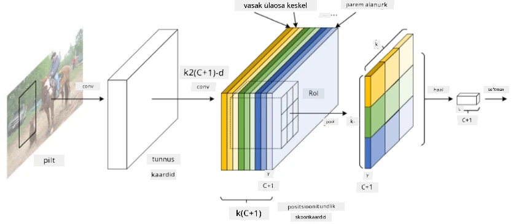
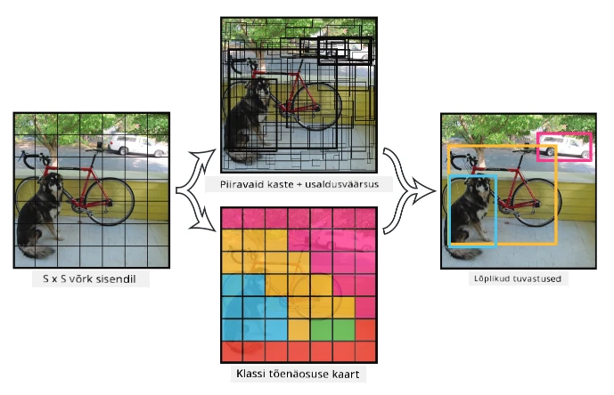

# Objektide tuvastamine

Pildiklassifikatsiooni mudelid, millega oleme seni tegelenud, võtsid pildi ja andsid kategoorilise tulemuse, näiteks klassi 'number' MNIST-probleemis. Kuid paljudel juhtudel ei taha me lihtsalt teada, et pilt kujutab objekte – me tahame määrata nende täpse asukoha. Just seda eesmärki täidab **objektide tuvastamine**.

## [Eelloengu viktoriin](https://ff-quizzes.netlify.app/en/ai/quiz/21)

> Pilt [YOLO v2 veebilehelt](https://pjreddie.com/darknet/yolov2/)

## Naivne lähenemine objektide tuvastamisele

Oletame, et tahame leida kassi pildilt. Väga naiivne lähenemine objektide tuvastamisele oleks järgmine:

1. Jagame pildi mitmeks väiksemaks osaks.
2. Käivitame pildiklassifikatsiooni igal osal.
3. Need osad, mis annavad piisavalt kõrge aktiveerimise, võib pidada objektiks, mida otsime.

> *Pilt [harjutuste märkmikust](ObjectDetection-TF.ipynb)*

Kuid see lähenemine pole ideaalne, kuna see võimaldab algoritmil määrata objekti piiritleva kasti asukohta väga ebatäpselt. Täpsema asukoha määramiseks peame kasutama mingisugust **regressiooni**, et ennustada piiritlevate kastide koordinaate – ja selleks on vaja spetsiifilisi andmekogumeid.

## Regressioon objektide tuvastamiseks

[See blogipostitus](https://towardsdatascience.com/object-detection-with-neural-networks-a4e2c46b4491) pakub suurepärast sissejuhatust kujundite tuvastamisse.

## Andmekogumid objektide tuvastamiseks

Selle ülesande jaoks võite kohata järgmisi andmekogumeid:

* [PASCAL VOC](http://host.robots.ox.ac.uk/pascal/VOC/) – 20 klassi
* [COCO](http://cocodataset.org/#home) – Tavalised objektid kontekstis. 80 klassi, piiritlevad kastid ja segmentatsioonimaskid

## Objektide tuvastamise mõõdikud

### Ühisosa ja ühenduse suhe (Intersection over Union)

Kui pildiklassifikatsiooni puhul on lihtne mõõta, kui hästi algoritm töötab, siis objektide tuvastamise puhul peame mõõtma nii klassi õigsust kui ka tuvastatud piiritleva kasti asukoha täpsust. Viimase jaoks kasutame nn **ühisosa ja ühenduse suhet** (IoU), mis mõõdab, kui hästi kaks kasti (või kaks suvalist ala) kattuvad.

> *Joonis 2 [sellest suurepärasest blogipostitusest IoU kohta](https://pyimagesearch.com/2016/11/07/intersection-over-union-iou-for-object-detection/)*

Idee on lihtne – jagame kahe kujundi ühisosa pindala nende ühenduse pindalaga. Kahe identse ala puhul oleks IoU väärtus 1, samas kui täiesti eraldatud alade puhul oleks see 0. Muudel juhtudel varieerub see 0 ja 1 vahel. Tavaliselt arvestame ainult neid piiritlevaid kaste, mille IoU ületab teatud väärtuse.

### Keskmine täpsus (Average Precision)

Oletame, et tahame mõõta, kui hästi tuvastatakse teatud klassi objekte $C$. Selleks kasutame **keskmise täpsuse** mõõdikut, mis arvutatakse järgmiselt:

1. Võtame täpsuse ja tagasikutsumise kõvera, mis näitab täpsust sõltuvalt tuvastamise läve väärtusest (vahemikus 0 kuni 1).
2. Sõltuvalt lävest tuvastatakse pildil rohkem või vähem objekte ning täpsuse ja tagasikutsumise väärtused muutuvad.
3. Kõver näeb välja selline:

> *Pilt [NeuroWorkshopist](http://github.com/shwars/NeuroWorkshop)*

Keskmine täpsus klassi $C$ jaoks on selle kõvera alune pindala. Täpsemalt jagatakse tagasikutsumise telg tavaliselt 10 osaks ja täpsus keskmistatakse kõigi nende punktide üle:

$$
AP = {1\over11}\sum_{i=0}^{10}\mbox{Precision}(\mbox{Recall}={i\over10})
$$

### AP ja IoU

Arvestame ainult neid tuvastusi, mille IoU ületab teatud väärtuse. Näiteks PASCAL VOC andmekogumis eeldatakse tavaliselt $\mbox{IoU Threshold} = 0.5$, samas kui COCO-s mõõdetakse AP-d erinevate $\mbox{IoU Threshold}$ väärtuste jaoks.

> *Pilt [NeuroWorkshopist](http://github.com/shwars/NeuroWorkshop)*

### Keskmine keskmine täpsus – mAP

Peamine objektide tuvastamise mõõdik on **keskmine keskmine täpsus** ehk **mAP**. See on keskmise täpsuse väärtus, keskmistatud kõigi objektiklasside ja mõnikord ka $\mbox{IoU Threshold}$ üle. Täpsemalt on mAP arvutamise protsess kirjeldatud
[selles blogipostituses](https://medium.com/@timothycarlen/understanding-the-map-evaluation-metric-for-object-detection-a07fe6962cf3) ja [siin koos koodinäidetega](https://gist.github.com/tarlen5/008809c3decf19313de216b9208f3734).

## Erinevad objektide tuvastamise lähenemised

Objektide tuvastamise algoritme on kahte laia klassi:

* **Piirkonna ettepanekuvõrgud** (R-CNN, Fast R-CNN, Faster R-CNN). Peamine idee on genereerida **huvipiirkonnad** (ROI) ja käivitada nende üle CNN, otsides maksimaalset aktiveerimist. See on natuke sarnane naiivse lähenemisega, välja arvatud see, et ROIsid genereeritakse nutikamalt. Üks peamisi puudusi sellistel meetoditel on see, et need on aeglased, kuna vajame CNN klassifikaatori mitut läbimist pildi üle.
* **Ühe läbimise** (YOLO, SSD, RetinaNet) meetodid. Nendes arhitektuurides kujundatakse võrk nii, et see ennustaks nii klasse kui ka ROIsid ühe läbimisega.

### R-CNN: Piirkonna põhine CNN

[R-CNN](http://islab.ulsan.ac.kr/files/announcement/513/rcnn_pami.pdf) kasutab [Selective Search](http://www.huppelen.nl/publications/selectiveSearchDraft.pdf), et genereerida ROI piirkondade hierarhiline struktuur, mis seejärel läbib CNN-i funktsioonide ekstraktorid ja SVM-klassi määrajad, et määrata objekti klass, ning lineaarse regressiooni, et määrata *piiritleva kasti* koordinaadid. [Ametlik artikkel](https://arxiv.org/pdf/1506.01497v1.pdf)

> *Pilt van de Sande et al. ICCV’11*

> *Pildid [sellest blogist](https://towardsdatascience.com/r-cnn-fast-r-cnn-faster-r-cnn-yolo-object-detection-algorithms-36d53571365e)*

### F-RCNN – Kiire R-CNN

See lähenemine on sarnane R-CNN-iga, kuid piirkonnad määratakse pärast konvolutsioonikihtide rakendamist.

> Pilt [ametlikust artiklist](https://www.cv-foundation.org/openaccess/content_iccv_2015/papers/Girshick_Fast_R-CNN_ICCV_2015_paper.pdf), [arXiv](https://arxiv.org/pdf/1504.08083.pdf), 2015

### Kiirem R-CNN

Selle lähenemise peamine idee on kasutada närvivõrku ROIside ennustamiseks – nn *piirkonna ettepanekuvõrk*. [Artikkel](https://arxiv.org/pdf/1506.01497.pdf), 2016

> Pilt [ametlikust artiklist](https://arxiv.org/pdf/1506.01497.pdf)

### R-FCN: Piirkonna põhine täielikult konvolutsiooniline võrk

See algoritm on isegi kiirem kui Faster R-CNN. Peamine idee on järgmine:

1. Ekstraheerime funktsioonid ResNet-101 abil.
2. Funktsioone töödeldakse **positsioonitundliku skoorikaardiga**. Iga objekt klassist $C$ jagatakse $k\times k$ piirkondadeks ja treenime ennustama objektide osi.
3. Iga osa $k\times k$ piirkondadest hääletavad kõik võrgud objektiklasside eest ja maksimaalse häälega objektiklass valitakse.

> Pilt [ametlikust artiklist](https://arxiv.org/abs/1605.06409)

### YOLO – You Only Look Once

YOLO on reaalajas ühe läbimise algoritm. Peamine idee on järgmine:

 * Pilt jagatakse $S\times S$ piirkondadeks.
 * Iga piirkonna jaoks ennustab **CNN** $n$ võimalikku objekti, *piiritleva kasti* koordinaate ja *usaldusväärsust*=*tõenäosust* * IoU.

 

> Pilt [ametlikust artiklist](https://arxiv.org/abs/1506.02640)

### Muud algoritmid

* RetinaNet: [ametlik artikkel](https://arxiv.org/abs/1708.02002)
   - [PyTorchi implementatsioon Torchvisionis](https://pytorch.org/vision/stable/_modules/torchvision/models/detection/retinanet.html)
   - [Kerase implementatsioon](https://github.com/fizyr/keras-retinanet)
   - [Objektide tuvastamine RetinaNetiga](https://keras.io/examples/vision/retinanet/) Kerase näidetes
* SSD (Single Shot Detector): [ametlik artikkel](https://arxiv.org/abs/1512.02325)

## ✍️ Harjutused: Objektide tuvastamine

Jätkake õppimist järgmises märkmikus:

[ObjectDetection.ipynb](ObjectDetection.ipynb)

## Kokkuvõte

Selles tunnis tegite kiirülevaate erinevatest viisidest, kuidas objektide tuvastamist saab teostada!

## 🚀 Väljakutse

Lugege läbi need artiklid ja märkmikud YOLO kohta ning proovige neid ise:

* [Hea blogipostitus](https://www.analyticsvidhya.com/blog/2018/12/practical-guide-object-detection-yolo-framewor-python/) YOLO kirjeldamiseks
 * [Ametlik veebileht](https://pjreddie.com/darknet/yolo/)
 * Yolo: [Kerase implementatsioon](https://github.com/experiencor/keras-yolo2), [samm-sammult märkmik](https://github.com/experiencor/basic-yolo-keras/blob/master/Yolo%20Step-by-Step.ipynb)
 * Yolo v2: [Kerase implementatsioon](https://github.com/experiencor/keras-yolo2), [samm-sammult märkmik](https://github.com/experiencor/keras-yolo2/blob/master/Yolo%20Step-by-Step.ipynb)

## [Järelloengu viktoriin](https://ff-quizzes.netlify.app/en/ai/quiz/22)

## Ülevaade ja iseseisev õppimine

* [Objektide tuvastamine](https://tjmachinelearning.com/lectures/1718/obj/) autor Nikhil Sardana
* [Hea võrdlus objektide tuvastamise algoritmide kohta](https://lilianweng.github.io/lil-log/2018/12/27/object-detection-part-4.html)
* [Ülevaade süvaõppe algoritmidest objektide tuvastamiseks](https://medium.com/comet-app/review-of-deep-learning-algorithms-for-object-detection-c1f3d437b852)
* [Samm-sammuline sissejuhatus põhilistesse objektide tuvastamise algoritmidesse](https://www.analyticsvidhya.com/blog/2018/10/a-step-by-step-introduction-to-the-basic-object-detection-algorithms-part-1/)
* [Kiirema R-CNN-i implementatsioon Pythonis objektide tuvastamiseks](https://www.analyticsvidhya.com/blog/2018/11/implementation-faster-r-cnn-python-object-detection/)

## [Ülesanne: Objektide tuvastamine](lab/README.md)

---

**Lahtiütlus**:  
See dokument on tõlgitud, kasutades AI tõlketeenust [Co-op Translator](https://github.com/Azure/co-op-translator). Kuigi püüame tagada täpsust, palun arvestage, et automaatsed tõlked võivad sisaldada vigu või ebatäpsusi. Algne dokument selle algses keeles tuleks lugeda autoriteetseks allikaks. Olulise teabe puhul on soovitatav kasutada professionaalset inimtõlget. Me ei vastuta selle tõlke kasutamisest tulenevate arusaamatuste või valesti tõlgenduste eest.