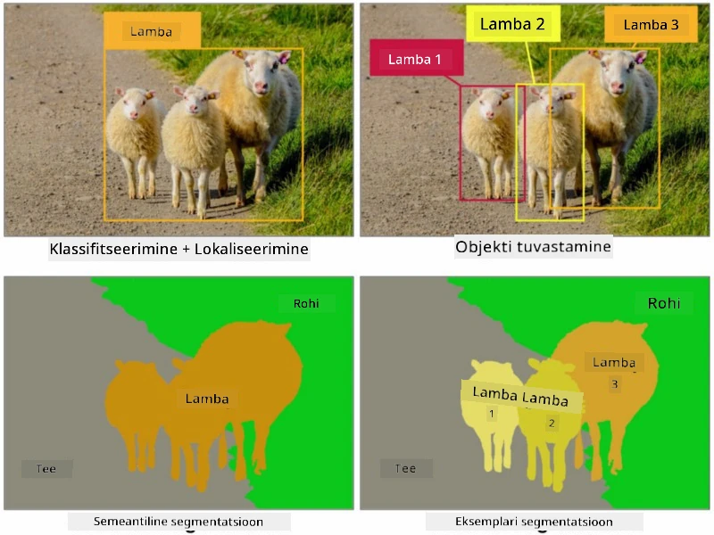
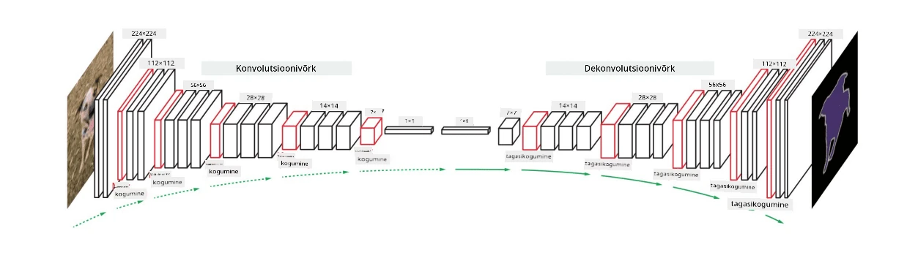

# Segmenteerimine

Oleme varem õppinud objektide tuvastamist, mis võimaldab meil leida objekte pildil, ennustades nende *piiravaid kaste*. Kuid mõnede ülesannete puhul ei vaja me ainult piiravaid kaste, vaid ka täpsemat objektide lokaliseerimist. Seda ülesannet nimetatakse **segmenteerimiseks**.

## [Eelloengu viktoriin](https://ff-quizzes.netlify.app/en/ai/quiz/23)

Segmenteerimist võib vaadelda kui **pikslite klassifikatsiooni**, kus **iga** piksli kohta pildil peame ennustama selle klassi (*taust* on üks klassidest). Segmenteerimise peamised algoritmid on järgmised:

* **Semantiline segmenteerimine** määrab ainult piksli klassi ega erista sama klassi erinevaid objekte.
* **Instance segmenteerimine** jagab klassid erinevateks eksemplarideks.

Instance segmenteerimise puhul on need lambad erinevad objektid, kuid semantilise segmenteerimise puhul esindavad kõik lambad ühte klassi.

> Pilt [sellest blogipostitusest](https://nirmalamurali.medium.com/image-classification-vs-semantic-segmentation-vs-instance-segmentation-625c33a08d50)

Segmenteerimiseks on erinevaid närvivõrkude arhitektuure, kuid neil kõigil on sama struktuur. Mingis mõttes on see sarnane autoenkooderiga, millest varem õppisite, kuid originaalpildi dekonstruerimise asemel on meie eesmärk dekonstruerida **mask**. Seega on segmenteerimisvõrgul järgmised osad:

* **Kodeerija** ekstraheerib sisendpildist omadused.
* **Dekodeerija** teisendab need omadused **maskipildiks**, millel on sama suurus ja kanalite arv, mis vastab klasside arvule.

> Pilt [sellest publikatsioonist](https://arxiv.org/pdf/2001.05566.pdf)

Eriti tuleks mainida segmenteerimisel kasutatavat kaotusfunktsiooni. Klassikaliste autoenkooderite kasutamisel peame mõõtma kahe pildi sarnasust ja selleks võime kasutada keskmist ruutviga (MSE). Segmenteerimisel esindab sihtmaski pildi iga piksel klassi numbrit (ühekuumkoodiga kolmandas dimensioonis), seega peame kasutama klassifikatsioonile spetsiifilisi kaotusfunktsioone - ristentroopia kaotus, keskmistatuna kõigi pikslite üle. Kui mask on binaarne, kasutatakse **binaarset ristentroopia kaotust** (BCE).

> ✅ Ühekuumkoodimine on viis klassi märgistuse kodeerimiseks vektoriks, mille pikkus vastab klasside arvule. Vaadake [seda artiklit](https://datagy.io/sklearn-one-hot-encode/) selle tehnika kohta.

## Segmenteerimine meditsiiniliste piltide jaoks

Selles õppetükis näeme segmenteerimist tegevuses, treenides võrku inimeste neevuste (tuntud ka kui sünnimärgid) tuvastamiseks meditsiinilistel piltidel. Kasutame <a href="https://www.fc.up.pt/addi/ph2%20database.html">PH2 andmebaasi</a> dermoskoopia piltide allikana. See andmebaas sisaldab 200 pilti kolmest klassist: tüüpiline nevus, ebatüüpiline nevus ja melanoom. Kõigil piltidel on ka vastav **mask**, mis piiritleb nevuse.

> ✅ See tehnika sobib eriti hästi sellist tüüpi meditsiiniliste piltide jaoks, kuid milliseid muid reaalse maailma rakendusi võiksite ette kujutada?

> Pilt PH2 andmebaasist

Treeni mudelit, et segmenteerida nevus selle taustast.

## ✍️ Harjutused: Semantiline segmenteerimine

Avage allolevad märkmikud, et õppida rohkem erinevate semantilise segmenteerimise arhitektuuride kohta, harjutada nendega töötamist ja näha neid tegevuses.

* [Semantiline segmenteerimine Pytorch](SemanticSegmentationPytorch.ipynb)
* [Semantiline segmenteerimine TensorFlow](SemanticSegmentationTF.ipynb)

## [Järelloengu viktoriin](https://ff-quizzes.netlify.app/en/ai/quiz/24)

## Kokkuvõte

Segmenteerimine on väga võimas tehnika pildiklassifikatsiooniks, liikudes piiravatest kastidest pikslitaseme klassifikatsioonini. Seda tehnikat kasutatakse meditsiinilistes piltides ja muudes rakendustes.

## 🚀 Väljakutse

Keha segmenteerimine on vaid üks levinud ülesannetest, mida saame teha inimeste piltidega. Teised olulised ülesanded hõlmavad **skeleti tuvastamist** ja **poosi tuvastamist**. Proovige [OpenPose](https://github.com/CMU-Perceptual-Computing-Lab/openpose) raamatukogu, et näha, kuidas poosi tuvastamist saab kasutada.

## Ülevaade ja iseseisev õppimine

See [Wikipedia artikkel](https://wikipedia.org/wiki/Image_segmentation) pakub head ülevaadet selle tehnika erinevatest rakendustest. Uurige ise rohkem Instance segmenteerimise ja Panoptic segmenteerimise aladest selles valdkonnas.

## [Ülesanne](lab/README.md)

Selles laboris proovige **inimkeha segmenteerimist** kasutades [Segmentation Full Body MADS Dataset](https://www.kaggle.com/datasets/tapakah68/segmentation-full-body-mads-dataset) andmestikku Kaggle'ist.

---

**Lahtiütlus**:  
See dokument on tõlgitud AI tõlketeenuse [Co-op Translator](https://github.com/Azure/co-op-translator) abil. Kuigi püüame tagada täpsust, palume arvestada, et automaatsed tõlked võivad sisaldada vigu või ebatäpsusi. Algne dokument selle algses keeles tuleks pidada autoriteetseks allikaks. Olulise teabe puhul soovitame kasutada professionaalset inimtõlget. Me ei vastuta selle tõlke kasutamisest tulenevate arusaamatuste või valesti tõlgenduste eest.