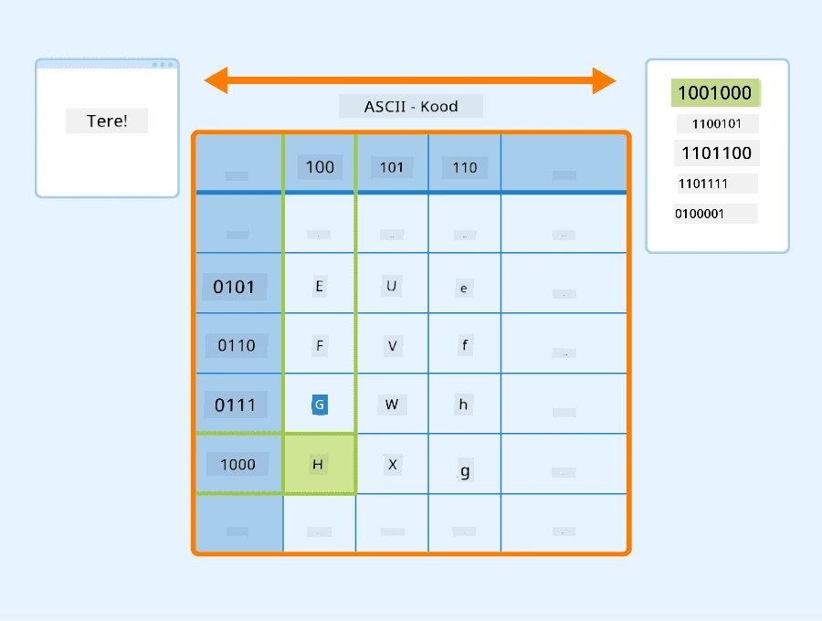
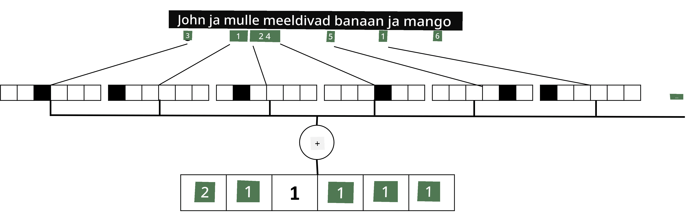

# Teksti esindamine tensoritena

## [Eelloengu viktoriin](https://ff-quizzes.netlify.app/en/ai/quiz/25)

## Tekstiklassifikatsioon

Selle osa esimeses pooles keskendume **tekstiklassifikatsiooni** ülesandele. Kasutame [AG News](https://www.kaggle.com/amananandrai/ag-news-classification-dataset) andmestikku, mis sisaldab uudisartikleid, näiteks järgmisi:

* Kategooria: Teadus/Tehnoloogia
* Pealkiri: Ky. ettevõte võidab granti peptiidide uurimiseks (AP)
* Sisu: AP - Keemiauuringutega tegeleva Louisville'i ülikooli teadlase asutatud ettevõte võitis granti, et arendada...

Meie eesmärk on klassifitseerida uudisartikkel üheks kategooriaks, tuginedes tekstile.

## Teksti esindamine

Kui tahame lahendada loomuliku keele töötlemise (NLP) ülesandeid närvivõrkudega, peame leidma viisi, kuidas teksti tensoritena esitada. Arvutid esindavad tekstimärke juba numbritena, mis kaardistuvad ekraanil olevate fontidega, kasutades kodeeringuid nagu ASCII või UTF-8.

> [Pildi allikas](https://www.seobility.net/en/wiki/ASCII)

Inimestena mõistame, mida iga täht **esindab**, ja kuidas kõik märgid kokku moodustavad lause sõnad. Kuid arvutid ise sellist arusaama ei oma, ning närvivõrk peab tähenduse õppima treeningu käigus.

Seetõttu saame teksti esindamisel kasutada erinevaid lähenemisviise:

* **Tasemel esindamine**, kus käsitleme iga märki numbrina. Kui meil on *C* erinevat märki tekstikorpuses, siis sõna *Hello* esitatakse 5x*C* tensorina. Iga täht vastab ühe-kuuma kodeeringus tensoriveerule.
* **Sõnatasemel esindamine**, kus loome tekstis kõigi sõnade **sõnavara** ja esindame sõnu ühe-kuuma kodeeringuga. See lähenemine on mõnevõrra parem, sest iga täht iseenesest ei oma suurt tähendust, ja kasutades kõrgema taseme semantilisi mõisteid - sõnu - lihtsustame ülesannet närvivõrgule. Kuid suure sõnastiku suuruse tõttu peame tegelema kõrgedimensiooniliste hõredate tensoritega.

Sõltumata esitusviisist peame esmalt teisendama teksti **tokenite** jadaks, kus üks token on kas märk, sõna või mõnikord isegi osa sõnast. Seejärel teisendame tokeni numbriks, kasutades tavaliselt **sõnavara**, ja see number saab ühe-kuuma kodeeringu kaudu närvivõrku sisendiks.

## N-grammid

Loomulikus keeles saab sõnade täpset tähendust määrata ainult kontekstis. Näiteks on *närvivõrk* ja *kalavõrk* tähendused täiesti erinevad. Üks viis seda arvesse võtta on luua mudel sõnapaaride põhjal ja käsitleda sõnapaare eraldi sõnavara tokenitena. Sel viisil esitatakse lause *Mulle meeldib kalal käia* järgmiste tokenite jadana: *Mulle meeldib*, *meeldib käia*, *käia kalal*. Selle lähenemise probleem on, et sõnastiku suurus kasvab märkimisväärselt, ja kombinatsioonid nagu *käia kalal* ja *käia poes* esitatakse erinevate tokenitena, mis ei jaga semantilist sarnasust vaatamata sama verbi kasutamisele.

Mõnel juhul võime kaaluda ka tri-grammide - kolme sõna kombinatsioonide - kasutamist. Seetõttu nimetatakse seda lähenemist sageli **n-grammideks**. Samuti on mõistlik kasutada n-gramme märgitasemel esindamisel, kus n-grammid vastavad ligikaudu erinevatele silpidele.

## Sõnakott ja TF/IDF

Tekstiklassifikatsiooni ülesannete lahendamisel peame suutma esitada teksti ühe fikseeritud suurusega vektorina, mida kasutame lõpliku tiheda klassifikaatori sisendina. Üks lihtsamaid viise seda teha on kombineerida kõik üksikud sõnaesitused, näiteks neid liites. Kui liidame iga sõna ühe-kuuma kodeeringud, saame sagedusvektori, mis näitab, mitu korda iga sõna tekstis esineb. Sellist teksti esitust nimetatakse **sõnakotiks** (BoW).

> Pilt autori poolt

Sõnakott esindab sisuliselt, millised sõnad tekstis esinevad ja millistes kogustes, mis võib tõepoolest olla hea näitaja, millest tekst räägib. Näiteks poliitiliste uudiste artikkel sisaldab tõenäoliselt sõnu nagu *president* ja *riik*, samas kui teaduslikus publikatsioonis leidub midagi sellist nagu *kollider*, *avastatud* jne. Seega võivad sõnade sagedused paljudel juhtudel olla hea näitaja teksti sisust.

Sõnakoti probleem on aga see, et teatud tavalised sõnad, nagu *ja*, *on* jne, esinevad enamikus tekstides ja neil on kõrgeimad sagedused, varjutades sõnu, mis on tõeliselt olulised. Nende sõnade tähtsust saame vähendada, võttes arvesse sõnade esinemissagedust kogu dokumendikogus. See on TF/IDF lähenemise peamine idee, mida käsitletakse selle õppetunni juurde kuuluvates märkmikes üksikasjalikumalt.

Kuid ükski neist lähenemistest ei suuda täielikult arvesse võtta teksti **semantikat**. Selleks vajame võimsamaid närvivõrgu mudeleid, mida käsitleme hiljem selles osas.

## ✍️ Harjutused: Teksti esitus

Jätka õppimist järgmistes märkmikes:

* [Teksti esitus PyTorchiga](TextRepresentationPyTorch.ipynb)
* [Teksti esitus TensorFlowga](TextRepresentationTF.ipynb)

## Kokkuvõte

Siiani oleme uurinud tehnikaid, mis lisavad sõnadele sageduskaalu. Need ei suuda siiski esitada tähendust ega järjekorda. Nagu kuulus lingvist J. R. Firth ütles 1935. aastal: "Sõna täielik tähendus on alati kontekstuaalne, ja ükski tähenduse uurimine väljaspool konteksti ei ole tõsiseltvõetav." Õpime hiljem kursusel, kuidas tekstist kontekstuaalset teavet püüda, kasutades keelemudeleid.

## 🚀 Väljakutse

Proovi mõnda muud harjutust, kasutades sõnakotti ja erinevaid andmemudeleid. Inspiratsiooni võid saada sellest [Kaggle'i võistlusest](https://www.kaggle.com/competitions/word2vec-nlp-tutorial/overview/part-1-for-beginners-bag-of-words).

## [Järelloengu viktoriin](https://ff-quizzes.netlify.app/en/ai/quiz/26)

## Ülevaade ja iseseisev õppimine

Harjuta oma oskusi tekstiesituste ja sõnakoti tehnikatega [Microsoft Learnis](https://docs.microsoft.com/learn/modules/intro-natural-language-processing-pytorch/?WT.mc_id=academic-77998-cacaste).

## [Ülesanne: Märkmikud](assignment.md)

---

**Lahtiütlus**:  
See dokument on tõlgitud, kasutades AI tõlketeenust [Co-op Translator](https://github.com/Azure/co-op-translator). Kuigi püüame tagada täpsust, palun arvestage, et automaatsed tõlked võivad sisaldada vigu või ebatäpsusi. Algne dokument selle algkeeles tuleks lugeda autoriteetseks allikaks. Olulise teabe puhul on soovitatav kasutada professionaalset inimtõlget. Me ei vastuta selle tõlke kasutamisest tulenevate arusaamatuste või valede tõlgenduste eest.