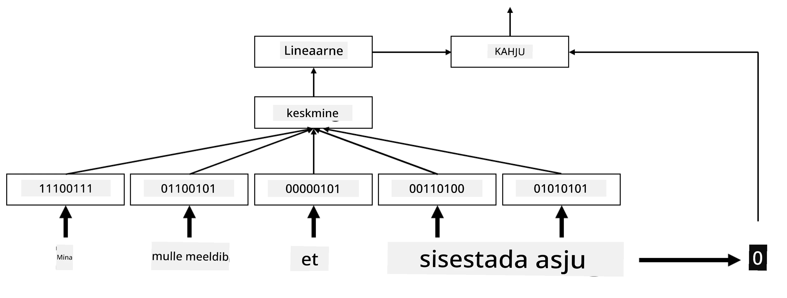

# Sisestused

## [Eelloengu viktoriin](https://ff-quizzes.netlify.app/en/ai/quiz/27)

Kui treenisime klassifitseerijaid, mis põhinesid BoW-l või TF/IDF-il, töötasime kõrgedimensiooniliste sõnakottide vektoritega, mille pikkus oli `vocab_size`, ja teisendasime madaladimensioonilised positsioonirepresentatsiooni vektorid selgesõnaliselt hõredateks ühekuumadeks representatsioonideks. See ühekuum representatsioon ei ole aga mälusäästlik. Lisaks käsitletakse iga sõna üksteisest sõltumatult, st ühekuumad kodeeritud vektorid ei väljenda sõnade semantilist sarnasust.

**Sisestuse** idee seisneb selles, et sõnu esitatakse madaladimensiooniliste tihedate vektoritega, mis mingil moel peegeldavad sõna semantilist tähendust. Hiljem arutame, kuidas luua tähenduslikke sõnasisestusi, kuid praegu mõtleme sisestustest kui viisist vähendada sõnavektori dimensionaalsust.

Sisestuskihi ülesanne on võtta sõna sisendina ja anda väljundvektor kindlaksmääratud `embedding_size`-ga. Mingis mõttes on see väga sarnane `Linear` kihiga, kuid selle asemel, et võtta ühekuum kodeeritud vektor, suudab see võtta sõna numbri sisendina, võimaldades meil vältida suurte ühekuumade vektorite loomist.

Kasutades sisestuskihti meie klassifitseerimisvõrgu esimese kihina, saame liikuda sõnakotilt **sisestuskoti** mudelile, kus esmalt teisendame iga sõna meie tekstis vastavaks sisestuseks ja seejärel arvutame nende sisestuste üle mingi koondfunktsiooni, nagu `sum`, `average` või `max`.  

> Pilt autori poolt

## ✍️ Harjutused: Sisestused

Jätka õppimist järgmistes märkmikes:
* [Sisestused PyTorchiga](EmbeddingsPyTorch.ipynb)
* [Sisestused TensorFlowga](EmbeddingsTF.ipynb)

## Semantilised sisestused: Word2Vec

Kuigi sisestuskiht õppis sõnu vektorrepresentatsiooniks teisendama, ei pruugi see representatsioon tingimata omada palju semantilist tähendust. Oleks tore õppida vektorrepresentatsiooni, kus sarnased sõnad või sünonüümid vastavad vektoritele, mis on üksteisele lähedal mingi vektorkauguse (nt Eukleidese kauguse) mõttes.

Selleks peame oma sisestusmudeli eelnevalt treenima suure tekstikogu peal spetsiifilisel viisil. Üks viis semantiliste sisestuste treenimiseks on [Word2Vec](https://en.wikipedia.org/wiki/Word2vec). See põhineb kahel peamisel arhitektuuril, mida kasutatakse sõnade hajutatud representatsiooni loomiseks:

 - **Jätkuv sõnakott** (CBoW) — selles arhitektuuris treenime mudelit ennustama sõna ümbritseva konteksti põhjal. Arvestades ngrammi $(W_{-2},W_{-1},W_0,W_1,W_2)$, on mudeli eesmärk ennustada $W_0$ $(W_{-2},W_{-1},W_1,W_2)$ põhjal.
 - **Jätkuv hüppegramm** on CBoW vastand. Mudel kasutab ümbritsevat kontekstiakent, et ennustada praegust sõna.

CBoW on kiirem, samas kui hüppegramm on aeglasem, kuid teeb paremat tööd harvaesinevate sõnade esindamisel.

> Pilt [sellest artiklist](https://arxiv.org/pdf/1301.3781.pdf)

Word2Vec eelnevalt treenitud sisestusi (samuti teisi sarnaseid mudeleid, nagu GloVe) saab kasutada sisestuskihi asemel närvivõrkudes. Siiski peame tegelema sõnavaradega, kuna Word2Vec/GloVe eeltreenimiseks kasutatud sõnavara erineb tõenäoliselt meie tekstikorpuse sõnavarast. Vaata ülaltoodud märkmikke, et näha, kuidas seda probleemi lahendada.

## Kontekstuaalsed sisestused

Traditsiooniliste eeltreenitud sisestusrepresentatsioonide, nagu Word2Vec, üks peamisi piiranguid on sõna tähenduse eristamise probleem. Kuigi eeltreenitud sisestused suudavad tabada osa sõnade tähendusest kontekstis, kodeeritakse iga sõna võimalik tähendus samasse sisestusse. See võib põhjustada probleeme järgnevatel mudelitel, kuna paljudel sõnadel, nagu näiteks sõnal 'play', on erinevad tähendused sõltuvalt kontekstist, milles neid kasutatakse.

Näiteks sõnal 'play' on nendes kahes erinevas lauses üsna erinev tähendus:

- Ma käisin teatris **etendust** vaatamas.
- John tahab oma sõpradega **mängida**.

Eeltreenitud sisestused esindavad mõlemat tähendust sõnast 'play' samas sisestuses. Selle piirangu ületamiseks peame looma sisestusi, mis põhinevad **keelemudelil**, mis on treenitud suure tekstikorpuse peal ja *teab*, kuidas sõnu saab erinevates kontekstides kokku panna. Kontekstuaalsete sisestuste arutamine jääb selle õpetuse ulatusest välja, kuid tuleme nende juurde tagasi, kui räägime keelemudelitest hiljem kursuse jooksul.

## Kokkuvõte

Selles õppetunnis avastasite, kuidas luua ja kasutada sisestuskihte TensorFlow ja Pytorch abil, et paremini peegeldada sõnade semantilisi tähendusi.

## 🚀 Väljakutse

Word2Vec-i on kasutatud huvitavate rakenduste jaoks, sealhulgas laulutekstide ja luule genereerimiseks. Vaata [seda artiklit](https://www.politetype.com/blog/word2vec-color-poems), mis selgitab, kuidas autor kasutas Word2Vec-i luule loomiseks. Vaata ka [seda videot Dan Shiffmannilt](https://www.youtube.com/watch?v=LSS_bos_TPI&ab_channel=TheCodingTrain), et avastada selle tehnika teistsugust selgitust. Seejärel proovi rakendada neid tehnikaid oma tekstikorpusele, võib-olla Kaggle'ist pärit andmetele.

## [Järelloengu viktoriin](https://ff-quizzes.netlify.app/en/ai/quiz/28)

## Ülevaade ja iseseisev õppimine

Loe läbi see artikkel Word2Vec-i kohta: [Efficient Estimation of Word Representations in Vector Space](https://arxiv.org/pdf/1301.3781.pdf)

## [Ülesanne: Märkmikud](assignment.md)

---

**Lahtiütlus**:  
See dokument on tõlgitud AI tõlketeenuse [Co-op Translator](https://github.com/Azure/co-op-translator) abil. Kuigi püüame tagada täpsust, palume arvestada, et automaatsed tõlked võivad sisaldada vigu või ebatäpsusi. Algne dokument selle algses keeles tuleks pidada autoriteetseks allikaks. Olulise teabe puhul soovitame kasutada professionaalset inimtõlget. Me ei vastuta selle tõlke kasutamisest tulenevate arusaamatuste või valesti tõlgenduste eest.