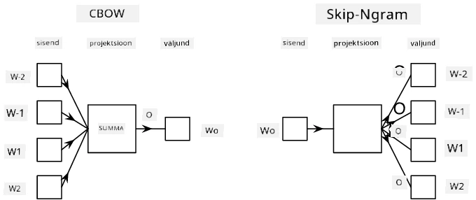

# Keelemudelid

Semantilised vektorid, nagu Word2Vec ja GloVe, on tegelikult esimene samm **keelemudelite** suunas – mudelite loomine, mis mingil moel *mõistavad* (või *esindavad*) keele olemust.

## [Eelloengu viktoriin](https://ff-quizzes.netlify.app/en/ai/quiz/29)

Keelemudelite peamine idee seisneb nende treenimises märgistamata andmekogumite põhjal juhendamata viisil. See on oluline, kuna meil on saadaval tohutul hulgal märgistamata teksti, samas kui märgistatud teksti hulk on alati piiratud ajaga, mida saame märgistamisele kulutada. Enamasti saame luua keelemudeleid, mis suudavad **ennustada puuduvaid sõnu** tekstis, kuna juhusliku sõna maskeerimine tekstis ja selle kasutamine treeningnäitena on lihtne.

## Vektorite treenimine

Eelnevates näidetes kasutasime eelnevalt treenitud semantilisi vektoreid, kuid huvitav on näha, kuidas neid vektoreid saab treenida. Selleks on mitmeid võimalikke ideid:

* **N-grammi** keelemudel, kus ennustame tokenit, vaadates N eelnevat tokenit (N-gramm).
* **Järjepidev sõnakott** (CBoW), kus ennustame keskmist tokenit $W_0$ tokenite järjestuses $W_{-N}$, ..., $W_N$.
* **Skip-gramm**, kus ennustame keskmise tokeni $W_0$ põhjal naabertokenite komplekti {$W_{-N},\dots, W_{-1}, W_1,\dots, W_N$}.

> Pilt [sellest artiklist](https://arxiv.org/pdf/1301.3781.pdf)

## ✍️ Näidisnotebookid: CBoW mudeli treenimine

Jätka õppimist järgmistes notebookides:

* [CBoW Word2Vec treenimine TensorFlow'ga](CBoW-TF.ipynb)
* [CBoW Word2Vec treenimine PyTorch'iga](CBoW-PyTorch.ipynb)

## Kokkuvõte

Eelmises tunnis nägime, et sõnade vektorid toimivad nagu võluväel! Nüüd teame, et sõnade vektorite treenimine ei ole väga keeruline ülesanne ning vajadusel peaksime suutma treenida oma vektoreid spetsiifilise valdkonna tekstide jaoks.

## [Järelloengu viktoriin](https://ff-quizzes.netlify.app/en/ai/quiz/30)

## Ülevaade ja iseseisev õppimine

* [PyTorch'i ametlik keelemudelite õpetus](https://pytorch.org/tutorials/beginner/nlp/word_embeddings_tutorial.html).
* [TensorFlow ametlik õpetus Word2Vec mudeli treenimisest](https://www.TensorFlow.org/tutorials/text/word2vec).
* **gensim** raamistikuga kõige levinumate vektorite treenimine mõne koodirea abil on kirjeldatud [selles dokumentatsioonis](https://pytorch.org/tutorials/beginner/nlp/word_embeddings_tutorial.html).

## 🚀 [Ülesanne: Treeni Skip-Gram mudel](lab/README.md)

Laboris kutsume sind üles muutma selle tunni koodi, et treenida CBoW asemel Skip-Gram mudelit. [Loe lähemalt](lab/README.md)

---

**Lahtiütlus**:  
See dokument on tõlgitud AI tõlketeenuse [Co-op Translator](https://github.com/Azure/co-op-translator) abil. Kuigi püüame tagada täpsust, palume arvestada, et automaatsed tõlked võivad sisaldada vigu või ebatäpsusi. Algne dokument selle algses keeles tuleks pidada autoriteetseks allikaks. Olulise teabe puhul soovitame kasutada professionaalset inimtõlget. Me ei vastuta selle tõlke kasutamisest tulenevate arusaamatuste või valesti tõlgenduste eest.