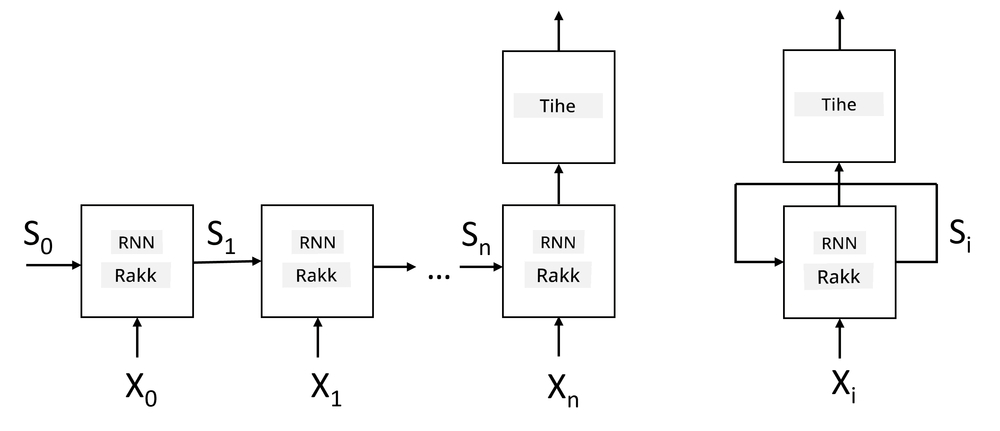
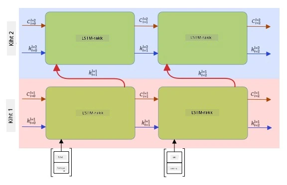

# Korduvad Neuraalvõrgud

## [Eelloengu viktoriin](https://ff-quizzes.netlify.app/en/ai/quiz/31)

Eelnevates osades oleme kasutanud tekstide rikkalikke semantilisi esitusi ja lihtsat lineaarset klassifikaatorit, mis põhineb sisenditel. Selline arhitektuur suudab tabada lause sõnade koondatud tähendust, kuid ei arvesta sõnade **järjekorda**, kuna sisendite koondamine eemaldab selle informatsiooni algtekstist. Kuna need mudelid ei suuda modelleerida sõnade järjestust, ei ole nad võimelised lahendama keerukamaid või mitmetähenduslikke ülesandeid, nagu tekstigeneratsioon või küsimustele vastamine.

Tekstijärjestuse tähenduse tabamiseks peame kasutama teistsugust neuraalvõrgu arhitektuuri, mida nimetatakse **korduvaks neuraalvõrguks** ehk RNN-iks. RNN-is edastame oma lause läbi võrgu ühe sümboli kaupa, ja võrk genereerib mingi **oleku**, mille edastame võrku uuesti koos järgmise sümboliga.

> Pilt autori poolt

Arvestades sisendjärjestust X0,...,Xn, loob RNN järjestuse neuraalvõrgu plokkidest ja treenib seda järjestust otsast lõpuni tagasileviku meetodil. Iga võrguplokk võtab sisendiks paari (Xi,Si) ja genereerib tulemuseks Si+1. Lõplik olek Sn või (väljund Yn) edastatakse lineaarsele klassifikaatorile, et saada tulemus. Kõik võrguplokid jagavad samu kaalusid ja neid treenitakse otsast lõpuni ühe tagasileviku käigus.

Kuna olekuvektorid S0,...,Sn edastatakse läbi võrgu, suudab see õppida sõnade järjestusevahelisi sõltuvusi. Näiteks, kui sõna *mitte* ilmub kuskil järjestuses, võib võrk õppida teatud elemente olekuvektoris eitama, mis viib eitamiseni.

> ✅ Kuna kõik RNN plokkide kaalusid ülaloleval pildil jagatakse, võib sama pilti kujutada ühe plokina (paremal), millel on korduv tagasisideahel, mis edastab võrgu väljundoleku tagasi sisendisse.

## RNN-raku anatoomia

Vaatame, kuidas lihtne RNN-rakk on üles ehitatud. See võtab sisendiks eelneva oleku Si-1 ja praeguse sümboli Xi, ning peab genereerima väljundoleku Si (ja mõnikord huvitab meid ka mõni muu väljund Yi, nagu generatiivsete võrkude puhul).

Lihtsal RNN-rakul on kaks kaalusid sisaldavat maatriksit: üks teisendab sisendsümbolit (nimetame seda W-ks) ja teine teisendab sisendolekut (H). Sellisel juhul arvutatakse võrgu väljund valemiga &sigma;(W&times;Xi+H&times;Si-1+b), kus &sigma; on aktivatsioonifunktsioon ja b on täiendav nihe.

> Pilt autori poolt

Paljudel juhtudel edastatakse sisendsümbolid enne RNN-i sisestamist läbi sisendite vähendamise kihi, et vähendada dimensioonilisust. Sellisel juhul, kui sisendvektorite dimensioon on *emb_size* ja olekuvektor on *hid_size*, siis W suurus on *emb_size*&times;*hid_size* ja H suurus on *hid_size*&times;*hid_size*.

## Pikaajaline lühimälu (LSTM)

Üks klassikaliste RNN-ide peamisi probleeme on nn **kustuvate gradientide** probleem. Kuna RNN-e treenitakse otsast lõpuni ühe tagasileviku käigus, on neil raskusi vea edastamisega võrgu esimestesse kihtidesse, mistõttu ei suuda võrk õppida kaugemate sümbolite vahelisi seoseid. Üks viis selle probleemi vältimiseks on **eksplitsiitne oleku haldamine**, kasutades nn **väravaid**. On kaks tuntud arhitektuuri: **Pikaajaline lühimälu** (LSTM) ja **Väravaga releeüksus** (GRU).

> Pildi allikas TBD

LSTM-võrk on üles ehitatud sarnaselt RNN-ile, kuid seal edastatakse kihilt kihile kaks olekut: tegelik olek C ja peidetud vektor H. Igas üksuses ühendatakse peidetud vektor Hi sisendiga Xi, ja need kontrollivad, mis juhtub olekuga C **väravate** kaudu. Iga värav on sigmoid-aktivatsiooniga neuraalvõrk (väljund vahemikus [0,1]), mida võib mõelda bitimaskina, kui seda korrutatakse olekuvektoriga. Järgnevad väravad (vasakult paremale ülaloleval pildil):

* **Unustamisvärav** võtab peidetud vektori ja määrab, millised komponendid vektorist C tuleb unustada ja millised edasi anda.
* **Sisendvärav** võtab osa informatsiooni sisendist ja peidetud vektorist ning lisab selle olekusse.
* **Väljundvärav** teisendab oleku lineaarse kihi kaudu *tanh*-aktivatsiooniga, seejärel valib mõned selle komponendid peidetud vektori Hi abil, et genereerida uus olek Ci+1.

Oleku C komponente võib mõelda kui lippe, mida saab sisse ja välja lülitada. Näiteks, kui kohtame järjestuses nime *Alice*, võime eeldada, et see viitab naissoost tegelasele, ja tõsta olekus lipu, et meil on naissoost nimisõna lauses. Kui edaspidi kohtame fraasi *ja Tom*, tõstame lipu, et meil on mitmuse nimisõna. Seega olekut manipuleerides saame väidetavalt jälgida lause osade grammatilisi omadusi.

> ✅ Suurepärane ressurss LSTM-i sisemuse mõistmiseks on Christopher Olahi artikkel [Understanding LSTM Networks](https://colah.github.io/posts/2015-08-Understanding-LSTMs/).

## Kahepoolne ja mitmekihiline RNN

Oleme arutanud korduvaid võrke, mis töötavad ühes suunas, järjestuse algusest lõpuni. See tundub loomulik, kuna see sarnaneb viisiga, kuidas me loeme ja kuulame kõnet. Kuid kuna paljudel praktilistel juhtudel on meil juhuslik juurdepääs sisendjärjestusele, võib olla mõistlik käivitada korduv arvutus mõlemas suunas. Selliseid võrke nimetatakse **kahepoolseteks** RNN-ideks. Kahepoolse võrgu puhul vajame kahte peidetud oleku vektorit, üks iga suuna jaoks.

Korduv võrk, olgu see ühesuunaline või kahepoolne, tabab teatud mustreid järjestuses ja suudab neid salvestada olekuvektorisse või edastada väljundisse. Nagu konvolutsioonivõrkude puhul, saame ehitada teise korduva kihi esimese peale, et tabada kõrgema taseme mustreid ja ehitada madalama taseme mustritest, mida esimene kiht eraldas. See viib meid **mitmekihilise RNN-i** mõisteni, mis koosneb kahest või enamast korduvast võrgust, kus eelmise kihi väljund edastatakse järgmisele kihile sisendiks.

*Pilt [sellest suurepärasest postitusest](https://towardsdatascience.com/from-a-lstm-cell-to-a-multilayer-lstm-network-with-pytorch-2899eb5696f3) autorilt Fernando López*

## ✍️ Harjutused: Sisendid

Jätka õppimist järgmistes märkmikes:

* [RNN-id PyTorchiga](RNNPyTorch.ipynb)
* [RNN-id TensorFlowga](RNNTF.ipynb)

## Kokkuvõte

Selles osas nägime, et RNN-e saab kasutada järjestuste klassifitseerimiseks, kuid tegelikult suudavad nad lahendada palju rohkem ülesandeid, nagu tekstigeneratsioon, masintõlge ja palju muud. Vaatame neid ülesandeid järgmises osas.

## 🚀 Väljakutse

Loe läbi mõningaid materjale LSTM-ide kohta ja mõtle nende rakendustele:

- [Grid Long Short-Term Memory](https://arxiv.org/pdf/1507.01526v1.pdf)
- [Show, Attend and Tell: Neural Image Caption
Generation with Visual Attention](https://arxiv.org/pdf/1502.03044v2.pdf)

## [Järelloengu viktoriin](https://ff-quizzes.netlify.app/en/ai/quiz/32)

## Ülevaade ja iseseisev õppimine

- [Understanding LSTM Networks](https://colah.github.io/posts/2015-08-Understanding-LSTMs/) autorilt Christopher Olah.

## [Ülesanne: Märkmikud](assignment.md)

---

**Lahtiütlus**:  
See dokument on tõlgitud AI tõlketeenuse [Co-op Translator](https://github.com/Azure/co-op-translator) abil. Kuigi püüame tagada täpsust, palume arvestada, et automaatsed tõlked võivad sisaldada vigu või ebatäpsusi. Algne dokument selle algses keeles tuleks pidada autoriteetseks allikaks. Olulise teabe puhul soovitame kasutada professionaalset inimtõlget. Me ei vastuta selle tõlke kasutamisest tulenevate arusaamatuste või valesti tõlgenduste eest.