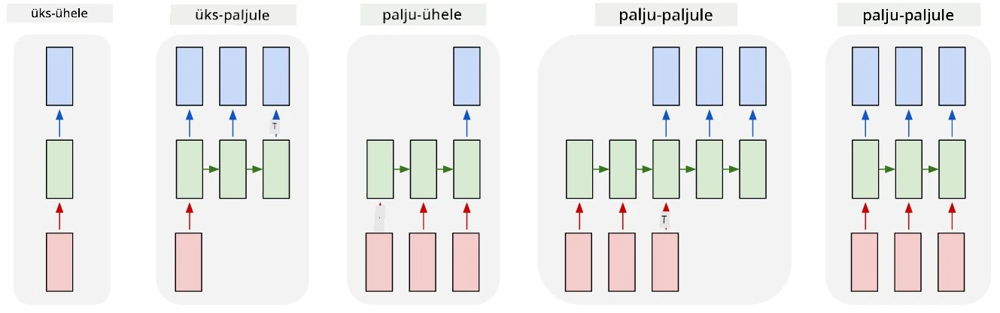

# Generatiivsed võrgud

## [Eelloengu viktoriin](https://ff-quizzes.netlify.app/en/ai/quiz/33)

Korduvad närvivõrgud (RNN-id) ja nende väratiga rakud, nagu Long Short Term Memory Cells (LSTM-id) ja Gated Recurrent Units (GRU-d), pakuvad mehhanismi keele modelleerimiseks, kuna nad suudavad õppida sõnade järjestust ja ennustada järgmise sõna järjestuses. See võimaldab kasutada RNN-e **generatiivseteks ülesanneteks**, nagu tavaline tekstigeneratsioon, masintõlge ja isegi pildiallkirjade loomine.

> ✅ Mõtle kõikidele kordadele, kui oled kasu saanud generatiivsetest ülesannetest, näiteks teksti täiendamisest kirjutamise ajal. Uuri oma lemmikrakendusi, et näha, kas nad kasutasid RNN-e.

RNN arhitektuuris, mida käsitlesime eelmises üksuses, genereeris iga RNN üksus järgmise varjatud oleku väljundina. Kuid me saame lisada igale korduvüksusele veel ühe väljundi, mis võimaldab meil genereerida **järjestuse** (mis on sama pikk kui algne järjestus). Lisaks saame kasutada RNN üksusi, mis ei võta igal sammul sisendit, vaid võtavad ainult algse oleku vektori ja genereerivad seejärel väljundite järjestuse.

See võimaldab erinevaid närvivõrgu arhitektuure, mida on näidatud alloleval pildil:



> Pilt blogipostitusest [Unreasonable Effectiveness of Recurrent Neural Networks](http://karpathy.github.io/2015/05/21/rnn-effectiveness/) autorilt [Andrej Karpaty](http://karpathy.github.io/)

* **Üks-ühele** on traditsiooniline närvivõrk ühe sisendi ja ühe väljundiga
* **Üks-paljudele** on generatiivne arhitektuur, mis võtab ühe sisendväärtuse ja genereerib väljundväärtuste järjestuse. Näiteks, kui tahame treenida **pildiallkirjade loomise** võrku, mis genereeriks pildi tekstilise kirjelduse, saame sisendiks pildi, edastame selle läbi CNN-i, et saada varjatud olek, ja seejärel genereerib korduv ahel allkirja sõna-sõnalt.
* **Palju-ühele** vastab RNN arhitektuuridele, mida kirjeldasime eelmises üksuses, näiteks tekstiklassifikatsioon.
* **Palju-paljudele**, või **järjestus-järjestusele**, vastab ülesannetele nagu **masintõlge**, kus esimene RNN kogub kogu sisendjärjestuse info varjatud olekusse ja teine RNN ahel lahtirullib selle oleku väljundjärjestuseks.

Selles üksuses keskendume lihtsatele generatiivsetele mudelitele, mis aitavad meil teksti genereerida. Lihtsuse huvides kasutame tähemärgi tasemel tokeniseerimist.

Treename selle RNN-i teksti genereerimiseks samm-sammult. Igal sammul võtame tähemärkide järjestuse pikkusega `nchars` ja palume võrgul genereerida järgmise väljundtähemärgi iga sisendtähemärgi jaoks:


Teksti genereerimisel (järeldamisel) alustame mõne **alguspunktiga**, mis edastatakse RNN rakkude kaudu, et genereerida selle vaheolek, ja seejärel algab genereerimine sellest olekust. Genereerime ühe tähemärgi korraga ja edastame oleku ja genereeritud tähemärgi järgmisele RNN rakule, et genereerida järgmine, kuni oleme genereerinud piisavalt tähemärke.


> Pilt autorilt

## ✍️ Harjutused: Generatiivsed võrgud

Jätka õppimist järgmistes märkmikes:

* [Generatiivsed võrgud PyTorchiga](GenerativePyTorch.ipynb)
* [Generatiivsed võrgud TensorFlowga](GenerativeTF.ipynb)

## Pehme teksti genereerimine ja temperatuur

Iga RNN raku väljundiks on tähemärkide tõenäosusjaotus. Kui võtame alati tähemärgi, millel on kõrgeim tõenäosus, kui järgmise tähemärgi genereerimisel, võib tekst sageli muutuda "tsükliliseks", kordudes samade tähemärkide järjestuste vahel, nagu selles näites:

```
today of the second the company and a second the company ...
```

Kuid kui vaatame järgmise tähemärgi tõenäosusjaotust, võib juhtuda, et mõne kõrgeima tõenäosusega tähemärgi vahe ei ole suur, näiteks ühel tähemärgil võib olla tõenäosus 0.2, teisel - 0.19 jne. Näiteks, kui otsime järgmist tähemärki järjestuses '*play*', võib järgmine tähemärk olla võrdselt kas tühik või **e** (nagu sõnas *player*).

See viib meid järelduseni, et alati ei ole "õiglane" valida tähemärki, millel on kõrgem tõenäosus, sest teise kõrgeima valimine võib siiski viia tähendusliku tekstini. Mõistlikum on **valida** tähemärke tõenäosusjaotusest, mille annab võrgu väljund. Samuti saame kasutada parameetrit **temperatuur**, mis tasandab tõenäosusjaotust, kui tahame lisada rohkem juhuslikkust, või muudab selle järsemaks, kui tahame rohkem kinni pidada kõrgeima tõenäosusega tähemärkidest.

Uuri, kuidas see pehme teksti genereerimine on rakendatud ülaltoodud märkmikes.

## Kokkuvõte

Kuigi teksti genereerimine võib olla kasulik iseenesest, on peamised eelised seotud võimega genereerida teksti RNN-idega mõnest algsest tunnusvektorist. Näiteks kasutatakse teksti genereerimist osana masintõlkest (järjestus-järjestusele, sel juhul kasutatakse *kodeerija* olekuvektorit, et genereerida või *dekodeerida* tõlgitud sõnum), või pildi tekstilise kirjelduse genereerimisel (sel juhul pärineb tunnusvektor CNN ekstraktorist).

## 🚀 Väljakutse

Võta mõned Microsoft Learni õppetunnid sellel teemal

* Teksti genereerimine [PyTorchiga](https://docs.microsoft.com/learn/modules/intro-natural-language-processing-pytorch/6-generative-networks/?WT.mc_id=academic-77998-cacaste)/[TensorFlowga](https://docs.microsoft.com/learn/modules/intro-natural-language-processing-tensorflow/5-generative-networks/?WT.mc_id=academic-77998-cacaste)

## [Järelloengu viktoriin](https://ff-quizzes.netlify.app/en/ai/quiz/34)

## Ülevaade ja iseseisev õppimine

Siin on mõned artiklid, et laiendada oma teadmisi

* Erinevad lähenemised teksti genereerimisele Markovi ahela, LSTM-i ja GPT-2-ga: [blogipostitus](https://towardsdatascience.com/text-generation-gpt-2-lstm-markov-chain-9ea371820e1e)
* Teksti genereerimise näidis [Kerase dokumentatsioonis](https://keras.io/examples/generative/lstm_character_level_text_generation/)

## [Ülesanne](lab/README.md)

Oleme näinud, kuidas genereerida teksti tähemärk-tähemärgi kaupa. Laboris uurid sõna tasemel teksti genereerimist.

---

**Lahtiütlus**:  
See dokument on tõlgitud AI tõlketeenuse [Co-op Translator](https://github.com/Azure/co-op-translator) abil. Kuigi püüame tagada täpsust, palume arvestada, et automaatsed tõlked võivad sisaldada vigu või ebatäpsusi. Algne dokument selle algses keeles tuleks pidada autoriteetseks allikaks. Olulise teabe puhul soovitame kasutada professionaalset inimtõlget. Me ei vastuta selle tõlke kasutamisest tulenevate arusaamatuste või valesti tõlgenduste eest.