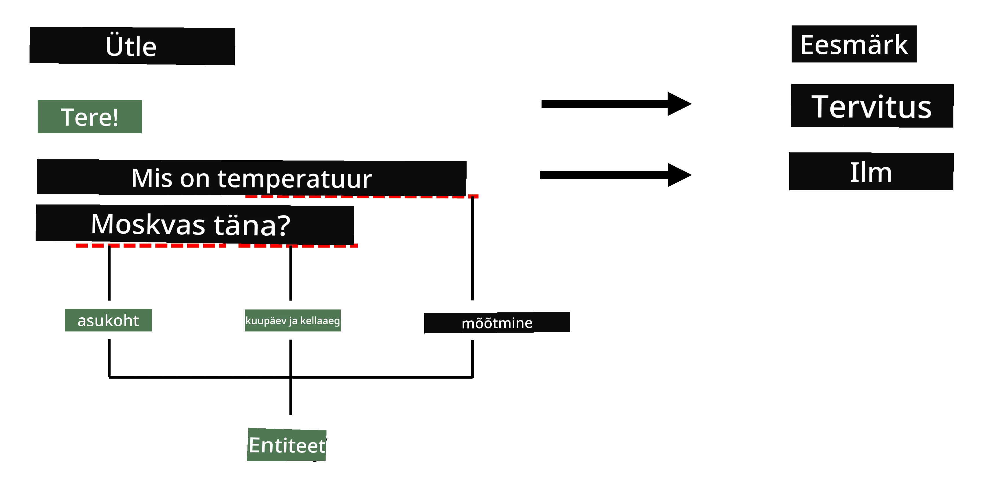

# Nimega Entiteetide Tuvastamine

Siiani oleme peamiselt keskendunud ühele NLP ülesandele - klassifikatsioonile. Kuid on ka teisi NLP ülesandeid, mida saab lahendada närvivõrkude abil. Üks neist ülesannetest on **[Nimega Entiteetide Tuvastamine](https://wikipedia.org/wiki/Named-entity_recognition)** (NER), mis tegeleb konkreetsete entiteetide tuvastamisega tekstis, nagu näiteks kohad, isikunimed, kuupäevad ja ajavahemikud, keemilised valemid jne.

## [Eelloengu viktoriin](https://ff-quizzes.netlify.app/en/ai/quiz/37)

## NER-i kasutamise näide

Oletame, et soovite arendada loomuliku keele vestlusrobotit, sarnast Amazon Alexa või Google Assistantiga. Nutikad vestlusrobotid töötavad nii, et nad *mõistavad*, mida kasutaja tahab, tehes sisendlausele tekstiklassifikatsiooni. Selle klassifikatsiooni tulemus on nn **intent**, mis määrab, mida vestlusrobot peaks tegema.

> Pilt autorilt

Kuid kasutaja võib fraasi osana anda ka mõned parameetrid. Näiteks, kui küsitakse ilma kohta, võib ta täpsustada asukoha või kuupäeva. Robot peaks suutma neid entiteete mõista ja täita vastavad parameetrid enne tegevuse sooritamist. Just siin tulebki mängu NER.

> ✅ Teine näide oleks [teaduslike meditsiiniliste artiklite analüüsimine](https://soshnikov.com/science/analyzing-medical-papers-with-azure-and-text-analytics-for-health/). Üks peamisi asju, mida otsida, on konkreetsed meditsiinilised terminid, nagu haigused ja meditsiinilised ained. Kuigi väikese arvu haigusi saab tõenäoliselt tuvastada alamstringi otsinguga, vajavad keerukamad entiteedid, nagu keemilised ühendid ja ravimite nimed, keerukamat lähenemist.

## NER kui tokenite klassifikatsioon

NER mudelid on sisuliselt **tokenite klassifikatsioonimudelid**, sest iga sisendi tokeni puhul peame otsustama, kas see kuulub mõnele entiteedile või mitte, ja kui kuulub - siis millisesse entiteediklassi.

Vaatame järgmist artikli pealkirja:

**Kolmiklõhe regurgitatsioon** ja **liitiumkarbonaadi** **toksilisus** vastsündinul.

Entiteedid siin on:

* Kolmiklõhe regurgitatsioon on haigus (`DIS`)
* Liitiumkarbonaat on keemiline aine (`CHEM`)
* Toksilisus on samuti haigus (`DIS`)

Pange tähele, et üks entiteet võib ulatuda mitme tokenini. Ja nagu antud juhul, peame eristama kahte järjestikust entiteeti. Seetõttu on tavaks kasutada iga entiteedi jaoks kahte klassi - üks, mis määrab entiteedi esimese tokeni (sageli kasutatakse eesliidet `B-`, tähistamaks **algust**), ja teine - entiteedi jätkumise (`I-`, tähistamaks **sisemist tokenit**). Samuti kasutame `O` klassi, et tähistada kõiki **muud** tokeneid. Sellist tokenite märgistamist nimetatakse [BIO märgistamiseks](https://en.wikipedia.org/wiki/Inside%E2%80%93outside%E2%80%93beginning_(tagging)) (või IOB). Märgistatud pealkiri näeks välja selline:

Token | Märgis
------|-----
Kolmiklõhe | B-DIS
regurgitatsioon | I-DIS
ja | O
liitium | B-CHEM
karbonaat | I-CHEM
toksilisus | B-DIS
vastsündinul | O
. | O

Kuna peame looma üks-ühele vastavuse tokenite ja klasside vahel, saame treenida parempoolse **mitme-mitme** närvivõrgu mudeli sellest pildist:

> *Pilt [sellest blogipostitusest](http://karpathy.github.io/2015/05/21/rnn-effectiveness/) autorilt [Andrej Karpathy](http://karpathy.github.io/). NER tokenite klassifikatsioonimudelid vastavad parempoolsele võrgustiku arhitektuurile sellel pildil.*

## NER mudelite treenimine

Kuna NER mudel on sisuliselt tokenite klassifikatsioonimudel, saame selle ülesande jaoks kasutada RNN-e, millega oleme juba tuttavad. Sellisel juhul tagastab iga korduvvõrgu plokk tokeni ID. Järgmine näidisnotebook näitab, kuidas treenida LSTM-i tokenite klassifikatsiooniks.

## ✍️ Näidisnotebookid: NER

Jätkake õppimist järgmises notebookis:

* [NER TensorFlow'ga](NER-TF.ipynb)

## Kokkuvõte

NER mudel on **tokenite klassifikatsioonimudel**, mis tähendab, et seda saab kasutada tokenite klassifikatsiooni teostamiseks. See on NLP-s väga levinud ülesanne, aidates tuvastada konkreetseid entiteete tekstis, sealhulgas kohti, nimesid, kuupäevi ja palju muud.

## 🚀 Väljakutse

Täitke allolev ülesanne, et treenida nimega entiteetide tuvastamise mudel meditsiiniliste terminite jaoks, ja proovige seda teisel andmestikul.

## [Järelloengu viktoriin](https://ff-quizzes.netlify.app/en/ai/quiz/38)

## Ülevaade ja iseseisev õppimine

Lugege läbi blogi [Korduvate närvivõrkude ebamõistlik tõhusus](http://karpathy.github.io/2015/05/21/rnn-effectiveness/) ja järgige artikli "Edasine lugemine" sektsiooni, et süvendada oma teadmisi.

## [Ülesanne](lab/README.md)

Selle õppetunni ülesandes peate treenima meditsiiniliste entiteetide tuvastamise mudelit. Alustage LSTM mudeli treenimisest, nagu selles õppetunnis kirjeldatud, ja jätkake BERT transformeerimismudeli kasutamisega. Lugege [juhiseid](lab/README.md), et saada kõik üksikasjad.

---

**Lahtiütlus**:  
See dokument on tõlgitud AI tõlketeenuse [Co-op Translator](https://github.com/Azure/co-op-translator) abil. Kuigi püüame tagada täpsust, palume arvestada, et automaatsed tõlked võivad sisaldada vigu või ebatäpsusi. Algne dokument selle algses keeles tuleks pidada autoriteetseks allikaks. Olulise teabe puhul soovitame kasutada professionaalset inimtõlget. Me ei vastuta selle tõlke kasutamisest tulenevate arusaamatuste või valesti tõlgenduste eest.